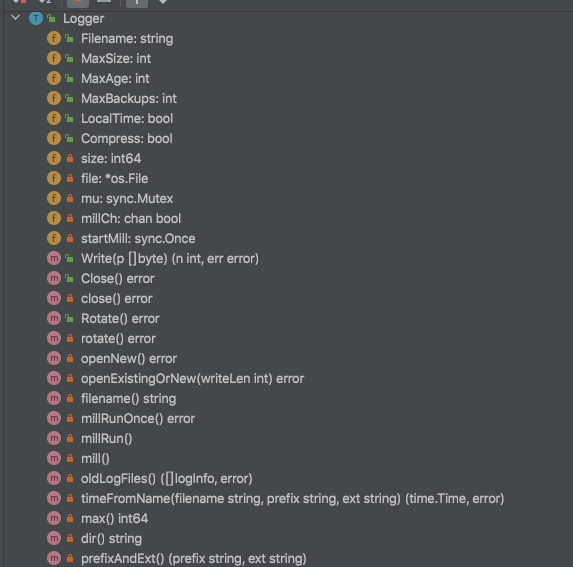
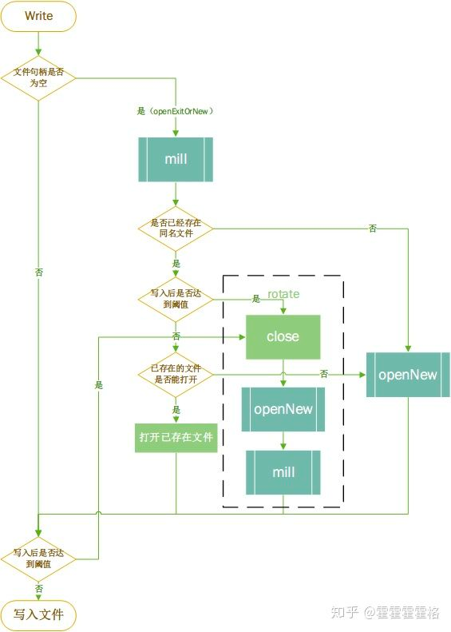

<!-- START doctoc generated TOC please keep comment here to allow auto update -->
<!-- DON'T EDIT THIS SECTION, INSTEAD RE-RUN doctoc TO UPDATE -->
**Table of Contents**  *generated with [DocToc](https://github.com/thlorenz/doctoc)*

- [lumberjack](#lumberjack)
  - [logger对象](#logger%E5%AF%B9%E8%B1%A1)

<!-- END doctoc generated TOC please keep comment here to allow auto update -->

# lumberjack

zap的重点在于对日志内容的组装和控制，没有实现对于日志文件的管理。而lumberjack就是一个用来管理日志文件的利器，经常与各种日志组件配合起来使用，实现日志的老化压缩，文件分割等等功能

## logger对象

```go
// /Users/xiaxin/go/pkg/mod/github.com/natefinch/lumberjack@v2.0.0+incompatible/lumberjack.go

// If MaxBackups and MaxAge are both 0, no old log files will be deleted.
type Logger struct {
	// Filename is the file to write logs to.   It uses <processname>-lumberjack.log in
	// os.TempDir() if empty.
	// 日志输出的文件名，这个文件名是一个全路径，即日志文件会在Filename指定的文件的目录下，进行存储和老化。
	// 备份文件会写到相同目录
	Filename string `json:"filename" yaml:"filename"`

	// ：日志文件的最大占用空间，也就是日志文件达到多大时触发日志文件的分割。单位是MB。megabytes.
	MaxSize int `json:"maxsize" yaml:"maxsize"`

	// 已经被分割存储的日志文件最大的留存时间，单位是天.  Note that a day is defined as 24
	// hours and may not exactly correspond to calendar days due to daylight
	// savings, leap seconds, etc. The default is not to remove old log files
	// based on age.
	MaxAge int `json:"maxage" yaml:"maxage"`

	// 已经被分割存储的日志文件最多的留存个数，单位是个。这个和上面的MaxAge共同生效，满足二者中的一个条件就会触发日志文件的删除。
	MaxBackups int `json:"maxbackups" yaml:"maxbackups"`

	// 用来指定被分割的日志文件上的时间戳是否要使用本地时间戳，默认会使用UTC时间。.
	LocalTime bool `json:"localtime" yaml:"localtime"`

	// 指定被分割之后的文件是否要压缩gzip,默认不压缩
	Compress bool `json:"compress" yaml:"compress"`

	size int64
	file *os.File
	mu   sync.Mutex

	millCh    chan bool
	startMill sync.Once
}
```


Logger实现了标准库中的WriterCloser接口，也就是Writer和Closer接口。
还有一个用来主动触发日志分割的Rotate方法。

文件名:filename方法，在内部实现中调用，用来获取待输出的文件名，如果没有设置文件名，返回的将是进程名称拼接上“-lumberjack.log”，目录在系统的临时目录下。
```go
func (l *Logger) filename() string {
	if l.Filename != "" {
		return l.Filename
	}
	name := filepath.Base(os.Args[0]) + "-lumberjack.log"
	return filepath.Join(os.TempDir(), name)
}
```
max方法，获取触发日志分割的文件大小，如果用户没有配置，默认会是100MB。
```go
func (l *Logger) max() int64 {
	if l.MaxSize == 0 {
		return int64(defaultMaxSize * megabyte)
	}
	return int64(l.MaxSize) * int64(megabyte)
}
```

写的过程   

```go
func (l *Logger) Write(p []byte) (n int, err error) {
	l.mu.Lock()
	defer l.mu.Unlock()

	writeLen := int64(len(p))
	if writeLen > l.max() {
        // 如果输入的长度大于触发文件分割的阈值，直接返回错误
		return 0, fmt.Errorf(
			"write length %d exceeds maximum file size %d", writeLen, l.max(),
		)
	}

	if l.file == nil {
		//打开或者新建日志文件
		if err = l.openExistingOrNew(len(p)); err != nil {
			return 0, err
		}
	}

	if l.size+writeLen > l.max() {
		if err := l.rotate(); err != nil {
			return 0, err
		}
	}

	n, err = l.file.Write(p)
	l.size += int64(n)

	return n, err
}
```

```go
func (l *Logger) openExistingOrNew(writeLen int) error {
	l.mill()

	filename := l.filename()
	info, err := os_Stat(filename)
	if os.IsNotExist(err) {
		// 老文件不存在
		return l.openNew()
	}
	if err != nil {
		return fmt.Errorf("error getting log file info: %s", err)
	}

	if info.Size()+int64(writeLen) >= l.max() {
		// 老文件大小加上本次要写入的达到阈值
		return l.rotate()
	}

	file, err := os.OpenFile(filename, os.O_APPEND|os.O_WRONLY, 0644)
	if err != nil {
		// 老文件打开失败
		// if we fail to open the old log file for some reason, just ignore
		// it and open a new log file.
		return l.openNew()
	}
	l.file = file
	l.size = info.Size()
	return nil
}

func (l *Logger) mill() {
	// 是一个once对象，用来控制这里的通道只初始化一次，以及协程只启动一次
   l.startMill.Do(func() {
   	    //millCh用来传递进行日志压缩删除的信号
      l.millCh = make(chan bool, 1)
      go l.millRun()
   })
   select {
   case l.millCh <- true:
   default:
   }
}

func (l *Logger) millRun() {
	for _ = range l.millCh {
		// 使用range关键字不断的从millCh通道中读取信号，每读到一次，就调用一次millRunOnce来真正实现压缩删除
		_ = l.millRunOnce()
	}
}
```
优秀设计：这里的思路和go的timer中的通道类似，使用容量为1的通道做通知以及去重.
- 如果millCh中没有元素，自然可以写入，并使得millRun读到，开始调用millRunOnce方法；
- 如果有元素，不能写入，那么就说明在millRun方法中还在执行millRunOnce方法，那也就没必要写入了，直接走default分支结束就好。

创建文件
```go
// /Users/xiaxin/go/pkg/mod/github.com/natefinch/lumberjack@v2.0.0+incompatible/lumberjack.go
func (l *Logger) openNew() error {
	// 创建全目录
	err := os.MkdirAll(l.dir(), 0744)
	if err != nil {
		return fmt.Errorf("can't make directories for new logfile: %s", err)
	}
    //判断老文件是否存在
	name := l.filename()
	mode := os.FileMode(0644)
	info, err := os_Stat(name)
	if err == nil {
        // 如果存在
		// Copy the mode off the old logfile.
		mode = info.Mode()
		// move the existing file
		// 调用backupName函数，生成老的日志文件被分割后的文件名
		newname := backupName(name, l.LocalTime)
		// 重命名旧文件
		if err := os.Rename(name, newname); err != nil {
			return fmt.Errorf("can't rename log file: %s", err)
		}

		// this is a no-op anywhere but linux
		if err := chown(name, info); err != nil {
			return err
		}
	}

	// 无论是否存在老文件，下来都要创建新文件，并重置Logger对象的文件句柄和已输出大小。
	// we use truncate here because this should only get called when we've moved
	// the file ourselves. if someone else creates the file in the meantime,
	// just wipe out the contents.
	f, err := os.OpenFile(name, os.O_CREATE|os.O_WRONLY|os.O_TRUNC, mode)
	if err != nil {
		return fmt.Errorf("can't open new logfile: %s", err)
	}
	l.file = f
	l.size = 0
	return nil
}
```
文件rotate
```go
func (l *Logger) rotate() error {
	// 1.关闭原有的文件句柄
   if err := l.close(); err != nil {
      return err
   }
   //2.创建新文件
   if err := l.openNew(); err != nil {
      return err
   }
   // 3. 调用mill进行日志文件的压缩删除
   l.mill()
   return nil
}

func (l *Logger) close() error {
	if l.file == nil {
		return nil
	}
	err := l.file.Close()
	l.file = nil
	return err
}
```

millRunOnce:压缩和没用的文件清除
```go
// millRunOnce performs compression and removal of stale log files.
// Log files are compressed if enabled via configuration and old log
// files are removed, keeping at most l.MaxBackups files, as long as
// none of them are older than MaxAge.
func (l *Logger) millRunOnce() error {
	if l.MaxBackups == 0 && l.MaxAge == 0 && !l.Compress {
		return nil
	}

	files, err := l.oldLogFiles()
	if err != nil {
		return err
	}

	var compress, remove []logInfo

	if l.MaxBackups > 0 && l.MaxBackups < len(files) {
		preserved := make(map[string]bool)
		var remaining []logInfo
		for _, f := range files {
			// Only count the uncompressed log file or the
			// compressed log file, not both.
			fn := f.Name()
			if strings.HasSuffix(fn, compressSuffix) {
				fn = fn[:len(fn)-len(compressSuffix)]
			}
			preserved[fn] = true

			if len(preserved) > l.MaxBackups {
				remove = append(remove, f)
			} else {
				remaining = append(remaining, f)
			}
		}
		files = remaining
	}
	if l.MaxAge > 0 {
		diff := time.Duration(int64(24*time.Hour) * int64(l.MaxAge))
		cutoff := currentTime().Add(-1 * diff)

		var remaining []logInfo
		for _, f := range files {
			if f.timestamp.Before(cutoff) {
				remove = append(remove, f)
			} else {
				remaining = append(remaining, f)
			}
		}
		files = remaining
	}

	if l.Compress {
		for _, f := range files {
			if !strings.HasSuffix(f.Name(), compressSuffix) {
				compress = append(compress, f)
			}
		}
	}

	for _, f := range remove {
		errRemove := os.Remove(filepath.Join(l.dir(), f.Name()))
		if err == nil && errRemove != nil {
			err = errRemove
		}
	}
	for _, f := range compress {
		fn := filepath.Join(l.dir(), f.Name())
		errCompress := compressLogFile(fn, fn+compressSuffix)
		if err == nil && errCompress != nil {
			err = errCompress
		}
	}

	return err
}
```
