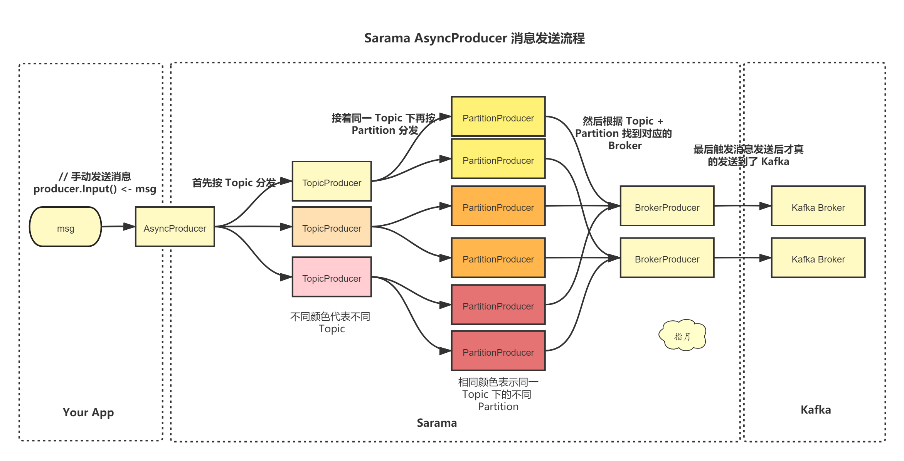

<!-- START doctoc generated TOC please keep comment here to allow auto update -->
<!-- DON'T EDIT THIS SECTION, INSTEAD RE-RUN doctoc TO UPDATE -->
**Table of Contents**  *generated with [DocToc](https://github.com/thlorenz/doctoc)*

- [github.com/IBM/sarama](#githubcomibmsarama)
  - [生产者](#%E7%94%9F%E4%BA%A7%E8%80%85)
    - [同步阻塞生产者: 效率较低](#%E5%90%8C%E6%AD%A5%E9%98%BB%E5%A1%9E%E7%94%9F%E4%BA%A7%E8%80%85-%E6%95%88%E7%8E%87%E8%BE%83%E4%BD%8E)
    - [异步生产者](#%E5%BC%82%E6%AD%A5%E7%94%9F%E4%BA%A7%E8%80%85)
  - [消费者](#%E6%B6%88%E8%B4%B9%E8%80%85)
  - [参考](#%E5%8F%82%E8%80%83)

<!-- END doctoc generated TOC please keep comment here to allow auto update -->

# github.com/IBM/sarama
历史: github.com/Shopify/sarama,Shopify 开发的一个 Kafka 库，提供了生产者、消费者、分区消费者等功能


## 生产者



两种生产者：AsyncProducer(异步，在大部分情况下推荐) or the SyncProducer(同步阻塞，等待ack).

1. The AsyncProducer accepts messages on a channel and produces them asynchronously in the background as efficiently as possible; it is preferred in most cases.

2. The SyncProducer provides a method which will block until Kafka acknowledges the message as produced


### 同步阻塞生产者: 效率较低
```go
// github.com/!i!b!m/sarama@v1.43.3/sync_producer.go

type SyncProducer interface {
	
	SendMessage(msg *ProducerMessage) (partition int32, offset int64, err error)

	// 批量发送消息,单个消息可以失败返回
	SendMessages(msgs []*ProducerMessage) error

	// 必须手动关闭,否则会泄露
	Close() error

	// TxnStatus return current producer transaction status.
	TxnStatus() ProducerTxnStatusFlag

	// IsTransactional return true when current producer is transactional.
	IsTransactional() bool

	// BeginTxn mark current transaction as ready.
	BeginTxn() error

	// CommitTxn commit current transaction.
	CommitTxn() error

	// AbortTxn abort current transaction.
	AbortTxn() error

	// AddOffsetsToTxn add associated offsets to current transaction.
	AddOffsetsToTxn(offsets map[string][]*PartitionOffsetMetadata, groupId string) error

	// AddMessageToTxn add message offsets to current transaction.
	AddMessageToTxn(msg *ConsumerMessage, groupId string, metadata *string) error
}

```


### 异步生产者

```go
// AsyncProducer publishes Kafka messages using a non-blocking API. It routes messages
// to the correct broker for the provided topic-partition, refreshing metadata as appropriate,
// and parses responses for errors. You must read from the Errors() channel or the
// producer will deadlock. You must call Close() or AsyncClose() on a producer to avoid
// leaks and message lost: it will not be garbage-collected automatically when it passes
// out of scope and buffered messages may not be flushed.
type AsyncProducer interface {
	// AsyncClose triggers a shutdown of the producer. The shutdown has completed
	// when both the Errors and Successes channels have been closed. When calling
	// AsyncClose, you *must* continue to read from those channels in order to
	// drain the results of any messages in flight.
	AsyncClose()

	// Close shuts down the producer and waits for any buffered messages to be
	// flushed. You must call this function before a producer object passes out of
	// scope, as it may otherwise leak memory. You must call this before process
	// shutting down, or you may lose messages. You must call this before calling
	// Close on the underlying client.
	Close() error

	// Input is the input channel for the user to write messages to that they
	// wish to send.
	Input() chan<- *ProducerMessage

	// Successes is the success output channel back to the user when Return.Successes is
	// enabled. If Return.Successes is true, you MUST read from this channel or the
	// Producer will deadlock. It is suggested that you send and read messages
	// together in a single select statement.
	Successes() <-chan *ProducerMessage

	// Errors is the error output channel back to the user. You MUST read from this
	// channel or the Producer will deadlock when the channel is full. Alternatively,
	// you can set Producer.Return.Errors in your config to false, which prevents
	// errors to be returned.
	Errors() <-chan *ProducerError

	// IsTransactional return true when current producer is transactional.
	IsTransactional() bool

	// TxnStatus return current producer transaction status.
	TxnStatus() ProducerTxnStatusFlag

	// BeginTxn mark current transaction as ready.
	BeginTxn() error

	// CommitTxn commit current transaction.
	CommitTxn() error

	// AbortTxn abort current transaction.
	AbortTxn() error

	// AddOffsetsToTxn add associated offsets to current transaction.
	AddOffsetsToTxn(offsets map[string][]*PartitionOffsetMetadata, groupId string) error

	// AddMessageToTxn add message offsets to current transaction.
	AddMessageToTxn(msg *ConsumerMessage, groupId string, metadata *string) error
}
```

初始化 client

```go
func NewAsyncProducer(addrs []string, conf *Config) (AsyncProducer, error) {
	// 客户端初始化
	client, err := NewClient(addrs, conf)
	if err != nil {
		return nil, err
	}
	return newAsyncProducer(client)
}

```
```go
func NewClient(addrs []string, conf *Config) (Client, error) {
    // ...

	client := &client{
		conf:                    conf,
		closer:                  make(chan none),
		closed:                  make(chan none),
		brokers:                 make(map[int32]*Broker),
		metadata:                make(map[string]map[int32]*PartitionMetadata),
		metadataTopics:          make(map[string]none),
		cachedPartitionsResults: make(map[string][maxPartitionIndex][]int32),
		coordinators:            make(map[string]int32),
		transactionCoordinators: make(map[string]int32),
	}

	if conf.Net.ResolveCanonicalBootstrapServers {
		var err error
		addrs, err = client.resolveCanonicalNames(addrs)
		if err != nil {
			return nil, err
		}
	}

	client.randomizeSeedBrokers(addrs)

	if conf.Metadata.Full {
		// 默认获取全量元数据
		// do an initial fetch of all cluster metadata by specifying an empty list of topics
		err := client.RefreshMetadata()
        // ...
	}
	
	// 定义更新元数据
	go withRecover(client.backgroundMetadataUpdater)

	DebugLogger.Println("Successfully initialized new client")

	return client, nil
}


func newAsyncProducer(client Client) (AsyncProducer, error) {
    // ...

	txnmgr, err := newTransactionManager(client.Config(), client)
	if err != nil {
		return nil, err
	}

	p := &asyncProducer{
		client:          client,
		conf:            client.Config(),
		errors:          make(chan *ProducerError),
		input:           make(chan *ProducerMessage),
		successes:       make(chan *ProducerMessage),
		retries:         make(chan *ProducerMessage),
		brokers:         make(map[*Broker]*brokerProducer),
		brokerRefs:      make(map[*brokerProducer]int),
		txnmgr:          txnmgr,
		metricsRegistry: newCleanupRegistry(client.Config().MetricRegistry),
	}

	// 消息分发
	// launch our singleton dispatchers
	go withRecover(p.dispatcher)
	// 处理重试逻辑
	go withRecover(p.retryHandler)

	return p, nil
}

```

元数据
```go
func (client *client) tryRefreshMetadata(topics []string, attemptsRemaining int, deadline time.Time) error {
	// 超时判断
	pastDeadline := func(backoff time.Duration) bool {
		if !deadline.IsZero() && time.Now().Add(backoff).After(deadline) {
			// we are past the deadline
			return true
		}
		return false
	}
    // err 重试
	retry := func(err error) error {
        
	}
    
	//  pending requests 最少的 broker 
	broker := client.LeastLoadedBroker()
	brokerErrors := make([]error, 0)
	for ; broker != nil && !pastDeadline(0); broker = client.LeastLoadedBroker() { // 没有超时
		allowAutoTopicCreation := client.conf.Metadata.AllowAutoTopicCreation
		if len(topics) > 0 {
			DebugLogger.Printf("client/metadata fetching metadata for %v from broker %s\n", topics, broker.addr)
		} else {
			allowAutoTopicCreation = false
			DebugLogger.Printf("client/metadata fetching metadata for all topics from broker %s\n", broker.addr)
		}

		req := NewMetadataRequest(client.conf.Version, topics)
		req.AllowAutoTopicCreation = allowAutoTopicCreation
		atomic.StoreInt64(&client.updateMetadataMs, time.Now().UnixMilli())

		response, err := broker.GetMetadata(req)
		var kerror KError
		var packetEncodingError PacketEncodingError
		if err == nil {
			// When talking to the startup phase of a broker, it is possible to receive an empty metadata set. We should remove that broker and try next broker (https://issues.apache.org/jira/browse/KAFKA-7924).
			if len(response.Brokers) == 0 {
	            // ...
			}
			allKnownMetaData := len(topics) == 0
			// valid response, use it
			// 更新元数据
			shouldRetry, err := client.updateMetadata(response, allKnownMetaData)
			if shouldRetry {
				Logger.Println("client/metadata found some partitions to be leaderless")
				return retry(err) // note: err can be nil
			}
			return err
		} else if errors.As(err, &packetEncodingError) {
            // 错误处理
			// ... 
		} else {
            // ...
		}
	}

	error := Wrap(ErrOutOfBrokers, brokerErrors...)
	if broker != nil {
		Logger.Printf("client/metadata not fetching metadata from broker %s as we would go past the metadata timeout\n", broker.addr)
		return retry(error)
	}

	Logger.Println("client/metadata no available broker to send metadata request to")
	client.resurrectDeadBrokers()
	return retry(error)
}
```


发送消息
```go
func (sp *syncProducer) SendMessage(msg *ProducerMessage) (partition int32, offset int64, err error) {
	expectation := make(chan *ProducerError, 1)
	msg.expectation = expectation
	sp.producer.Input() <- msg

	/// 阻塞等待
	if pErr := <-expectation; pErr != nil {
		return -1, -1, pErr.Err
	}

	return msg.Partition, msg.Offset, nil
}
```


producer 消息分发: 主要根据 topic 将消息分发到对应的 channel。
```go
func (p *asyncProducer) dispatcher() {
	handlers := make(map[string]chan<- *ProducerMessage)
	shuttingDown := false

	for msg := range p.input {
		// ...

		for _, interceptor := range p.conf.Producer.Interceptors {
			// 发送前处理
			msg.safelyApplyInterceptor(interceptor)
		}

        // ...

		// 找到这个Topic对应的Handler
		handler := handlers[msg.Topic]
		if handler == nil {
			// 如果没有这个Topic对应的Handler，那么创建一个
			handler = p.newTopicProducer(msg.Topic)
			handlers[msg.Topic] = handler
		}

		// 然后把这条消息写进这个Handler中
		handler <- msg
	}

	for _, handler := range handlers {
		close(handler)
	}
}

```
topic 消息分发

```go
func (tp *topicProducer) dispatch() {
	for msg := range tp.input {
		if msg.retries == 0 {
			if err := tp.partitionMessage(msg); err != nil {
				tp.parent.returnError(msg, err)
				continue
			}
		}

		// 找到分区对应的 handler
		handler := tp.handlers[msg.Partition]
		if handler == nil {
			handler = tp.parent.newPartitionProducer(msg.Topic, msg.Partition)
			tp.handlers[msg.Partition] = handler
		}

		handler <- msg
	}

	for _, handler := range tp.handlers {
		close(handler)
	}
}
```


对消息进行分区处理
```go
func (tp *topicProducer) partitionMessage(msg *ProducerMessage) error {
	var partitions []int32

	err := tp.breaker.Run(func() (err error) {
		requiresConsistency := false
		if ep, ok := tp.partitioner.(DynamicConsistencyPartitioner); ok {
			requiresConsistency = ep.MessageRequiresConsistency(msg)
		} else {
			requiresConsistency = tp.partitioner.RequiresConsistency()
		}

		if requiresConsistency { // 要求一致性
			partitions, err = tp.parent.client.Partitions(msg.Topic)
		} else {
			partitions, err = tp.parent.client.WritablePartitions(msg.Topic)
		}
		return
	})
	if err != nil {
		return err
	}

	numPartitions := int32(len(partitions))

	if numPartitions == 0 {
		return ErrLeaderNotAvailable
	}

	choice, err := tp.partitioner.Partition(msg, numPartitions)

	if err != nil {
		return err
	} else if choice < 0 || choice >= numPartitions {
		return ErrInvalidPartition
	}

	msg.Partition = partitions[choice]

	return nil
}

```


分区分配

```go
func (pp *partitionProducer) dispatch() {

    // 找到这个主题和分区的leader所在的broker
	pp.leader, _ = pp.parent.client.Leader(pp.topic, pp.partition)
	if pp.leader != nil {
		//  根据 leader 信息创建一个 BrokerProducer 对象
		pp.brokerProducer = pp.parent.getBrokerProducer(pp.leader)
		pp.parent.inFlight.Add(1) // we're generating a syn message; track it so we don't shut down while it's still inflight
		pp.brokerProducer.input <- &ProducerMessage{Topic: pp.topic, Partition: pp.partition, flags: syn}
	}

	defer func() {
		if pp.brokerProducer != nil {
			pp.parent.unrefBrokerProducer(pp.leader, pp.brokerProducer)
		}
	}()

	for msg := range pp.input {
        // ...
		// 然后把消息丢进brokerProducer中
		pp.brokerProducer.input <- msg
	}
}

```


压缩处理: 在Kafka 2.1.0版本之前，Kafka支持3种压缩算法：GZIP、Snappy和LZ4。
从 2.1.0开始，Kafka正式支持Zstandard算法（简写为zstd）。它是Facebook开源的一个压缩算法，能够提供超高的压缩比（compression ratio）

```go
func compress(cc CompressionCodec, level int, data []byte) ([]byte, error) {
	switch cc {
	case CompressionNone:
		return data, nil
	case CompressionGZIP:
		var (
			err    error
			buf    bytes.Buffer
			writer *gzip.Writer
		)

		switch level {
		case CompressionLevelDefault:
			writer = gzipWriterPool.Get().(*gzip.Writer)
			defer gzipWriterPool.Put(writer)
			writer.Reset(&buf)
        //...

		case 9:
			writer = gzipWriterPoolForCompressionLevel9.Get().(*gzip.Writer)
			defer gzipWriterPoolForCompressionLevel9.Put(writer)
			writer.Reset(&buf)
		default:
			writer, err = gzip.NewWriterLevel(&buf, level)
			if err != nil {
				return nil, err
			}
		}
		if _, err := writer.Write(data); err != nil {
			return nil, err
		}
		if err := writer.Close(); err != nil {
			return nil, err
		}
		return buf.Bytes(), nil
    // ...
	
	case CompressionZSTD:
		return zstdCompress(ZstdEncoderParams{level}, nil, data)
	default:
		return nil, PacketEncodingError{fmt.Sprintf("unsupported compression codec (%d)", cc)}
	}
}

```


## 消费者

分区消费者

```go
type Consumer interface {
	// Topics returns the set of available topics as retrieved from the cluster
	// metadata. This method is the same as Client.Topics(), and is provided for
	// convenience.
	Topics() ([]string, error)

	// Partitions returns the sorted list of all partition IDs for the given topic.
	// This method is the same as Client.Partitions(), and is provided for convenience.
	Partitions(topic string) ([]int32, error)

	// ConsumePartition creates a PartitionConsumer on the given topic/partition with
	// the given offset. It will return an error if this Consumer is already consuming
	// on the given topic/partition. Offset can be a literal offset, or OffsetNewest
	// or OffsetOldest
	ConsumePartition(topic string, partition int32, offset int64) (PartitionConsumer, error)

	// HighWaterMarks returns the current high water marks for each topic and partition.
	// Consistency between partitions is not guaranteed since high water marks are updated separately.
	HighWaterMarks() map[string]map[int32]int64

	// Close shuts down the consumer. It must be called after all child
	// PartitionConsumers have already been closed.
	Close() error

	// Pause suspends fetching from the requested partitions. Future calls to the broker will not return any
	// records from these partitions until they have been resumed using Resume()/ResumeAll().
	// Note that this method does not affect partition subscription.
	// In particular, it does not cause a group rebalance when automatic assignment is used.
	Pause(topicPartitions map[string][]int32)

	// Resume resumes specified partitions which have been paused with Pause()/PauseAll().
	// New calls to the broker will return records from these partitions if there are any to be fetched.
	Resume(topicPartitions map[string][]int32)

	// PauseAll suspends fetching from all partitions. Future calls to the broker will not return any
	// records from these partitions until they have been resumed using Resume()/ResumeAll().
	// Note that this method does not affect partition subscription.
	// In particular, it does not cause a group rebalance when automatic assignment is used.
	PauseAll()

	// ResumeAll resumes all partitions which have been paused with Pause()/PauseAll().
	// New calls to the broker will return records from these partitions if there are any to be fetched.
	ResumeAll()
}

```


消费组

```go
type ConsumerGroup interface {
	// Consume joins a cluster of consumers for a given list of topics and
	// starts a blocking ConsumerGroupSession through the ConsumerGroupHandler.
	//
	// The life-cycle of a session is represented by the following steps:
	//
	// 1. The consumers join the group (as explained in https://kafka.apache.org/documentation/#intro_consumers)
	//    and is assigned their "fair share" of partitions, aka 'claims'.
	// 2. Before processing starts, the handler's Setup() hook is called to notify the user
	//    of the claims and allow any necessary preparation or alteration of state.
	// 3. For each of the assigned claims the handler's ConsumeClaim() function is then called
	//    in a separate goroutine which requires it to be thread-safe. Any state must be carefully protected
	//    from concurrent reads/writes.
	// 4. The session will persist until one of the ConsumeClaim() functions exits. This can be either when the
	//    parent context is canceled or when a server-side rebalance cycle is initiated.
	// 5. Once all the ConsumeClaim() loops have exited, the handler's Cleanup() hook is called
	//    to allow the user to perform any final tasks before a rebalance.
	// 6. Finally, marked offsets are committed one last time before claims are released.
	//
	// Please note, that once a rebalance is triggered, sessions must be completed within
	// Config.Consumer.Group.Rebalance.Timeout. This means that ConsumeClaim() functions must exit
	// as quickly as possible to allow time for Cleanup() and the final offset commit. If the timeout
	// is exceeded, the consumer will be removed from the group by Kafka, which will cause offset
	// commit failures.
	// This method should be called inside an infinite loop, when a
	// server-side rebalance happens, the consumer session will need to be
	// recreated to get the new claims.
	Consume(ctx context.Context, topics []string, handler ConsumerGroupHandler) error

	// Errors returns a read channel of errors that occurred during the consumer life-cycle.
	// By default, errors are logged and not returned over this channel.
	// If you want to implement any custom error handling, set your config's
	// Consumer.Return.Errors setting to true, and read from this channel.
	Errors() <-chan error

	// Close stops the ConsumerGroup and detaches any running sessions. It is required to call
	// this function before the object passes out of scope, as it will otherwise leak memory.
	Close() error

	// Pause suspends fetching from the requested partitions. Future calls to the broker will not return any
	// records from these partitions until they have been resumed using Resume()/ResumeAll().
	// Note that this method does not affect partition subscription.
	// In particular, it does not cause a group rebalance when automatic assignment is used.
	Pause(partitions map[string][]int32)

	// Resume resumes specified partitions which have been paused with Pause()/PauseAll().
	// New calls to the broker will return records from these partitions if there are any to be fetched.
	Resume(partitions map[string][]int32)

	// Pause suspends fetching from all partitions. Future calls to the broker will not return any
	// records from these partitions until they have been resumed using Resume()/ResumeAll().
	// Note that this method does not affect partition subscription.
	// In particular, it does not cause a group rebalance when automatic assignment is used.
	PauseAll()

	// Resume resumes all partitions which have been paused with Pause()/PauseAll().
	// New calls to the broker will return records from these partitions if there are any to be fetched.
	ResumeAll()
}

```

## 参考

- [腾讯云 Sarama Go 使用案例](https://cloud.tencent.com/document/product/597/104883)
- [Kafka(Go)教程(六)---sarama 客户端 producer 源码分析](https://www.lixueduan.com/posts/kafka/06-sarama-producer/)