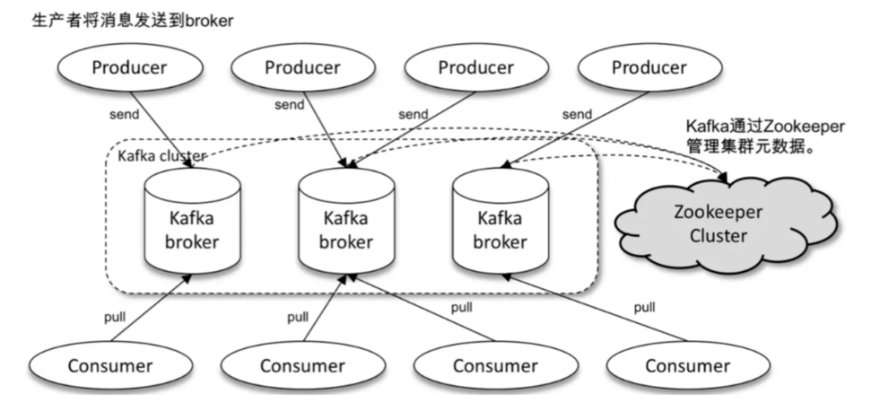

# Kafka
建议参考阿里文档：https://help.aliyun.com/document_detail/68166.html?spm=a2c4g.11186623.6.760.4d62203aT0ks10#title-k03-if4-cs8:
## 一. 基本概念

	服务端：Broker相当于Kafka的服务端，你可以理解为是队列存在的地方，生产者把消息发送到Broker中，消费者从Broker中获取消息
	客户端:生产者与消费者
1. producer： 消息生产者，发布消息到 kafka 集群的终端或服务。
2. broker：kafka 集群中包含的服务器。
3. topic： 每条发布到 kafka 集群的消息属于的类别，即 kafka 是面向 topic 的。
4. partition分区：partition 是物理上的概念，每个 topic 包含一个或多个 partition。kafka 分配的单位是 partition。Broker所在的机器的IO速度，可能会使得这个消息队列存在性能上的瓶颈。
    这里的分区，是扩展的概念，而不是副本的概念。所以，这里的分区，也被称为数据分区、数据分片。这些分区可以部署在不同的机器上，性能也就提升了好几倍。
5. consumer： 从 kafka 集群中消费消息的终端或服务。
6. Consumer group： high-level consumer API 中，每个 consumer 都属于一个 consumer group，每条消息只能被 consumer group 中的一个 Consumer 消费，但可以被多个 consumer group 消费。
7. replica：partition 的副本，保障 partition 的高可用。
8. leader： replica 中的一个角色， producer 和 consumer 只跟 leader 交互。
9. follower： replica 中的一个角色，从 leader 中复制数据。
10. controller： kafka 集群中的其中一个服务器，用来进行 leader election 以及 各种 failover。
11. zookeeper： kafka 通过 zookeeper 来存储集群的 meta 信息。
## 二. producer发布消息

1. 写入方式: 
    producer 采用 push 模式将消息发布到 broker，每条消息都被 append 到 partition 中，属于顺序写磁盘（顺序写磁盘效率比随机写内存要高，保障 kafka 吞吐率）
2. 消息路由:选区原则
- a. 指定了 partition，则直接使用；
- b. 未指定 partition 但指定 key，通过对 key 的 value 进行hash 选出一个 partition
- c. partition 和 key 都未指定，使用轮询选出一个 partition。
3. 写入流程
- a. producer 先从 zookeeper 的 "/brokers/.../state" 节点找到该 partition 的 leader
- b. producer 将消息发送给该 leader
- c. leader 将消息写入本地 log
- d. followers 从 leader pull 消息，写入本地 log 后 leader 发送 ACK
- e. leader 收到所有 ISR 中的 replica 的 ACK 后，增加 HW（high watermark，最后 commit 的 offset） 并向 producer 发送 ACK
4. producer delivery guarantee生产者发送保证
- a. At most once 消息可能会丢，但绝不会重复传输
- b. At least one 消息绝不会丢，但可能会重复传输
- c. Exactly once 每条消息肯定会被传输一次且仅传输一次

## 三. broker保存消息

所理解的“消息”，在Kafka中被称为日志。
在每一个broker中，保存了多个名字为{Topic}-{Partition}的文件夹，例如Test-1、Test-2.这里的意思是，这个broker中能够处理topic为Test，分区为1和2的消息

1. 存储方式   
   
    物理上把 topic 分成一个或多个 partition（对应 server.properties 中的 num.partitions=3 配置），每个 partition 物理上对应一个文件夹（该文件夹存储该 partition 的所有消息和索引文件）
    在这张图中，一个分区，包含了多个Log Segment。注意，这里的Log Segment也是逻辑上的概念，只有具体到具体的日志文件，才是物理上的概念.
    我们看图片最右边的部分，文件名都是20位的整数，这个数字称为消息的“基准偏移量”。
    例如我们第二个Log Segment是从121开始的，那么代表了这个日志段的第一条消息的偏移量是从121开始的，也代表了在这之前有121条日志记录.
    注意，因为我们的偏移量是从0开始的，所以在121这个偏移量之前有121条数据，而不是120条

2. 存储策略   
    无论消息是否被消费，kafka 都会保留所有消息。有两种策略可以删除旧数据：
    - 2.1  基于时间：log.retention.hours=168
    - 2.2  基于大小：log.retention.bytes=1073741824
    注意：因为Kafka读取特定消息的时间复杂度为O(1)，即与文件大小无关，所以这里删除过期文件与提高 Kafka 性能无关
   
3. Topic创建与删除top   
   - 3.1 controller 在 ZooKeeper 的 /brokers/topics 节点上注册 watcher，当 topic 被创建，则 controller 会通过 watch 得到该 topic 的 partition/replica 分配。
   - 3.2 controller从 /brokers/ids 读取当前所有可用的 broker 列表，对于 set_p 中的每一个 partition：
     - a 从分配给该 partition 的所有 replica（称为AR）中任选一个可用的 broker 作为新的 leader，并将AR设置为新的 ISR
     - b 将新的 leader 和 ISR 写入 /brokers/topics/[topic]/partitions/[partition]/state
- 3.3 controller 通过 RPC 向相关的 broker 发送 LeaderAndISRRequest。

4. 删除topic    
    - 4.1 controller 在 zooKeeper 的 /brokers/topics 节点上注册 watcher，当 topic 被删除，则 controller 会通过 watch 得到该 topic 的 partition/replica 分配。
    - 4.2 若 delete.topic.enable=false，结束；否则 controller 注册在 /admin/delete_topics 上的 watch 被 fire，controller 通过回调向对应的 broker 发送 StopReplicaRequest
5. 文件格式    
    三种类型的文件，*.log、*.index、*.timeindex。
    - log格式的文件记录了消息
    - index是偏移量索引
    - timeindex是时间戳索引。  
    broker在接收到生产者发过来的消息的时候，需要将消息写在最后的Log Segment中。这样还带来了一个好处，消息的写入是顺序的IO。也因为如此，最后的一个Log Segment，被称为“active Log Segment”

## 四. kafka高可用HA
1. 复制replication   
    同一个 partition 可能会有多个 replica（对应 server.properties 配置中的 default.replication.factor=N）。
    没有 replica 的情况下，一旦 broker 宕机，其上所有 patition 的数据都不可被消费，同时 producer 也不能再将数据存于其上的 patition。
    引入replication 之后，同一个 partition 可能会有多个 replica，而这时需要在这些 replica 之间选出一个 leader，
    producer 和 consumer 只与这个 leader 交互，其它 replica 作为 follower 从 leader 中复制数据   
复制算法：
   - a. 将所有 broker（假设共 n 个 broker）和待分配的 partition 排序
   - b. 将第 i 个 partition 分配到第（i mod n）个 broker 上
   - c. 将第 i 个 partition 的第 j 个 replica 分配到第（(i + j) mode n）个 broker上    
   
2. leader宕机
    当 partition 对应的 leader 宕机时，需要从 follower 中选举出新 leader。在选举新leader时，一个基本的原则是，新的 leader 必须拥有旧 leader commit 过的所有消息。
    kafka 在 zookeeper 中（/brokers/.../state）动态维护了一个 ISR（in-sync replicas），
    ISR 里面的所有 replica 都跟上了 leader，只有 ISR 里面的成员才能选为 leader。对于 f+1 个 replica，一个 partition 可以在容忍 f 个 replica 失效的情况下保证消息不丢失。
    当所有 replica 都不工作时，有两种可行的方案
   - a. 等待 ISR 中的任一个 replica 活过来，并选它作为 leader。可保障数据不丢失，但时间可能相对较长。
   - b. 选择第一个活过来的 replica（不一定是 ISR 成员）作为 leader。无法保障数据不丢失，但相对不可用时间较短
   
3. 中间人broker宕机    
    - 3.1 controller 在 zookeeper 的 /brokers/ids/[brokerId] 节点注册 Watcher，当 broker 宕机时 zookeeper 会 fire watch
    - 3.2 controller 从 /brokers/ids 节点读取可用broker
    - 3.3 controller决定set_p，该集合包含宕机 broker 上的所有 partition
    - 3.4 对 set_p 中的每一个 partition
        - 3.4.1 从/brokers/topics/[topic]/partitions/[partition]/state 节点读取 ISR
        - 3.4.2 决定新 leader
        - 3.4.3 将新 leader、ISR、controller_epoch 和 leader_epoch 等信息写入 state 节点
    - 3.5 通过 RPC 向相关 broker 发送 leaderAndISRRequest 命令
   
4. 控制器controller宕机   
    当 controller 宕机时会触发 controller fail over.
    每个 broker 都会在 zookeeper 的 "/controller" 节点注册 watcher，当 controller 宕机时 zookeeper 中的临时节点消失，
    所有存活的 broker 收到 fire 的通知，每个 broker 都尝试创建新的 controller path，只有一个竞选成功并当选为 controller。
    当新的 controller 当选时，会触发 KafkaController.onControllerFailover 方法 
    - 4.1. 读取并增加 Controller Epoch。
    - 4.2. 在 reassignedPartitions Patch(/admin/reassign_partitions) 上注册 watcher。
    - 4.3. 在 preferredReplicaElection Path(/admin/preferred_replica_election) 上注册 watcher。
    - 4.4. 通过 partitionStateMachine 在 broker Topics Patch(/brokers/topics) 上注册 watcher。
    - 4.5. 若 delete.topic.enable=true（默认值是 false），则 partitionStateMachine 在 Delete Topic Patch(/admin/delete_topics) 上注册 watcher。
    - 4.6. 通过 replicaStateMachine在 Broker Ids Patch(/brokers/ids)上注册Watch。
    - 4.7. 初始化 ControllerContext 对象，设置当前所有 topic，“活”着的 broker 列表，所有 partition 的 leader 及 ISR等。
    - 4.8. 启动 replicaStateMachine 和 partitionStateMachine。
    - 4.9. 将 brokerState 状态设置为 RunningAsController。
    - 4.10. 将每个 partition 的 Leadership 信息发送给所有“活”着的 broker。
    - 4.11. 若 auto.leader.rebalance.enable=true（默认值是true），则启动 partition-rebalance 线程。
    - 4.12. 若 delete.topic.enable=true 且Delete Topic Patch(/admin/delete_topics)中有值，则删除相应的Topic。

## 五. 消费者
- 5.1 kafka 提供了两套 consumer API：
    - a.  The high-level Consumer API
    - b.  The SimpleConsumer API   
  
    具体描述
      - 5.1.1 使用 high-level consumer API 可以是多线程的应用,注意事项
          - a. 如果消费线程大于 partition 数量，则有些线程将收不到消息
          - b. 如果 partition 数量大于线程数，则有些线程多收到多个 partition 的消息
          - c. 如果一个线程消费多个 partition，则无法保证你收到的消息的顺序，而一个 partition 内的消息是有序的
      - 5.1.2 SimpleConsumer API,对 partition 有更多的控制权，那就应该使用
          - a. 多次读取一个消息
          - b. 只消费一个 partition 中的部分消息
          - c. 使用事务来保证一个消息仅被消费一次
      
          使用此 API 时，partition、offset、broker、leader 等对你不再透明，需要自己去管理。你需要做大量的额外工作：
          - a. 必须在应用程序中跟踪 offset，从而确定下一条应该消费哪条消息
          - b. 应用程序需要通过程序获知每个 Partition 的 leader 是谁
          - c. 需要处理 leader 的变更
      
          SimpleConsumer API 的一般流程如下
          - 1. 查找到一个“活着”的 broker，并且找出每个 partition 的 leader
          - 2. 找出每个 partition 的 follower
          - 3. 定义好请求，该请求应该能描述应用程序需要哪些数据
          - 4. fetch 数据
          - 5. 识别 leader 的变化，并对之作出必要的响应
- 5.2 消费组   
        其实在Kafka中，消费者是以消费者组的形式对外消费的。   
        原因：   
            我们作一个假设，假设没有消费者组这种概念，我们现在有10个消费者订阅了同一个主题，那么当这个主题有新的消息之后，我们这10个消费者是不是应该去“抢消息”进行消费呢？  
    1. 这是一种浪费资源的表现。所以消费者组，也可以认为是一种更加合理分配资源，进行负载均衡的设计。
            假设有5个消费者属于同一个消费者组，这个消费者组订阅了一个具有10个分区的主题，那么组内的每一个消费者，都会负责处理2个分区的消息
  
    2. 消费者组的设计还能够令我们很方便的横向扩展系统的消费能力。设想一下在我们发觉系统中消息堆积越来越多，消费速度跟不上生产速度的时候，只需要新增消费者，
            并且将这个消费者划入原来的消费者组中，Kafka会自动调整组内消费者对分区的分配，这个过程称为《重平衡》。
  
    3. kafka 的分配单位是 partition。每个 consumer 都属于一个 group，一个 partition 只能被同一个 group 内的一个 consumer 所消费
            （也就保障了一个消息只能被 group 内的一个 consumer 所消费），但是多个 group 可以同时消费这个 partition
  
    4. Kafka还支持多个消费者组订阅同一个主题，这样，相同的消息将被发送到所有订阅了这个主题的消费者组中。
              注意：我们说到了同一分区只能被同一个消费者消费，但是这个说法的前提是这些消费者位于同一个消费者组。也就是说，不同消费者组内的消费者，是可以消费同一个主题分区的
  
- 5.3 消费方式   
        consumer 采用 pull 模式从 broker 中读取数据。
        push 模式很难适应消费速率不同的消费者，因为消息发送速率是由 broker 决定的。它的目标是尽可能以最快速度传递消息，
        但是这样很容易造成 consumer 来不及处理消息，典型的表现就是拒绝服务以及网络拥塞。而 pull 模式则可以根据 consumer 的消费能力以适当的速率消费消息。
        对于 Kafka 而言，pull 模式更合适，它可简化 broker 的设计，consumer 可自主控制消费消息的速率，同时 consumer 可以自己控制消费方式——即可批量消费也可逐条消费，同时还能选择不同的提交方式从而实现不同的传输语义
- 5.4 消费保证consumer delivery guarantee  
        如果将 consumer 设置为 autocommit，consumer 一旦读到数据立即自动 commit。如果只讨论这一读取消息的过程，那 Kafka 确保了 Exactly once。
        但实际使用中应用程序并非在 consumer 读取完数据就结束了，而是要进行进一步处理，而数据处理与 commit 的顺序在很大程度上决定了consumer delivery guarantee
    - a. 读完消息先 commit 再处理消息。
            这种模式下，如果 consumer 在 commit 后还没来得及处理消息就 crash 了，下次重新开始工作后就无法读到刚刚已提交而未处理的消息，这就对应于 At most once
    - b. 读完消息先处理再 commit。
            这种模式下，如果在处理完消息之后 commit 之前 consumer crash 了，下次重新开始工作时还会处理刚刚未 commit 的消息，实际上该消息已经被处理过了。这就对应于 At least once。
    - c. 如果一定要做到 Exactly once，就需要协调 offset 和实际操作的输出。
            精典的做法是引入两阶段提交。如果能让 offset 和操作输入存在同一个地方，会更简洁和通用。这种方式可能更好，因为许多输出系统可能不支持两阶段提交。
            比如，consumer 拿到数据后可能把数据放到 HDFS，如果把最新的 offset 和数据本身一起写到 HDFS，那就可以保证数据的输出和 offset 的更新要么都完成，要么都不完成，
            间接实现 Exactly once。（目前就 high-level API而言，offset 是存于Zookeeper 中的，无法存于HDFS，而SimpleConsuemr API的 offset 是由自己去维护的，可以将之存于 HDFS 中）

- 5.5 消费者重平衡consumer rebalance    
        定义：某个消费组内的消费者就如何消费某个主题的所有分区达成一个共识的过程   
        但是这个过程对Kafka的吞吐率影响是巨大的，因为这个过程有点像GC中的STW（世界停止），在Rebalance的时候，所有的消费者只能去做重平衡这一件事情，不能消费任何的消息。
        下面我们来说说哪些情况可能会导致Rebalance：
  1. 组内成员数量发生了变化
  2. 订阅主题的数量发生了变化
  3. 订阅主题的分区数量发生了变化     
  
    而且在Rebalance的时候，假设有消费者退出了，导致多出了一些分区，Kafka并不是把这几个多出来的分区分配给原来的那些消费者，而是所有的消费者一起参与重新分配所有的分区
    当有新的消费者加入的时候，也不是原本的每个消费者分出一些分区给新的消费者，而是所有的消费者一起参与重新分配所有的分区。
    这样的分配策略听起来就很奇怪且影响效率，但是没有办法。
    不过社区新推出了StickyAssignor（粘性分配）策略，就可以做到我们上面假设的情况，但是目前还存在一些bug    
    - a. 将目标 topic 下的所有 partition 排序，存于PT
    - b. 对某 consumer group 下所有 consumer 排序，存于 CG，第 i 个consumer 记为 Ci
    - c. N=size(PT)/size(CG)，向上取整
    - d. 解除 Ci 对原来分配的 partition 的消费权（i从0开始）
    - e. 将第i*N到（i+1）*N-1个 partition 分配给 Ci
  
## 六. 注意事项  
- 6.1 producer 无法发布消息到 broker（奇怪也没有抛错）   
     解决方式：server.properties 配置   
    advertised.listeners 是 broker 给 producer 和 consumer 连接使用的，如果没有设置，就使用 listeners，而如果 host_name 没有设置的话，就使用 java.net.InetAddress.getCanonicalHostName() 方法返回的主机名

## 七. 位移主题   
在Kafka中的主题名称是__consumer_offsets。因为位移主题也是一个主题。
1. 问题：
    讨论一下发往位移主题的消息格式。因为我们是希望保存位移，所以很容易会想到这是一个KV结构。那么Key中应该保存哪些消息呢？
结论：
    key-value结构
    Key中包含了主题名，分区名，消费者组名。其实在这里是不需要保存消费者id之类的信息的，也就是说只需要具体到是哪个消费者组在哪个主题的哪个分区消费了多少数据，就足够。
    Value中，只需要保存消费位移，就足够了.消费者是可能发生变动的，我们的目的是让消费者发生变动后，能知道从哪里继续消费
2. 问题：
    位移主题也是一个主题，所以必然也会有分区，也会有副本。那么消费者在消费了信息之后，该把位移发送到哪呢？
结论：
    Kafka中的位移主题会在第一个消费者被创建的时候创建，默认会有50个分区。消费者在提交位移的时候，会根据自己组id的hash值模位移主题的分区数，
    所得到的结果就是位移信息该提交的分区id，然后找到这个分区id的leader节点，将位移信息提交到这个leader节点所在的broker中
3.位移的提交
    位移的提交与消息丢失和重复消费
    虽然有了位移主题这样的设计，但是并不代表了消息一定不会被重复消费，也不代表消息一定不会丢失。
    另外，Kafka会严格的执行位移主题中所提交的信息。例如已经消费了0-20的消息，如果你提交的位移是100，那么下一次拉取的信息一定是从100开始的，20-99的消息将会丢失。又比如你提交的位移是10，那么10-20的消息将会被重复消费
提交方式：一种是自动提交，一种是手动提交    
自动提交：   
   1. 在某一时刻提交了位移100，随后你拉取了100-150的消息，但是还没有到下一次提交位移的时候，消费者宕机了。可能这个时候只消费了100-120的消息，那么在消费者重启后，因为120的位移没有提交，所以这部分的消息会被重复消费一次。
   2. 再设想一种情况，你拉取了100-150的消息，这个时候到了自动提交的时间，提交了150的这个位移，而这个时候消费者宕机了，重启之后会从150开始拉取信息处理，那么在这之前的信息将会丢失
   
手动提交：  
   手动提交又分为同步提交和异步提交两种提交方式。
   1. 同步提交会直到消息被写入了位移主题，才会返回，这样是安全的，但是可能造成的问题是TPS降低。
   2. 异步提交是触发了提交这个操作，就会返回。这样速度是很快的，但是可能会造成提交失败的情况

