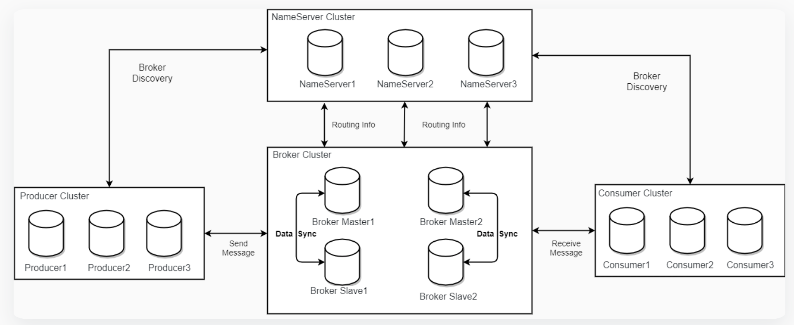
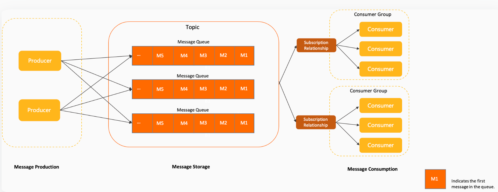

<!-- START doctoc generated TOC please keep comment here to allow auto update -->
<!-- DON'T EDIT THIS SECTION, INSTEAD RE-RUN doctoc TO UPDATE -->
**Table of Contents**  *generated with [DocToc](https://github.com/thlorenz/doctoc)*

- [github.com/apache/rocketmq](#githubcomapacherocketmq)
  - [架构](#%E6%9E%B6%E6%9E%84)
  - [领域模型](#%E9%A2%86%E5%9F%9F%E6%A8%A1%E5%9E%8B)
  - [安装](#%E5%AE%89%E8%A3%85)
    - [dashboard](#dashboard)
  - [消息](#%E6%B6%88%E6%81%AF)
  - [golang sdk](#golang-sdk)
    - [生产者](#%E7%94%9F%E4%BA%A7%E8%80%85)
    - [消费者](#%E6%B6%88%E8%B4%B9%E8%80%85)
  - [参考](#%E5%8F%82%E8%80%83)

<!-- END doctoc generated TOC please keep comment here to allow auto update -->

# github.com/apache/rocketmq

RocketMQ作为一款纯java、分布式、队列模型的开源消息中间件.


## 架构
https://rocketmq.apache.org/zh/docs/4.x/introduction/02whatis/#rocketmq%E7%9A%84%E9%83%A8%E7%BD%B2%E6%A8%A1%E5%9E%8B




## 领域模型
https://rocketmq.apache.org/docs/domainModel/01main
  



## 安装

```shell
# helm 安装
helm upgrade --install rocketmq \
  --namespace rocketmq \
  --create-namespace \
  --set dashboard.enabled="true" \
  rocketmq-repo/rocketmq

```

Apache RocketMQ 5.0 版本完成基本消息收发，包括 NameServer、Broker、Proxy 组件。

### dashboard
https://rocketmq.apache.org/docs/4.x/deployment/03Dashboard


## 消息

https://rocketmq.apache.org/zh/docs/4.x/producer/01concept1#%E6%B6%88%E6%81%AF


## golang sdk


### 生产者

初始化生产者 
```go
func NewProducer(opts ...producer.Option) (Producer, error) {
	return producer.NewDefaultProducer(opts...)
}


func NewDefaultProducer(opts ...Option) (*defaultProducer, error) {
	// 默认选项
	defaultOpts := defaultProducerOptions()
	for _, apply := range opts {
		apply(&defaultOpts)
	}
	// 默认 HttpResolver
	srvs, err := internal.NewNamesrv(defaultOpts.Resolver)
	if err != nil {
		return nil, errors.Wrap(err, "new Namesrv failed.")
	}
	if !defaultOpts.Credentials.IsEmpty() {
		srvs.SetCredentials(defaultOpts.Credentials)
	}
	defaultOpts.Namesrv = srvs

	producer := &defaultProducer{
		group:      defaultOpts.GroupName,
		callbackCh: make(chan interface{}),
		options:    defaultOpts,
	}
	// 获取或则初始化连接
	producer.client = internal.GetOrNewRocketMQClient(defaultOpts.ClientOptions, producer.callbackCh)

	// 拦截器
	producer.interceptor = primitive.ChainInterceptors(producer.options.Interceptors...)

	return producer, nil
}
```

```go

func GetOrNewRocketMQClient(option ClientOptions, callbackCh chan interface{}) RMQClient {
	client := &rmqClient{
		option:       option,
		remoteClient: remote.NewRemotingClient(),
		namesrvs:     option.Namesrv,
		done:         make(chan struct{}),
	}
	actual, loaded := clientMap.LoadOrStore(client.ClientID(), client)
	if !loaded { 
		// 注册处理函数
		
		// 消费者 id 修改
		client.remoteClient.RegisterRequestFunc(ReqNotifyConsumerIdsChanged, func(req *remote.RemotingCommand, addr net.Addr) *remote.RemotingCommand {
			// 重平衡
			client.RebalanceImmediately()
			return nil
		})
		// 事务状态
		client.remoteClient.RegisterRequestFunc(ReqCheckTransactionState, func(req *remote.RemotingCommand, addr net.Addr) *remote.RemotingCommand {
            // ...
		})

        // 消费者运行信息
		client.remoteClient.RegisterRequestFunc(ReqGetConsumerRunningInfo, func(req *remote.RemotingCommand, addr net.Addr) *remote.RemotingCommand {
			rlog.Info("receive get consumer running info request...", nil)
            // ...
		})

		// 消息
		client.remoteClient.RegisterRequestFunc(ReqConsumeMessageDirectly, func(req *remote.RemotingCommand, addr net.Addr) *remote.RemotingCommand {
            // ...
		})
	}
	return actual.(*rmqClient)
}


func NewRemotingClient() *remotingClient {
	return &remotingClient{
		processors: make(map[int16]ClientRequestFunc),
	}
}

// 注册函数
func (c *remotingClient) RegisterRequestFunc(code int16, f ClientRequestFunc) {
	c.processors[code] = f
}

```


启动
```go
func (p *defaultProducer) Start() error {
	atomic.StoreInt32(&p.state, int32(internal.StateRunning))

	p.client.RegisterProducer(p.group, p)
	p.client.Start()
	return nil
}

```


发送同步消息

```go
func (p *defaultProducer) SendSync(ctx context.Context, msgs ...*primitive.Message) (*primitive.SendResult, error) {
	if err := p.checkMsg(msgs...); err != nil {
		return nil, err
	}

	msg := p.encodeBatch(msgs...)

	resp := primitive.NewSendResult()
	if p.interceptor != nil { // 拦截器处理
		// ...
		return resp, err
	}

	err := p.sendSync(ctx, msg, resp)
	return resp, err
}

func (p *defaultProducer) sendSync(ctx context.Context, msg *primitive.Message, resp *primitive.SendResult) error {

	retryTime := 1 + p.options.RetryTimes

	var (
		err error
	)

	if p.options.Namespace != "" {
		msg.Topic = p.options.Namespace + "%" + msg.Topic
	}

	var producerCtx *primitive.ProducerCtx
	for retryCount := 0; retryCount < retryTime; retryCount++ {
		// 选择队列
		mq := p.selectMessageQueue(msg)
		if mq == nil {
			err = fmt.Errorf("the topic=%s route info not found", msg.Topic)
			continue
		}

		// 获取 broker地址
		addr := p.options.Namesrv.FindBrokerAddrByName(mq.BrokerName)
		if addr == "" {
			return fmt.Errorf("topic=%s route info not found", mq.Topic)
		}

		if p.interceptor != nil {
			producerCtx = primitive.GetProducerCtx(ctx)
			producerCtx.BrokerAddr = addr
			producerCtx.MQ = *mq
		}

		res, _err := p.client.InvokeSync(ctx, addr, p.buildSendRequest(mq, msg), 3*time.Second)
		if _err != nil {
			err = _err
			continue
		}
		return p.client.ProcessSendResponse(mq.BrokerName, res, resp, msg)
	}
	return err
}

```

```go
func (c *rmqClient) InvokeSync(ctx context.Context, addr string, request *remote.RemotingCommand,
	timeoutMillis time.Duration) (*remote.RemotingCommand, error) {
	if c.close {
		return nil, ErrServiceState
	}
	ctx, _ = context.WithTimeout(ctx, timeoutMillis)
	return c.remoteClient.InvokeSync(ctx, addr, request)
}


func (c *remotingClient) InvokeSync(ctx context.Context, addr string, request *RemotingCommand) (*RemotingCommand, error) {
	// 建立连接
	conn, err := c.connect(ctx, addr)
	if err != nil {
		return nil, err
	}
	resp := NewResponseFuture(ctx, request.Opaque, nil)
	c.responseTable.Store(resp.Opaque, resp)
	defer c.responseTable.Delete(request.Opaque)
	// 发送请求
	err = c.sendRequest(conn, request)
	if err != nil {
		return nil, err
	}
	return resp.waitResponse()
}
```


### 消费者

MQ的消费模式可以大致分为两种，一种是推Push，一种是拉Pull.


在 Apache RocketMQ 有两种消费模式，分别是：

- 集群消费模式：当使用集群消费模式时，RocketMQ 认为任意一条消息只需要被消费组内的任意一个消费者处理即可。
- 广播消费模式：当使用广播消费模式时，RocketMQ 会将每条消息推送给消费组所有的消费者，保证消息至少被每个消费者消费一次。

主动推送消息给客户端的消费者初始化
```go
/// 初始化  Push 类型消费者
func NewPushConsumer(opts ...Option) (*pushConsumer, error) {
	defaultOpts := defaultPushConsumerOptions()
	for _, apply := range opts {
		apply(&defaultOpts)
	}
	srvs, err := internal.NewNamesrv(defaultOpts.Resolver)
	if err != nil {
		return nil, errors.Wrap(err, "new Namesrv failed.")
	}
	if !defaultOpts.Credentials.IsEmpty() {
		srvs.SetCredentials(defaultOpts.Credentials)
	}
	defaultOpts.Namesrv = srvs

	if defaultOpts.Namespace != "" {
		defaultOpts.GroupName = defaultOpts.Namespace + "%" + defaultOpts.GroupName
	}

	dc := &defaultConsumer{
		client:         internal.GetOrNewRocketMQClient(defaultOpts.ClientOptions, nil),// 真正的对接rocketmq 客户端
		consumerGroup:  defaultOpts.GroupName, // 消费组
		cType:          _PushConsume,
		state:          int32(internal.StateCreateJust),
		prCh:           make(chan PullRequest, 4),
		model:          defaultOpts.ConsumerModel, // 默认集群消费模式
		consumeOrderly: defaultOpts.ConsumeOrderly,
		fromWhere:      defaultOpts.FromWhere,  // 消费位点
		allocate:       defaultOpts.Strategy, // 分配策略,默认 平均分配策略
		option:         defaultOpts,
		namesrv:        srvs,
	}

	p := &pushConsumer{
		defaultConsumer: dc,
		subscribedTopic: make(map[string]string, 0),
		queueLock:       newQueueLock(),
		done:            make(chan struct{}, 1),
		consumeFunc:     utils.NewSet(),
	}
	dc.mqChanged = p.messageQueueChanged
	if p.consumeOrderly { // 消费顺序
		p.submitToConsume = p.consumeMessageOrderly
	} else {
		p.submitToConsume = p.consumeMessageCurrently
	}

	// 拦截器
	p.interceptor = primitive.ChainInterceptors(p.option.Interceptors...)

	return p, nil
}

```


启动
```go
func (pc *pushConsumer) Start() error {
	var err error
	pc.once.Do(func() {
        // ..
		atomic.StoreInt32(&pc.state, int32(internal.StateStartFailed))
		pc.validate()

		// 注册消费者
		err = pc.client.RegisterConsumer(pc.consumerGroup, pc)
		if err != nil {
			rlog.Error("the consumer group has been created, specify another one", map[string]interface{}{
				rlog.LogKeyConsumerGroup: pc.consumerGroup,
			})
			err = ErrCreated
			return
		}

		// 默认消费者开始
		err = pc.defaultConsumer.start()
		if err != nil {
			return
		}

		go func() {
			// todo start clean msg expired
			for {
				select {
				case pr := <-pc.prCh:
					go func() {
						pc.pullMessage(&pr)
					}()
				case <-pc.done:
					rlog.Info("push consumer close pullConsumer listener.", map[string]interface{}{
						rlog.LogKeyConsumerGroup: pc.consumerGroup,
					})
					return
				}
			}
		}()

		go primitive.WithRecover(func() {
            // ...
		})
	})

	if err != nil {
		return err
	}

	pc.client.UpdateTopicRouteInfo()
	for k := range pc.subscribedTopic {
		_, exist := pc.topicSubscribeInfoTable.Load(k)
		if !exist {
			pc.client.Shutdown()
			return fmt.Errorf("the topic=%s route info not found, it may not exist", k)
		}
	}
	pc.client.CheckClientInBroker()
	pc.client.SendHeartbeatToAllBrokerWithLock()
	pc.client.RebalanceImmediately()

	return err
}

func (dc *defaultConsumer) start() error {
    // ...

	dc.client.Start()

	// ...
	return nil
}
```


订阅
```go

func (pc *pushConsumer) Subscribe(topic string, selector MessageSelector,
	f func(context.Context, ...*primitive.MessageExt) (ConsumeResult, error)) error {
	if atomic.LoadInt32(&pc.state) == int32(internal.StateStartFailed) ||
		atomic.LoadInt32(&pc.state) == int32(internal.StateShutdown) {
		return errors.New("cannot subscribe topic since client either failed to start or has been shutdown.")
	}

	// 增加消费者重试topic
	retryTopic := internal.GetRetryTopic(pc.consumerGroup)
	_, exists := pc.subscriptionDataTable.Load(retryTopic)
	if !exists {
		sub := buildSubscriptionData(retryTopic, MessageSelector{TAG, _SubAll})
		pc.subscriptionDataTable.Store(retryTopic, sub)
	}

	if pc.option.Namespace != "" {
		topic = pc.option.Namespace + "%" + topic
	}
	
	// 构建订阅数据
	data := buildSubscriptionData(topic, selector)
	pc.subscriptionDataTable.Store(topic, data)
	pc.subscribedTopic[topic] = ""

	// 注册根据topic 来区分消费函数
	pc.consumeFunc.Add(&PushConsumerCallback{
		f:     f,
		topic: topic,
	})
	return nil
}
```

## 参考

- https://rocketmq.apache.org/docs/
- https://github.com/apache/rocketmq/blob/develop/docs/cn/design.md