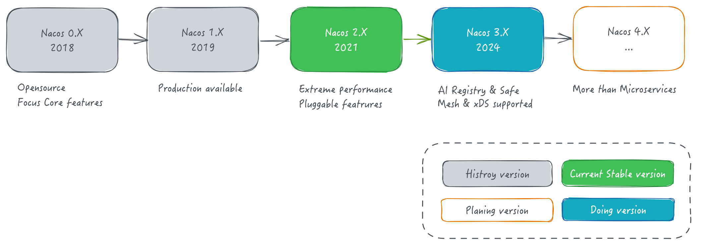

<!-- START doctoc generated TOC please keep comment here to allow auto update -->
<!-- DON'T EDIT THIS SECTION, INSTEAD RE-RUN doctoc TO UPDATE -->
**Table of Contents**  *generated with [DocToc](https://github.com/thlorenz/doctoc)*

- [Nacos (Dynamic Naming and Configuration Service )](#nacos-dynamic-naming-and-configuration-service-)
  - [架构](#%E6%9E%B6%E6%9E%84)
  - [nacos 版本](#nacos-%E7%89%88%E6%9C%AC)
  - [关键特性](#%E5%85%B3%E9%94%AE%E7%89%B9%E6%80%A7)
  - [Nacos 概念](#nacos-%E6%A6%82%E5%BF%B5)
    - [命名空间](#%E5%91%BD%E5%90%8D%E7%A9%BA%E9%97%B4)
    - [1. 配置管理](#1-%E9%85%8D%E7%BD%AE%E7%AE%A1%E7%90%86)
      - [Data ID](#data-id)
    - [2. 服务管理](#2-%E6%9C%8D%E5%8A%A1%E7%AE%A1%E7%90%86)
      - [元信息](#%E5%85%83%E4%BF%A1%E6%81%AF)
      - [服务分组](#%E6%9C%8D%E5%8A%A1%E5%88%86%E7%BB%84)
      - [实例](#%E5%AE%9E%E4%BE%8B)
      - [权重](#%E6%9D%83%E9%87%8D)
      - [健康保护阈值](#%E5%81%A5%E5%BA%B7%E4%BF%9D%E6%8A%A4%E9%98%88%E5%80%BC)
  - [领域模型](#%E9%A2%86%E5%9F%9F%E6%A8%A1%E5%9E%8B)
    - [数据模型](#%E6%95%B0%E6%8D%AE%E6%A8%A1%E5%9E%8B)
    - [服务领域模型](#%E6%9C%8D%E5%8A%A1%E9%A2%86%E5%9F%9F%E6%A8%A1%E5%9E%8B)
    - [配置领域模型](#%E9%85%8D%E7%BD%AE%E9%A2%86%E5%9F%9F%E6%A8%A1%E5%9E%8B)
  - [环境初始化](#%E7%8E%AF%E5%A2%83%E5%88%9D%E5%A7%8B%E5%8C%96)
  - [golang sdk: go-nacos](#golang-sdk-go-nacos)
    - [配置说明](#%E9%85%8D%E7%BD%AE%E8%AF%B4%E6%98%8E)
    - [配置客户端](#%E9%85%8D%E7%BD%AE%E5%AE%A2%E6%88%B7%E7%AB%AF)
    - [服务发现客户端](#%E6%9C%8D%E5%8A%A1%E5%8F%91%E7%8E%B0%E5%AE%A2%E6%88%B7%E7%AB%AF)
  - [参考](#%E5%8F%82%E8%80%83)

<!-- END doctoc generated TOC please keep comment here to allow auto update -->

# Nacos (Dynamic Naming and Configuration Service )
Nacos 是阿里巴巴推出来的一个开源项目，这是一个易于构建 AI Agent 应用的动态服务发现、配置管理和AI智能体管理平台。


## 架构


- 服务管理：实现服务CRUD，域名CRUD，服务健康状态检查，服务权重管理等功能
- 配置管理：实现配置管CRUD，版本管理，灰度管理，监听管理，推送轨迹，聚合数据等功能
- 元数据管理：提供元数据CURD 和打标能力
- 插件机制：实现三个模块可分可合能力，实现扩展点SPI机制
- 事件机制：实现异步化事件通知，sdk数据变化异步通知等逻辑
- 日志模块：管理日志分类，日志级别，日志可移植性（尤其避免冲突），日志格式，异常码+帮助文档
- 回调机制：sdk通知数据，通过统一的模式回调用户处理。接口和数据结构需要具备可扩展性
- 寻址模式：解决ip，域名，nameserver、广播等多种寻址模式，需要可扩展
- 推送通道：解决server与存储、server间、server与sdk间推送性能问题
- 容量管理：管理每个租户，分组下的容量，防止存储被写爆，影响服务可用性
- 流量管理：按照租户，分组等多个维度对请求频率，长链接个数，报文大小，请求流控进行控制
- 缓存机制：容灾目录，本地缓存，server缓存机制。容灾目录使用需要工具
- 启动模式：按照单机模式，配置模式，服务模式，dns模式，或者all模式，启动不同的程序+UI
- 一致性协议：解决不同数据，不同一致性要求情况下，不同一致性机制
- 存储模块：解决数据持久化、非持久化存储，解决数据分片问题
- Nameserver：解决namespace到clusterid的路由问题，解决用户环境与nacos物理环境映射问题
- CMDB：解决元数据存储，与三方cmdb系统对接问题，解决应用，人，资源关系
- Metrics：暴露标准metrics数据，方便与三方监控系统打通
- Trace：暴露标准trace，方便与SLA系统打通，日志白平化，推送轨迹等能力，并且可以和计量计费系统打通
- 接入管理：相当于阿里云开通服务，分配身份、容量、权限过程
- 用户管理：解决用户管理，登录，sso等问题
- 权限管理：解决身份识别，访问控制，角色管理等问题
- 审计系统：扩展接口方便与不同公司审计系统打通
- 通知系统：核心数据变更，或者操作，方便通过SMS系统打通，通知到对应人数据变更
- OpenAPI：暴露标准Rest风格HTTP接口，简单易用，方便多语言集成
- Console：易用控制台，做服务管理、配置管理等操作
- SDK：多语言sdk
- Agent：dns-f类似模式，或者与mesh等方案集成
- CLI：命令行对产品进行轻量化管理，像git一样好用


## nacos 版本



在nacos 1.X的版本中使用http方式来做服务注册和发现，配置主端口(默认8848)；
在2.0版本支持了grpc 服务发现：9848 是客户端gRPC请求服务端端口，用于客户端向服务端发起连接和请求9849是服务端gRPC请求服务端端口，用于服务间同步等


Nacos 3.0 最主要的能力就是作为MCP Registry，支持了MCP服务的注册，管理，和发现的能力。

## 关键特性
1. 服务发现和服务健康监测


    Nacos 支持基于 DNS 和基于 RPC 的服务发现。服务提供者使用 原生SDK、OpenAPI、或一个独立的Agent TODO注册 Service 后，服务消费者可以使用DNS TODO 或HTTP&API查找和发现服务。
    
    Nacos 提供对服务的实时的健康检查，阻止向不健康的主机或服务实例发送请求。Nacos 支持传输层 (PING 或 TCP)和应用层 (如 HTTP、MySQL、用户自定义）的健康检查。
    对于复杂的云环境和网络拓扑环境中（如 VPC、边缘网络等）服务的健康检查，Nacos 提供了 agent 上报模式和服务端主动检测2种健康检查模式。
    Nacos 还提供了统一的健康检查仪表盘，帮助您根据健康状态管理服务的可用性及流量

2. 动态配置服务


    动态配置服务可以让您以中心化、外部化和动态化的方式管理所有环境的应用配置和服务配置。
    
    动态配置消除了配置变更时重新部署应用和服务的需要，让配置管理变得更加高效和敏捷。
    
    配置中心化管理让实现无状态服务变得更简单，让服务按需弹性扩展变得更容易。
    
3. 动态 DNS 服务  

    
    动态 DNS 服务支持权重路由，让您更容易地实现中间层负载均衡、更灵活的路由策略、流量控制以及数据中心内网的简单DNS解析服务。
    动态DNS服务还能让您更容易地实现以 DNS 协议为基础的服务发现，以帮助您消除耦合到厂商私有服务发现 API 上的风险。

4. 服务及其元数据管理


    Nacos 能让您从微服务平台建设的视角管理数据中心的所有服务及元数据，包括管理服务的描述、生命周期、服务的静态依赖分析、服务的健康状态、服务的流量管理、路由及安全策略、服务的 SLA 以及最首要的 metrics 统计数据。


## Nacos 概念

### 命名空间
用于进行租户粒度的配置隔离。不同的命名空间下，可以存在相同的 Group 或 Data ID 的配置。
Namespace 的常用场景之一是不同环境的配置的区分隔离，例如开发测试环境和生产环境的资源（如配置、服务）隔离等

### 1. 配置管理

#### Data ID
Nacos 中的某个配置集的 ID。配置集 ID 是组织划分配置的维度之一。
Data ID 通常用于组织划分系统的配置集。一个系统或者应用可以包含多个配置集，每个配置集都可以被一个有意义的名称标识。
Data ID 通常采用类 Java 包（如 com.taobao.tc.refund.log.level）的命名规则保证全局唯一性

### 2. 服务管理

#### 元信息
Nacos数据（如配置和服务）描述信息，如服务版本、权重、容灾策略、负载均衡策略、鉴权配置、各种自定义标签 (label)，从作用范围来看，分为服务级别的元信息、集群的元信息及实例的元信息。

#### 服务分组
不同的服务可以归类到同一分组。

#### 实例
提供一个或多个服务的具有可访问网络地址（IP:Port）的进程。

#### 权重
实例级别的配置。权重为浮点数。权重越大，分配给该实例的流量越大。

#### 健康保护阈值
为了防止因过多实例 (Instance) 不健康导致流量全部流向健康实例 (Instance) ，继而造成流量压力把健康实例 (Instance) 压垮并形成雪崩效应，应将健康保护阈值定义为一个 0 到 1 之间的浮点数。
当域名健康实例数 (Instance) 占总服务实例数 (Instance) 的比例小于该值时，无论实例 (Instance) 是否健康，都会将这个实例 (Instance) 返回给客户端。这样做虽然损失了一部分流量，但是保证了集群中剩余健康实例 (Instance) 能正常工作

## 领域模型

### 数据模型


Nacos 数据模型 由三元组唯一确定, 分别是命名空间（Namespace），分组（Group）和资源名；其中 资源名按照功能模块的不同，可以分为服务名（ServiceName），配置名（DataId）和MCP服务（McpName）
### 服务领域模型


### 配置领域模型

围绕配置，主要有两个关联的实体，一个是配置变更历史，一个是服务标签（用于打标分类，方便索引），由 ID 关联。


## 环境初始化

docker 方式: https://nacos.io/docs/v3.0/quickstart/quick-start-docker/
```shell
docker run --rm --name nacos-standalone-derby \
    -e MODE=standalone \
    -e NACOS_AUTH_TOKEN=SecretKey012345678901234567890123456789012345678901234567890123456789 \
    -e NACOS_AUTH_IDENTITY_KEY=serverIdentity \
    -e NACOS_AUTH_IDENTITY_VALUE=security \
    -p 8080:8080 \
    -p 8848:8848 \
    -p 9848:9848 \
    nacos/nacos-server:v3.1.0
```


## golang sdk: go-nacos 
https://nacos.io/docs/v3.0/manual/user/go-sdk/usage/

应用配置管理（Application Configuration Management，简称 ACM）

企业级分布式应用服务（Enterprise Distributed Application Service,简称EDAS）

### 配置说明 
配置 Nacos 客户端的选项
```go
constant.ClientConfig{
	TimeoutMs            uint64 // 请求Nacos服务端的超时时间，默认是10000ms
	NamespaceId          string // ACM的命名空间Id
	Endpoint             string // 当使用ACM时，需要该配置. https://help.aliyun.com/document_detail/130146.html
	RegionId             string // ACM&KMS的regionId，用于配置中心的鉴权
	AccessKey            string // ACM&KMS的AccessKey，用于配置中心的鉴权
	SecretKey            string // ACM&KMS的SecretKey，用于配置中心的鉴权
	OpenKMS              bool   // 是否开启kms，默认不开启，kms可以参考文档 https://help.aliyun.com/product/28933.html
	                            // 同时DataId必须以"cipher-"作为前缀才会启动加解密逻辑
	CacheDir             string // 缓存service信息的目录，默认是当前运行目录
	UpdateThreadNum      int    // 监听service变化的并发数，默认20
	NotLoadCacheAtStart  bool   // 在启动的时候不读取缓存在CacheDir的service信息
	UpdateCacheWhenEmpty bool   // 当service返回的实例列表为空时，不更新缓存，用于推空保护
	Username             string // Nacos服务端的API鉴权Username
	Password             string // Nacos服务端的API鉴权Password
	LogDir               string // 日志存储路径
	RotateTime           string // 日志轮转周期，比如：30m, 1h, 24h, 默认是24h
	MaxAge               int64  // 日志最大文件数，默认3
	LogLevel             string // 日志默认级别，值必须是：debug,info,warn,error，默认值是info
}
```
服务端配置
```go
constant.ServerConfig{
	ContextPath string // Nacos的ContextPath
	IpAddr      string // Nacos的服务地址
	Port        uint64 // Nacos的服务端口
	Scheme      string // Nacos的服务地址前缀
}
```
Note：我们可以配置多个ServerConfig，客户端会对这些服务端做轮询请求


### 配置客户端

```go
// github.com/nacos-group/nacos-sdk-go/v2@v2.0.1/clients/client_factory.go


func CreateConfigClient(properties map[string]interface{}) (iClient config_client.IConfigClient, err error) {
	param := getConfigParam(properties)
	return NewConfigClient(param)
}

```

### 服务发现客户端

```go
func NewNamingClient(param vo.NacosClientParam) (iClient naming_client.INamingClient, err error) {
	nacosClient, err := setConfig(param)
	if err != nil {
		return
	}
	naming, err := naming_client.NewNamingClient(nacosClient)
	if err != nil {
		return
	}
	iClient = naming
	return
}

```

## 参考
- https://github.com/alibaba/nacos
- https://nacos.io/docs/v3.0/overview/