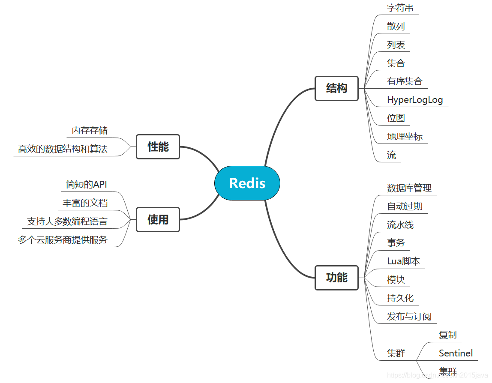
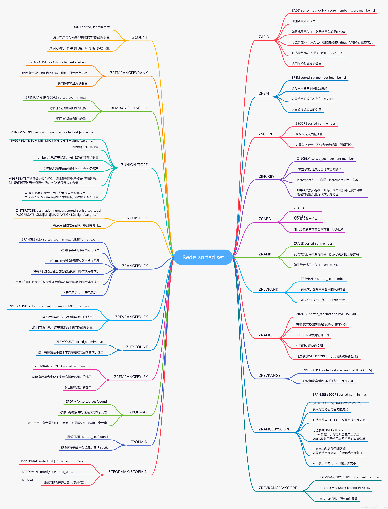
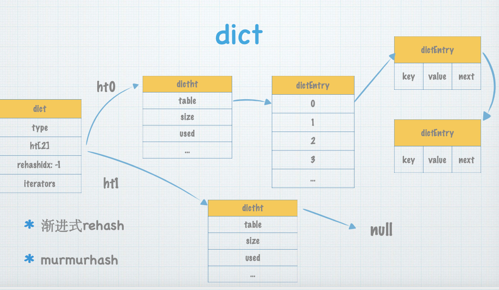
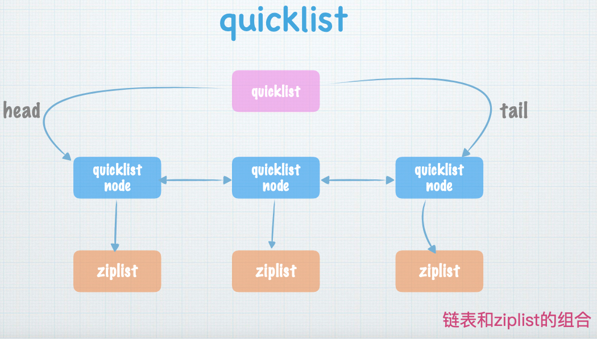
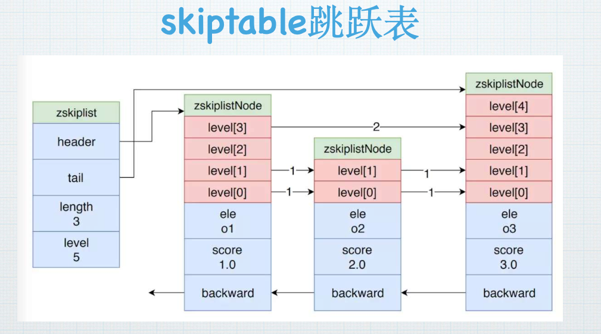
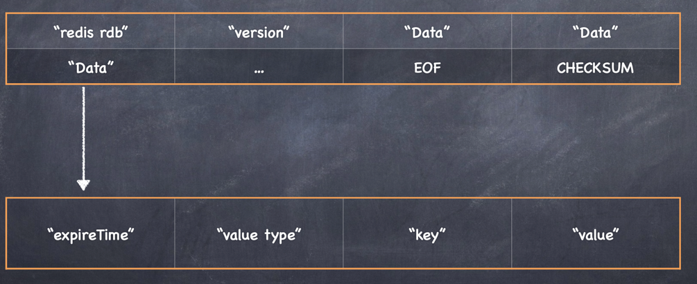
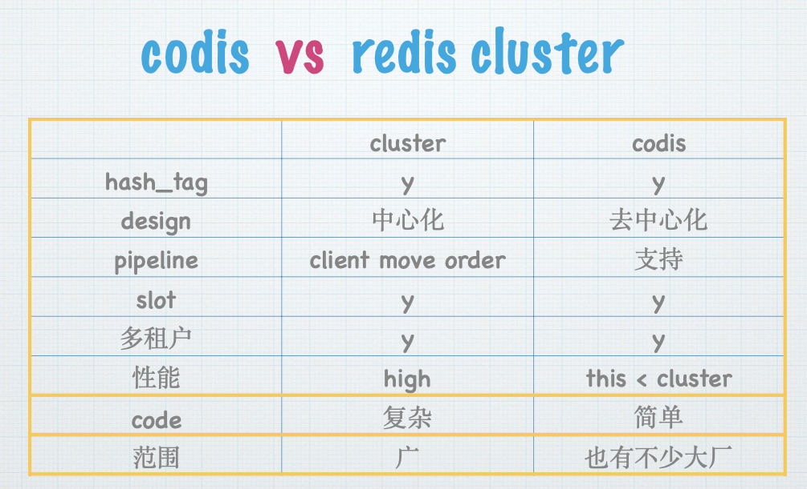
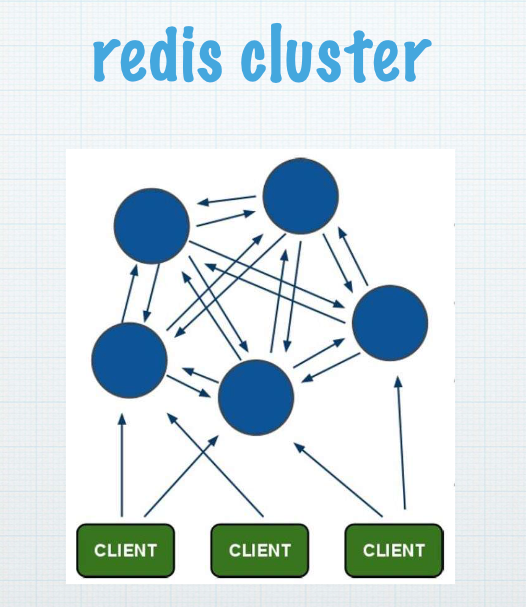

#Redis:



	Remote Dictionary Server, 翻译为远程字典服务. Redis是一个完全开源的基于Key-Value的NoSQL存储系统，他是一个使用ANSIC语言编写的，
	遵守BSD协议，支持网络、可基于内存的可持久化的日志型、Key-Value数据库,并提供多种语言的API.
执行原理：

	# 1. 客户端发送命令后，Redis服务器将为这个客户端链接创造一个'输入缓存'，将命令放到里面
	# 2. 再由Redis服务器进行分配挨个执行，顺序是随机的，这将不会产生并发冲突问题，也就不需要事务了.
	# 3. 再将结果返回到客户端的'输出缓存'中，输出缓存先存到'固定缓冲区',如果存满了，就放入'动态缓冲区',客户端再获得信息结果

	# 如果数据时写入命令，例如set name:1  zhangsan 方式添加一个字符串.
	# Redis将根据策略，将这对key:value来用内部编码格式存储，好处是改变内部编码不会对外有影响，正常操作即可,
	# 同时不同情况下存储格式不一样，发挥优势.

##Redis协议


为什么需要Redis?

	传统数据库在存储数据时，需要先定义schema，以确定类型(字节宽度)，并以行存储，所以每行所占的字节宽度是一致的（便于索引数据）。
	数据库内部数据分为多个datapage(一般是4kb)存储，随着数据量的增大，数据库查询速度会越来越慢，其主要瓶颈在于磁盘I/O。
	由于数据量增大查找datapage的时间也会变长，所以索引出现了。索引是一个B+T，存储在内存中，根据索引记录的信息，可以快速定位到datapage的位置。
    索引虽然会大大加快查询速度，但是因为增删改需要维护索引的B+T，所以会把增删改的速度拖慢，所以索引不适合频繁写的表。
	此外，当数据库高并发查询的情况下，单位时间内所需的数据量也是很大的，此时可能会受到磁盘带宽的影响，影响磁盘的查询速度。
	在I/O上，内存相比较于磁盘，拥有较好的性能;
	出现了一批基于内存的关系型数据库，比如SAP HAHA数据库，其物理机器内存2T，包含软件以及服务，购买需要1亿元,由于内存关系型数据库的昂贵价格，
	所以大部分公司采用了折中的方案,使用磁盘关系型数据库+内存缓存,比如 Oracle+Memcached,Mysql+Redis
单线程的Redis为什么这么快?

	# 1. 基于内存的访问，非阻塞I/O，Redis使用事件驱动模型epoll多路复用实现，连接，读写，关闭都转换为事件不在网络I/O上浪费过多的时间.
	# 2. 单线程避免高并发的时候，多线程有锁的问题和线程切换的CPU开销问题.《虽然是单线程，但可以开多实例弥补》
	# 3. 使用C语言编写，更好的发挥服务器性能，并且代码简介，性能高
Redis五种数据类型应用场景


	1.String(sds,simple dynamic string简单动态字符串): 常规的set/get操作,因为string 类型是二进制安全的，可以用来存放图片，视频等内容，
        另外由于Redis的高性能读写功能，而string类型的value也可以是数字，一般做一些复杂的计数功能的缓存,还可以用作计数器（INCR,DECR），
		比如分布式环境中统计系统的在线人数，秒杀等


	2. hash(hash table): value 存放的是键值对结构化后的对象，比较方便操作其中某个字段，比如可以做单点登录存放用户信息,以cookiele作为key，
		设置30分钟为缓存过期时间，能很好的模拟出类似session的效
		


	3. list(deque): 发布和订阅、慢查询、监视器等都用到了链表，Redis服务器本身还是用链表来保存多个客户端的状态信息，以及使用链表来构建客户端输出缓冲区。
    另外可以利用lrange命令，做基于redis的分页功能,性能极佳，用户体验好
	


	4. set(intset+dict):由于底层是字典实现的，查找元素特别快，另外set 数据类型不允许重复，利用这两个特性我们可以进行全局去重，
		比如在用户注册模块，判断用户名是否注册；另外就是利用交集、并集、差集等操作，可以计算共同喜好，全部的喜好，自己独有的喜好等功能

		

	5. Zset(skip list + hash table):有序的集合，可以做范围查找，排行榜应用，取 TOP N 操作等,还可以做延时任务

##RedisDB内部结构


##Redis数据类型底层数据结构


###1.string(sds)


```c   
typedef char *sds;
```
sds字符串根据字符串的长度，划分了五种结构体sdshdr5、sdshdr8、sdshdr16、sdshdr32、sdshdr64,分别对应的类型为SDS_TYPE_5、SDS_TYPE_8、SDS_TYPE_16、SDS_TYPE_32、SDS_TYPE_64
每个sds 所能存取的最大字符串长度为：

    sdshdr5最大为32(2^5)
    sdshdr8最大为0xff(2^8-1)
    sdshdr16最大为0xffff(2^16-1)
    sdshdr32最大为0xffffffff(2^32-1)
    sdshdr64最大为(2^64-1)
SDS_TYPE_8结构体
```c
struct __attribute__ ((__packed__)) sdshdr8 {
    uint8_t len; /* used */
    uint8_t alloc; /* excluding the header and null terminator */
    unsigned char flags; /* 3 lsb of type, 5 unused bits */
    char buf[];
};

```
###2.hash(ziplist+dict)


字典的结构体
```c
//dict.h
typedef struct dict {
    dictType *type;
    void *privdata;
    // ht是一个长度为2的数组，对应的是两个哈希表，一般使用使用ht[0],ht[1]主要在扩容和缩容时使用。
    dictht ht[2];
    long rehashidx; /* rehashing not in progress if rehashidx == -1 */
    unsigned long iterators; /* number of iterators currently running */
} dict;

```
哈希表结构体
```c
typedef struct dictht {
	//哈希表数组,对应的是多个哈希表节点dictEntry
    dictEntry **table;
    //哈希表大小
    unsigned long size;
   	//哈希表大小的掩码,用于计算索引值
   	//总是等于size-1
    unsigned long sizemask;
   	//已有节点的数量
    unsigned long used;
} dictht;
```
哈希表节点key/value结构体定义
```c
typedef struct dictEntry {
	//键
    void *key;
    //值
    union {
        void *val;
        uint64_t u64;
        int64_t s64;
        double d;
    } v;
    //指向下一个哈希表节点,形成链表
    struct dictEntry *next;
} dictEntry
```
哈希表每个节点都保存着一个键值对，key就是键值对的键，v属性就是对应键值对的值，v可以是一个指针也可以是uint64_t,整数也可以是int64_t整数。 
next是一个链表，指向着下一个哈希表节点，这个指针可以将多个哈希值相同的键值对连接在一起，以此来解决哈希冲突问题。

###3.set(intset+dict)


整数集合intset是集合键的底层实现之一，当一个集合只包含整数值元素，并且这个集合的元素数量不多时，Redis就会使用整数集合键的底层实现。
```c
typedef struct intset {
	//编码方式
    uint32_t encoding;
    //集合包含的元素数量
    uint32_t length;
    //保存元素的数组
    int8_t contents[];
} intset;
```
contents数组是整数集合的底层实现：整数集合的每个元素都是contents数组的一个数据项(item),各个项在数组中按值得大小从小到大有序得排列，并且数组中不包含任何重复项

虽然intset结构将contents属性声明为int8_t类型的数组，但实际上contents并不保存任何int8_t类型的值，contents数组得真正类型取决于encoding属性的值:

    如果encoding属性得值为INTSET_ENC_INT16，那么contents就是一个int16_t类型的数组，数组里得每个项都是一个int16_t类型的整数值(最小值为-32768,最大值为32767)。
    
    如果encoding属性得值为INTSET_ENC_INT32，那么contents就是一个int32_t类型的数组，数组里的每个项都是一个int32_t类型的整数值(最小值为-2147483648,最大值为2147483648)。
    
    如果encoding属性的值为INTSET_ENC_INT64,那么contents就是一个int64_t类型的数组，数组里的每个项都是一个int64_t类型得整数值(最小值为-9223372036854775808,9223372036854775808)
length属性记录了整数集合包含得元素数量，也即是contents数组得长度。

###4.list(ziplist+quicklist)


```c
//链表节点adlist.h/listNode
typedef struct listNode {
    struct listNode *prev;//前置节点
    struct listNode *next;//后置节点
    void *value;//节点值
} listNode;

typedef struct list {
    listNode *head;//表头节点
    listNode *tail;//表尾节点
    //节点值复制函数
    void *(*dup)(void *ptr);
    //节点值释放函数
    void (*free)(void *ptr);
    //节点值对比函数
    int (*match)(void *ptr, void *key);
    unsigned long len;
} list;
```


###5.Sort Set(hash+skiptable)

跳跃表的结构
```c
//定义在server.h/zskiplist
typedef struct zskiplistNode {
    sds ele;//成员对象
    double score;//分数
    struct zskiplistNode *backward;
    //层
    struct zskiplistLevel {
    	//前进指针
        struct zskiplistNode *forward;
        //跨度
        unsigned long span;
    } level[];
    
} zskiplistNode;

typedef struct zskiplist {
    struct zskiplistNode *header, *tail;
    unsigned long length; // 跳跃表的长度
    int level; // 记录跳跃表内，层数最大的那个节点的层数
} zskiplist;
```


###6.stream(radix-tree)


PipeLine:

	Redis的pipeline功能的原理是 Client通过一次性将多条redis命令发往Redis Server，减少了每条命令分别传输的IO开销。
	同时减少了系统调用的次数，因此提升了整体的吞吐能力。
	我们在主-从模式的Redis中，pipeline功能应该用的很多，但是Cluster模式下，估计还没有几个人用过。
	我们知道 redis cluster 默认分配了 16384 个slot，当我们set一个key 时，会用CRC16算法来取模得到所属的slot，
	然后将这个key 分到哈希槽区间的节点上，具体算法就是：CRC16(key) % 16384。如果我们使用pipeline功能，
	一个批次中包含的多条命令，每条命令涉及的key可能属于不同的slot
	
##持久化方式

###1.RDB(redis database)：
    以快照的形式将数据持久化到磁盘


    手段(会丢一部分最新数据) 
        * 每个Redis实例只会存一份rdb文件
        * 可以通过Save以及BGSAVE 来调用 
        * 二进制文件, lzf
    
###2.AOF(append only file)
    
    以日志的形式记录每个操作，将Redis执行过的所有指令全部记录下来（读操作不记录）， 只许追加文件但不可以修改文件， Redis启动时会读取AOF配置文件重构数据

    每次操作都需要fsync, 前台线程阻塞
    aof的内容就是redis标准协议

意义 
    将同一个key的反复操作，全部转为最后的值或multi集合(<64)

no-appendfsync-on-rewrite yes

    正导出rdb快照的过程中,要不要停止同步fsync 
auto-aof-rewrite-min-size 3000mb

    aof文件,至少超过3000M时, 再执行aof重写 
auto-aof-rewrite-percentage 80

    aof文件大小比起上次重写时的大小,增长率80%时,执行aof重写

Redis集群特点

    1. 多个redis节点网络互联，数据共享  
    2. 所有的节点都是一主一从（也可以是一主多从），其中从不提供服务，仅作为备用  
    3. 不支持同时处理多个key（如MSET/MGET），因为redis需要把key均匀分布在各个节点上，
    并发量很高的情况下同时创建key-value会降低性能并导致不可预测的行为  
    4. 支持在线增加、删除节点  
    5. 客户端可以连任何一个主节点进行读写

集群方案

    1. vip多线程版本 twemproxy(Twitter开源)
    2. codis

    3. redis cluster


#高并发缓存


