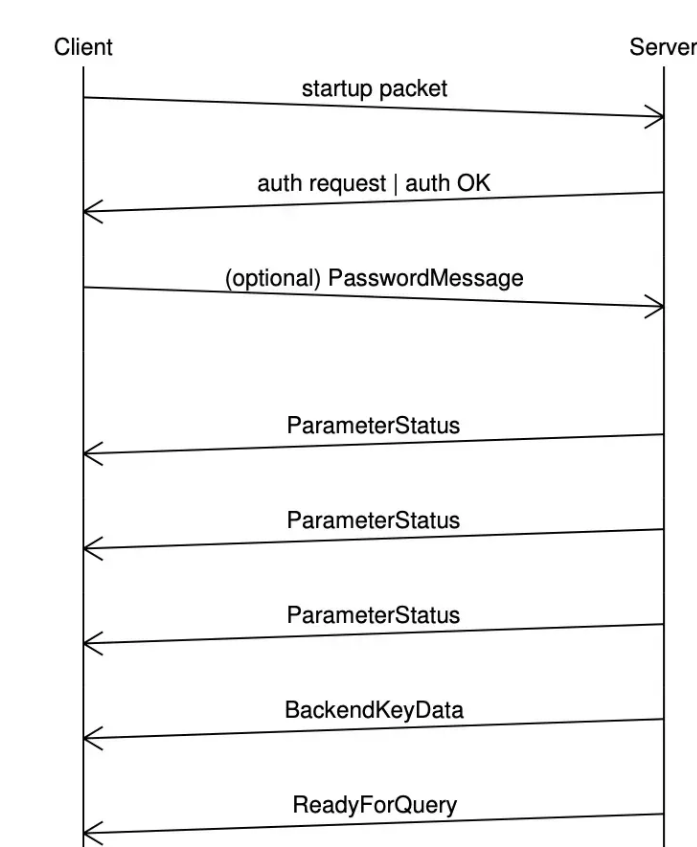
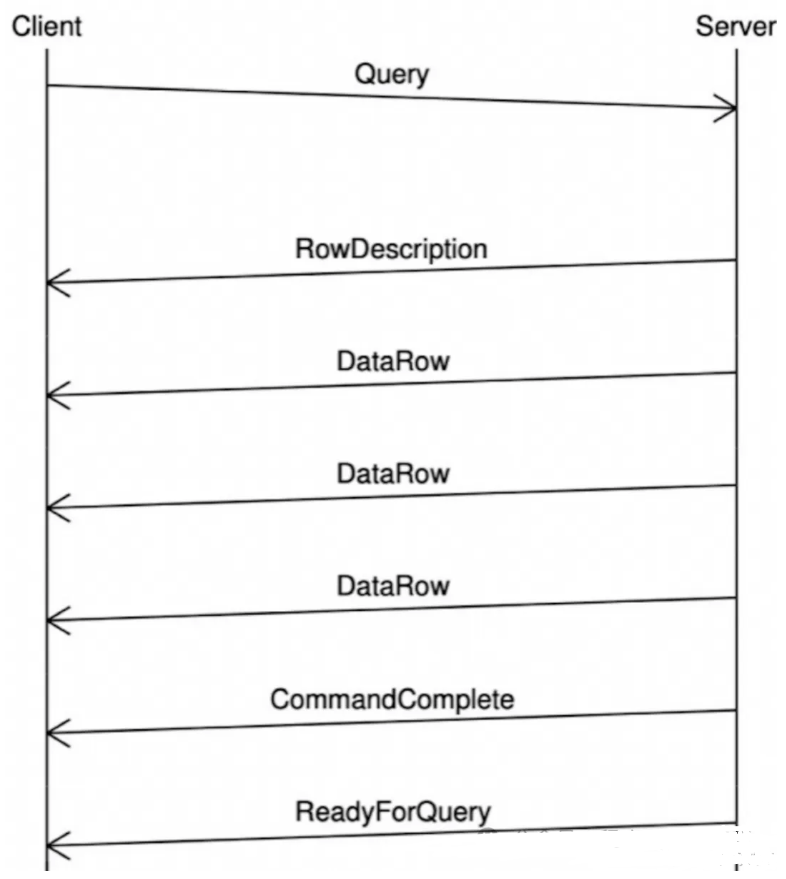
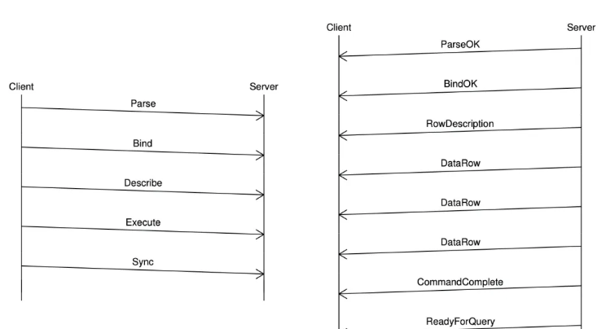

<!-- START doctoc generated TOC please keep comment here to allow auto update -->
<!-- DON'T EDIT THIS SECTION, INSTEAD RE-RUN doctoc TO UPDATE -->
**Table of Contents**  *generated with [DocToc](https://github.com/thlorenz/doctoc)*

- [PostgreSQL](#postgresql)
  - [环境搭建](#%E7%8E%AF%E5%A2%83%E6%90%AD%E5%BB%BA)
  - [基本命令](#%E5%9F%BA%E6%9C%AC%E5%91%BD%E4%BB%A4)
  - [LISTEN 和 NOTIFY 机制](#listen-%E5%92%8C-notify-%E6%9C%BA%E5%88%B6)
  - [流复制](#%E6%B5%81%E5%A4%8D%E5%88%B6)
  - [PostgreSQL 通讯协议](#postgresql-%E9%80%9A%E8%AE%AF%E5%8D%8F%E8%AE%AE)
    - [startup启动阶段](#startup%E5%90%AF%E5%8A%A8%E9%98%B6%E6%AE%B5)
    - [简单查询流程](#%E7%AE%80%E5%8D%95%E6%9F%A5%E8%AF%A2%E6%B5%81%E7%A8%8B)
    - [扩展查询](#%E6%89%A9%E5%B1%95%E6%9F%A5%E8%AF%A2)
    - [错误和通知](#%E9%94%99%E8%AF%AF%E5%92%8C%E9%80%9A%E7%9F%A5)
  - [参考](#%E5%8F%82%E8%80%83)

<!-- END doctoc generated TOC please keep comment here to allow auto update -->

# PostgreSQL

## 环境搭建

```shell
docker run --rm --name my-postgres -v postgre-data:/var/lib/postgresql/data -p 5432:5432 -e POSTGRES_PASSWORD=postgres -e LANG=C.UTF-8 -d postgres:16
```

## 基本命令

```shell
#1、列举数据库：\l
postgres=# \l
                                                   List of databases
   Name    |  Owner   | Encoding | Locale Provider | Collate |  Ctype  | ICU Locale | ICU Rules |   Access privileges
-----------+----------+----------+-----------------+---------+---------+------------+-----------+-----------------------
 postgres  | postgres | UTF8     | libc            | C.UTF-8 | C.UTF-8 |            |           |
 template0 | postgres | UTF8     | libc            | C.UTF-8 | C.UTF-8 |            |           | =c/postgres          +
           |          |          |                 |         |         |            |           | postgres=CTc/postgres
 template1 | postgres | UTF8     | libc            | C.UTF-8 | C.UTF-8 |            |           | =c/postgres          +
           |          |          |                 |         |         |            |           | postgres=CTc/postgres
 todo      | postgres | UTF8     | libc            | C.UTF-8 | C.UTF-8 |            |           |
#2、选择数据库：\c 数据库名
postgres=# \c todo
You are now connected to database "todo" as user "postgres".
#3、查看该某个库中的所有表：\dt
todo=# \dt
         List of relations
 Schema | Name  | Type  |  Owner
--------+-------+-------+----------
 public | tasks | table | postgres
(1 row)
#4、切换数据库：\c interface
#5、查看某个库中的某个表结构：\d 表名
todo=# \d tasks
                               Table "public.tasks"
   Column    |  Type   | Collation | Nullable |              Default
-------------+---------+-----------+----------+-----------------------------------
 id          | integer |           | not null | nextval('tasks_id_seq'::regclass)
 description | text    |           | not null |
Indexes:
    "tasks_pkey" PRIMARY KEY, btree (id)
#6、查看某个库中某个表的记录
todo=# select * from tasks limit 1;
 id | description
----+-------------
  1 | learn Rust
(1 row)
#7、显示字符集：\encoding
todo=# \encoding
UTF8
#8、退出psgl：\q
```


## LISTEN 和 NOTIFY 机制


PostgreSQL 的 LISTEN 和 NOTIFY 是一种内置的消息通知系统，允许应用程序订阅数据库事件，并在事件发生时接收通知。


## 流复制
PostgreSQL 支持 COPY 操作，COPY 操作通过流复制协议（Streaming Replication Protocol）实现。COPY 命令允许在服务器之间进行高速批量数据传输，有三种流复制模式：


COPY-IN 模式 : 数据从客户端传输到服务器端,对应命令 COPY FROM STDIN。

COPY-OUT 模式 : 数据从服务器端传输到客户端,对应命令 COPY TO STDOUT。

COPY-BOTH 模式 : 服务器端和客户端数据可以双向传输,用于 walsender，在主备间批量传输数据。


## PostgreSQL 通讯协议
以 PostgreSQL 为例，常用的客户端有自带的 psql，JAVA 应用的数据库驱动 JDBC，可视化工具 PgAdmin 等，这些客户端都需要遵守 PostgreSQL 的通信协议才能与之 “交流”.


PostgreSQL 通信协议包括两个阶段： startup 阶段和 normal 阶段.

startup 阶段，客户端尝试创建连接并发送授权信息，如果一切正常，服务端会反馈状态信息，连接成功创建，随后进入 normal 阶段。 
normal 阶段，客户端发送请求至服务端，服务端执行命令并将结果返回给客户端。客户端请求结束后，可以主动发送消息断开连接。

### startup启动阶段




客户端首先发送startup packet到服务器，服务器判断是否需要授权信息，需要的话这发送权限认证请求要求客户端发送密码，权限验证后进行一些参数信息传递，最后发送readyforquery表明连接创建成功

```go
// /Users/python/go/pkg/mod/github.com/jackc/pgx/v5@v5.7.6/pgconn/pgconn.go
func connectOne(ctx context.Context, config *Config, connectConfig *connectOneConfig,
	ignoreNotPreferredErr bool,
) (*PgConn, error) {
	pgConn := new(PgConn)
	pgConn.config = config

	// ...

	startupMsg := pgproto3.StartupMessage{
		ProtocolVersion: pgproto3.ProtocolVersionNumber,
		Parameters:      make(map[string]string),
	}

	// Copy default run-time params
	for k, v := range config.RuntimeParams {
		startupMsg.Parameters[k] = v
	}

	startupMsg.Parameters["user"] = config.User
	if config.Database != "" {
		startupMsg.Parameters["database"] = config.Database
	}

	pgConn.frontend.Send(&startupMsg)
	if err := pgConn.flushWithPotentialWriteReadDeadlock(); err != nil {
		pgConn.conn.Close()
		return nil, newPerDialConnectError("failed to write startup message", err)
	}

	for {
		msg, err := pgConn.receiveMessage()
		if err != nil {
			pgConn.conn.Close()
			if err, ok := err.(*PgError); ok {
				return nil, newPerDialConnectError("server error", err)
			}
			return nil, newPerDialConnectError("failed to receive message", err)
		}

		switch msg := msg.(type) {
		case *pgproto3.BackendKeyData:
			pgConn.pid = msg.ProcessID
			pgConn.secretKey = msg.SecretKey

		case *pgproto3.AuthenticationOk:
		case *pgproto3.AuthenticationCleartextPassword:
			err = pgConn.txPasswordMessage(pgConn.config.Password)
			if err != nil {
				pgConn.conn.Close()
				return nil, newPerDialConnectError("failed to write password message", err)
			}
		case *pgproto3.AuthenticationMD5Password:
			digestedPassword := "md5" + hexMD5(hexMD5(pgConn.config.Password+pgConn.config.User)+string(msg.Salt[:]))
			err = pgConn.txPasswordMessage(digestedPassword)
			if err != nil {
				pgConn.conn.Close()
				return nil, newPerDialConnectError("failed to write password message", err)
			}
		case *pgproto3.AuthenticationSASL:
			err = pgConn.scramAuth(msg.AuthMechanisms)
			if err != nil {
				pgConn.conn.Close()
				return nil, newPerDialConnectError("failed SASL auth", err)
			}
		case *pgproto3.AuthenticationGSS:
			err = pgConn.gssAuth()
			if err != nil {
				pgConn.conn.Close()
				return nil, newPerDialConnectError("failed GSS auth", err)
			}
		case *pgproto3.ReadyForQuery:
			pgConn.status = connStatusIdle
			if config.ValidateConnect != nil {
				// ValidateConnect may execute commands that cause the context to be watched again. Unwatch first to avoid
				// the watch already in progress panic. This is that last thing done by this method so there is no need to
				// restart the watch after ValidateConnect returns.
				//
				// See https://github.com/jackc/pgconn/issues/40.
				pgConn.contextWatcher.Unwatch()

				err := config.ValidateConnect(ctx, pgConn)
				if err != nil {
					if _, ok := err.(*NotPreferredError); ignoreNotPreferredErr && ok {
						return pgConn, nil
					}
					pgConn.conn.Close()
					return nil, newPerDialConnectError("ValidateConnect failed", err)
				}
			}
			return pgConn, nil
		case *pgproto3.ParameterStatus, *pgproto3.NoticeResponse:
			// handled by ReceiveMessage
		case *pgproto3.ErrorResponse:
			pgConn.conn.Close()
			return nil, newPerDialConnectError("server error", ErrorResponseToPgError(msg))
		default:
			pgConn.conn.Close()
			return nil, newPerDialConnectError("received unexpected message", err)
		}
	}
}
```

### 简单查询流程


客户端会发送一个Query消息，服务端处理请求，然后返回查询结果，查询结果包含两部分，一是结构，即RowDescription（如列名，类型，长度）；另外一个是数据，即DataRow(一行数据).
每个sql结束后都会返回一个commandcomplete,查询请求结束后回回复一条ReadyForQuery


### 扩展查询


扩展查询将一个查询分为多个步骤，客户端先给服务的发送Parse消息，该消息包含参数化sql，服务端收到消息后，调用exec_parse_message 函数进行处理，进行语法分析、语义分析和重写，同时会创建一个 Plan Cache 的结构，用于缓存后续的执行计划；
然后客户端发送bind消息，携带具体参数值，服务端收到该消息后，调用 exec_bind_message 函数进行处理；
然后客户端发送describe，获取结果的列名，类型等信息；
然后客户端发送execute去获取DataRow；
最后Sync是扩展协议的请求消息结束标识。


### 错误和通知
错误和通知通过ErrorResponse 和通知消息 NoticeResponse来返回

## 参考
- https://www.postgresql.org/docs/17/protocol.html
- [掌握 PostgreSQL 的 LISTEN 和 NOTIFY 机制：实时数据库通知的艺术](https://blog.csdn.net/2401_85761762/article/details/139885992)
- [PostgreSQL操作-psql基本命令](https://www.cnblogs.com/my-blogs-for-everone/p/10226473.html)
- [PostgreSQL通讯协议](https://blog.csdn.net/qq_40529346/article/details/142704973)
- [PgSQL · 引擎特性 · PostgreSQL 通信协议](http://mysql.taobao.org/monthly/2020/03/02/)