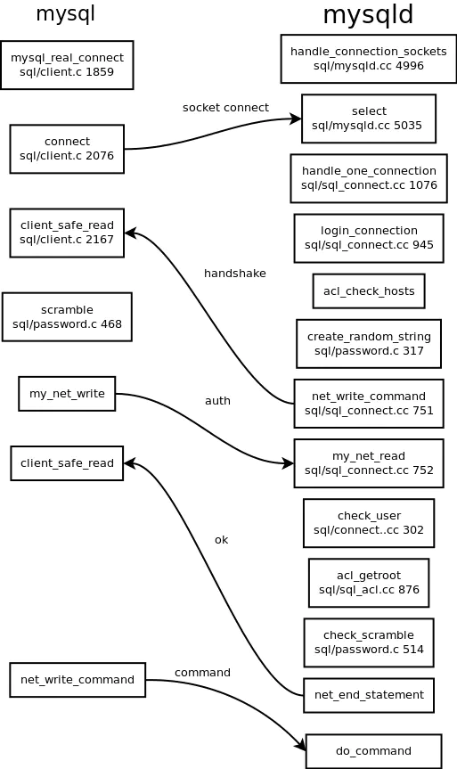
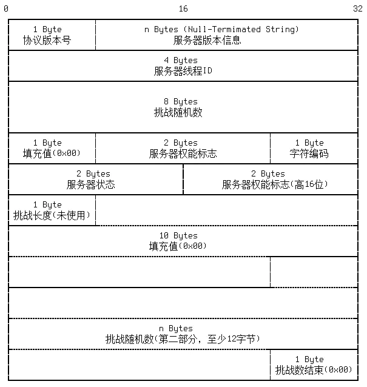

<!-- START doctoc generated TOC please keep comment here to allow auto update -->
<!-- DON'T EDIT THIS SECTION, INSTEAD RE-RUN doctoc TO UPDATE -->
**Table of Contents**  *generated with [DocToc](https://github.com/thlorenz/doctoc)*

- [github.com/go-sql-driver/mysql  源码分析](#githubcomgo-sql-drivermysql--%E6%BA%90%E7%A0%81%E5%88%86%E6%9E%90)
  - [1. go-sql-driver/mysql@v1.5.0/buffer.go](#1-go-sql-drivermysqlv150buffergo)
  - [2. Collations.go](#2-collationsgo)
  - [3. Dsn.go   数据源名称 （Data Source Name）](#3-dsngo---%E6%95%B0%E6%8D%AE%E6%BA%90%E5%90%8D%E7%A7%B0-data-source-name)
  - [4. Errors.go](#4-errorsgo)
  - [5. Packets.go](#5-packetsgo)
    - [mysql通信协议](#mysql%E9%80%9A%E4%BF%A1%E5%8D%8F%E8%AE%AE)
      - [1. 基础数据类型](#1-%E5%9F%BA%E7%A1%80%E6%95%B0%E6%8D%AE%E7%B1%BB%E5%9E%8B)
      - [2. 报文协议](#2-%E6%8A%A5%E6%96%87%E5%8D%8F%E8%AE%AE)
      - [3. 协议类型](#3-%E5%8D%8F%E8%AE%AE%E7%B1%BB%E5%9E%8B)
  - [6. Driver.go](#6-drivergo)
  - [7. connection.go](#7-connectiongo)
  - [8. result.go](#8-resultgo)
  - [9. row.go](#9-rowgo)
  - [10. Statement.go](#10-statementgo)
  - [11. Transaction.go](#11-transactiongo)

<!-- END doctoc generated TOC please keep comment here to allow auto update -->

# github.com/go-sql-driver/mysql  源码分析

Go中支持MySQL的驱动目前比较多，有如下几种

- https://github.com/go-sql-driver/mysql 支持database/sql，全部采用go写。
- https://github.com/ziutek/mymysql 支持database/sql，也支持自定义的接口，全部采用go写。
- https://github.com/Philio/GoMySQL 不支持database/sql，自定义接口，全部采用go写。


我主要以第一个驱动为例(我目前项目中也是采用它来驱动)，也推荐大家采用它，主要理由：

- 这个驱动比较新，维护的比较好
- 完全支持database/sql接口
- 支持keepalive，保持长连接,


## 1. go-sql-driver/mysql@v1.5.0/buffer.go

buffer 数是据库连接 (net.Conn) 进行缓冲的一个数据结构
```go
type buffer struct {
	buf     []byte //缓冲池中的数据 buf is a byte buffer who's length and capacity are equal.
	nc      net.Conn // 负责缓冲的数据库连接对象
	idx     int //已读数据索引
	length  int  // 缓冲池中未读数据的长度
	timeout time.Duration  // 数据库连接的超时设置
	dbuf    [2][]byte // dbuf is an array with the two byte slices that back this buffer
	flipcnt uint      // flipccnt is the current buffer counter for double-buffering
}

// newBuffer allocates and returns a new buffer.
func newBuffer(nc net.Conn) buffer {
	fg := make([]byte, defaultBufSize)
	return buffer{
		buf:  fg,
		nc:   nc,
		dbuf: [2][]byte{fg, nil},
	}
}
```
重要函数
```go
// 读取并返回未读数据的 need 位
// The returned slice is only guaranteed to be valid until the next read
func (b *buffer) readNext(need int) ([]byte, error) {
	if b.length < need {
		// 如果 need 大于 buffer 的 length ，就会调用 fill(need int) error 对 buffer进行 扩容
		// refill
		if err := b.fill(need); err != nil {
			return nil, err
		}
	}

	offset := b.idx
	b.idx += need
	b.length -= need
	return b.buf[offset:b.idx], nil
}

```
## 2. Collations.go
MySQL 所有支持的 字符集 格式


## 3. Dsn.go   数据源名称 （Data Source Name）
数据库的连接配置
```go
type Config struct {
	User             string            // Username
	Passwd           string            // Password (requires User)
	Net              string            // Network type
	Addr             string            // Network address (requires Net)
	DBName           string            // Database name
	Params           map[string]string // Connection parameters  连接参数，可是是系统环境变量
	Collation        string            // Connection collation
	Loc              *time.Location    // Location for time.Time values
	MaxAllowedPacket int               // Max packet size allowed
	ServerPubKey     string            // Server public key name
	pubKey           *rsa.PublicKey    // Server public key
	TLSConfig        string            // TLS configuration name
	tls              *tls.Config       // TLS configuration
	Timeout          time.Duration     // Dial timeout
	ReadTimeout      time.Duration     // I/O read timeout
	WriteTimeout     time.Duration     // I/O write timeout

	AllowAllFiles           bool // 允许文件使用 LOAD DATA LOCAL INFILE 导入数据库
	AllowCleartextPasswords bool // 支持明文密码客户端
	AllowNativePasswords    bool // Allows the native password authentication method
	AllowOldPasswords       bool // 允许使用不可靠的旧密码
	CheckConnLiveness       bool // Check connections for liveness before using them
	ClientFoundRows         bool // 返回匹配的行数而不是受影响的行数
	ColumnsWithAlias        bool // Prepend table alias to column names 列别名
	InterpolateParams       bool // 将占位符插入查询的SQL字符串
	MultiStatements         bool // 允许一条语句多次查询
	ParseTime               bool // 格式化时间值为 time.Time 变量
	RejectReadOnly          bool // Reject read-only connections
}·
```

## 4. Errors.go
定义MySQLError数据结构
```go
// MySQLError is an error type which represents a single MySQL error
type MySQLError struct {
	Number  uint16
	Message string
}

func (me *MySQLError) Error() string {
	return fmt.Sprintf("Error %d: %s", me.Number, me.Message)
}

```

日志打印 :复用了 Go 原生的 log 包，并将其中的输出重定向至控制台的 标准错误
```go

var errLog = Logger(log.New(os.Stderr, "[mysql] ", log.Ldate|log.Ltime|log.Lshortfile))

// Logger is used to log critical error messages.
type Logger interface {
	Print(v ...interface{})
}

// SetLogger is used to set the logger for critical errors.
// The initial logger is os.Stderr.
func SetLogger(logger Logger) error {
	if logger == nil {
		return errors.New("logger is nil")
	}
	errLog = logger
	return nil
}
```
## 5. Packets.go

常量
```go
// go-sql-driver/mysql@v1.5.0/const.go
const (
    defaultAuthPlugin       = "mysql_native_password"
    defaultMaxAllowedPacket = 4 << 20 // 4 MiB
    minProtocolVersion      = 10
    maxPacketSize           = 1<<24 - 1  //16Mib
    timeFormat              = "2006-01-02 15:04:05.999999"
)
```

### mysql通信协议

官方mysql服务端和客户端协议参考: https://dev.mysql.com/doc/internals/en/client-server-protocol.html

#### 1. 基础数据类型
MySQL 通信的基本数据类型有两种， Integer 、 String
- Integer : 分别有 1， 2， 3， 4， 8 个字节长度的类型，使用小端传输
- String : 分别有 固定长度字符串（协议规定），NULL结尾字符串（长度不固定），长度编码字符串（长度不固定）。

#### 2. 报文协议

报文分为 消息头 以及 消息体，而 消息头 由 3 字节的 消息长度 以及 1 字节的 序号 sequence （新客户端由 0 开始）组成，消息体 则由 消息长度 的字节组成

- 3 字节的 消息长度 最大值为 0xFFFFFF ，即为 16 MB - 1 byte ，这就意味着，如果整个消息（不包括消息头）的长度大于 16MB - 1byte - 4byte 大小时，消息就会被分包。

- 1 字节的 序号 在每次新的客户端发起请求时，以 0 开始，依次递增 1 ，如果消息需要分包， 序号 会随着分包的数量递增。而在一次应答中， 客户端会校验服务器 返回序号 是否与 发送序号 一致，如果不一致，则返回错误异常

#### 3. 协议类型
- handshake : 发起连接
- auth : 登录权限校验
- ok | error : 返回结果状态 *
- ok : 首字节为 0 （0x00）
- error : 首字节为 255 （0xff）
- resultset : 结果集
- header
- field
- eof
- row
- command package : 命令

读取报文时
```go
// Read packet to buffer 'data'
func (mc *mysqlConn) readPacket() ([]byte, error) {
	var prevData []byte

	// for 循环是为了读取有可能分片的数据
	for {
		// 读取头部
		// 从 buffer 缓冲器中读取 4 字节的 header---3 字节的 消息长度 以及 1 字节的 序号 sequence 
		data, err := mc.buf.readNext(4)
		if err != nil {
			if cerr := mc.canceled.Value(); cerr != nil {
				return nil, cerr
			}
			errLog.Print(err)
			mc.Close()
			return nil, ErrInvalidConn
		}

		// packet length [24 bit]
		//  读取 3 字节的消息长度
		pktLen := int(uint32(data[0]) | uint32(data[1])<<8 | uint32(data[2])<<16)

		// check packet sync [8 bit]
		//  判断服务端返回的序号是否与客户端一致
		if data[3] != mc.sequence {
            // 如果服务端返回序号大于客户端的序号，则有可能是在一次请求中做了多次操作
			if data[3] > mc.sequence {
				return nil, ErrPktSyncMul
			}
            // 返回序号不一致错误
			return nil, ErrPktSync
		}
		mc.sequence++

		// packets with length 0 terminate a previous packet which is a
		// multiple of (2^24)-1 bytes long
		if pktLen == 0 {
			// there was no previous packet
			if prevData == nil {
				errLog.Print(ErrMalformPkt)
				mc.Close()
				return nil, ErrInvalidConn
			}

			return prevData, nil
		}

        // 读取 消息长度 的数据
		data, err = mc.buf.readNext(pktLen)
		if err != nil {
			if cerr := mc.canceled.Value(); cerr != nil {
				return nil, cerr
			}
			errLog.Print(err)
			mc.Close()
			return nil, ErrInvalidConn
		}

		// 如果是最后一个数据包，必然小于 maxPacketSize (16MB - 1byte)
		if pktLen < maxPacketSize {
			// zero allocations for non-split packets
			if prevData == nil {
				return data, nil
			}

			return append(prevData, data...), nil
		}

		prevData = append(prevData, data...)
	}
}
```

握手报文协议 

```go
func (mc *mysqlConn) readHandshakePacket() (data []byte, plugin string, err error) {
	data, err = mc.readPacket()
	if err != nil {
		// for init we can rewrite this to ErrBadConn for sql.Driver to retry, since
		// in connection initialization we don't risk retrying non-idempotent actions.
		if err == ErrInvalidConn {
			return nil, "", driver.ErrBadConn
		}
		return
	}
    // iERR = 0xff  消息体的第一个字节返回 0xff ，则意味着 error package
	if data[0] == iERR {
		return nil, "", mc.handleErrorPacket(data)
	}

	// protocol version [1 byte]
	// 判断是否是兼容的协议版本
	if data[0] < minProtocolVersion {
		return nil, "", fmt.Errorf(
			"unsupported protocol version %d. Version %d or higher is required",
			data[0],
			minProtocolVersion,
		)
	}

	// server version [null terminated string]
	// connection id [4 bytes]
	// 读取 NULL （0x00）为结尾的字符串，跳过服务器线程 ID
	pos := 1 + bytes.IndexByte(data[1:], 0x00) + 1 + 4

	// first part of the password cipher [8 bytes]
	// 获取挑战随机数
	authData := data[pos : pos+8]

	// (filler) always 0x00 [1 byte]
	pos += 8 + 1

	// capability flags (lower 2 bytes) [2 bytes]
	// 获取服务器权能标识
	mc.flags = clientFlag(binary.LittleEndian.Uint16(data[pos : pos+2]))
    // 说明 MySQL 服务器不支持高于 41 版本的协议
	if mc.flags&clientProtocol41 == 0 {
		return nil, "", ErrOldProtocol
	}
    // 说明 MySQL 服务器需要 SSL 加密，但是客户端没有配置 SSL
	if mc.flags&clientSSL == 0 && mc.cfg.tls != nil {
		if mc.cfg.TLSConfig == "preferred" {
			mc.cfg.tls = nil
		} else {
			return nil, "", ErrNoTLS
		}
	}
	pos += 2

	if len(data) > pos {
		// character set [1 byte] 字符编码
		// status flags [2 bytes] 服务器状态
		// capability flags (upper 2 bytes) [2 bytes] 服务器权能标志
		// length of auth-plugin-data [1 byte] 
		// reserved (all [00]) [10 bytes]
		// 指针跳过标志位
		pos += 1 + 2 + 2 + 1 + 10

		// second part of the password cipher [mininum 13 bytes],
		// where len=MAX(13, length of auth-plugin-data - 8)
		//
		// The web documentation is ambiguous about the length. However,
		// according to mysql-5.7/sql/auth/sql_authentication.cc line 538,
		// the 13th byte is "\0 byte, terminating the second part of
		// a scramble". So the second part of the password cipher is
		// a NULL terminated string that's at least 13 bytes with the
		// last byte being NULL.
		//
		// The official Python library uses the fixed length 12
		// which seems to work but technically could have a hidden bug.
		authData = append(authData, data[pos:pos+12]...)
		pos += 13

		// EOF if version (>= 5.5.7 and < 5.5.10) or (>= 5.6.0 and < 5.6.2)
		// \NUL otherwise
		if end := bytes.IndexByte(data[pos:], 0x00); end != -1 {
			plugin = string(data[pos : pos+end])
		} else {
			plugin = string(data[pos:])
		}

		// make a memory safe copy of the cipher slice
		var b [20]byte
		copy(b[:], authData)
		return b[:], plugin, nil
	}

	// make a memory safe copy of the cipher slice
	// 返回 8 字节的挑战随机数
	var b [8]byte
	copy(b[:], authData)
	return b[:], plugin, nil
}
```

## 6. Driver.go
主要负责与 MySQL 数据库进行各种协议的连接，并返回该连接

先看标准包database/sql包中的定义
```go
//  database/sql/driver/driver.go
// 数据库驱动
type Driver interface {
	// Open returns a new connection to the database.
	// The name is a string in a driver-specific format.
	//
	// Open may return a cached connection (one previously
	// closed), but doing so is unnecessary; the sql package
	// maintains a pool of idle connections for efficient re-use.
	//
	// The returned connection is only used by one goroutine at a
	// time.
	Open(name string) (Conn, error)
}
```
连接
```go
// 非并发安全数据库连接
// Conn is assumed to be stateful.
type Conn interface {
	//  返回一个绑定到 sql 的准备语句
	Prepare(query string) (Stmt, error)


	// 关闭该连接，并标记为不再使用，停止所有准备语句和事务
	// 因为 database/sql 包维护了一个空闲的连接池，并且在空闲连接过多的时候会自动调用 Close ，所以驱动程序包不需要显式调用该函数
	// Drivers must ensure all network calls made by Close
	// do not block indefinitely (e.g. apply a timeout).
	Close() error

	// 开始并返回一个新的事务，而新的事务与旧的连接没有任何关联
	//
	// Deprecated: Drivers should implement ConnBeginTx instead (or additionally).
	Begin() (Tx, error)
}
```
创建连接
```go
// A Connector represents a driver in a fixed configuration
// and can create any number of equivalent Conns for use
// by multiple goroutines.
//
// A Connector can be passed to sql.OpenDB, to allow drivers
// to implement their own sql.DB constructors, or returned by
// DriverContext's OpenConnector method, to allow drivers
// access to context and to avoid repeated parsing of driver
// configuration.
type Connector interface {
	// Connect returns a connection to the database.
	// Connect may return a cached connection (one previously
	// closed), but doing so is unnecessary; the sql package
	// maintains a pool of idle connections for efficient re-use.
	//
	// The provided context.Context is for dialing purposes only
	// (see net.DialContext) and should not be stored or used for
	// other purposes. A default timeout should still be used
	// when dialing as a connection pool may call Connect
	// asynchronously to any query.
	//
	// The returned connection is only used by one goroutine at a
	// time.
	Connect(context.Context) (Conn, error)

	// Driver returns the underlying Driver of the Connector,
	// mainly to maintain compatibility with the Driver method
	// on sql.DB.
	Driver() Driver
}

```

具体实现

```go
type MySQLDriver struct{}
func (d MySQLDriver) Open(dsn string) (driver.Conn, error) {
    // 通过解析 DSN 设置 MySQL 连接的配置
	cfg, err := ParseDSN(dsn)
	if err != nil {
		return nil, err
	}
	c := &connector{
		cfg: cfg,
	}
	return c.Connect(context.Background())
}
```
交互连接

```go
// Connect implements driver.Connector interface.
// Connect returns a connection to the database.
func (c *connector) Connect(ctx context.Context) (driver.Conn, error) {
	var err error

	// New mysqlConn
	mc := &mysqlConn{
		// 设置相关最大值  
		maxAllowedPacket: maxPacketSize,
		maxWriteSize:     maxPacketSize - 1,
		closech:          make(chan struct{}),
		cfg:              c.cfg,
	}
	mc.parseTime = mc.cfg.ParseTime

	// Connect to Server
	// 根据 地址 以及 协议类型，尝试连接上服务器
	dialsLock.RLock()
	dial, ok := dials[mc.cfg.Net]
	dialsLock.RUnlock()
	if ok {
		dctx := ctx
		if mc.cfg.Timeout > 0 {
			var cancel context.CancelFunc
			dctx, cancel = context.WithTimeout(ctx, c.cfg.Timeout)
			defer cancel()
		}
		mc.netConn, err = dial(dctx, mc.cfg.Addr)
	} else {
        // 连接服务器失败，尝试重连
		nd := net.Dialer{Timeout: mc.cfg.Timeout}
		mc.netConn, err = nd.DialContext(ctx, mc.cfg.Net, mc.cfg.Addr)
	}
    // 重试失败，返回异常
	if err != nil {
		return nil, err
	}

	// Enable TCP Keepalives on TCP connections
	if tc, ok := mc.netConn.(*net.TCPConn); ok {
		// tcp 连接类型转换
		if err := tc.SetKeepAlive(true); err != nil {
			// Don't send COM_QUIT before handshake.
			// 如果设置长连接失败，返回异常之前一定要记得将连接断开
			mc.netConn.Close()
			mc.netConn = nil
			return nil, err
		}
	}

	// Call startWatcher for context support (From Go 1.8)
	mc.startWatcher()
	if err := mc.watchCancel(ctx); err != nil {
		mc.cleanup()
		return nil, err
	}
	defer mc.finish()
    
	// 生成一个带缓冲的 buffer，如上面 buffer.go 中所说
	mc.buf = newBuffer(mc.netConn)

	// Set I/O timeouts
	mc.buf.timeout = mc.cfg.ReadTimeout
	mc.writeTimeout = mc.cfg.WriteTimeout

	// Reading Handshake Initialization Packet
	// 发起数据库首次握手
	authData, plugin, err := mc.readHandshakePacket()
	if err != nil {
		// 将当前 mysqlConn 对象销毁，后面我们会说这个函数
		mc.cleanup()
		return nil, err
	}

	if plugin == "" {
		plugin = defaultAuthPlugin
	}
	
	// Send Client Authentication Packet
	authResp, err := mc.auth(authData, plugin)
	if err != nil {
		// try the default auth plugin, if using the requested plugin failed
		errLog.Print("could not use requested auth plugin '"+plugin+"': ", err.Error())
		plugin = defaultAuthPlugin
		authResp, err = mc.auth(authData, plugin)
		if err != nil {
			mc.cleanup()
			return nil, err
		}
	}
    // 向数据库发送登录信息校验
	if err = mc.writeHandshakeResponsePacket(authResp, plugin); err != nil {
		mc.cleanup()
		return nil, err
	}

	// Handle response to auth packet, switch methods if possible
	if err = mc.handleAuthResult(authData, plugin); err != nil {
		// Authentication failed and MySQL has already closed the connection
		// (https://dev.mysql.com/doc/internals/en/authentication-fails.html).
		// Do not send COM_QUIT, just cleanup and return the error.
		mc.cleanup()
		return nil, err
	}

	if mc.cfg.MaxAllowedPacket > 0 {
		mc.maxAllowedPacket = mc.cfg.MaxAllowedPacket
	} else {
		// Get max allowed packet size
		maxap, err := mc.getSystemVar("max_allowed_packet")
		if err != nil {
			mc.Close()
			return nil, err
		}
		mc.maxAllowedPacket = stringToInt(maxap) - 1
	}
	if mc.maxAllowedPacket < maxPacketSize {
		mc.maxWriteSize = mc.maxAllowedPacket
	}

	// Handle DSN Params
	err = mc.handleParams()
	if err != nil {
		mc.Close()
		return nil, err
	}

	return mc, nil
}
```

## 7. connection.go
```go
type mysqlConn struct {
	buf              buffer  // buffer 缓冲器
	netConn          net.Conn //网络连接 
	rawConn          net.Conn // underlying connection when netConn is TLS connection.
	affectedRows     uint64  // sql 执行成功影响行数
	insertId         uint64  // sql 添加成功最新的主键 ID
	cfg              *Config  //  dsn 中的 基础配置
	maxAllowedPacket int  // 允许的最大报文的字节长度，最大不能超过 (16MB - 1byte)
	maxWriteSize     int  // 允许最大的写入字节长度，最大不能超过 (16MB - 1byte)
	writeTimeout     time.Duration  // 执行 sql 的 超时时间
	flags            clientFlag  // 客户端状态标识
	status           statusFlag // 服务端状态标识
	sequence         uint8  // 序号
	parseTime        bool  // 是否格式化时间
	reset            bool // set when the Go SQL package calls ResetSession

	// for context support (Go 1.8+)
	watching bool
	watcher  chan<- context.Context
	closech  chan struct{}
	finished chan<- struct{}
	canceled atomicError // set non-nil if conn is canceled
	closed   atomicBool  // set when conn is closed, before closech is closed
}
```

当一个新的客户端连接上服务器的时候 （三次握手结束，客户端进入 established 状态），需要先对 MySQL 服务器进行 会话的用户/系统环境变量 的设置。
```go
func (mc *mysqlConn) handleParams() (err error) {
	for param, val := range mc.cfg.Params {
		switch param {
		// Charset
		case "charset":
			// 如果是字符集，则调用 SET NAMES 命令
			charsets := strings.Split(val, ",")
			for i := range charsets {
				// ignore errors here - a charset may not exist
				err = mc.exec("SET NAMES " + charsets[i])
				if err == nil {
					break
				}
			}
			if err != nil {
				return
			}

		// System Vars
		default:
		    // 执行系统环境变量设置
			err = mc.exec("SET " + param + "=" + val + "")
			if err != nil {
				return
			}
		}
	}

	return
}
```

负责 事务 、预处理语句 、执行/查询 的管理，但是基本都是往 mysqlConn 中发送 command package 
```go
func (mc *mysqlConn) Begin() (driver.Tx, error) {
	return mc.begin(false)
}

func (mc *mysqlConn) begin(readOnly bool) (driver.Tx, error) {
	if mc.closed.IsSet() {
		errLog.Print(ErrInvalidConn)
		return nil, driver.ErrBadConn
	}
	var q string
	if readOnly {
		q = "START TRANSACTION READ ONLY"
	} else {
		q = "START TRANSACTION"
	}
	err := mc.exec(q)
	if err == nil {
        // 返回成功开启的事务，重用之前的连接
		return &mysqlTx{mc}, err
	}
	return nil, mc.markBadConn(err)
}
```
执行流程
```go
func (mc *mysqlConn) Exec(query string, args []driver.Value) (driver.Result, error) {
    // ...
	mc.affectedRows = 0
	mc.insertId = 0

	err := mc.exec(query)
	if err == nil {
		// 返回执行的结果
		return &mysqlResult{
			affectedRows: int64(mc.affectedRows),
			insertId:     int64(mc.insertId),
		}, err
	}
	return nil, mc.markBadConn(err)
}

// Internal function to execute commands
func (mc *mysqlConn) exec(query string) error {
	// Send command
	// 发送指令
	if err := mc.writeCommandPacketStr(comQuery, query); err != nil {
		return mc.markBadConn(err)
	}

	// Read Result
	// 根据 data[0] 的值判断是否出错，如果没有错误，则返回消息体的长度
	resLen, err := mc.readResultSetHeaderPacket()
	if err != nil {
		return err
	}

	if resLen > 0 {
		// columns 读取列
		if err := mc.readUntilEOF(); err != nil {
			return err
		}

		// rows 读取行
		if err := mc.readUntilEOF(); err != nil {
			return err
		}
	}

	return mc.discardResults()
}
```
读取头部结果
```go
func (mc *mysqlConn) readResultSetHeaderPacket() (int, error) {
	data, err := mc.readPacket()
	if err == nil {
		switch data[0] {

		case iOK:
			return 0, mc.handleOkPacket(data)

		case iERR:
			return 0, mc.handleErrorPacket(data)

		case iLocalInFile:
			return 0, mc.handleInFileRequest(string(data[1:]))
		}

		// column count
		num, _, n := readLengthEncodedInteger(data)
		if n-len(data) == 0 {
			return int(num), nil
		}

		return 0, ErrMalformPkt
	}
	return 0, err
}


// 处理ok的情况
func (mc *mysqlConn) handleOkPacket(data []byte) error {
	var n, m int

	// 0x00 [1 byte]

	// 影响的行数
	// Affected rows [Length Coded Binary]
	mc.affectedRows, _, n = readLengthEncodedInteger(data[1:])

	// 插入的Id
	// Insert id [Length Coded Binary]
	mc.insertId, _, m = readLengthEncodedInteger(data[1+n:])

	// server_status [2 bytes]
	mc.status = readStatus(data[1+n+m : 1+n+m+2])
	if mc.status&statusMoreResultsExists != 0 {
		return nil
	}

	// warning count [2 bytes]

	return nil
}
```


cleanup :它负责将 连接关闭 、 重置环境变量 等功能，但是该函数不能随意调用，它只有在 登录权限校验异常 时候才应该被调用，
否则服务器在不知道客户端 被强行关闭 的情况下，依然会向该客户端发送消息，导致严重异常
```go
func (mc *mysqlConn) cleanup() {
	if !mc.closed.TrySet(true) {
		return
	}

	// Makes cleanup idempotent
	close(mc.closech)
	if mc.netConn == nil {
		return
	}
	if err := mc.netConn.Close(); err != nil {
		errLog.Print(err)
	}
}
```

## 8. result.go
每当 MySQL 返回一个 OK 的 状态报文 ，该报文协议会携带上本次执行的结果 affectedRows 以及 insertId ，而 result.go 就包含着一个数据结构，用于存储本次的执行结果
```go
package mysql

type mysqlResult struct {
	affectedRows int64
	insertId     int64
}

func (res *mysqlResult) LastInsertId() (int64, error) {
	return res.insertId, nil
}

func (res *mysqlResult) RowsAffected() (int64, error) {
	return res.affectedRows, nil
}

```

Note: 当 MySQL 执行 插入、更新、删除 等操作后，都会返回 Result    

但是 查询 返回的是 Rows ，我们先来看看 go-mysql-driver 驱动所实现的 接口 Rows 的接口描述
## 9. row.go
接口描述 Rows
```go
// database/sql/driver/driver.go
// Rows 是执行查询返回的结果的 游标
type Rows interface {
    // Columns 返回列的名称，从 slice 的长度可以判断列的长度
    // 如果一个列的名称未知，则为该列返回一个空字符串
    Columns() []string
  
    // Close 关闭游标
    Close() error
  
    // Next 将下一行数据填充到 desc 切片中
    // 如果读取的是最后一行数据，应该返回一个 io.EOF 错误
    Next(desc []Value) error
}

type Value interface{} // Value is a value that drivers must be able to handle.
```
结果集rows
```go
// Rows is the result of a query. Its cursor starts before the first row
// of the result set. Use Next to advance from row to row.
type Rows struct {
	dc          *driverConn // owned; must call releaseConn when closed to release
	releaseConn func(error)
	rowsi       driver.Rows  // // 接口描述的 Rows 
	cancel      func()      // called when Rows is closed, may be nil.
	closeStmt   *driverStmt // if non-nil, statement to Close on close

    // ... 

	// lastcols is only used in Scan, Next, and NextResultSet which are expected
	// not to be called concurrently.
	lastcols []driver.Value
}
```
字段
```go
// go-sql-driver/mysql@v1.5.0/fields.go
type mysqlField struct {
	tableName string
	name      string
	length    uint32
	flags     fieldFlag
	fieldType fieldType
	decimals  byte
	charSet   uint8
}

```

```go
// /go-sql-driver/mysql@v1.5.0/rows.go
// 行
type mysqlRows struct {
    mc     *mysqlConn
    rs     resultSet
    finish func()
}

// 行结果集
type resultSet struct {
	columns     []mysqlField
	columnNames []string
	done        bool
}

// 二进制结果集协议
type binaryRows struct {
	mysqlRows
}

// 文本结果集协议
type textRows struct {
	mysqlRows
}


func (rows *mysqlRows) Columns() []string {
	if rows.rs.columnNames != nil {
		return rows.rs.columnNames
	}

	// 将列名赋值到 columns ，如果有设置别名则赋值别名...
	columns := make([]string, len(rows.rs.columns))
	if rows.mc != nil && rows.mc.cfg.ColumnsWithAlias {
		for i := range columns {
			if tableName := rows.rs.columns[i].tableName; len(tableName) > 0 {
				columns[i] = tableName + "." + rows.rs.columns[i].name
			} else {
				columns[i] = rows.rs.columns[i].name
			}
		}
	} else {
		for i := range columns {
			columns[i] = rows.rs.columns[i].name
		}
	}

	rows.rs.columnNames = columns
	return columns
}

func (rows *binaryRows) Next(dest []driver.Value) error {
	if mc := rows.mc; mc != nil {
		if err := mc.error(); err != nil {
			return err
		}

		// 读二进制协议结果集
		return rows.readRow(dest)
	}
	return io.EOF
}

func (rows *textRows) Next(dest []driver.Value) error {
	if mc := rows.mc; mc != nil {
		if err := mc.error(); err != nil {
			return err
		}

		// 读取文本协议
		return rows.readRow(dest)
	}
	return io.EOF
}
```
Note: 使用 textRows 的场景在 getSystemVar 以及 Query 中，而使用 binaryRows 的场景在 statement 中


## 10. Statement.go
Prepared Statement ，即预处理语句
- 执行性能更高：MySQL 会对 Prepared Statement 语句预先进行编译成模板，并将 占位符 替换 参数 的位置，这样如果频繁执行一条参数只有少量替换的语句时候，性能会得到大量提高。
可能有同学会有疑问，为什么 MySQL 语句还需要编译？那么可以来参考下这篇 MySQL Prepare 原理: https://www.cnblogs.com/justfortaste/p/3920140.html

- 传输协议更优：Prepare Statement 在传输时候使用的是 Binary Protocol ，比使用 Text Protocol 的查询具有 传输数据量更小 、 无需转换数据格式 等优势，缓解了 CPU 和 网络 的开销。

- 安全性更好：由 MySQL Prepare 原理 我们可以知道，Perpare 编译之后会生成 语法树，在执行的时候才会将参数传进来，这样就避免了平常直接执行 SQL 语句 会发生的 SQL 注入 问题

```go

type mysqlStmt struct {
	mc         *mysqlConn
	id         uint32  // MySQL 预处理语句之后，会给该语句分配一个 id 并返回客户端
	paramCount int  // 参数数量，等于 占位符 的个数，
}
```
id 作用:  客户端提交该 id 给服务器调用对应的预处理语句。  
paramCount作用: 
- 判断传入的参数个数是否与预编译语句中的占位符个数一致。
- 判断返回的 PREPARE_OK 响应报文是否带有 参数列名 数据

```go
// /go-sql-driver/mysql@v1.5.0/connection.go
// 传入需要预编译的 SQL 语句
func (mc *mysqlConn) Prepare(query string) (driver.Stmt, error) {
	if mc.closed.IsSet() {
		errLog.Print(ErrInvalidConn)
		return nil, driver.ErrBadConn
	}
	// Send command
	// 将 SQL 发往数据库进行预编译
	err := mc.writeCommandPacketStr(comStmtPrepare, query)
	if err != nil {
		// STMT_PREPARE is safe to retry.  So we can return ErrBadConn here.
		errLog.Print(err)
		return nil, driver.ErrBadConn
	}
    // 预编译成功，先创建 stmt 对象
	stmt := &mysqlStmt{
		mc: mc,
	}

	// Read Result
	// 从 stmt 的连接读取返回 响应报文
	columnCount, err := stmt.readPrepareResultPacket()
	if err == nil {
        // 如果预编译的 SQL 的有参数
		if stmt.paramCount > 0 {
			// 读取参数列名数据
			if err = mc.readUntilEOF(); err != nil {
				return nil, err
			}
		}
        // 返回执行结果的列表个数
		if columnCount > 0 {
            // 读取执行结果的列名数据
			err = mc.readUntilEOF()
		}
	}

	return stmt, err
}
```

因为是已经预编译好的语句，所以在执行的时候只需要将参数传进去就可以了。
```go
func (stmt *mysqlStmt) Exec(args []driver.Value) (driver.Result, error) {
    // 检查连接是否可用...
	if stmt.mc.closed.IsSet() {
		errLog.Print(ErrInvalidConn)
		return nil, driver.ErrBadConn
	}
	// Send command
	err := stmt.writeExecutePacket(args)
	if err != nil {
		return nil, stmt.mc.markBadConn(err)
	}

	mc := stmt.mc

	mc.affectedRows = 0
	mc.insertId = 0

	// Read Result
	resLen, err := mc.readResultSetHeaderPacket()
	if err != nil {
		return nil, err
	}

    // 读取结果集的行、列数据...

	if err := mc.discardResults(); err != nil {
		return nil, err
	}

	return &mysqlResult{
		affectedRows: int64(mc.affectedRows),
		insertId:     int64(mc.insertId),
	}, nil
}

// 发送指令
func (stmt *mysqlStmt) writeExecutePacket(args []driver.Value) error {
    // 判断传进来的参数和预编译好的SQL参数 个数是否一致
	if len(args) != stmt.paramCount {
		return fmt.Errorf(
			"argument count mismatch (got: %d; has: %d)",
			len(args),
			stmt.paramCount,
		)
	}

	const minPktLen = 4 + 1 + 4 + 1 + 4
	mc := stmt.mc

	// Determine threshold dynamically to avoid packet size shortage.
	longDataSize := mc.maxAllowedPacket / (stmt.paramCount + 1)
	if longDataSize < 64 {
		longDataSize = 64
	}

	// Reset packet-sequence
	mc.sequence = 0

	var data []byte
	var err error

    // 读取缓冲器中的数据，如果为空，则返回异常...
	if len(args) == 0 {
		data, err = mc.buf.takeBuffer(minPktLen)
	} else {
		data, err = mc.buf.takeCompleteBuffer()
		// In this case the len(data) == cap(data) which is used to optimise the flow below.
	}
	if err != nil {
		// cannot take the buffer. Something must be wrong with the connection
		errLog.Print(err)
		return errBadConnNoWrite
	}

	// command [1 byte]
	data[4] = comStmtExecute

	// statement_id [4 bytes] 将预编译语句的 id 转换为 4字节的二进制数据
	data[5] = byte(stmt.id)
	data[6] = byte(stmt.id >> 8)
	data[7] = byte(stmt.id >> 16)
	data[8] = byte(stmt.id >> 24)

	// flags (0: CURSOR_TYPE_NO_CURSOR) [1 byte]
	data[9] = 0x00

	// iteration_count (uint32(1)) [4 bytes]
	data[10] = 0x01
	data[11] = 0x00
	data[12] = 0x00
	data[13] = 0x00

	if len(args) > 0 {
		pos := minPktLen

		var nullMask []byte
		if maskLen, typesLen := (len(args)+7)/8, 1+2*len(args); pos+maskLen+typesLen >= cap(data) {
			// buffer has to be extended but we don't know by how much so
			// we depend on append after all data with known sizes fit.
			// We stop at that because we deal with a lot of columns here
			// which makes the required allocation size hard to guess.
			tmp := make([]byte, pos+maskLen+typesLen)
			copy(tmp[:pos], data[:pos])
			data = tmp
			nullMask = data[pos : pos+maskLen]
			// No need to clean nullMask as make ensures that.
			pos += maskLen
		} else {
			nullMask = data[pos : pos+maskLen]
			for i := range nullMask {
				nullMask[i] = 0
			}
			pos += maskLen
		}

		// newParameterBoundFlag 1 [1 byte]
		data[pos] = 0x01
		pos++

		// type of each parameter [len(args)*2 bytes]
		paramTypes := data[pos:]
		pos += len(args) * 2

		// value of each parameter [n bytes]
		paramValues := data[pos:pos]
		valuesCap := cap(paramValues)
		
        //... 将参数按照不同的类型转换为 binary protobuf 并 append 到 data 中..


		data = data[:pos]
	}

	return mc.writePacket(data)
}
```

## 11. Transaction.go
事务是 MySQL 中很重要的一部分，但是驱动的实现却很简单，因为一切的事务控制都已经交由 MySQL 去执行了，驱动所需要做的，只要发送一个 commit 或者 rollback 的 command packet 即可
```go
type mysqlTx struct {
	mc *mysqlConn
}

func (tx *mysqlTx) Commit() (err error) {
	if tx.mc == nil || tx.mc.closed.IsSet() {
		return ErrInvalidConn
	}
	err = tx.mc.exec("COMMIT")
	tx.mc = nil
	return
}

func (tx *mysqlTx) Rollback() (err error) {
	if tx.mc == nil || tx.mc.closed.IsSet() {
		return ErrInvalidConn
	}
	err = tx.mc.exec("ROLLBACK")
	tx.mc = nil
	return
}
```
