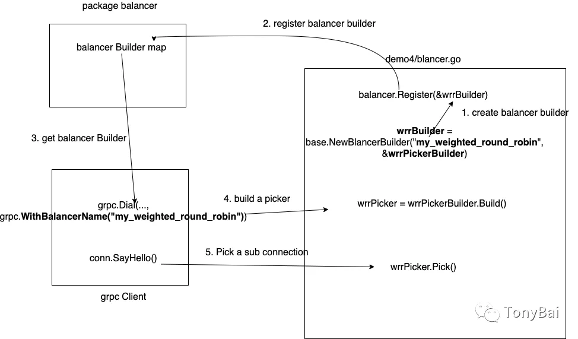

# Builder接口和Resolver接口

gRPC已提供了简单的负载均衡策略（如：Round Robin），我们只需实现它提供的Builder和Resolver接口，就能完成gRPC客户端负载均衡。

Builder接口：创建一个resolver（本文称之服务发现），用于监视名称解析更新。
```go
type Builder interface {
    Build(target Target, cc ClientConn, opts BuildOption) (Resolver, error)//为给定目标创建一个新的resolver，当调用grpc.Dial()时执行
    Scheme() string //返回此resolver支持的方案
}

```

Resolver接口：监视指定目标的更新，包括地址更新和服务配置更新。
```go
type Resolver interface {
    ResolveNow(ResolveNowOption) // 被 gRPC 调用，以尝试再次解析目标名称。只用于提示，可忽略该方法。 需要并发安全的
    Close()
}
```

## 解析过程

1. SchemeBuilder将自身实例注册到resolver包的map中； 
2. grpc.Dial/DialContext时使用特定形式的target参数
3. 对target解析后，根据target.Scheme到resolver包的map中查找Scheme对应的Buider；
4. 调用Buider的Build方法
5. Build方法构建出SchemeResolver实例；
6. 后续由SchemeResolver实例监视service instance变更状态并在有变更的时候更新ClientConnection
7. 当address被作为target的实参传入grpc.DialContext后，它会被grpcutil.ParseTarget解析为一个resolver.Target结构体
```go
type Target struct {
	Scheme    string
	Authority string
	Endpoint  string
}
```

解析的方法
```go
// /Users/xiaxin/go/pkg/mod/google.golang.org/grpc@v1.32.0/internal/grpcutil/target.go
// ParseTarget splits target into a resolver.Target struct containing scheme,
// authority and endpoint.
//
// If target is not a valid scheme://authority/endpoint, it returns {Endpoint:
// target}.
func ParseTarget(target string) (ret resolver.Target) {
	var ok bool
	ret.Scheme, ret.Endpoint, ok = split2(target, "://")
	if !ok {
		return resolver.Target{Endpoint: target}
	}
	ret.Authority, ret.Endpoint, ok = split2(ret.Endpoint, "/")
	if !ok {
		return resolver.Target{Endpoint: target}
	}
	return ret
}
```

gRPC会根据Target.Scheme的值到resolver包中的builder map中查找是否有对应的Resolver Builder实例。
到目前为止gRPC内置的的resolver Builder都无法匹配该Scheme值。
```go
	resolverBuilder := cc.getResolver(cc.parsedTarget.Scheme)
```
```go
func (cc *ClientConn) getResolver(scheme string) resolver.Builder {
	for _, rb := range cc.dopts.resolvers {
		if scheme == rb.Scheme() {
			return rb
		}
	}
    return resolver.Get(scheme)
}
```
```go
// /Users/xiaxin/go/pkg/mod/google.golang.org/grpc@v1.32.0/resolver/resolver.go
var (
    // m is a map from scheme to resolver builder.
    m = make(map[string]Builder)
    // defaultScheme is the default scheme to use.
    defaultScheme = "passthrough"
)
func Get(scheme string) Builder {
	if b, ok := m[scheme]; ok {
		return b
	}
	return nil
}
```


## 负载均衡

- 首先要注册一个名为"my_weighted_round_robin"的balancer Builder:wrrBuilder，该Builder由base包的NewBalancerBuilder构建；
- base包的NewBalancerBuilder函数需要传入一个PickerBuilder实现，于是我们需要自定义一个返回Picker接口实现的PickerBuilder。
- grpc.Dial调用时传入一个WithBalancerName("my_weighted_round_robin")，grpc通过balancer Name从已注册的balancer builder中选出我们实现的wrrBuilder，并调用wrrBuilder创建Picker：wrrPicker。
- 在grpc实施rpc调用SayHello时，wrrPicker的Pick方法会被调用，选出一个Connection，并在该connection上发送rpc请求
```go
type Balancer interface {
    // UpdateClientConnState is called by gRPC when the state of the ClientConn
    // changes.  If the error returned is ErrBadResolverState, the ClientConn
    // will begin calling ResolveNow on the active name resolver with
    // exponential backoff until a subsequent call to UpdateClientConnState
    // returns a nil error.  Any other errors are currently ignored.
    UpdateClientConnState(ClientConnState) error
    // ResolverError is called by gRPC when the name resolver reports an error.
    ResolverError(error)
    // UpdateSubConnState is called by gRPC when the state of a SubConn
    // changes.
    UpdateSubConnState(SubConn, SubConnState)
    // Close closes the balancer. The balancer is not required to call
    // ClientConn.RemoveSubConn for its existing SubConns.
    Close()
}
```
Balancer要比Resolver要复杂很多。gRPC的核心开发者们也看到了这一点，于是他们提供了一个可简化自定义Balancer创建的包：google.golang.org/grpc/balancer/base。

gRPC内置的round_robin Balancer也是基于base包实现的。
```go
// /Users/xiaxin/go/pkg/mod/google.golang.org/grpc@v1.32.0/balancer/roundrobin/roundrobin.go
// Name is the name of round_robin balancer.
const Name = "round_robin"


// newBuilder creates a new roundrobin balancer builder.
func newBuilder() balancer.Builder {
	return base.NewBalancerBuilder(Name, &rrPickerBuilder{}, base.Config{HealthCheck: true})
}
```

base包提供了NewBalancerBuilder可以快速返回一个balancer.Builder的实现：
```go
func NewBalancerBuilder(name string, pb PickerBuilder, config Config) balancer.Builder {
	return &baseBuilder{
		name:          name,
		pickerBuilder: pb,
		config:        config,
	}
}

// PickerBuilder creates balancer.Picker.
type PickerBuilder interface {
    // Build returns a picker that will be used by gRPC to pick a SubConn.
    Build(info PickerBuildInfo) balancer.Picker
}
```
我们仅需要提供一个PickerBuilder的实现以及一个balancer.Picker的实现即可，而Picker则是仅有一个方法的接口类型：
```go
// The pickers used by gRPC can be updated by ClientConn.UpdateState().
type Picker interface {
	// Pick returns the connection to use for this RPC and related information.
	//
	// Pick should not block.  If the balancer needs to do I/O or any blocking
	// or time-consuming work to service this call, it should return
	// ErrNoSubConnAvailable, and the Pick call will be repeated by gRPC when
	// the Picker is updated (using ClientConn.UpdateState).
	//
	// If an error is returned:
	//
	// - If the error is ErrNoSubConnAvailable, gRPC will block until a new
	//   Picker is provided by the balancer (using ClientConn.UpdateState).
	//
	// - If the error is a status error (implemented by the grpc/status
	//   package), gRPC will terminate the RPC with the code and message
	//   provided.
	//
	// - For all other errors, wait for ready RPCs will wait, but non-wait for
	//   ready RPCs will be terminated with this error's Error() string and
	//   status code Unavailable.
	Pick(info PickInfo) (PickResult, error)
}
```