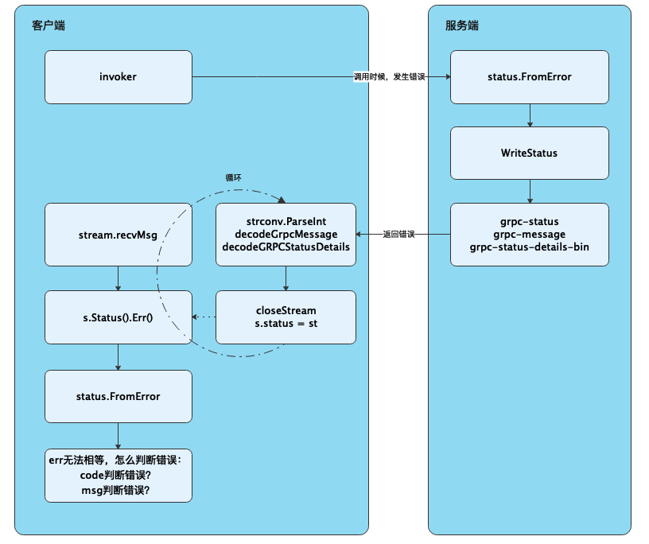
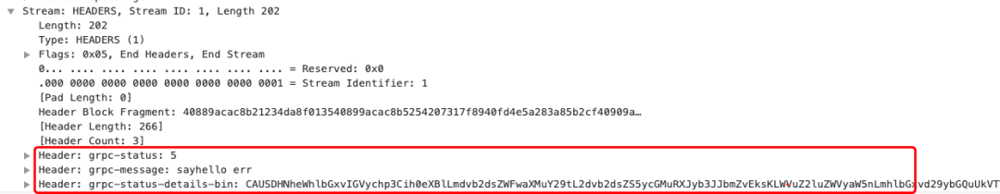

<!-- START doctoc generated TOC please keep comment here to allow auto update -->
<!-- DON'T EDIT THIS SECTION, INSTEAD RE-RUN doctoc TO UPDATE -->
**Table of Contents**  *generated with [DocToc](https://github.com/thlorenz/doctoc)*

- [grpc错误](#grpc%E9%94%99%E8%AF%AF)
  - [errors包](#errors%E5%8C%85)
  - [gRPC网络传输的Error](#grpc%E7%BD%91%E7%BB%9C%E4%BC%A0%E8%BE%93%E7%9A%84error)
  - [grpc status包](#grpc-status%E5%8C%85)
  - [参考](#%E5%8F%82%E8%80%83)

<!-- END doctoc generated TOC please keep comment here to allow auto update -->

# grpc错误

## errors包
```go
package main

import (
	"fmt"
	"github.com/pkg/errors"
)

func wrapNewPointerError() error {
	// 	Go1.13版本为fmt.Errorf函数新加了一个%w占位符用来生成一个可以包裹Error的Wrapping Error。
	return fmt.Errorf("wrap err0:%w", fmt.Errorf("i am a error0"))
}

func wrapConstantPointerError() error {
	return fmt.Errorf("wrap err1:%w", constantErr)
}

var constantErr = fmt.Errorf("i am a error1 ")

func main() {
	fmt.Println("第一个结果", errors.Is(wrapNewPointerError(), fmt.Errorf("i am a error0"))) // false
	fmt.Println("第二个结果", errors.Is(wrapConstantPointerError(), constantErr))            //true
}

```

## gRPC网络传输的Error
     
我们客户端在获取到gRPC的error的时候，是否可以使用上文说的官方errors.Is进行判断呢。
如果我们直接使用该方法，通过判断error地址是否相等，是无法做到的。原因是因为我们在使用gRPC的时候，在远程调用过程中，客户端获取的服务端返回的error，在tcp传递的时候实际上是一串文本。
客户端拿到这个文本，是要将其反序列化转换为error，在这个反序列化的过程中，其实是new了一个新的error地址，这样就无法判断error地址是否相等。

为了更好的解释gRPC网络传输的error，以下描述了整个error的处理流程
- 客户端通过invoker方法将请求发送到服务端。

- 服务端通过processUnaryRPC方法，获取到用户代码的error信息。

- 服务端通过status.FromError方法，将error转化为status.Status。

- 服务端通过WriteStatus方法将status.Status里的数据，写入到grpc-status、grpc-message、grpc-status-details-bin的header头里。

- 客户端通过网络获取到这些header头，使用strconv.ParseInt解析到grpc-status信息、decodeGrpcMessage解析到grpc-message信息、decodeGRPCStatusDetails解析为grpc-status-details-bin信息。

- 客户端通过a.Status().Err()获取到用户代码的错误。

为了方便理解，我们抓个包，看下error具体的报文情况。



## grpc status包
对外暴露的方法，首先看返回err
```go
// /Users/xiaxin/go/pkg/mod/google.golang.org/grpc@v1.32.0/status/status.go
package status

import (
	"context"
	"fmt"

	spb "google.golang.org/genproto/googleapis/rpc/status"

	"google.golang.org/grpc/codes"
	"google.golang.org/grpc/internal/status"
)


// Status references google.golang.org/grpc/internal/status. It represents an
// RPC status code, message, and details.  It is immutable and should be
// created with New, Newf, or FromProto.
// https://godoc.org/google.golang.org/grpc/internal/status
// 不可改变的
type Status = status.Status

// New returns a Status representing c and msg.
func New(c codes.Code, msg string) *Status {
	return status.New(c, msg)
}

// Newf returns New(c, fmt.Sprintf(format, a...)).
func Newf(c codes.Code, format string, a ...interface{}) *Status {
	return New(c, fmt.Sprintf(format, a...))
}

// Error returns an error representing c and msg.  If c is OK, returns nil.
func Error(c codes.Code, msg string) error {
	return New(c, msg).Err()
}
```
内部包
```go
// /Users/xiaxin/go/pkg/mod/google.golang.org/grpc@v1.32.0/internal/status/status.go
type Status struct {
	s *spb.Status
}

// New returns a Status representing c and msg.
func New(c codes.Code, msg string) *Status {
	return &Status{s: &spb.Status{Code: int32(c), Message: msg}}
}
```

```go
// You can find out more about this error model and how to work with it in the
// [API Design Guide](https://cloud.google.com/apis/design/errors).
type Status struct {
	state         protoimpl.MessageState
	sizeCache     protoimpl.SizeCache
	unknownFields protoimpl.UnknownFields

	// The status code, which should be an enum value of [google.rpc.Code][google.rpc.Code].
	Code int32 `protobuf:"varint,1,opt,name=code,proto3" json:"code,omitempty"`
	// A developer-facing error message, which should be in English. Any
	// user-facing error message should be localized and sent in the
	// [google.rpc.Status.details][google.rpc.Status.details] field, or localized by the client.
	Message string `protobuf:"bytes,2,opt,name=message,proto3" json:"message,omitempty"`
	// A list of messages that carry the error details.  There is a common set of
	// message types for APIs to use.
	Details []*anypb.Any `protobuf:"bytes,3,rep,name=details,proto3" json:"details,omitempty"`
}
```


Code: gRPC的错误码
* OK 正常
* Canceled 客户端取消
* Unknown 未知
* InvalidArgument 未知参数
* DeadlineExceeded 超时
* NotFound 未找到资源
* AlreadyExists 资源已经创建
* PermissionDenied 权限不足
* ResourceExhausted 资源耗尽
* FailedPrecondition 前置条件不满足
* Aborted 异常退出
* OutOfRange 超出范围
* Unimplemented 未实现方法
* Internal 内部问题
* Unavailable 不可用状态
* DataLoss 数据丢失
* Unauthenticated 未认证


类似于HTTP 状态码code的个数也是有限的。有个很大的问题就是 表达能力非常有限

所以我们需要一个能够额外传递业务错误信息字段的功能


Google 基于自身业务, 有了一套错误扩展 https://cloud.google.com/apis/design/errors#error_model. 

可以看到比标准错误多了一个 details 数组字段, 而且这个字段是 Any 类型, 支持我们自行扩展


下面是一些示例 error_details 载荷：

- ErrorInfo 提供既稳定又可扩展的结构化错误信息。
- RetryInfo：描述客户端何时可以重试失败的请求，这些内容可能在以下方法中返回：Code.UNAVAILABLE 或 Code.ABORTED
- QuotaFailure：描述配额检查失败的方式，这些内容可能在以下方法中返回：Code.RESOURCE_EXHAUSTED
- BadRequest：描述客户端请求中的违规行为，这些内容可能在以下方法中返回：Code.INVALID_ARGUMENT

## 参考

- [写给go开发者的gRPC教程-错误处理](https://mp.weixin.qq.com/s?__biz=MzAxMTA4Njc0OQ==&mid=2651454448&idx=1&sn=77daf4371a7cf92a222da9b7a9d13ac8&chksm=80bb2502b7ccac143a98167d952935c1c421aaf058f697872d2c87fb4bc89c96f5a8cd1043a0&scene=21#wechat_redirect)
