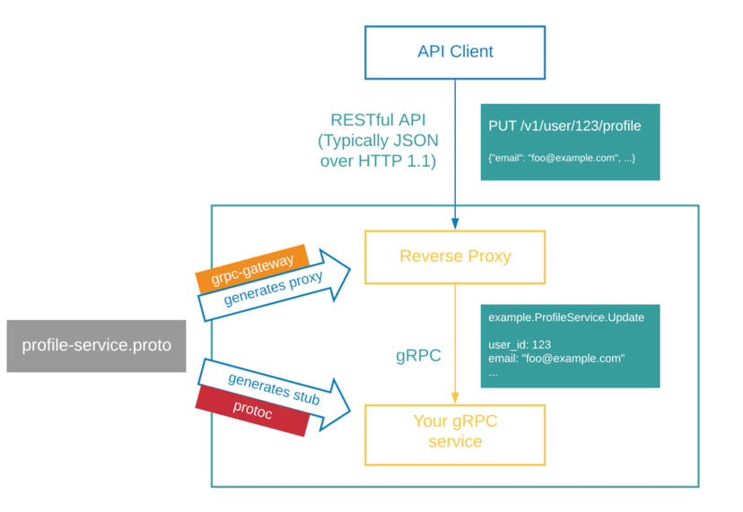

<!-- START doctoc generated TOC please keep comment here to allow auto update -->
<!-- DON'T EDIT THIS SECTION, INSTEAD RE-RUN doctoc TO UPDATE -->
**Table of Contents**  *generated with [DocToc](https://github.com/thlorenz/doctoc)*

- [gRPC 转码（RPC Transcoding）](#grpc-%E8%BD%AC%E7%A0%81rpc-transcoding)
  - [gRPC-Gateway](#grpc-gateway)
  - [应用](#%E5%BA%94%E7%94%A8)
  - [流程](#%E6%B5%81%E7%A8%8B)
  - [环境准备](#%E7%8E%AF%E5%A2%83%E5%87%86%E5%A4%87)
  - [使用](#%E4%BD%BF%E7%94%A8)
  - [HTTP映射的规则](#http%E6%98%A0%E5%B0%84%E7%9A%84%E8%A7%84%E5%88%99)
  - [源码分析](#%E6%BA%90%E7%A0%81%E5%88%86%E6%9E%90)

<!-- END doctoc generated TOC please keep comment here to allow auto update -->

# gRPC 转码（RPC Transcoding）

gRPC 转码（RPC Transcoding）是一种用于在 gRPC 方法和一个或多个 HTTP REST 端点之间进行映射的功能。 
它允许开发人员构建一个同时支持 gRPC API 和 REST API 的 API 服务。
许多系统，包括Google APIs，Cloud Endpoints，gRPC Gateway和Envoy 代理都支持此功能并将其用于大规模生产服务。

HttpRule 定义了 gRPC/REST 映射的模式。 映射指定 gRPC 请求消息的不同部分如何映射到 URL 路径、URL 查询参数和 HTTP 请求正文。 它还控制 gRPC 响应消息如何映射到 HTTP 响应正文。 HttpRule 通常被指定为 gRPC 方法上的 google.api.http 注释

## gRPC-Gateway

gRPC-Gateway 是Google protocol buffers compiler(protoc)的一个插件。
读取 protobuf 定义然后生成反向代理服务器，将 RESTful HTTP API 转换为 gRPC。

换句话说就是将 gRPC 转为 RESTful HTTP API。

## 应用
etcd v3 改用 gRPC 后为了兼容原来的 API，同时要提供 HTTP/JSON 方式的API，为了满足这个需求，要么开发两套 API，要么实现一种转换机制，他们选择了后者，而我们选择跟随他们的脚步。

## 流程



当 HTTP 请求到达 gRPC-Gateway 时，它将 JSON 数据解析为 Protobuf 消息。然后，它使用解析的 Protobuf 消息发出正常的 Go gRPC 客户端请求。
Go gRPC 客户端将 Protobuf 结构编码为 Protobuf 二进制格式，然后将其发送到 gRPC 服务器。

gRPC 服务器处理请求并以 Protobuf 二进制格式返回响应。
Go gRPC 客户端将其解析为 Protobuf 消息，并将其返回到 gRPC-Gateway，后者将 Protobuf 消息编码为 JSON 并将其返回给原始客户端。

  
gRPC 网关生成的反向代理被水平扩展以在多台机器上运行，并且在这些实例之前使用负载均衡器。单个实例可以托管多个 gRPC 服务的反向代理。

## 环境准备

环境主要分为 3 部分：

1. Protobuf 相关 
    - Go 
    - Protocol buffer compile（protoc） 
    - Go Plugins
    
2. gRPC相关
    - gRPC Lib
    - gRPC Plugins
3. gRPC-Gateway 


## 使用
1. 第一步引入annotations.proto

目录
```shell
proto
├── google
│   └── api
│       ├── annotations.proto
│       └── http.proto
└── helloworld
    └── hello_world.proto
```
2. 增加 http 相关注解

[proto 代码](./proto/helloworld/hello_world.proto)


3. 编译增加 --grpc-gateway_out

- Go Plugins 用于生成 .pb.go 文件
- gRPC Plugins 用于生成 _grpc.pb.go
- gRPC-Gateway 则是 pb.gw.go


## HTTP映射的规则

1. 叶请求字段（请求消息中的递归扩展嵌套消息）分为三类
- 由路径模板引用的字段。它们通过 URL 路径传递。
- [HttpRule.body][google.api.HttpRule.body] 引用的字段。 它们通过 HTTP 请求正文传递。
- 所有其他字段都是通过 URL 查询参数传递的，参数名称是请求消息中的字段路径。 一个重复的字段可以表示为同名的多个查询参数。
2. 如果 [HttpRule.body][google.api.HttpRule.body] 为“*”，则没有 URL 查询参数，所有字段都通过 URL 路径和 HTTP 请求正文传递。
3. 如果 [HttpRule.body][google.api.HttpRule.body] 省略，则没有 HTTP 请求正文，所有字段都通过 URL 路径和 URL 查询参数传递


## 源码分析
```go
// 08_grpc/10_grpc_gateway/proto/helloworld/hello_world.pb.gw.go
func RegisterGreeterHandler(ctx context.Context, mux *runtime.ServeMux, conn *grpc.ClientConn) error {
	return RegisterGreeterHandlerClient(ctx, mux, NewGreeterClient(conn))
}

func RegisterGreeterHandlerClient(ctx context.Context, mux *runtime.ServeMux, client GreeterClient) error {

	mux.Handle("POST", pattern_Greeter_SayHello_0, func(w http.ResponseWriter, req *http.Request, pathParams map[string]string) {
		ctx, cancel := context.WithCancel(req.Context())
		defer cancel()
		inboundMarshaler, outboundMarshaler := runtime.MarshalerForRequest(mux, req)
		var err error
		ctx, err = runtime.AnnotateContext(ctx, mux, req, "/helloworld.Greeter/SayHello", runtime.WithHTTPPathPattern("/v1/greeter/sayhello"))
		if err != nil {
			runtime.HTTPError(ctx, mux, outboundMarshaler, w, req, err)
			return
		}
		resp, md, err := request_Greeter_SayHello_0(ctx, inboundMarshaler, client, req, pathParams)
		ctx = runtime.NewServerMetadataContext(ctx, md)
		if err != nil {
			runtime.HTTPError(ctx, mux, outboundMarshaler, w, req, err)
			return
		}

		forward_Greeter_SayHello_0(ctx, mux, outboundMarshaler, w, req, resp, mux.GetForwardResponseOptions()...)

	})

	return nil
}
```