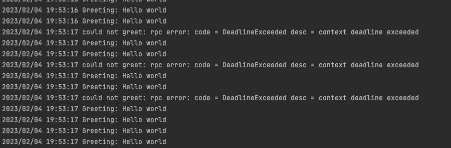

# Channelz

Channelz是一个工具，可提供有关gRPC中不同级别的连接的全面运行时信息。它旨在帮助调试可能受到网络，性能，配置问题等困扰的实时程序.


## proto定义

```protobuf
//https://github.com/grpc/grpc/blob/master/src/proto/grpc/channelz/channelz.proto
service Channelz {
  // 返回所有的根 Channel(即应用直接创建的 Channel)
  rpc GetTopChannels(GetTopChannelsRequest) returns (GetTopChannelsResponse);
  // 根据 Channel ID 返回单个的 Channel 详情，包括 Subchannel，如果没有则返回 NOT_FOUND
  rpc GetChannel(GetChannelRequest) returns (GetChannelResponse);
  // 根据 Subchannel ID 返回 Subchannel 详情
  rpc GetSubchannel(GetSubchannelRequest) returns (GetSubchannelResponse);
  // 返回所有存在的 Server
  rpc GetServers(GetServersRequest) returns (GetServersResponse);
  // 根据 Server ID 返回 Server 详情
  rpc GetServer(GetServerRequest) returns (GetServerResponse);
  // 根据 Server ID 返回 Server 所有的 Socket
  rpc GetServerSockets(GetServerSocketsRequest) returns (GetServerSocketsResponse);
  // 根据 Socket ID 返回 Socket 详情
  rpc GetSocket(GetSocketRequest) returns (GetSocketResponse);
}
```


## 案例分析
运行服务端及客户端程序，我们在日志中注意到存在间歇性错误，错误代码为DeadlineExceeded，

导致超出期限的错误，并且存在很多可能性：

- 网络问题，例如：连接丢失
- 代理问题，例如：中间的请求/响应被丢弃
- 服务器问题，例如：请求丢失或响应缓慢

### 分析 
客户端打开 grpc INFO日志以获取更多调试信息

```shell
(⎈ |test-ctx:ticket-system)➜  client git:(feature/grpc) ✗ GRPC_GO_LOG_SEVERITY_LEVEL=info GRPC_GO_LOG_VERBOSITY_LEVEL=99 go run client.go 
2023/02/04 19:59:28 INFO: [core] [Server #1] Server created
2023/02/04 19:59:28 INFO: [core] [Channel #2] Channel created
2023/02/04 19:59:28 INFO: [core] [Channel #2] original dial target is: "whatever:///test.server"
2023/02/04 19:59:28 INFO: [core] [Channel #2] parsed dial target is: {Scheme:whatever Authority: Endpoint:test.server URL:{Scheme:whatever Opaque: User: Host: Path:/test.server RawPath: ForceQuery:false RawQuery: Fragment: RawFragment:}}
2023/02/04 19:59:28 INFO: [core] [Channel #2] Channel authority set to "test.server"
2023/02/04 19:59:28 INFO: [core] [Server #1 ListenSocket #3] ListenSocket created
2023/02/04 19:59:28 INFO: [core] [Channel #2] Resolver state updated: {
  "Addresses": [
    {
      "Addr": ":10001",
      "ServerName": "",
      "Attributes": null,
      "BalancerAttributes": null,
      "Type": 0,
      "Metadata": null
    },
    {
      "Addr": ":10002",
      "ServerName": "",
      "Attributes": null,
      "BalancerAttributes": null,
      "Type": 0,
      "Metadata": null
    },
    {
      "Addr": ":10003",
      "ServerName": "",
      "Attributes": null,
      "BalancerAttributes": null,
      "Type": 0,
      "Metadata": null
    }
  ],
  "ServiceConfig": null,
  "Attributes": null
} (resolver returned new addresses)
2023/02/04 19:59:28 INFO: [core] [Channel #2] Channel switches to new LB policy "round_robin"
2023/02/04 19:59:28 INFO: [balancer] base.baseBalancer: got new ClientConn state:  {{[{
  "Addr": ":10001",
  "ServerName": "",
  "Attributes": null,
  "BalancerAttributes": null,
  "Type": 0,
  "Metadata": null
} {
  "Addr": ":10002",
  "ServerName": "",
  "Attributes": null,
  "BalancerAttributes": null,
  "Type": 0,
  "Metadata": null
} {
  "Addr": ":10003",
  "ServerName": "",
  "Attributes": null,
  "BalancerAttributes": null,
  "Type": 0,
  "Metadata": null
}] <nil> <nil>} <nil>}
2023/02/04 19:59:28 INFO: [core] [Channel #2 SubChannel #4] Subchannel created
2023/02/04 19:59:28 INFO: [core] [Channel #2 SubChannel #5] Subchannel created
2023/02/04 19:59:28 INFO: [core] [Channel #2 SubChannel #6] Subchannel created
2023/02/04 19:59:28 INFO: [core] [Channel #2 SubChannel #4] Subchannel Connectivity change to CONNECTING
2023/02/04 19:59:28 INFO: [core] [Channel #2 SubChannel #4] Subchannel picks a new address ":10001" to connect
2023/02/04 19:59:28 INFO: [core] [Channel #2 SubChannel #6] Subchannel Connectivity change to CONNECTING
2023/02/04 19:59:28 INFO: [core] [Channel #2 SubChannel #6] Subchannel picks a new address ":10003" to connect
2023/02/04 19:59:28 INFO: [core] [Channel #2 SubChannel #5] Subchannel Connectivity change to CONNECTING
2023/02/04 19:59:28 INFO: [balancer] base.baseBalancer: handle SubConn state change: 0x140002a4420, CONNECTING
2023/02/04 19:59:28 INFO: [core] [Channel #2] Channel Connectivity change to CONNECTING
2023/02/04 19:59:28 INFO: [core] [Channel #2 SubChannel #5] Subchannel picks a new address ":10002" to connect
2023/02/04 19:59:28 INFO: [balancer] base.baseBalancer: handle SubConn state change: 0x140002a4560, CONNECTING
2023/02/04 19:59:28 INFO: [balancer] base.baseBalancer: handle SubConn state change: 0x140002a44c0, CONNECTING
2023/02/04 19:59:28 INFO: [core] [Channel #2 SubChannel #4] Subchannel Connectivity change to READY
2023/02/04 19:59:28 INFO: [balancer] base.baseBalancer: handle SubConn state change: 0x140002a4420, READY
2023/02/04 19:59:28 INFO: [core] [Channel #2 SubChannel #5] Subchannel Connectivity change to READY
2023/02/04 19:59:28 INFO: [core] [Channel #2 SubChannel #6] Subchannel Connectivity change to READY
# ....
```
日志中未显示可疑事件

[使用channelz 分析问题](https://www.cnblogs.com/a00ium/p/14158585.html)


## 参考资料
1. [官方 channelz 提案](https://github.com/grpc/proposal/blob/master/A14-channelz.md)