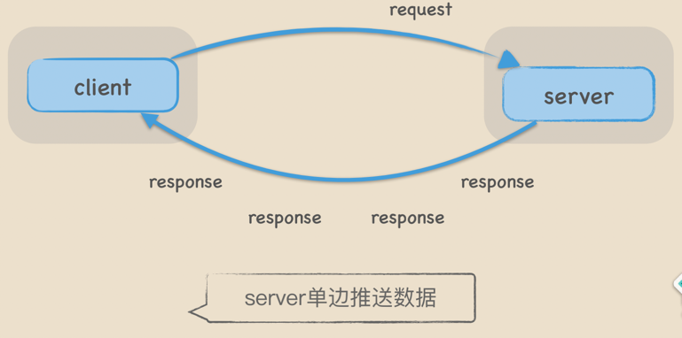
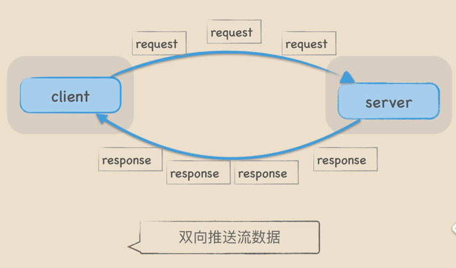

# Grpc
参考使用连接：https://github.com/grpc/grpc-go/tree/master/examples/features

## grpc分类
### 1. unary

### 2. client streaming
    

### 3. server streaming

### 4. bidi streaming   

## 拦截器

## grpc调优
* GRPC默认的参数对于传输大数据块来说不够友好，我们需要进行特定参数的调优。

* MaxSendMsgSizeGRPC最大允许发送的字节数，默认4MiB，如果超过了GRPC会报错。Client和Server我们都调到4GiB。

* MaxRecvMsgSizeGRPC最大允许接收的字节数，默认4MiB，如果超过了GRPC会报错。Client和Server我们都调到4GiB。

* InitialWindowSize基于Stream的滑动窗口，类似于TCP的滑动窗口，用来做流控，默认64KiB，吞吐量上不去，Client和Server我们调到1GiB。

* InitialConnWindowSize基于Connection的滑动窗口，默认16 * 64KiB，吞吐量上不去，Client和Server我们也都调到1GiB。

* KeepAliveTime每隔KeepAliveTime时间，发送PING帧测量最小往返时间，确定空闲连接是否仍然有效，我们设置为10S。

* KeepAliveTimeout超过KeepAliveTimeout，关闭连接，我们设置为3S。

* PermitWithoutStream如果为true，当连接空闲时仍然发送PING帧监测，如果为false，则不发送忽略。我们设置为true

