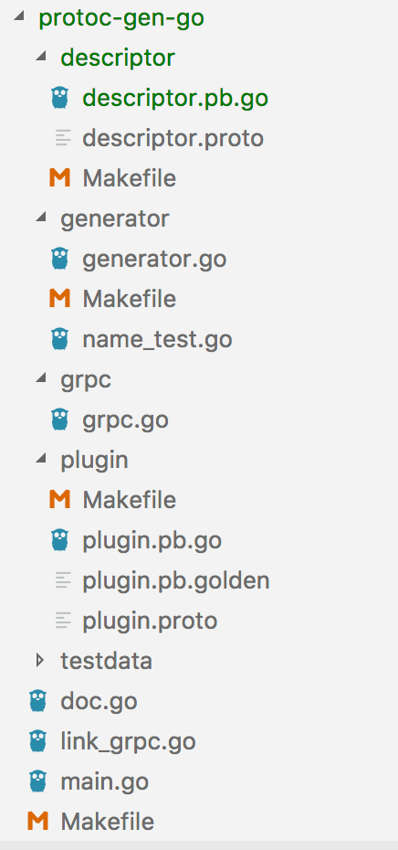

# Protobuf

## v2 和 v3 主要区别
* 删除原始值字段的字段存在逻辑
* 删除 required 字段
* 删除 optional 字段，默认就是
* 删除 default 字段
* 删除扩展特性，新增 Any 类型来替代它
* 删除 unknown 字段的支持
* 新增 JSON Mapping
* 新增 Map 类型的支持
* 修复 enum 的 unknown 类型
* repeated 默认使用 packed 编码
* 引入了新的语言实现（C＃，JavaScript，Ruby，Objective-C）

## protobuf优化


### wiretype   


## 工具
### protoc
   
protoc是protobuf文件（.proto）的编译器，可以借助这个工具把 .proto 文件转译成各种编程语言对应的源码，包含数据类型定义、调用接口等。

通过查看protoc的源码（参见github库）可以知道，protoc在设计上把protobuf和不同的语言解耦了，底层用c++来实现protobuf结构的存储，然后通过插件的形式来生成不同语言的源码。可以把protoc的编译过程分成简单的两个步骤

1. 解析.proto文件，转译成protobuf的原生数据结构在内存中保存；    

2. 把protobuf相关的数据结构传递给相应语言的编译插件，由插件负责根据接收到的protobuf原生结构渲染输出特定语言的模板

Note:包含的插件有 csharp、java、js、objectivec、php、python、ruby等多种,不包含go.

### protoc-gen-go
   
原生protoc并不包含Go版本的插件,protoc-gen-go是protobuf编译插件系列中的Go版本。
由于protoc-gen-go是Go写的，所以安装它变得很简单，只需要运行 go get -u github.com/golang/protobuf/protoc-gen-go

#### protoc-gen-go 源码目录分析
main包

- doc.go 主要是说明。
- link_grpc.go 显式引用protoc-gen-go/grpc包，触发grpc的init函数。
- main.go 代码不到50行，初始化generator，并调用generator相应的方法输出protobuf的Go语言文件。

- generator.go 包含了大部分由protobuf原生结构到Go语言文件的渲染方法，其中 func (g *Generator) P(str ...interface{}) 这个方法会把渲染输出到generator的output（generator匿名嵌套了bytes.Buffer，因此有Buffer的方法）。
name_test.go 测试，主要包含generator中名称相关方法的测试。

- grpc.go 与generator相似，但是包含了很多生成grpc相关方法的方法，比如渲染转译protobuf中定义的rpc方法（在generator中不包含，其默认不转译service的定义）
descriptor 包含protobuf的描述文件（.proto文件及其对应的Go编译文件），其中proto文件来自于proto库

- plugin 包含plugin的描述文件（.proto文件及其对应的Go编译文件），其中proto文件来自于proto库


### 生成方式
参考scripts脚本

####  gogoprotobuf
在go中使用protobuf，有两个可选用的包goprotobuf（go官方出品）和gogoprotobuf。gogoprotobuf完全兼容google protobuf，
它生成的代码质量和编解码性能均比goprotobuf高一些。
主要是它在goprotobuf之上extend了一些option。这些option也是有级别区分的，有的option只能修饰field，有的可以修饰enum，有的可以修饰message，有的是修饰package（即对整个文件都有效)

gogoprotobuf有两个插件可以使用

protoc-gen-gogo：和protoc-gen-go生成的文件差不多，性能也几乎一样(稍微快一点点)
protoc-gen-gofast：生成的文件更复杂，性能也更高(快5-7倍)

```shell
#安装 the protoc-gen-gofast binary
go get github.com/gogo/protobuf/protoc-gen-gofast
#生成
protoc --gofast_out=. myproto.proto
```

# protobuf源码分析
```go
//message接口
type Message = protoiface.MessageV1
type MessageV1 interface {
    Reset()
    String() string
    ProtoMessage()
}
```
proto编译成的Go结构体都是符合Message接口的，从Marshal可知Go结构体有3种序列化方式：
```go
func Marshal(pb Message) ([]byte, error) {
	if m, ok := pb.(newMarshaler); ok {
		siz := m.XXX_Size()
		b := make([]byte, 0, siz)
		return m.XXX_Marshal(b, false)
	}
	if m, ok := pb.(Marshaler); ok {
		// If the message can marshal itself, let it do it, for compatibility.
		// NOTE: This is not efficient.
		return m.Marshal()
	}
	// in case somehow we didn't generate the wrapper
	if pb == nil {
		return nil, ErrNil
	}
	var info InternalMessageInfo
	siz := info.Size(pb)
	b := make([]byte, 0, siz)
	return info.Marshal(b, pb, false)
}
//newMarshaler接口
type newMarshaler interface {
    XXX_Size() int
    XXX_Marshal(b []byte, deterministic bool) ([]byte, error)
}
//Marshaler接口
type Marshaler interface {
    Marshal() ([]byte, error)
}
```

1. pb Message满足newMarshaler接口，则调用XXX_Marshal()进行序列化。   
2. pb满足Marshaler接口，则调用Marshal()进行序列化，这种方式适合某类型自定义序列化规则的情况。   
3. 否则，使用默认的序列化方式，创建一个Warpper，利用wrapper对pb进行序列化，后面会介绍方式1实际就是使用方式3。