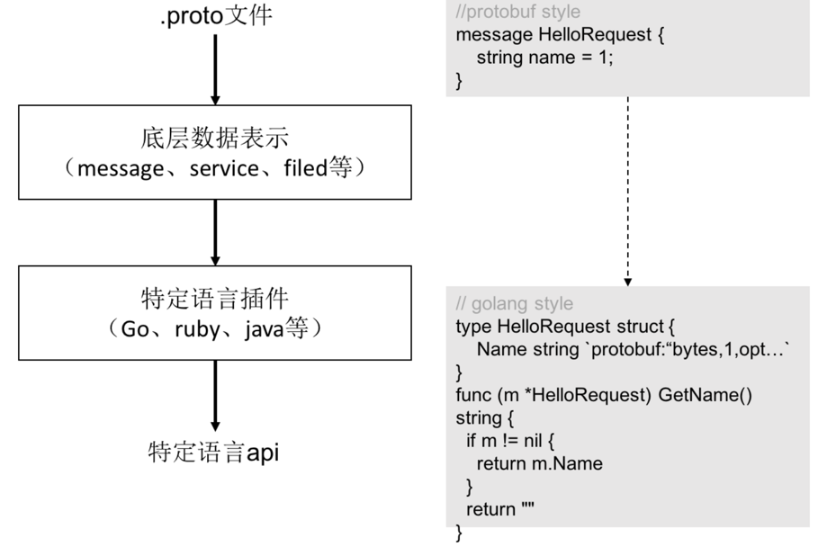

## protobuf 工具

### 1 [protoc (protocol buffer compiler)](https://github.com/protocolbuffers/protobuf)
   


protoc是protobuf文件（.proto）的编译器，可以借助这个工具把 .proto 文件转译成各种编程语言对应的源码，包含数据类型定义、调用接口等。

protoc在设计上把protobuf和不同的语言解耦了，底层用c++来实现protobuf结构的存储，然后通过插件的形式来生成不同语言的源码。
可以把protoc的编译过程分成简单的两个步骤

1. 解析.proto文件，转译成protobuf的原生数据结构在内存中保存；

2. 把protobuf相关的数据结构传递给相应语言的编译插件，由插件负责根据接收到的protobuf原生结构渲染输出特定语言的模板

Note: 包含的插件有 csharp、java、js、objectivec、php、python、ruby等多种,不包含go.


### 2 [protoc-gen-go](https://github.com/protocolbuffers/protobuf-go)


原生protoc并不包含Go版本的插件,protoc-gen-go是protobuf编译插件系列中的Go版本。

```go
# 安装参考
go install google.golang.org/protobuf/cmd/protoc-gen-go@latest
```

> The protocol buffer compiler produces Go output when invoked with the go_out flag. 
> The argument to the go_out flag is the directory where you want the compiler to write your Go output.
> The compiler creates a single source file for each .proto file input. The name of the output file is created by replacing the .proto extension with .pb.go


> There is no correlation between the Go import path and the package specifier in the .proto file. The latter is only relevant to the protobuf namespace, while the former is only relevant to the Go namespace.
> Also, there is no correlation between the Go import path and the .proto import path.


### 3 [protoc-gen-go-grpc](https://github.com/grpc/grpc-go)

```shell
# 安装参考
go install google.golang.org/grpc/cmd/protoc-gen-go-grpc@v1.2
```


### 4 [protoc-gen-go的替代版本:gogoprotobuf,2022开始 depreciated ](https://github.com/gogo/protobuf)

在go中使用protobuf，有两个可选用的包goprotobuf（go官方出品）和gogoprotobuf。
gogoprotobuf完全兼容google protobuf， 它生成的代码质量和编解码性能均比goprotobuf高一些。
主要是它在goprotobuf之上extend了一些option。这些option也是有级别区分的，有的option只能修饰field，有的可以修饰enum，有的可以修饰message，有的是修饰package（即对整个文件都有效)

gogoprotobuf有两个插件可以使用

protoc-gen-gogo：和 protoc-gen-go 生成的文件差不多，性能也几乎一样(稍微快一点点)
protoc-gen-gofast：生成的文件更复杂，性能也更高(快5-7倍)

```shell
#安装 the protoc-gen-gofast binary
go get github.com/gogo/protobuf/protoc-gen-gofast
#生成
protoc --gofast_out=. myproto.proto
```


查看版本
```shell
(⎈|test-ctx:ticket-system)➜  go_package_example git:(feature/grpc) ✗ protoc-gen-go-grpc --version
protoc-gen-go-grpc 1.2.0
(⎈|test-ctx:ticket-system)➜  go_package_example git:(feature/grpc) ✗ protoc --version            
libprotoc 3.19.4
(⎈|test-ctx:ticket-system)➜  go_package_example git:(feature/grpc) ✗ protoc-gen-go --version
protoc-gen-go v1.28.0
```


## 使用
需要用到的工具
- protoc v3.18.1
- protoc-gen-go v1.27.1
- protoc-gen-go-grpc v1.1.0
- grpc v1.41.0
- protobuf v1.27.1


## 生成的protobuf.pb.go源码分析
CodeC：定义了Marshal和Unmarshal的接口，在grpc底层实现是proto
```go
import (
	"github.com/gogo/protobuf/proto"
)

type Codec interface {
	Marshal(v interface{}) ([]byte, error)
	Unmarshal(data []byte, v interface{}) error
	String() string
}
```

proto.Message类型
```go
//message接口
type Message = protoiface.MessageV1
type MessageV1 interface {
    Reset()
    String() string
    ProtoMessage()
}
```
proto编译成的Go结构体都是符合Message接口的，从Marshal可知Go结构体有3种序列化方式：
```go
func Marshal(pb Message) ([]byte, error) {
	if m, ok := pb.(newMarshaler); ok {
		siz := m.XXX_Size()
		b := make([]byte, 0, siz)
		return m.XXX_Marshal(b, false)
	}
	if m, ok := pb.(Marshaler); ok {
		// If the message can marshal itself, let it do it, for compatibility.
		// NOTE: This is not efficient.
		return m.Marshal()
	}
	// in case somehow we didn't generate the wrapper
	if pb == nil {
		return nil, ErrNil
	}
	var info InternalMessageInfo
	siz := info.Size(pb)
	b := make([]byte, 0, siz)
	return info.Marshal(b, pb, false)
}
//newMarshaler接口
type newMarshaler interface {
    XXX_Size() int
    XXX_Marshal(b []byte, deterministic bool) ([]byte, error)
}
//Marshaler接口
type Marshaler interface {
    Marshal() ([]byte, error)
}
```

1. pb Message满足newMarshaler接口，则调用XXX_Marshal()进行序列化。
2. pb满足Marshaler接口，则调用Marshal()进行序列化，这种方式适合某类型自定义序列化规则的情况。
3. 否则，使用默认的序列化方式，创建一个Warpper，利用wrapper对pb进行序列化，后面会介绍方式1实际就是使用方式3。


## 参考资料
1. [protoc-gen-go-grpc 工具官方文档](https://protobuf.dev/reference/go/go-generated/)