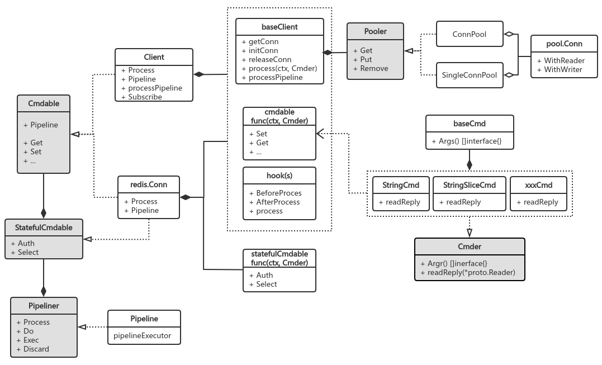

#通信协议
go-redis 为 TCP 连接装饰了读写缓冲，并将协议操作解耦到了 proto 模块


##proto.Writer
基于bufio.Writer实现 Redis 协议的 encoder，用于将命令及其参数 encode 到单个 multibulk 请求
    
    encode 逻辑：将各种参数值进行类型断言，统一转为byte[]写入 buffer
    
    值缓冲优化：bulk len 和 multibulk size 等整数值会高频地转为byte[]并写入 buffer，故预分配字节缓冲区，使用前丢弃旧数据即可
```go
type Writer struct {
    writer        // bufio.Writer
    lenBuf []byte // 高频使用的字节缓冲区
    numBuf []byte // 同理，初始大小为 64，足够
}
func (w *Writer) writeLen(n int) error {
    w.lenBuf = strconv.AppendUint(w.lenBuf[:0], uint64(n), 10) // [:0] 复用同一个 byte[] slice
    w.lenBuf = append(w.lenBuf, '\r', '\n')                    // 避免大量分配临时 byte[]
    _, err := w.Write(w.lenBuf)
    return err
}
```
##proto.Reader
基于bufio.Reader实现 5 种 Redis 协议响应数据的 decoder，读取回复并按指定类型解释字节数据

    数据读取：普通数据按行\n分割读，bulk 数据长度已知直接io.ReadFull阻塞 IO 读
    
    接口设计：由于响应数据的层次不定（简单的如GET只有一层 bulk，而复杂的如XREADGROUP则有五层），故 Writer 把 multi bulk 的读取逻辑交由调用方自行组织
```go
func (r *Reader) ReadIntReply() (int64, error) // :N // 读取整型回复
func (r *Reader) ReadString() (string, error)  // -ERR, +OK, $N // 读取错误回复、状态回复、bulk 数据

// 开放 MultiBulkParse 给不同命令实现，来自行组织数据的读取顺序
type MultiBulkParse func(*Reader, int64) (interface{}, error)
func (r *Reader) ReadArrayReply(m MultiBulkParse) (interface{}, error) // *N // 读取 multibulk 数据
func (r *Reader) ReadArrayLen() (int, error)
```

##proto.Conn
```go
type Conn struct {
    netConn net.Conn // TCP Connection
    rd *proto.Reader // read + decode
    wr *proto.Writer // encode + write
    bw *bufio.Writer // 暴露给 Conn 控制 write 完毕后触发 flush
    Inited bool      // 是否已初始化，管道执行 AUTH,SELECT 都成功后才是可使用的有效连接
    usedAt int64     // stale 连接检测
    /*...*/
}

func (cn *Conn) WithReader(ctx context.Context, timeout time.Duration, fn func(rd *proto.Reader) error) error {
	if err := cn.netConn.SetReadDeadline(cn.deadline(ctx, timeout)); err != nil {
		return err
	}
	return fn(cn.rd) // reader 交由调用方自行按格式解释字节数据
}

func (cn *Conn) WithWriter(ctx context.Context, timeout time.Duration, fn func(wr *proto.Writer) error) error {
	if err := cn.netConn.SetWriteDeadline(cn.deadline(ctx, timeout)); err != nil {
		return err
	}
	if err := fn(cn.wr); err != nil { // writer 交由调用方自行写入一批格式化后的数据
		return err
	}
	return cn.bw.Flush(); // 触发 flush
}
```

##命令处理流程
三步流程：准备命令及参数表，执行网络 IO 读写数据，返回响应数据；go-redis 通过接口、组合、依赖等方式高度抽象了流程中的各模块

命令分类，分离回复数据的读取逻辑；Redis 有 200+ 个命令，为提高可维护性，go-redis 将命令按回复数据的格式分成 34 类，抽象成 Cmder 接口
```
type Cmder interface {
    Args() []interface{}              // 命令及其参数列表
    readReply(rd *proto.Reader) error // 从 proto.Reader 读取回复数据
}
```
以 StatusCmd 为例，描述回复数据为单个状态字符串的命令，如 AUTH,SET,...
```go
type StatusCmd struct {
    baseCmd    // 组合参数表 args []interface{}
    val string // 读取到的单行回复，如 "OK"
}

func (cmd *StatusCmd) readReply(rd *proto.Reader) (err error) {
    cmd.val, err = rd.ReadString() // 仅需读取一个 string
    return err
}
```
最终 cmdable 在实现面向用户的各种命令函数时，会引用对应的 Cmder 实现
```go
type cmdable func(ctx context.Context, cmd Cmder) error

func (c cmdable) Set(ctx context.Context, key string, value interface{}, expiration time.Duration) *StatusCmd {
    cmd := NewStatusCmd(ctx, "set", key, value) /* ex, px... */
    _ = c(ctx, cmd)
    return cmd
}

```
流程第一步中命令及参数表已准备好，同时实现了回复数据的读取；注意 cmdable 是函数类型，签名为func(context.Context, Cmder) error，仅用于表示 cmder 的处理过程，也即第二步

##baseClient
封装连接池执行网络 IO 读写数据；核心逻辑：
    
    process：负责从连接池中获取连接，写出Cmder.Args命令参数表，并委托Cmder.readReply从连接中读取回复，最后归还连接
    管道操作pipelineProcessCmds：将[]Cmder的所有命令参数依次写出，再依次读取回复，做好错误处理
```go
func (c *baseClient) _process(ctx context.Context, cmd Cmder, attempt int) (bool, error) {
    // 1. 从连接池获取连接，将读写操作以闭包形式传入执行
    err := c.withConn(ctx, func(ctx context.Context, cn *pool.Conn) error {
        // 2. 配置写超时后，写入命令及参数表
        if err := cn.WithWriter(ctx, c.opt.WriteTimeout, func(wr *proto.Writer) error {
            return writeCmd(wr, cmd)
        }) ; err != nil {
            return err
        }
        // 3. 配置读超时后，执行 cmd.readReply 从连接中读取并解析数据到 cmd.val
        return cn.WithReader(ctx, c.cmdTimeout(cmd), cmd.readReply)
    }); 
    /*...*/
}
```

##Client
Client 组合了三个模块：cmdable 的参数表和回复读取、baseClient 的连接读写、hooks 执行命令回调
```go
type Hook interface {
	BeforeProcess(ctx context.Context, cmd Cmder) (context.Context, error)
	AfterProcess(ctx context.Context, cmd Cmder) error // 常用于实现 tracing 记录命令参数和执行时长
}
```
组合的目的在于，将 cmdable 的职责委托给 baseClient.process，完成流程第三步
```go
func NewClient(opt *Options) *Client {
    c.cmdable = c.Process /*...*/
}
func (c *Client) Process(ctx context.Context, cmd Cmder) error {
    return c.hooks.process(ctx, cmd, c.baseClient.process)
}    
```