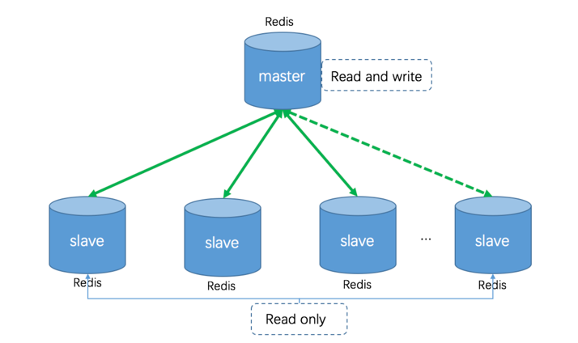
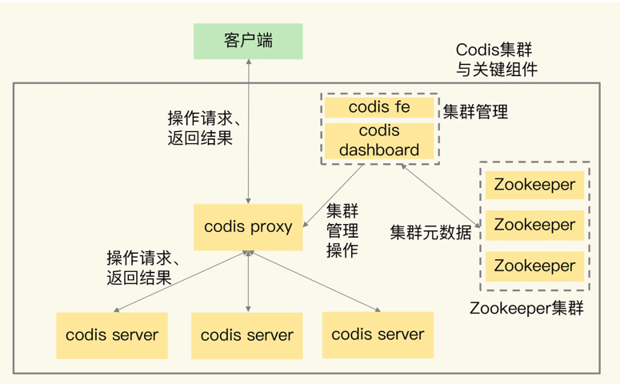
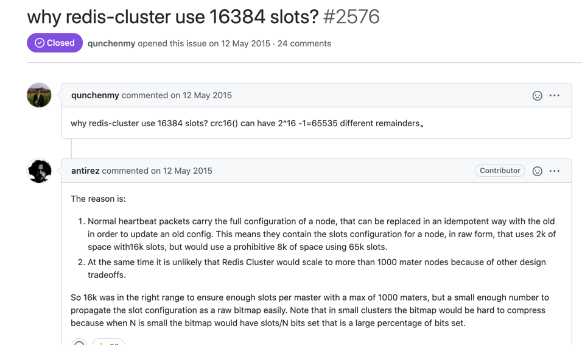

<!-- START doctoc generated TOC please keep comment here to allow auto update -->
<!-- DON'T EDIT THIS SECTION, INSTEAD RE-RUN doctoc TO UPDATE -->
**Table of Contents**  *generated with [DocToc](https://github.com/thlorenz/doctoc)*

- [redis 集群](#redis-%E9%9B%86%E7%BE%A4)
  - [Redis 单机模式](#redis-%E5%8D%95%E6%9C%BA%E6%A8%A1%E5%BC%8F)
    - [主从模式](#%E4%B8%BB%E4%BB%8E%E6%A8%A1%E5%BC%8F)
    - [哨兵模式](#%E5%93%A8%E5%85%B5%E6%A8%A1%E5%BC%8F)
  - [集群方案](#%E9%9B%86%E7%BE%A4%E6%96%B9%E6%A1%88)
    - [redis cluster(官方)](#redis-cluster%E5%AE%98%E6%96%B9)
      - [Redis Cluster 特点](#redis-cluster-%E7%89%B9%E7%82%B9)
      - [Redis-Cluster 实现基础：分片](#redis-cluster-%E5%AE%9E%E7%8E%B0%E5%9F%BA%E7%A1%80%E5%88%86%E7%89%87)
  - [参考](#%E5%8F%82%E8%80%83)

<!-- END doctoc generated TOC please keep comment here to allow auto update -->

# redis 集群

## Redis 单机模式

单机模式指 Redis 主节点以单个节点的形式存在，这个主节点可读可写，上面存储数据全集。在3.0版本之前，Redis 只能支持单机模式，出于可靠性考量，通常单机模式为“1主 N 备”的结构

### 主从模式
普通的主从模式，当主数据库崩溃时，需要手动切换从数据库成为主数据库:

- 在从数据库中使用SLAVE NO ONE命令将从数据库提升成主数据继续服务。
- 启动之前崩溃的主数据库，然后使用SLAVEOF命令将其设置成新的主数据库的从数据库，即可同步数据

### 哨兵模式
主从同步/复制的模式，当主服务器宕机后，需要手动把一台从服务器切换为主服务器，这就需要人工干预，费事费力

哨兵模式是从Redis的2.6版本开始提供的，但是当时这个版本的模式是不稳定的，直到Redis的2.8版本以后，这个哨兵模式才稳定下来。

优点

- 哨兵模式是基于主从模式的，解决可主从模式中master故障不可以自动切换故障的问题。

不足

- 是一种中心化的集群实现方案：始终只有一个Redis主机来接收和处理写请求，写操作受单机瓶颈影响。
- 集群里所有节点保存的都是全量数据，浪费内存空间，没有真正实现分布式存储。数据量过大时，主从同步严重影响master的性能。
- Redis主机宕机后，哨兵模式正在投票选举的情况之外，因为投票选举结束之前，谁也不知道主机和从机是谁，此时Redis也会开启保护机制，禁止写操作，直到选举出了新的Redis主机。

## 集群方案

1. 代理分片: redis代理分片用得最多的就是Twemproxy，由Twitter开源的Redis代理，其基本原理是：通过中间件的形式，Redis客户端把请求发送到Twemproxy，Twemproxy根据路由规则发送到正确的Redis实例，最后Twemproxy把结果汇集返回给客户端。

2. codis(Redis Cluster 方案正式发布前，业界已经广泛使用豌豆荚的 Codis)   

3. redis cluster    
   

### redis cluster(官方)

自3.0版本起，Redis 官方推出了一个原生的分布式方案—— Redis Cluster。它是一个分布式、容错的 Redis 实现。Redis Cluster中不存在中心节点或者代理节点，集群主要设计目标之一是实现线性可扩展性。

#### Redis Cluster 特点
- 节点互通：所有的 Redis 节点彼此互联（PING-PONG机制），内部使用二进制协议优化传输速度和带宽；
- 去中心化：Redis Cluster 不存在中心节点，每个节点都记录有集群的状态信息，并且通过 Gossip 协议，使每个节点记录的信息实现最终一致性；
- 客户端直连：客户端与 Redis 节点直连，不需要中间 Proxy 层，客户端不需要连接集群所有节点，连接集群中任何一个可用节点即可；
- 数据分片：Redis Cluster 的键空间被分割为 16384 个 Slot，这些 Slot 被分别指派给主节点，当存储 Key-Value 时，根据 CRC16(key) Mod 16384的值，决定将一个 Key-Value 放到哪个 Slot 中；
- 多数派原则：对于集群中的任何一个节点，需要超过半数的节点检测到它失效（pFail），才会将其判定为失效（Fail）；
- 自动 Failover：当集群中某个主节点故障后（Fail），其它主节点会从故障主节点的从节点中选举一个“最佳”从节点升主，替代故障的主节点；
- 功能弱化：集群模式下，由于数据分布在多个节点，不支持单机模式下的集合操作，也不支持多数据库功能，集群只能使用默认的0号数据库；
- 集群规模：官方推荐的最大节点数量为 1000 个左右，这是因为当集群规模过大时，Gossip 协议的效率会显著下降，通信成本剧增

#### Redis-Cluster 实现基础：分片

基于“分片”的思想，Redis 提出了 Hash Slot。Redis Cluster 把所有的物理节点映射到预先分好的16384个 Slot 上，当需要在 Redis 集群中放置一个 Key-Value 时，根据 CRC16(key) Mod 16384的值，决定将一个 Key 放到哪个 Slot 中。

redis cluster 的哈希槽为啥16384个? 

## 参考

