<!-- START doctoc generated TOC please keep comment here to allow auto update -->
<!-- DON'T EDIT THIS SECTION, INSTEAD RE-RUN doctoc TO UPDATE -->
**Table of Contents**  *generated with [DocToc](https://github.com/thlorenz/doctoc)*

- [redis 数据类型](#redis-%E6%95%B0%E6%8D%AE%E7%B1%BB%E5%9E%8B)
  - [1. Redis object 对象的数据结构,具有五种属性与 11 种编码方式](#1-redis-object-%E5%AF%B9%E8%B1%A1%E7%9A%84%E6%95%B0%E6%8D%AE%E7%BB%93%E6%9E%84%E5%85%B7%E6%9C%89%E4%BA%94%E7%A7%8D%E5%B1%9E%E6%80%A7%E4%B8%8E-11-%E7%A7%8D%E7%BC%96%E7%A0%81%E6%96%B9%E5%BC%8F)
    - [基本数据类型-->应用层](#%E5%9F%BA%E6%9C%AC%E6%95%B0%E6%8D%AE%E7%B1%BB%E5%9E%8B--%E5%BA%94%E7%94%A8%E5%B1%82)
      - [1. string](#1-string)
      - [2. hash(ziplist+dict)](#2-hashziplistdict)
      - [3. set(intset+dict)](#3-setintsetdict)
      - [4. list 双端链表](#4-list-%E5%8F%8C%E7%AB%AF%E9%93%BE%E8%A1%A8)
      - [5. Sort Set(主要是dict+zskiplist)](#5-sort-set%E4%B8%BB%E8%A6%81%E6%98%AFdictzskiplist)
      - [6. stream(radix-tree)](#6-streamradix-tree)
    - [encoding 编码方式-->实际数据库内部结构](#encoding-%E7%BC%96%E7%A0%81%E6%96%B9%E5%BC%8F--%E5%AE%9E%E9%99%85%E6%95%B0%E6%8D%AE%E5%BA%93%E5%86%85%E9%83%A8%E7%BB%93%E6%9E%84)
      - [0. OBJ_ENCODING_RAW](#0-obj_encoding_raw)
      - [2. OBJ_ENCODING_HT 哈希表](#2-obj_encoding_ht-%E5%93%88%E5%B8%8C%E8%A1%A8)
      - [5. OBJ_ENCODING_ZIPLIST 压缩列表](#5-obj_encoding_ziplist-%E5%8E%8B%E7%BC%A9%E5%88%97%E8%A1%A8)
        - [查找复杂度高](#%E6%9F%A5%E6%89%BE%E5%A4%8D%E6%9D%82%E5%BA%A6%E9%AB%98)
      - [6. OBJ_ENCODING_INTSET整数集合](#6-obj_encoding_intset%E6%95%B4%E6%95%B0%E9%9B%86%E5%90%88)
      - [7. OBJ_ENCODING_SKIPLIST 跳跃表](#7-obj_encoding_skiplist-%E8%B7%B3%E8%B7%83%E8%A1%A8)
        - [8. OBJ_ENCODING_EMBSTR(embedded string)](#8-obj_encoding_embstrembedded-string)
      - [9. OBJ_ENCODING_QUICKLIST](#9-obj_encoding_quicklist)
      - [10. OBJ_ENCODING_STREAM](#10-obj_encoding_stream)
  - [2. client、redisServer 对象](#2-clientredisserver-%E5%AF%B9%E8%B1%A1)
  - [参考](#%E5%8F%82%E8%80%83)

<!-- END doctoc generated TOC please keep comment here to allow auto update -->

# redis 数据类型

## 1. Redis object 对象的数据结构,具有五种属性与 11 种编码方式

```cgo
// src/server.h
typedef struct redisObject {
    unsigned type:4;  // 是应用程序在 Redis 中保存的数据类型，包括 String、List、Hash 等,占4位
    unsigned encoding:4;  // 编码,对应了11中编码方式,是 Redis 内部实现各种数据类型所用的数据结构
    unsigned lru:LRU_BITS; /* LRU time (relative to global lru_clock) or
                            * LFU data (least significant 8 bits frequency
                            * and most significant 16 bits access time). */
                            // 最近最少使用
    int refcount; // 引用计数
    void *ptr; // 指针
} robj;
```

- [1] type ====> 类型对应基本数据类型。例如Redis_String 对应字符串，Redis_List对应列表
- [2] encoding ====> 编码。编码方式决定了对象的底层的数据结构，一个对象至少有两种编码方式
- [3] prt ====> 指针。指向由编码决定的数据结构，数据结构中往往包含有所存的数据
- [4] refcount ====> 引用计数。这个属性主要是为了实现redis中的内存回收机制
- [5] lru ====> 最近最少使用。用来解决对象的空转时长，同时也会被用于当缓冲达到最大值，再向其中添加数据时，应该删除什么数据。

### 基本数据类型-->应用层
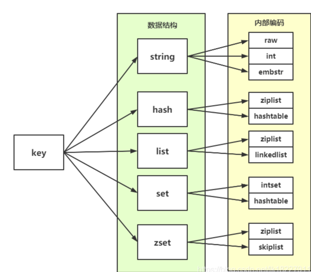

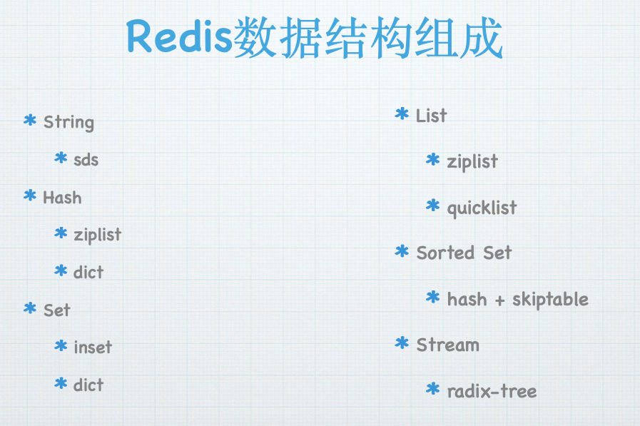
```cgo
/* The actual Redis Object */
#define OBJ_STRING 0    /* String object. */
#define OBJ_LIST 1      /* List object. */
#define OBJ_SET 2       /* Set object. */
#define OBJ_ZSET 3      /* Sorted set object. */
#define OBJ_HASH 4      /* Hash object. */
```

#### 1. string
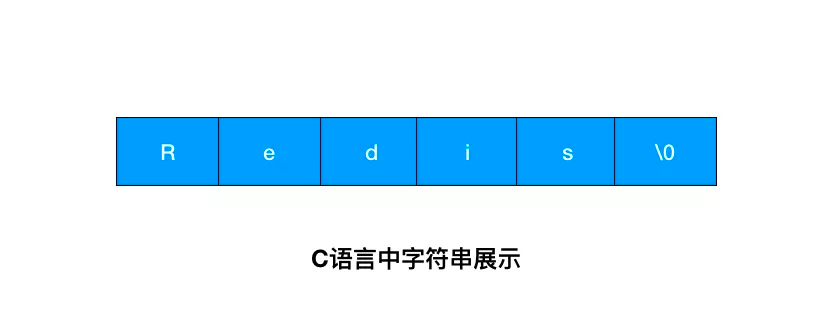

c语言自带的字符串,不过是一个以0结束的字符数组.想要获取 「Redis」的长度，需要从头开始遍历，直到遇到 '\0' 为止。
其主要原因是C的字符串是底层的API，存在以下问题：（1）没有记录字符串长度，故需要O(n)复杂度获取字符串长度；（2）由于没有记录字符串长度，故容易出现缓冲区溢出问题；（3）每次对字符串拓容都需要使用系统调用，没有预留空间（4）C的字符串只能保存字符。


在redis中，sds提供简单动态字符串,（1）通过len记录字符串长度，实现O(1)复杂度获取；（2）内部字符串数组预留了空间，减少字符串的内存重分配次数，同时实现了自动拓容避免缓冲区溢出问题；（3）内部字符数组基于字节来保存数据，故可以保存字符和二进制数据

具体分配规则

    1、int：8个字节的长整型
    
    2、embstar：小于等于 39 字节的字符串
    
    3、raw：大于 39 字节的字符串 
#### 2. hash(ziplist+dict)

#### 3. set(intset+dict)

#### 4. list 双端链表

#### 5. Sort Set(主要是dict+zskiplist)
```cgo
typedef struct zset {
    dict *dict;
    zskiplist *zsl;
} zset;
```
其中字典里面保存了有序集合中member与score的键值对，跳跃表则用于实现按score排序的功能


#### 6. stream(radix-tree)

PipeLine:

	Redis的pipeline功能的原理是 Client通过一次性将多条redis命令发往Redis Server，减少了每条命令分别传输的IO开销。
	同时减少了系统调用的次数，因此提升了整体的吞吐能力。
	我们在主-从模式的Redis中，pipeline功能应该用的很多，但是Cluster模式下，估计还没有几个人用过。
	我们知道 redis cluster 默认分配了 16384 个slot，当我们set一个key 时，会用CRC16算法来取模得到所属的slot，
	然后将这个key 分到哈希槽区间的节点上，具体算法就是：CRC16(key) % 16384。如果我们使用pipeline功能，
	一个批次中包含的多条命令，每条命令涉及的key可能属于不同的slot


### encoding 编码方式-->实际数据库内部结构
```cgo
#define OBJ_ENCODING_RAW 0     /* Raw representation */
#define OBJ_ENCODING_INT 1     /* Encoded as integer 整数*/
#define OBJ_ENCODING_HT 2      /* Encoded as hash table 哈希表 */
#define OBJ_ENCODING_ZIPMAP 3  /* Encoded as zipmap */
#define OBJ_ENCODING_LINKEDLIST 4 /* No longer used: old list encoding. 不再使用*/
#define OBJ_ENCODING_ZIPLIST 5 /* Encoded as 压缩列表（ziplist） */
#define OBJ_ENCODING_INTSET 6  /* Encoded as 整数集合（intset）*/
#define OBJ_ENCODING_SKIPLIST 7  /* Encoded as skiplist 跳表 */
#define OBJ_ENCODING_EMBSTR 8  /* Embedded sds string encoding */
#define OBJ_ENCODING_QUICKLIST 9 /* Encoded as linked list of ziplists */
#define OBJ_ENCODING_STREAM 10 /* Encoded as a radix tree of listpacks */
```

```shell
#  查看数据的编码类型
object encoding key
```


#### 0. OBJ_ENCODING_RAW
RAW编码方式使用简单动态字符串（Simple Dynamic String，SDS）来保存字符串对象


```c   
typedef char *sds;
```
sds字符串根据字符串的长度，划分了五种结构体sdshdr5、sdshdr8、sdshdr16、sdshdr32、sdshdr64,分别对应的类型为SDS_TYPE_5、SDS_TYPE_8、SDS_TYPE_16、SDS_TYPE_32、SDS_TYPE_64
每个sds 所能存取的最大字符串长度为：
```cgo
static inline char sdsReqType(size_t string_size) {
    if (string_size < 1<<5)
        return SDS_TYPE_5;
    if (string_size < 1<<8)
        return SDS_TYPE_8;
    if (string_size < 1<<16)
        return SDS_TYPE_16;
#if (LONG_MAX == LLONG_MAX)
    if (string_size < 1ll<<32)
        return SDS_TYPE_32;
    return SDS_TYPE_64;
#else
    return SDS_TYPE_32;
#endif
}

```
- sdshdr5最大为32(2^5),  sdshdr5 这一类型 Redis 已经不再使用了
- sdshdr8最大为0xff(2^8-1)
- sdshdr16最大为0xffff(2^16-1)
- sdshdr32最大为0xffffffff(2^32-1)
- sdshdr64最大为(2^64-1)


SDS_TYPE_8结构体
```c
struct __attribute__ ((__packed__)) sdshdr8 { // attribute ((packed))的作用就是告诉编译器，在编译 sdshdr8 结构时，不要使用字节对齐的方式，而是采用紧凑的方式分配内存。
    // 已使用字符串长度
    uint8_t len; /* used */
    // 一共分配了多少字节
    uint8_t alloc; /* excluding the header and null terminator */
    unsigned char flags; /* 3 lsb of type, 5 unused bits */
    // 字节数组
    char buf[];
};

```

#### 2. OBJ_ENCODING_HT 哈希表

Redis 采用了链式哈希


a. 哈希表节点key/value结构体定义，真正的数据节点

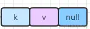
```c
typedef struct dictEntry {
	//键
	// Redis 的哈希表使用链地址法(separate chaining)来解决键冲突：
    void *key;
    //值
    union {
        void *val;
        uint64_t u64;
        int64_t s64;
        double d;
    } v;
     // 每个哈希表节点都有一个 next 指针， 多个哈希表节点可以用 next 指针构成一个单向链表，
     // 被分配到同一个索引上的多个节点可以用这个单向链表连接起来， 这就解决了键冲突的问题。
    struct dictEntry *next;
} dictEntry
```

b. 哈希表结构体,数据 dictEntry 类型的数组，每个数组的item可能都指向一个链表。
```c
/* This is our hash table structure. */
typedef struct dictht {
	//对应的是多个哈希表节点dictEntry
    dictEntry **table;
    //哈希表大小
    unsigned long size;

   	//哈希表大小的掩码,用于计算索引值
   	//总是等于size-1
    unsigned long sizemask;

   	//已有节点的数量
    unsigned long used;
} dictht;
```

c. 字典的结构体
```c
//dict.h
typedef struct dict {

    // 包括一些自定义函数，这些函数使得key和value能够存储
    dictType *type;

    void *privdata;
    // ht是一个长度为2的数组，对应的是两个哈希表，一般使用使用ht[0],ht[1]主要在扩容和缩容时使用。
    dictht ht[2];

    long rehashidx; /* 是一个标志量，如果为-1说明当前没有扩容，如果不为 -1 则记录扩容位置 */
    unsigned long iterators; /*当前字典正在进行中的迭代器 */
} dict;


typedef struct dictType {
    // 用于计算Hash的函数指针
    unsigned int (*hashFunction)(const void *key);
    void *(*keyDup)(void *privdata，const void *key);
    void *(*valDup)(void *privdata，const void *obj);
    int (*keyCompare)(void *privdata，const void *key1，const void *key2);
    void (*keyDestructor)(void *privdata，void *key);
    void (*valDestructor)(void *privdata，void *obj);
} dictType;

```
如何实现 rehash:Redis 准备了两个哈希表，用于 rehash 时交替保存数据。


#### 5. OBJ_ENCODING_ZIPLIST 压缩列表


一个 ziplist 数据结构在内存中的布局，就是一块连续的内存空间。

链表(List),哈希(Hash),有序集合(Sorted Set)在成员较少，成员值较小的时候都会采用压缩列表(ZIPLIST)编码方式进行存储。

这里成员"较少"，成员值"较小"的标准可以通过配置项进行配置:
```cgo

hash-max-ziplist-entries 512
hash-max-ziplist-value 64
list-max-ziplist-entries 512
list-max-ziplist-value 64
zset-max-ziplist-entries 128
zset-max-ziplist-value 64
```

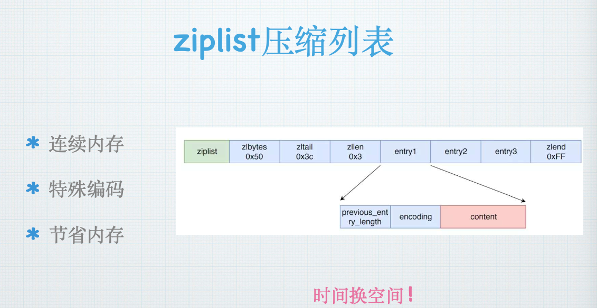
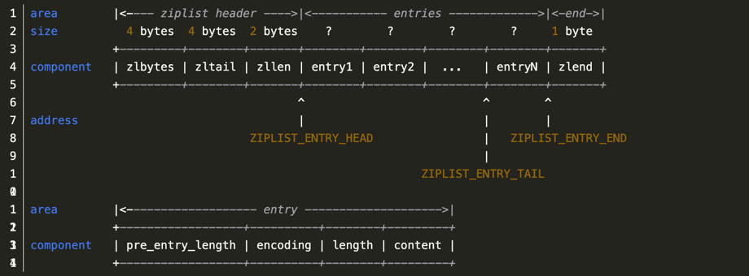


如果在一个链表节点中存储一个小数据，比如一个字节。那么对应的就要保存头节点，前后指针等额外的数据。
这样就浪费了空间，同时由于反复申请与释放也容易导致内存碎片化。这样内存的使用效率就太低了。
并且压缩列表的内存是连续分配的，遍历的速度很快。

```cgo
// https://github.com/redis/redis/blob/842dd85b264f7d77a12273f8b2e7700ce99dd610/src/ziplist.c
// 创建函数 ziplistNew
/* Create a new empty ziplist. */
unsigned char *ziplistNew(void) {
    unsigned int bytes = ZIPLIST_HEADER_SIZE+ZIPLIST_END_SIZE;
    unsigned char *zl = zmalloc(bytes);
    ZIPLIST_BYTES(zl) = intrev32ifbe(bytes);
    ZIPLIST_TAIL_OFFSET(zl) = intrev32ifbe(ZIPLIST_HEADER_SIZE);
    ZIPLIST_LENGTH(zl) = 0;
    zl[bytes-1] = ZIP_END;
    return zl;
}

```

ziplistNew 函数的逻辑很简单，就是创建一块连续的内存空间，大小为 ZIPLIST_HEADER_SIZE 和 ZIPLIST_END_SIZE 的总和，然后再把该连续空间的最后一个字节赋值为 ZIP_END，表示列表结束


ziplist 列表项包括三部分内容，分别是前一项的长度（prevlen）、当前项长度信息的编码结果（encoding），以及当前项的实际数据（data）。

##### 查找复杂度高
因为 ziplist 头尾元数据的大小是固定的，并且在 ziplist 头部记录了最后一个元素的位置，所以，当在 ziplist 中查找第一个或最后一个元素的时候，就可以很快找到。

但问题是，当要查找列表中间的元素时，ziplist 就得从列表头或列表尾遍历才行。而当 ziplist 保存的元素过多时，查找中间数据的复杂度就增加了。更糟糕的是，如果 ziplist 里面保存的是字符串，ziplist 在查找某个元素时，还需要逐一判断元素的每个字符，这样又进一步增加了复杂度。

也正因为如此，我们在使用 ziplist 保存 Hash 或 Sorted Set 数据时，都会在 redis.conf 文件中，通过 hash-max-ziplist-entries 和 zset-max-ziplist-entries 两个参数，来控制保存在 ziplist 中的元素个数。

不仅如此，除了查找复杂度高以外，ziplist 在插入元素时，如果内存空间不够了，ziplist 还需要重新分配一块连续的内存空间，而这还会进一步引发连锁更新的问题。


#### 6. OBJ_ENCODING_INTSET整数集合

当一个集合只包含整数值元素，并且这个集合的元素数量不多时，Redis就会使用整数集合键的底层实现。
```c
typedef struct intset {
	//编码方式
    uint32_t encoding;
    //集合包含的元素数量
    uint32_t length;
    //保存元素的数组
    int8_t contents[];
} intset;
```
contents数组是整数集合的底层实现：整数集合的每个元素都是contents数组的一个数据项(item),各个项在数组中按值得大小从小到大有序得排列，并且数组中不包含任何重复项

虽然intset结构将contents属性声明为int8_t类型的数组，但实际上contents并不保存任何int8_t类型的值，contents数组得真正类型取决于encoding属性的值:

    如果encoding属性得值为INTSET_ENC_INT16，那么contents就是一个int16_t类型的数组，数组里得每个项都是一个int16_t类型的整数值(最小值为-32768,最大值为32767)。
    
    如果encoding属性得值为INTSET_ENC_INT32，那么contents就是一个int32_t类型的数组，数组里的每个项都是一个int32_t类型的整数值(最小值为-2147483648,最大值为2147483648)。
    
    如果encoding属性的值为INTSET_ENC_INT64,那么contents就是一个int64_t类型的数组，数组里的每个项都是一个int64_t类型得整数值(最小值为-9223372036854775808,9223372036854775808)

length属性记录了整数集合包含得元素数量，也即是contents数组得长度。


#### 7. OBJ_ENCODING_SKIPLIST 跳跃表
为有序集合对象专用，有序集合对象采用了字典+跳跃表的方式实现
```cgo
typedef struct zset {
    dict *dict;
    zskiplist *zsl;
} zset;
```
其中字典里面保存了有序集合中member与score的键值对，跳跃表则用于实现按score排序的功能


跳跃表的结构
```c
//定义在server.h/zskiplist
typedef struct zskiplistNode {
    sds ele;//成员对象
    double score;//分数
    struct zskiplistNode *backward;  //  后退指针，方便 zrev 系列的逆序操作
    //层
    struct zskiplistLevel {
    	//前进指针
        struct zskiplistNode *forward;
        //跨度
        unsigned long span;
    } level[];
    
} zskiplistNode;

typedef struct zskiplist {
    struct zskiplistNode *header, *tail;
    unsigned long length; // 跳跃表的长度
    int level; // 记录跳跃表内，层数最大的那个节点的层数
} zskiplist;
```
跳表就是多层链表的结合体，跳表分为许多层(level)，每一层都可以看作是数据的索引，这些索引的意义就是加快跳表查找数据速度

没有跳表查询时,查询数据37

有跳表查询37时
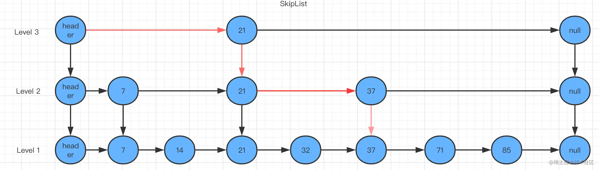

与一般的跳跃表实现相比，有序集合中的跳跃表有以下特点：

    * 允许重复的 score 值：多个不同的 member 的 score 值可以相同。
    * 进行对比操作时，不仅要检查 score 值，还要检查 member：当 score 值可以重复时，单靠 score 值无法判断一个元素的身份，所以需要连 member 域都一并检查才行。
    * 每个节点都带有一个高度为1层的后退指针，用于从表尾方向向表头方向迭代：当执行 ZREVRANGE 或ZREVRANGEBYSCORE这类以逆序处理有序集的命令时，就会用到这个属性

##### 8. OBJ_ENCODING_EMBSTR(embedded string)
从Redis 3.0版本开始字符串引入了EMBSTR编码方式，长度小于OBJ_ENCODING_EMBSTR_SIZE_LIMIT的字符串将以EMBSTR方式存储
```cgo
robj *createStringObject(const char *ptr, size_t len) {
    if (len <= OBJ_ENCODING_EMBSTR_SIZE_LIMIT)
        return createEmbeddedStringObject(ptr,len);
    else
        return createRawStringObject(ptr,len);
}
```
EMBSTR方式的意思是 embedded string ，字符串的空间将会和redisObject对象的空间一起分配，两者在同一个内存块中

    Redis中内存分配使用的是jemalloc，jemalloc分配内存的时候是按照8,16,32,64作为chunk的单位进行分配的。
    为了保证采用这种编码方式的字符串能被jemalloc分配在同一个chunk中，该字符串长度不能超过64，
    故字符串长度限制OBJ_ENCODING_EMBSTR_SIZE_LIMIT = 64 - sizeof('0') - sizeof(robj)为16 - sizeof(struct sdshdr)为8 = 39

#### 9. OBJ_ENCODING_QUICKLIST
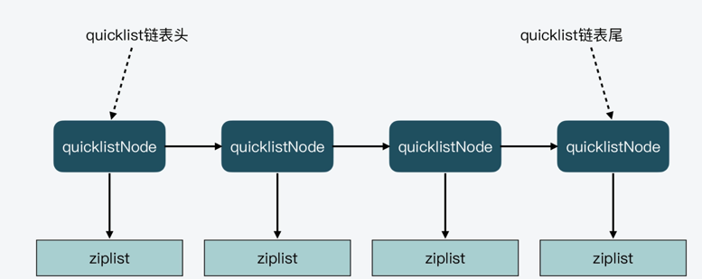
虽然 ziplist 节省了内存开销，可它也存在两个设计代价：一是不能保存过多的元素，否则访问性能会降低；二是不能保存过大的元素，否则容易导致内存重新分配，甚至可能引发连锁更新的问题。
所谓的连锁更新，简单来说，就是 ziplist 中的每一项都要被重新分配内存空间，造成 ziplist 的性能降低

针对 ziplist 在设计上的不足，Redis 代码在开发演进的过程中，新增设计了两种数据结构：quicklist 和 listpack。在 5.0 版本中新增了 listpack 数据结构，用来彻底避免连锁更新
这两种数据结构的设计目标，就是尽可能地保持 ziplist 节省内存的优势，同时避免 ziplist 潜在的性能下降问题。

- 在Redis 3.2版本之前，一般的链表使用LINKDEDLIST编码。
- 在Redis 3.2版本开始，所有的链表都是用QUICKLIST编码。

两者都是使用基本的双端链表数据结构，区别是QUICKLIST每个节点的值都是使用ZIPLIST进行存储的。
```cgo
// 3.2版本之前
typedef struct list {
    listNode *head;
    listNode *tail;
    void *(*dup)(void *ptr);
    void (*free)(void *ptr);
    int (*match)(void *ptr，void *key);
    unsigned long len;
} list;

typedef struct listNode {
    struct listNode *prev;
    struct listNode *next;
    void *value;
} listNode;


// 3.2版本
typedef struct quicklist {
    quicklistNode *head;
    quicklistNode *tail;
    unsigned long count;        /* 所有ziplist中的总元素个数 */
    unsigned int len;           /* quicklistNodes的个数 */
    int fill : 16;              /* fill factor for individual nodes */
    unsigned int compress : 16; /* depth of end nodes not to compress;0=off */
} quicklist;

typedef struct quicklistNode {
    struct quicklistNode *prev;
    struct quicklistNode *next;
    unsigned char *zl; //quicklistNode指向的ziplist
    unsigned int sz;             //ziplist的字节大小
    unsigned int count : 16;    //ziplist中的元素个数
    unsigned int encoding : 2;   /* RAW==1 or LZF==2 编码格式，原生字节数组或压缩存储*/
    unsigned int container : 2;  /* 存储方式 NONE==1 or ZIPLIST==2 */
    unsigned int recompress : 1; /* 数据是否被压缩  */
    unsigned int attempted_compress : 1; /* node can't compress; too small */
    unsigned int extra : 10; /* //预留的bit位 */
} quicklistNode;
```
一个 quicklist 就是一个链表，而链表中的每个元素又是一个 ziplist。


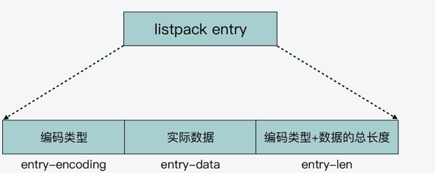

listpack 中的每个列表项不再像 ziplist 列表项那样，保存其前一个列表项的长度，它只会包含三个方面内容，分别是当前元素的编码类型（entry-encoding）、元素数据 (entry-data)


#### 10. OBJ_ENCODING_STREAM
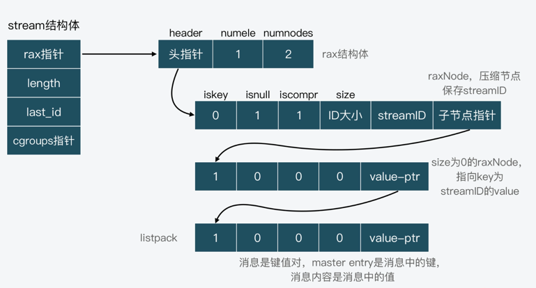
Redis 从 5.0 版本开始支持提供 Stream 数据类型，它可以用来保存消息数据，进而能帮助我们实现一个带有消息读写基本功能的消息队列，并用于日常的分布式程序通信当中。

Stream 会使用 Radix Tree 来保存消息 ID，然后将消息内容保存在 listpack 中，并作为消息 ID 的 value，用 raxNode 的 value 指针指向对应的 listpack


```cgo
// https://github.com/redis/redis/blob/cddf1da2e9964267ce0c8755d645e457ac852746/src/stream.h
typedef struct stream {
    rax *rax;               /* 保存消息的Radix Tree */
    uint64_t length;        /* 消息流中的消息个数. */
    streamID last_id;       /* 当前消息流中最后插入的消息的ID */
    rax *cgroups;           /* 当前消息流的消费组信息，也是用Radix Tree保存 */
} stream;
```

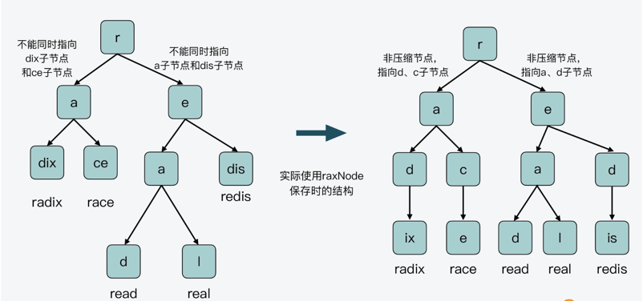
```cgo
#define RAX_NODE_MAX_SIZE ((1<<29)-1)
typedef struct raxNode {
    uint32_t iskey:1;     /* 节点是否包含key */
    uint32_t isnull:1;    /* 节点的值是否为NULL */
    uint32_t iscompr:1;   /* 节点是否被压缩 */
    uint32_t size:29;     /* 表示当前节点的大小，具体值会根据节点是压缩节点还是非压缩节点而不同。如果当前节点是压缩节点，该值表示压缩数据的长度；如果是非压缩节点，该值表示该节点指向的子节点个数 */
    /* Data layout is as follows:
     *
     * If node is not compressed we have 'size' bytes, one for each children
     * character, and 'size' raxNode pointers, point to each child node.
     * Note how the character is not stored in the children but in the
     * edge of the parents:
     *
     * [header iscompr=0][abc][a-ptr][b-ptr][c-ptr](value-ptr?)
     *
     * if node is compressed (iscompr bit is 1) the node has 1 children.
     * In that case the 'size' bytes of the string stored immediately at
     * the start of the data section, represent a sequence of successive
     * nodes linked one after the other, for which only the last one in
     * the sequence is actually represented as a node, and pointed to by
     * the current compressed node.
     *
     * [header iscompr=1][xyz][z-ptr](value-ptr?)
     *
     * Both compressed and not compressed nodes can represent a key
     * with associated data in the radix tree at any level (not just terminal
     * nodes).
     *
     * If the node has an associated key (iskey=1) and is not NULL
     * (isnull=0), then after the raxNode pointers poiting to the
     * children, an additional value pointer is present (as you can see
     * in the representation above as "value-ptr" field).
     */
    unsigned char data[];
} raxNode;

typedef struct rax {
    raxNode *head;
    uint64_t numele;
    uint64_t numnodes;
} rax;
```

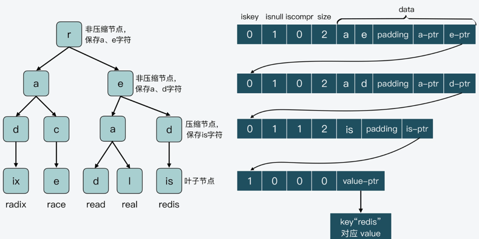

这张图上显示了 Radix Tree 最右侧分支的 4 个节点 r、e、d、is 和它们各自的 raxNode 内容。其中，节点 r、e 和 d 都不代表 key，所以它们的 iskey 值为 0，isnull 值为 1，没有为 value 指针分配空间

节点 r 和 e 指向的子节点都是单字符节点，所以它们不是压缩节点，iscompr 值为 0。而节点 d 的子节点包含了合并字符串“is”，所以该节点是压缩节点，iscompr 值为 1。最后的叶子节点 is，它的 raxNode 的 size 为 0，没有子节点指针。不过，因为从根节点到节点 is 路径上的字符串代表了 key“redis”，所以，节点 is 的 value 指针指向了“redis”对应的 value 数据。


## 2. client、redisServer 对象
```cgo
struct client {
    int fd;// Client socket.
    sds querybuf;//Buffer we use to accumulate client queries.
    int argc;//当前命令的参数个数
    robj **argv;//当前命令redisObject对象
    redisDb *db;//当前选择的db
    int flags;
    user *user;//connection关联的用户
    list *reply;//List of reply objects to send to the client.
    char buf[PROTO_REPLY_CHUNK_BYTES];//Response buffer
    char slave_ip[NET_IP_STR_LEN];//slave ip
    ... many other fields ...
}
struct redisServer {
    /* General */
    pid_t pid;                  /* Main process pid. */
    redisDb *db;
    dict *commands;             /* Command table */
/* Networking */
    int port;                   /* TCP listening port */
    int tcp_backlog;            /* TCP listen() backlog */
    list *clients;              /* List of active clients */
    list *slaves, *monitors;    /* List of slaves and MONITORs */
}
```


## 参考

- [Redis 源码剖析与实战](https://time.geekbang.org/column/article/399866)