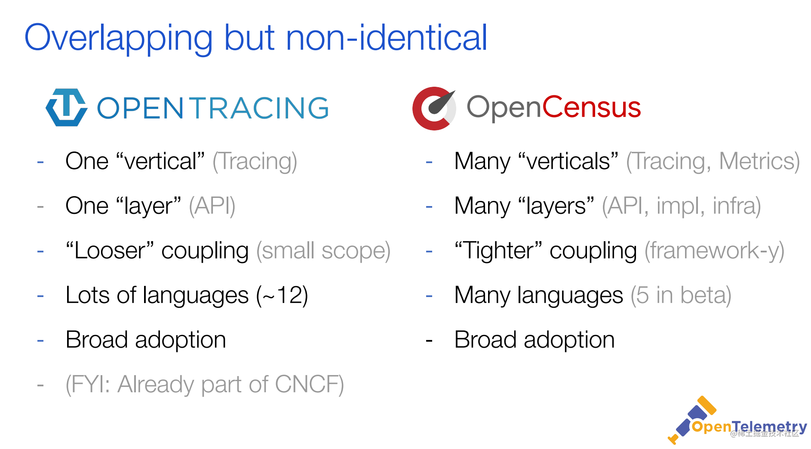

# 链路追踪(Distributed Tracing)
是一种用于分析和监控应用程序的方法，尤其是使用微服务架构构建的应用程序。分布式跟踪有助于精确定位故障发生的位置以及导致性能差的原因.

目前在Tracing技术这块比较有影响力的是两大开源技术框架：Netflix公司开源的OpenTracing和Google开源的OpenCensus.

两大框架都拥有比较高的开发者群体。为形成统一的技术标准，两大框架最终磨合成立了OpenTelemetry项目，简称otel.

## 常用的链路追踪系统
* SkyWalking：本土开源的基于字节码注入的调用链分析，以及应用监控分析工具。特点是支持多种插件，UI功能较强，接入端无代码侵入
* 阿里 鹰眼
* 大众点评 CAT:大众点评开源的基于编码和配置的调用链分析，应用监控分析，日志采集，监控报警等一系列的监控平台工具
* Twitter Zipkin：目前基于springcloud sleuth得到了广泛的使用，特点是轻量，使用部署简单
* Naver pinpoint：韩国人开源的基于字节码注入的调用链分析，以及应用监控分析工具。特点是支持多种插件，UI功能强大，接入端无代码侵入
* Uber Jaeger

## 链路监控组件要求
- 探针的性能消耗

  APM组件服务的影响应该做到足够小。在一些高度优化过的服务，即使一点点损耗也会很容易察觉到，而且有可能迫使在线服务的部署团队不得不将跟踪系统关停。

- 代码的侵入性

  对于应用的程序员来说，是不需要知道有跟踪系统这回事的。如果一个跟踪系统想生效，就必须需要依赖应用的开发者主动配合，那么这个跟踪系统也太脆弱了，往往由于跟踪系统在应用中植入代码的bug或疏忽导致应用出问题，这样才是无法满足对跟踪系统“无所不在的部署”这个需求。

- 可扩展性

  能够支持的组件越多当然越好。或者提供便捷的插件开发API，对于一些没有监控到的组件，应用开发者也可以自行扩展。

- 数据的分析

  数据的分析要快 ，分析的维度尽可能多。跟踪系统能提供足够快的信息反馈，就可以对生产环境下的异常状况做出快速反应。分析的全面，能够避免二次开发

## 基础概念

### Tracer
Tracer表示一次完整的追踪链路，用来创建Span，以及处理如何处理Inject(serialize) 和 Extract (deserialize),tracer由一个或多个span组成。
下图示例表示了一个由8个span组成的tracer:
```css
        [Span A]  ←←←(the root span)
            |
     +------+------+
     |             |
 [Span B]      [Span C] ←←←(Span C is a `ChildOf` Span A)
     |             |
 [Span D]      +---+-------+
               |           |
           [Span E]    [Span F] >>> [Span G] >>> [Span H]
                                       ↑
                                       ↑
                                       ↑
                         (Span G `FollowsFrom` Span F)
```
时间轴的展现方式
```css
––|–––––––|–––––––|–––––––|–––––––|–––––––|–––––––|–––––––|–> time
 [Span A···················································]
   [Span B··············································]
      [Span D··········································]
    [Span C········································]
         [Span E·······]        [Span F··] [Span G··] [Span H··]
```
代码方式
```go
otel.Tracer(tracerName)
```

### Span   
Span是一条追踪链路中的基本组成要素，一个span表示一个独立的工作单元，比如可以表示一次函数调用，一次http请求等等。span会记录如下基本要素:
- 服务名称（operation name）
- 服务的开始时间和结束时间
- K/V形式的Tags
- K/V形式的Logs
- SpanContext

代码方式
```go
otel.Tracer(tracerName).Start(ctx, spanName, opts ...)
```

### Attributes
Attributes以K/V键值对的形式保存用户自定义标签，主要用于链路追踪结果的查询过滤。例如： http.method="GET",http.status_code=200。
其中key值必须为字符串，value必须是字符串，布尔型或者数值型。 span中的Attributes仅自己可见，不会随着 SpanContext传递给后续span。

设置Attributes方式例如
```go
span.SetAttributes(
    label.String("http.remote", conn.RemoteAddr().String()),
    label.String("http.local", conn.LocalAddr().String()),
)
```

### events

Events与Attributes类似，也是K/V键值对形式。与Attributes不同的是，Events还会记录写入Events的时间，因此Events主要用于记录某些事件发生的时间。
Events的key值同样必须为字符串，但对value类型则没有限制

```go
span.AddEvent("http.request", trace.WithAttributes(
    label.Any("http.request.header", headers),
    label.Any("http.request.baggage", gtrace.GetBaggageMap(ctx)),
    label.String("http.request.body", bodyContent),
))
```
### Annotation: 注解,用来记录请求特定事件相关信息(例如时间)
通常包含四个注解信息：   
(1) cs：Client Start,表示客户端发起请求

(2) sr：Server Receive,表示服务端收到请求

(3) ss：Server Send,表示服务端完成处理，并将结果发送给客户端

(4) cr：Client Received,表示客户端获取到服务端返回信息


### SpanContext
SpanContext携带着一些用于跨服务通信的（跨进程）数据，主要包含：

- 足够在系统中标识该span的信息，比如：span_id, trace_id。
- Baggage - 为整条追踪连保存跨服务（跨进程）的K/V格式的用户自定义数据。Baggage 与 Attributes 类似，也是 K/V 键值对。与 Attributes 不同的是：
  - key跟value都只能是字符串格式
  - Baggage不仅当前span可见，其会随着SpanContext传递给后续所有的子span。要小心谨慎的使用Baggage - 因为在所有的span中传递这些K,V会带来不小的网络和CPU开销。

### Propagator

Propagator传播器用于端对端的数据编码/解码，例如：Client到Server端的数据传输，TraceId、SpanId和Baggage也是需要通过传播器来管理数据传输。
业务端开发者往往对Propagator无感知，只有中间件/拦截器的开发者需要知道它的作用。

OpenTelemetry的标准协议实现库提供了常用的TextMapPropagator，用于常见的文本数据端到端传输。
此外，为保证TextMapPropagator中的传输数据兼容性，不应当带有特殊字符


### OpenTelemetry Baggage
OpenTelemetry Baggage 是一个简单但通用的键值系统。一旦数据被添加为 Baggage，它就可以被所有下游服务访问。
这允许有用的信息，如账户和项目 ID，在事务的后期变得可用，而不需要从数据库中重新获取它们。

例如，一个使用项目 ID 作为索引的前端服务可以将其作为 Baggage 添加，允许后端服务也通过项目 ID 对其跨度和指标进行索引。
这信息添加到了http header中，进行上下文传递，因此每增加一个项目都必须被编码为一个头，每增加一个项目都会增加事务中每一个后续网络请求的大小，因此不建议在将大量的非重要的信息添加到Baggage中。


## 分类
开源领域主要分为两派   


1. 一派是以 CNCF技术委员 会为主的 OpenTracing 的规范，例如 jaeger zipkin 都是遵循了OpenTracing 的规范。
2. 而另一派则是谷歌作为发起者的 OpenCensus，而且谷歌本身还是最早提出链路追踪概念的公司，后期连微软也加入了 OpenCensus.


## 参考链接
1. https://www.bookstack.cn/read/goframe-1.16-zh/549208391059b05d.md