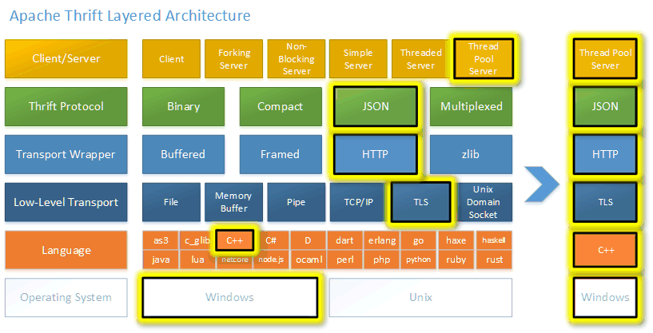

<!-- START doctoc generated TOC please keep comment here to allow auto update -->
<!-- DON'T EDIT THIS SECTION, INSTEAD RE-RUN doctoc TO UPDATE -->
**Table of Contents**  *generated with [DocToc](https://github.com/thlorenz/doctoc)*

- [thrift](#thrift)
  - [架构](#%E6%9E%B6%E6%9E%84)
    - [Transport(传输层)](#transport%E4%BC%A0%E8%BE%93%E5%B1%82)
    - [Protocol(协议层)](#protocol%E5%8D%8F%E8%AE%AE%E5%B1%82)
    - [Processor(处理层)](#processor%E5%A4%84%E7%90%86%E5%B1%82)
    - [Server(服务层)](#server%E6%9C%8D%E5%8A%A1%E5%B1%82)
  - [go 使用案例](#go-%E4%BD%BF%E7%94%A8%E6%A1%88%E4%BE%8B)
  - [IDL (Interface Description Language)](#idl-interface-description-language)
  - [参考](#%E5%8F%82%E8%80%83)

<!-- END doctoc generated TOC please keep comment here to allow auto update -->

# thrift


## 架构


https://thrift.apache.org/docs/concepts.html
```css
  +-------------------------------------------+
  | Server                                    |
  | (single-threaded, event-driven etc)       |
  +-------------------------------------------+
  | Processor                                 |
  | (compiler generated)                      |
  +-------------------------------------------+
  | Protocol                                  |
  | (JSON, compact etc)                       |
  +-------------------------------------------+
  | Transport                                 |
  | (raw TCP, HTTP etc)                       |
  +-------------------------------------------+
```
thrift架构由4部分构成：Server、Processor、Protocol、Transport.


### Transport(传输层)
传输层为从网络读取、写入网络提供了一个简单的抽象， 这使得Thrift能够将底层传输与其他部分如序列化等解耦


### Protocol(协议层)
协议层主要抽象了将内存数据结构映射到传输格式的机制， 它指定了数据类型如何用底层传输来编码、解码自己。因此，协议层负责实现控制编码方案和（反）序列化。Protocol层一般支持：JSON、XML、纯文本、Compact Binary等等。


### Processor(处理层)
负责从输入流读取数据和写入输出流的能力， 输入和输出流由协议对象表示， 处理器接口非常简单

```go
// github.com/apache/thrift@v0.22.0/lib/go/thrift/processor_factory.go
type TProcessorFunction interface {
	Process(ctx context.Context, seqId int32, in, out TProtocol) (bool, TException)
}
```

### Server(服务层)
服务层汇集了以上功能:

- 创建一个Transport
- 为Transport创建输入输出协议Protocol
- 基于输入输出Protocol创建Processor
- 等待传入的连接并将它交给Processor处理


## go 使用案例

https://thrift.apache.org/tutorial/go.html


## IDL (Interface Description Language)


namespace
每个thrift文件都在自己的命名空间中，多个thrift文件可以用同一个命名空间作为标识，并指定要使用的语言的generator。


## 参考

- https://thrift.apache.org/docs/
- [thrift-入门介绍](https://juejin.cn/post/7092383627853430815)