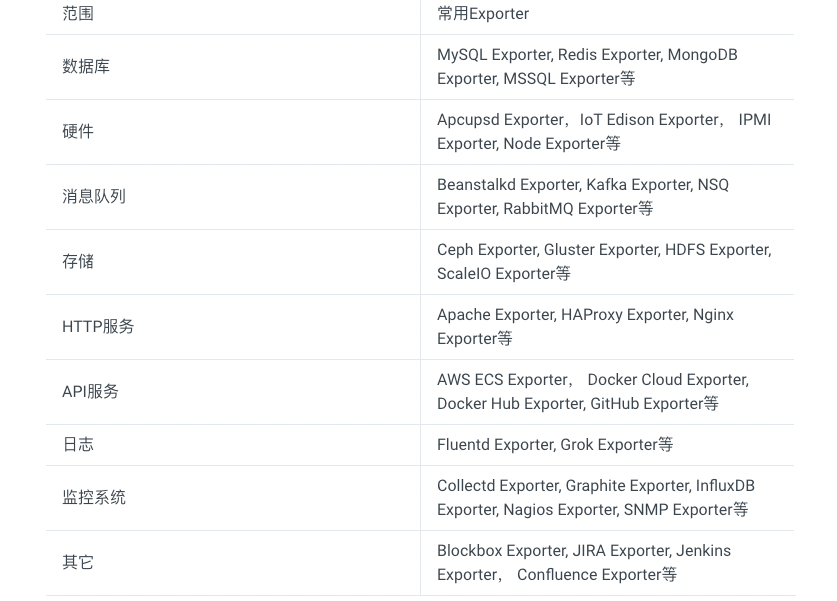

<!-- START doctoc generated TOC please keep comment here to allow auto update -->
<!-- DON'T EDIT THIS SECTION, INSTEAD RE-RUN doctoc TO UPDATE -->
**Table of Contents**  *generated with [DocToc](https://github.com/thlorenz/doctoc)*

- [exporter](#exporter)
  - [来源](#%E6%9D%A5%E6%BA%90)
  - [Registry 结构体](#registry-%E7%BB%93%E6%9E%84%E4%BD%93)
  - [注册指标](#%E6%B3%A8%E5%86%8C%E6%8C%87%E6%A0%87)
  - [参考](#%E5%8F%82%E8%80%83)

<!-- END doctoc generated TOC please keep comment here to allow auto update -->

# exporter


广义上讲所有可以向Prometheus提供监控样本数据的程序都可以被称为一个Exporter。
而Exporter的一个实例称为target，如下所示，Prometheus通过轮询的方式定期从这些target中获取样本数据:


## 来源
从Exporter的来源上来讲，主要分为两类：

- 社区提供的
  Prometheus社区提供了丰富的Exporter实现，涵盖了从基础设施，中间件以及网络等各个方面的监控功能。
  这些Exporter可以实现大部分通用的监控需求。下表列举一些社区中常用的Exporter：

  
- 用户自定义的

除了直接使用社区提供的Exporter程序以外，用户还可以基于Prometheus提供的Client Library创建自己的Exporter程序，
目前Prometheus社区官方提供了对以下编程语言的支持：Go、Java/Scala、Python、Ruby。
同时还有第三方实现的如：Bash、C++、Common Lisp、Erlang,、Haskeel、Lua、Node.js、PHP、Rust等。


Exporter返回的样本数据，主要由三个部分组成：样本的一般注释信息（HELP），样本的类型注释信息（TYPE）和样本。Prometheus会对Exporter响应的内容逐行解析
```yaml
# HELP <metrics_name> <doc_string>
# TYPE <metrics_name> <metrics_type>
metric_name [
  "{" label_name "=" `"` label_value `"` { "," label_name "=" `"` label_value `"` } [ "," ] "}"
] value [ timestamp ]
```

以下是类型为histogram和summary的样本输出示例：
```yaml
# A histogram, which has a pretty complex representation in the text format:
# HELP http_request_duration_seconds A histogram of the request duration.
# TYPE http_request_duration_seconds histogram
http_request_duration_seconds_bucket{le="0.05"} 24054
http_request_duration_seconds_bucket{le="0.1"} 33444
http_request_duration_seconds_bucket{le="0.2"} 100392
http_request_duration_seconds_bucket{le="+Inf"} 144320
http_request_duration_seconds_sum 53423
http_request_duration_seconds_count 144320

# Finally a summary, which has a complex representation, too:
# HELP rpc_duration_seconds A summary of the RPC duration in seconds.
# TYPE rpc_duration_seconds summary
rpc_duration_seconds{quantile="0.01"} 3102
rpc_duration_seconds{quantile="0.05"} 3272
rpc_duration_seconds{quantile="0.5"} 4773
rpc_duration_seconds_sum 1.7560473e+07
rpc_duration_seconds_count 2693
```


## Registry 结构体
```go
type Registry struct {
	mtx                   sync.RWMutex
	collectorsByID        map[uint64]Collector // ID is a hash of the descIDs.
	descIDs               map[uint64]struct{}
	dimHashesByName       map[string]uint64
	uncheckedCollectors   []Collector
	pedanticChecksEnabled bool
}
```

初始化指标,这里 以 Counter 为例

```go
func NewCounter(opts CounterOpts) Counter {
	desc := NewDesc(
		BuildFQName(opts.Namespace, opts.Subsystem, opts.Name),
		opts.Help,
		nil,
		opts.ConstLabels,
	)
	result := &counter{desc: desc, labelPairs: desc.constLabelPairs, now: time.Now}
	result.init(result) // Init self-collection.
	return result
}

```


## 注册指标


```go
func MustRegister(cs ...Collector) {
	// 使用默认的DefaultRegisterer
	DefaultRegisterer.MustRegister(cs...)
}

```

```go
// github.com/prometheus/client_golang@v1.11.0/prometheus/registry.go
var (
	defaultRegistry              = NewRegistry()
	// DefaultRegisterer, DefaultGatherer 指向相同的 Registry
	DefaultRegisterer Registerer = defaultRegistry
	DefaultGatherer   Gatherer   = defaultRegistry
)
```

```go
func (r *Registry) MustRegister(cs ...Collector) {
	for _, c := range cs {
		if err := r.Register(c); err != nil {
			panic(err)
		}
	}
}

func (r *Registry) Register(c Collector) error {
	var (
		descChan           = make(chan *Desc, capDescChan)
		newDescIDs         = map[uint64]struct{}{}
		newDimHashesByName = map[string]uint64{}
		collectorID        uint64 // All desc IDs XOR'd together.
		duplicateDescErr   error
	)
	go func() {
		c.Describe(descChan)
		close(descChan)
	}()
	r.mtx.Lock()
	defer func() {
		// Drain channel in case of premature return to not leak a goroutine.
		for range descChan {
		}
		r.mtx.Unlock()
	}()
	// Conduct various tests...
	for desc := range descChan {

		// Is the descriptor valid at all?
		if desc.err != nil {
			return fmt.Errorf("descriptor %s is invalid: %s", desc, desc.err)
		}

		// Is the descID unique?
		// (In other words: Is the fqName + constLabel combination unique?)
		if _, exists := r.descIDs[desc.id]; exists {
			duplicateDescErr = fmt.Errorf("descriptor %s already exists with the same fully-qualified name and const label values", desc)
		}
		// If it is not a duplicate desc in this collector, XOR it to
		// the collectorID.  (We allow duplicate descs within the same
		// collector, but their existence must be a no-op.)
		if _, exists := newDescIDs[desc.id]; !exists {
			newDescIDs[desc.id] = struct{}{}
			collectorID ^= desc.id
		}

		// Are all the label names and the help string consistent with
		// previous descriptors of the same name?
		// First check existing descriptors...
		if dimHash, exists := r.dimHashesByName[desc.fqName]; exists {
			if dimHash != desc.dimHash {
				return fmt.Errorf("a previously registered descriptor with the same fully-qualified name as %s has different label names or a different help string", desc)
			}
		} else {
			// ...then check the new descriptors already seen.
			if dimHash, exists := newDimHashesByName[desc.fqName]; exists {
				if dimHash != desc.dimHash {
					return fmt.Errorf("descriptors reported by collector have inconsistent label names or help strings for the same fully-qualified name, offender is %s", desc)
				}
			} else {
				newDimHashesByName[desc.fqName] = desc.dimHash
			}
		}
	}
	// A Collector yielding no Desc at all is considered unchecked.
	if len(newDescIDs) == 0 {
		r.uncheckedCollectors = append(r.uncheckedCollectors, c)
		return nil
	}
	if existing, exists := r.collectorsByID[collectorID]; exists {
		switch e := existing.(type) {
		case *wrappingCollector:
			return AlreadyRegisteredError{
				ExistingCollector: e.unwrapRecursively(),
				NewCollector:      c,
			}
		default:
			return AlreadyRegisteredError{
				ExistingCollector: e,
				NewCollector:      c,
			}
		}
	}
	// If the collectorID is new, but at least one of the descs existed
	// before, we are in trouble.
	if duplicateDescErr != nil {
		return duplicateDescErr
	}

	// Only after all tests have passed, actually register.
	r.collectorsByID[collectorID] = c
	for hash := range newDescIDs {
		r.descIDs[hash] = struct{}{}
	}
	for name, dimHash := range newDimHashesByName {
		r.dimHashesByName[name] = dimHash
	}
	return nil
}
```


## 参考

