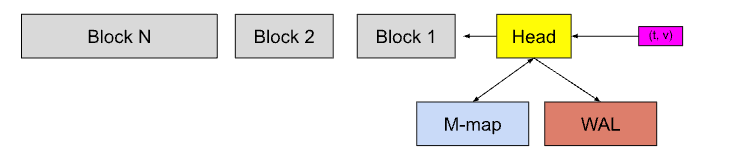
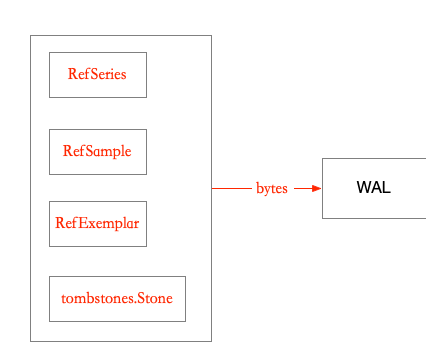
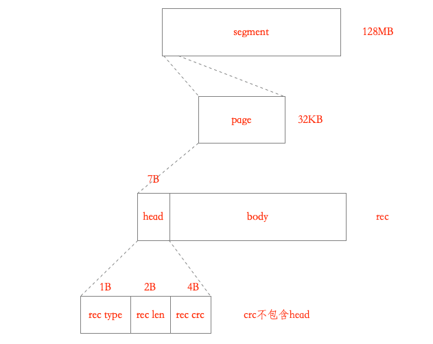
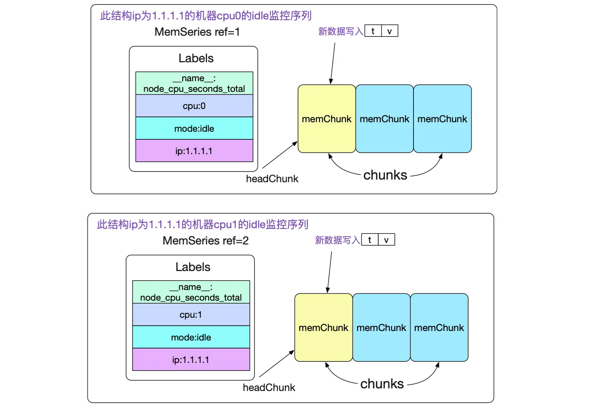
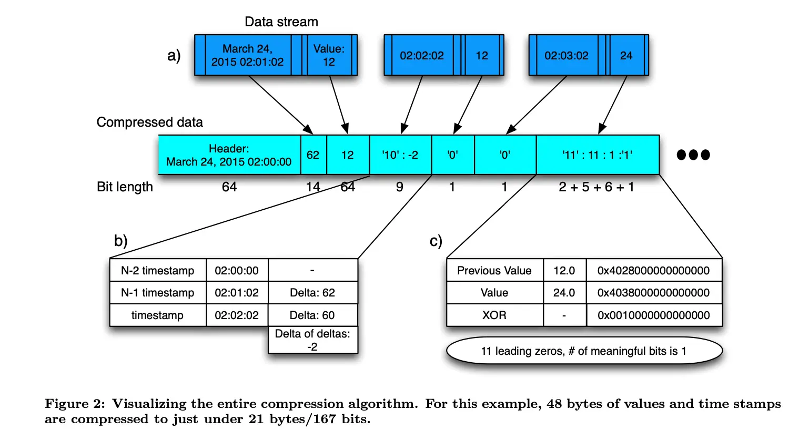
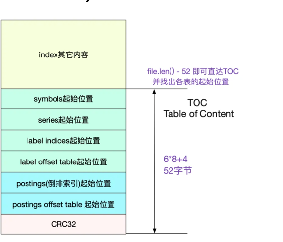
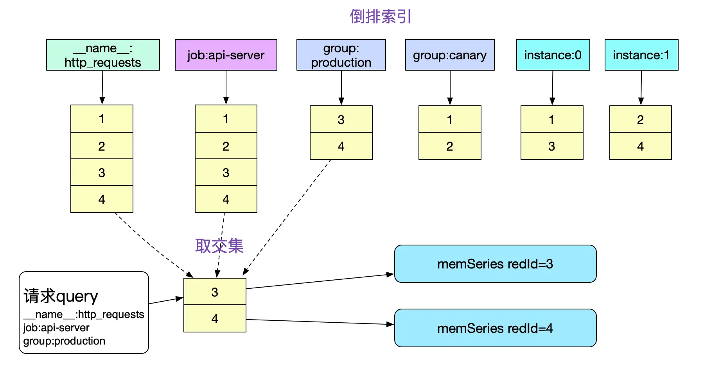
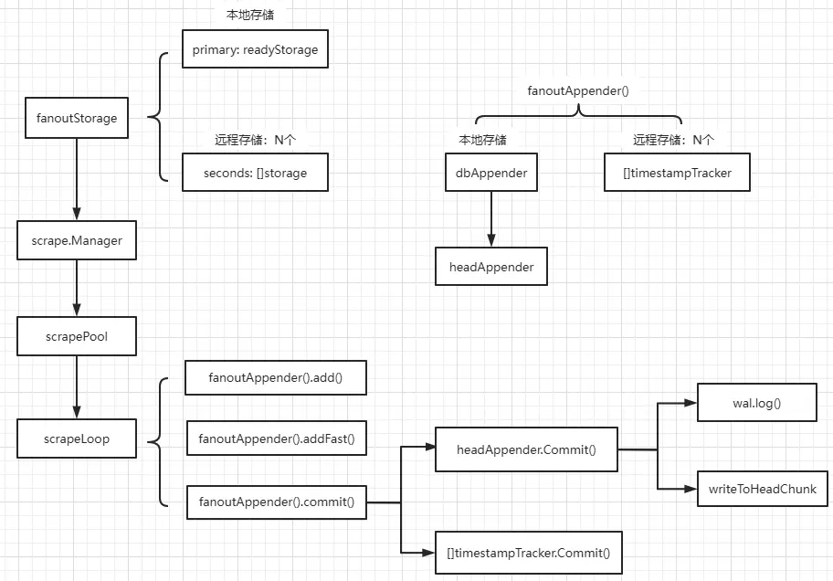

<!-- START doctoc generated TOC please keep comment here to allow auto update -->
<!-- DON'T EDIT THIS SECTION, INSTEAD RE-RUN doctoc TO UPDATE -->
**Table of Contents**  *generated with [DocToc](https://github.com/thlorenz/doctoc)*

- [Prometheus 性能调优](#prometheus-%E6%80%A7%E8%83%BD%E8%B0%83%E4%BC%98)
  - [基本概念](#%E5%9F%BA%E6%9C%AC%E6%A6%82%E5%BF%B5)
  - [数据存储形式](#%E6%95%B0%E6%8D%AE%E5%AD%98%E5%82%A8%E5%BD%A2%E5%BC%8F)
    - [写入 WAL 的数据类型](#%E5%86%99%E5%85%A5-wal-%E7%9A%84%E6%95%B0%E6%8D%AE%E7%B1%BB%E5%9E%8B)
      - [series records: 包含唯一id和标签值(label && value)列表。](#series-records-%E5%8C%85%E5%90%AB%E5%94%AF%E4%B8%80id%E5%92%8C%E6%A0%87%E7%AD%BE%E5%80%BClabel--value%E5%88%97%E8%A1%A8)
      - [Samples records : 包含三元组(series_id, timestamp, value)](#samples-records--%E5%8C%85%E5%90%AB%E4%B8%89%E5%85%83%E7%BB%84series_id-timestamp-value)
    - [在内存中的组织](#%E5%9C%A8%E5%86%85%E5%AD%98%E4%B8%AD%E7%9A%84%E7%BB%84%E7%BB%87)
    - [在磁盘中的组织](#%E5%9C%A8%E7%A3%81%E7%9B%98%E4%B8%AD%E7%9A%84%E7%BB%84%E7%BB%87)
  - [索引](#%E7%B4%A2%E5%BC%95)
  - [写入过程](#%E5%86%99%E5%85%A5%E8%BF%87%E7%A8%8B)
  - [查询过程](#%E6%9F%A5%E8%AF%A2%E8%BF%87%E7%A8%8B)
  - [高基数问题 Cardinality](#%E9%AB%98%E5%9F%BA%E6%95%B0%E9%97%AE%E9%A2%98-cardinality)
  - [参考](#%E5%8F%82%E8%80%83)

<!-- END doctoc generated TOC please keep comment here to allow auto update -->

# Prometheus 性能调优

源码基于版本 v2.36.1



## 基本概念


segment 片段: 每一个WAL文件
```shell
/prometheus/wal $ tree
.
├── 00000004
├── 00000005
├── 00000006
├── 00000007
└── checkpoint.00000003
    └── 00000000
```

我们必须定期删除过期的WAL片段，否则，磁盘会被这些过期片段填满，TSDB的启动会耗费大量时间，因为tsdb重启时会加载这个WAL中的所有操作事件（加载过程中，大部分数据会因为是过期数据而被丢弃，浪费资源和时间）。

Checkpointing 检查点: 检查点被命名为checkpoint.X，其中X是创建检查点的最后一个段号.


block: Prometheus 的数据库被划分为基本的存储单元， 最近的Block一般是存储了2小时的数据，而较为久远的Block则会通过compactor进行合并，一个Block可能存储了若干小时的信息。


tombstones : 由于Prometheus Block的数据一般在写完后就不会变动。
如果要删除部分数据，就只能记录一下删除数据的范围，由下一次compactor组成新block的时候删除。而记录这些信息的文件即是 tomstones.


- Metric names 指标名称
- labels 指标标签，与指标名称一同构成唯一标识项
- Samples 一个时间点的 Metric names，labels，样本值(value)，
- Series 由很多相关的samples组成的时间序列

## 数据存储形式

### 写入 WAL 的数据类型
https://github.com/prometheus/prometheus/blob/v3.3.0/tsdb/docs/format/wal.md



基本类型 4 种, 包括时序 Series的标签值(label && value), 样本 sample样本(timestamp && value), Exemplar(外部引用相关), tombstones.Stone(TSDB 的删除机制相关)
四种类型
```go
type Type uint8

const (
	// Unknown is returned for unrecognised WAL record types.
	Unknown Type = 255
	// Series is used to match WAL records of type Series.
	Series Type = 1
	// Samples is used to match WAL records of type Samples.
	Samples Type = 2
	// Tombstones is used to match WAL records of type Tombstones.
	Tombstones Type = 3
	// Exemplars is used to match WAL records of type Exemplars.
	Exemplars Type = 4
)
```




数据所在文件(segment), 默认大小 128MB, 超过限制切割文件继续.

数据按照 record(head+body)写入 page(32KB)

page 为单位持久化到 segment 中

record 支持 CRC 校验

record 可能独占 page

record 可能跨 page

records 可能共存在一个 page 中, 比如 record-a 的尾和 record-b 的头, 提高利用率.

record 支持压缩, 但是否压缩看数据, 会做尝试, 避免出现压缩后反而大的情况.

record 的 head 中标记压缩与否.


写入 wal

```go
// https://github.com/prometheus/prometheus/blob/af0f6da5cb5bb9736abcfc9e8c7633ee01000ce2/tsdb/head_append.go
func (a *headAppender) log() error {
	if a.head.wal == nil {
		return nil
	}

	buf := a.head.getBytesBuffer()
	defer func() { a.head.putBytesBuffer(buf) }()

	var rec []byte
	var enc record.Encoder

	// series 处理
	if len(a.series) > 0 {
		rec = enc.Series(a.series, buf)
		buf = rec[:0]

		if err := a.head.wal.Log(rec); err != nil {
			return errors.Wrap(err, "log series")
		}
	}
	// samples 处理
	if len(a.samples) > 0 {
		rec = enc.Samples(a.samples, buf)
		buf = rec[:0]

		if err := a.head.wal.Log(rec); err != nil {
			return errors.Wrap(err, "log samples")
		}
	}
	// exemplars 处理
	if len(a.exemplars) > 0 {
		rec = enc.Exemplars(exemplarsForEncoding(a.exemplars), buf)
		buf = rec[:0]

		if err := a.head.wal.Log(rec); err != nil {
			return errors.Wrap(err, "log exemplars")
		}
	}
	return nil
}

```


#### series records: 包含唯一id和标签值(label && value)列表。

```css
Series records
┌────────────────────────────────────────────┐
│ type = 1 <1b>                              │
├────────────────────────────────────────────┤
│ ┌─────────┬──────────────────────────────┐ │
│ │ id <8b> │ n = len(labels) <uvarint>    │ │
│ ├─────────┴────────────┬─────────────────┤ │
│ │ len(str_1) <uvarint> │ str_1 <bytes>   │ │
│ ├──────────────────────┴─────────────────┤ │
│ │  ...                                   │ │
│ ├───────────────────────┬────────────────┤ │
│ │ len(str_2n) <uvarint> │ str_2n <bytes> │ │
│ └───────────────────────┴────────────────┘ │
│                  . . .                     │
└────────────────────────────────────────────┘

```

```go
// 写入 series 类型
func (e *Encoder) Series(series []RefSeries, b []byte) []byte {
	buf := encoding.Encbuf{B: b}
	buf.PutByte(byte(Series))

	for _, s := range series {
		buf.PutBE64(uint64(s.Ref))
		buf.PutUvarint(len(s.Labels))

		for _, l := range s.Labels {
			buf.PutUvarintStr(l.Name)
			buf.PutUvarintStr(l.Value)
		}
	}
	return buf.Get()
}
```

#### Samples records : 包含三元组(series_id, timestamp, value)
```css
┌──────────────────────────────────────────────────────────────────┐
│ type = 2 <1b>                                                    │
├──────────────────────────────────────────────────────────────────┤
│ ┌────────────────────┬───────────────────────────┐               │
│ │ id <8b>            │ timestamp <8b>            │               │
│ └────────────────────┴───────────────────────────┘               │
│ ┌────────────────────┬───────────────────────────┬─────────────┐ │
│ │ id_delta <uvarint> │ timestamp_delta <uvarint> │ value <8b>  │ │
│ └────────────────────┴───────────────────────────┴─────────────┘ │
│                              . . .                               │
└──────────────────────────────────────────────────────────────────┘

```
```go
func (e *Encoder) Samples(samples []RefSample, b []byte) []byte {
	buf := encoding.Encbuf{B: b}
	buf.PutByte(byte(Samples))

	if len(samples) == 0 {
		return buf.Get()
	}

	// Store base timestamp and base reference number of first sample.
	// All samples encode their timestamp and ref as delta to those.
	first := samples[0]

	buf.PutBE64(uint64(first.Ref))
	buf.PutBE64int64(first.T)

	for _, s := range samples {
		buf.PutVarint64(int64(s.Ref) - int64(first.Ref))
		buf.PutVarint64(s.T - first.T)
		buf.PutBE64(math.Float64bits(s.V))
	}
	return buf.Get()
}
```

### 在内存中的组织

```go
// https://github.com/prometheus/prometheus/blob/4cc25c0cb0b96042a7d36a0dd53dc6970ad607fd/tsdb/head.go

// memSeries is the in-memory representation of a series. None of its methods
// are goroutine safe and it is the caller's responsibility to lock it.
type memSeries struct {
	sync.RWMutex

	ref  chunks.HeadSeriesRef // 其id
	lset labels.Labels // 对应的标签集合

	// Immutable chunks on disk that have not yet gone into a block, in order of ascending time stamps.
	// When compaction runs, chunks get moved into a block and all pointers are shifted like so:
	//
	//                                    /------- let's say these 2 chunks get stored into a block
	//                                    |  |
	// before compaction: mmappedChunks=[p5,p6,p7,p8,p9] firstChunkID=5
	//  after compaction: mmappedChunks=[p7,p8,p9]       firstChunkID=7
	//
	// pN is the pointer to the mmappedChunk referered to by HeadChunkID=N
	mmappedChunks []*mmappedChunk

	mmMaxTime    int64     // Max time of any mmapped chunk, only used during WAL replay.
	headChunk    *memChunk // Most recent chunk in memory that's still being built.
	chunkRange   int64
	firstChunkID chunks.HeadChunkID // HeadChunkID for mmappedChunks[0]

	nextAt int64 // Timestamp at which to cut the next chunk.

	// We keep the last 4 samples here (in addition to appending them to the chunk) so we don't need coordination between appender and querier.
	// Even the most compact encoding of a sample takes 2 bits, so the last byte is not contended.
	sampleBuf [4]sample

	pendingCommit bool // Whether there are samples waiting to be committed to this series.

	// Current appender for the head chunk. Set when a new head chunk is cut.
	// It is nil only if headChunk is nil. E.g. if there was an appender that created a new series, but rolled back the commit
	// (the first sample would create a headChunk, hence appender, but rollback skipped it while the Append() call would create a series).
	app chunkenc.Appender

	memChunkPool *sync.Pool

	// txs is nil if isolation is disabled.
	txs *txRing
}

```

mmappedChunks 设计: 由于chunks文件大小基本固定(最大512M),所以我们很容易的可以通过mmap去访问对应的数据。直接将对应文件的读操作交给操作系统，既省心又省力.

通过一堆标签快速找到对应的 memSeries。
```go
// 寻址 memSeries
type stripeSeries struct {
	size                    int
	series                  []map[chunks.HeadSeriesRef]*memSeries // 记录refId到memSeries的映射
	hashes                  []seriesHashmap                       //  记录hash值到memSeries,hash冲突采用拉链法
	locks                   []stripeLock                          // 分段锁
	seriesLifecycleCallback SeriesLifecycleCallback
}

```

写入 

```go
func (s *memSeries) append(t int64, v float64, appendID uint64, chunkDiskMapper *chunks.ChunkDiskMapper) (sampleInOrder, chunkCreated bool) {
	// Based on Gorilla white papers this offers near-optimal compression ratio
	// so anything bigger that this has diminishing returns and increases
	// the time range within which we have to decompress all samples.
	const samplesPerChunk = 120

	// 获取 headChunk
	c := s.head()

	if c == nil {
		if len(s.mmappedChunks) > 0 && s.mmappedChunks[len(s.mmappedChunks)-1].maxTime >= t {
			// Out of order sample. Sample timestamp is already in the mmapped chunks, so ignore it.
			return false, false
		}
		// 默认 2 小时的 chunkRange
		// There is no chunk in this series yet, create the first chunk for the sample.
		c = s.cutNewHeadChunk(t, chunkDiskMapper)
		chunkCreated = true
	}

	// Out of order sample.
	if c.maxTime >= t {
		return false, chunkCreated
	}

	numSamples := c.chunk.NumSamples()
	if numSamples == 0 { // 代表新的chunk 
		// It could be the new chunk created after reading the chunk snapshot,
		// hence we fix the minTime of the chunk here.
		c.minTime = t
		s.nextAt = rangeForTimestamp(c.minTime, s.chunkRange)
	}

	// If we reach 25% of a chunk's desired sample count, predict an end time
	// for this chunk that will try to make samples equally distributed within
	// the remaining chunks in the current chunk range.
	// At latest it must happen at the timestamp set when the chunk was cut.
	if numSamples == samplesPerChunk/4 {
		s.nextAt = computeChunkEndTime(c.minTime, c.maxTime, s.nextAt)
	}
	// If numSamples > samplesPerChunk*2 then our previous prediction was invalid,
	// most likely because samples rate has changed and now they are arriving more frequently.
	// Since we assume that the rate is higher, we're being conservative and cutting at 2*samplesPerChunk
	// as we expect more chunks to come.
	// Note that next chunk will have its nextAt recalculated for the new rate.
	if t >= s.nextAt || numSamples >= samplesPerChunk*2 {
		c = s.cutNewHeadChunk(t, chunkDiskMapper)
		chunkCreated = true
	}
	s.app.Append(t, v)

	c.maxTime = t

	s.sampleBuf[0] = s.sampleBuf[1]
	s.sampleBuf[1] = s.sampleBuf[2]
	s.sampleBuf[2] = s.sampleBuf[3]
	s.sampleBuf[3] = sample{t: t, v: v}

	if appendID > 0 && s.txs != nil {
		s.txs.add(appendID)
	}

	return true, chunkCreated
}

```


数据点的存储


memChunk 在内存中保存的正是采用 XOR 算法压缩过的数据。
```go
func (a *xorAppender) Append(t int64, v float64) {
	var tDelta uint64
	num := binary.BigEndian.Uint16(a.b.bytes())

	if num == 0 {
		buf := make([]byte, binary.MaxVarintLen64)
		for _, b := range buf[:binary.PutVarint(buf, t)] {
			a.b.writeByte(b)
		}
		a.b.writeBits(math.Float64bits(v), 64)

	} else if num == 1 {
		tDelta = uint64(t - a.t)

		buf := make([]byte, binary.MaxVarintLen64)
		for _, b := range buf[:binary.PutUvarint(buf, tDelta)] {
			a.b.writeByte(b)
		}

		a.writeVDelta(v)

	} else {
		tDelta = uint64(t - a.t)
		dod := int64(tDelta - a.tDelta)

		// Gorilla has a max resolution of seconds, Prometheus milliseconds.
		// Thus we use higher value range steps with larger bit size.
		switch {
		case dod == 0:
			a.b.writeBit(zero)
		case bitRange(dod, 14):
			a.b.writeBits(0b10, 2)
			a.b.writeBits(uint64(dod), 14)
		case bitRange(dod, 17):
			a.b.writeBits(0b110, 3)
			a.b.writeBits(uint64(dod), 17)
		case bitRange(dod, 20):
			a.b.writeBits(0b1110, 4)
			a.b.writeBits(uint64(dod), 20)
		default:
			a.b.writeBits(0b1111, 4)
			a.b.writeBits(uint64(dod), 64)
		}

		a.writeVDelta(v)
	}

	a.t = t
	a.v = v
	binary.BigEndian.PutUint16(a.b.bytes(), num+1)
	a.tDelta = tDelta
}
```

使用了 XOR 算法后，平均每个数据点能从 16bytes 压缩到 1.37bytes，也就是说所用空间直接降为原来的 1/12


### 在磁盘中的组织
```shell
prometheus-data
    |-01EY0EH5JA3ABCB0PXHAPP999D (block)
    |-01EY0EH5JA3QCQB0PXHAPP999D (block)
        |-chunks
            |-000001
            |-000002
            .....
            |-000021
        |-index
        |-meta.json
        |-tombstones
    |-wal
    |-chunks_head
```


## 索引

https://github.com/prometheus/prometheus/blob/v3.3.0/tsdb/docs/format/index.md



假设你在监控两个服务器的 CPU 使用率，并且你有如下数据：
```css
cpu_usage{instance="server1", core="0"} 30  1594971600
cpu_usage{instance="server1", core="1"} 35  1594971600
cpu_usage{instance="server2", core="0"} 25  1594971600
cpu_usage{instance="server2", core="1"} 28  1594971600
```


索引磁盘格式由以下几个主要部分组成：

- 元数据（Meta Information）
```css
{
  "blockID": "01DZXD1KHH63N1TB3WJYZQG8G1",
  "startTime": 1594971600,
  "endTime": 1594971660,
  "compression": "snappy"
}

```
- 符号表（Symbols Table）
```css
0: "cpu_usage"
1: "instance"
2: "server1"
3: "server2"
4: "core"
5: "0"
6: "1"

```
- 标签值索引（Label Value Index）
```css
"instance" -> ["server1": 2, "server2": 3]
"core" -> ["0": 5, "1": 6]

```
- 时间序列索引（Series Index）:用seriesId查询series，这是前向索引，查询时间复杂度=O(1);
```css
series 1: {metric: "cpu_usage", labels: {"instance": "server1", "core": "0"}, chunks: [(1594971600, offset1)]}
series 2: {metric: "cpu_usage", labels: {"instance": "server1", "core": "1"}, chunks: [(1594971600, offset2)]}
series 3: {metric: "cpu_usage", labels: {"instance": "server2", "core": "0"}, chunks: [(1594971600, offset3)]}
series 4: {metric: "cpu_usage", labels: {"instance": "server2", "core": "1"}, chunks: [(1594971600, offset4)]}

```
- 倒排索引（ Postings ）
```css
"instance=server1" -> [1, 2]
"instance=server2" -> [3, 4]
"core=0" -> [1, 3]
"core=1" -> [2, 4]

```


最近的Block一般是存储了2小时的数据，而较为久远的Block则会通过compactor进行合并，一个Block可能存储了若干小时的信息。
值得注意的是，合并操作只是减少了索引的大小(尤其是符号表的合并)，而本身数据(chunks)的大小并没有任何改变。


查询的具体例子
假设你想查询 instance="server1" 的所有 CPU 使用率数据。

1. 通过倒排索引查找：

   - 查找 instance=server1 对应的时间序列ID：[1, 2]

2. 通过时间序列索引获取数据位置：

   - 时间序列ID 1 对应的数据位置：offset1
   - 时间序列ID 2 对应的数据位置：offset2

3. 读取实际数据：

   - 根据 offset1 读取数据：cpu_usage{instance="server1", core="0"} 30 1594971600
   - 根据 offset2 读取数据：cpu_usage{instance="server1", core="1"} 35 1594971600


  



```go
type intersectPostings struct {...}  // 交集
type mergedPostings struct {...} // 并集
type removedPostings struct {...} // 差集
```


block 中最重要的两个组成部分是 chunks 和 index。
```go
type Block struct {
    // ..
	
	// 保存 block 的元数据信息
	meta BlockMeta

	// Symbol Table Size in bytes.
	// We maintain this variable to avoid recalculation every time.
	symbolTableSize uint64

	chunkr     ChunkReader
	indexr     IndexReader
	
	// 保存已经删除的序列以及关于它们的信息
	tombstones tombstones.Reader

    // ...
}

```
字段说明
- chunks 中保存的是特定序列在一定时间范围内的采样集合，一个 chunk 只包含一个序列的数据。

- index 中保存的是 Prometheus 访问数据使用的索引信息。 在 index 中保存着两种类的索引：postings index 和 series index。
    * postings index：保存着标签与包含该标签的序列之间的对应关系。例如，标签 __name__ ="logback_events_total" 可以被包含在两个序列中，logback_events_total {job="app1", level="error"}和 logback_events_total {job="app2", level="error"}。
    * series index：保存着序列和 chunk 之间的对应关系。例如，序列 {__name__="logback_events_total", job="app1", level="error"} 可能保存在00001和00002两个 chunk 里。


  
```go
func NewRangeHead(head *Head, mint, maxt int64) *RangeHead {
	return &RangeHead{
		head: head,
		mint: mint,
		maxt: maxt,
	}
}

func (h *RangeHead) Index() (IndexReader, error) {
	return h.head.indexRange(h.mint, h.maxt), nil
}


```

内存中，使用headIndexReader，将内存block中的label组织成倒排索引；
```go
func (h *Head) indexRange(mint, maxt int64) *headIndexReader {
	if hmin := h.MinTime(); hmin > mint {
		mint = hmin
	}
	return &headIndexReader{head: h, mint: mint, maxt: maxt}
}
```


block中，使用blockIndexReader，读取block目录中的index文件，将其中的label组织倒排索引；
```go
func (pb *Block) Index() (IndexReader, error) {
	if err := pb.startRead(); err != nil {
		return nil, err
	}
	return blockIndexReader{ir: pb.indexr, b: pb}, nil
}

```

headIndexReader和blockIndexReader实现indexReader，提供了：
```go
type IndexReader interface {
	// Symbols return an iterator over sorted string symbols that may occur in
	// series' labels and indices. It is not safe to use the returned strings
	// beyond the lifetime of the index reader.
	Symbols() index.StringIter

	// SortedLabelValues returns sorted possible label values.
	SortedLabelValues(name string, matchers ...*labels.Matcher) ([]string, error)

	// 查询label key对应的values ,未排序
	LabelValues(name string, matchers ...*labels.Matcher) ([]string, error)

	// Postings returns the postings list iterator for the label pairs.
	// The Postings here contain the offsets to the series inside the index.
	// Found IDs are not strictly required to point to a valid Series, e.g.
	// during background garbage collections. Input values must be sorted.
	// 查询label key/value对应的[]seriesId；
	Postings(name string, values ...string) (index.Postings, error)

	// SortedPostings returns a postings list that is reordered to be sorted
	// by the label set of the underlying series.
	SortedPostings(index.Postings) index.Postings

	// Series populates the given labels and chunk metas for the series identified
	// by the reference.
	// Returns storage.ErrNotFound if the ref does not resolve to a known series.
	Series(ref storage.SeriesRef, lset *labels.Labels, chks *[]chunks.Meta) error

	// 所有的已经排序 Label key；
	LabelNames(matchers ...*labels.Matcher) ([]string, error)

	// LabelValueFor returns label value for the given label name in the series referred to by ID.
	// If the series couldn't be found or the series doesn't have the requested label a
	// storage.ErrNotFound is returned as error.
	LabelValueFor(id storage.SeriesRef, label string) (string, error)

	// LabelNamesFor returns all the label names for the series referred to by IDs.
	// The names returned are sorted.
	LabelNamesFor(ids ...storage.SeriesRef) ([]string, error)

	// Close releases the underlying resources of the reader.
	Close() error
}

```


block 中还包含了一个 meta.json 文件（保存 block 的元数据信息）和 一个 tombstones 文件（保存已经删除的序列以及关于它们的信息）。

## 写入过程




```go
func (sp *scrapePool) sync(targets []*Target) {
	var (
		uniqueLoops   = make(map[uint64]loop)
        // ..
	)

	sp.targetMtx.Lock()
	for _, t := range targets {
		hash := t.hash()

		if _, ok := sp.activeTargets[hash]; !ok {
            
			// 初始化 ScrapeLoop
			l := sp.newLoop(scrapeLoopOptions{
				target:          t,
				scraper:         s,
				sampleLimit:     sampleLimit,
				labelLimits:     labelLimits,
				honorLabels:     honorLabels,
				honorTimestamps: honorTimestamps,
				mrc:             mrc,
				interval:        interval,
				timeout:         timeout,
			})
			if err != nil {
				l.setForcedError(err)
			}

			sp.activeTargets[hash] = t
			sp.loops[hash] = l

			uniqueLoops[hash] = l
		} else {
            // ... 
		}
	}

    // ...
	for _, l := range uniqueLoops {
		if l != nil {
			// 运行
			go l.run(nil)
		}
	}
	// Wait for all potentially stopped scrapers to terminate.
	// This covers the case of flapping targets. If the server is under high load, a new scraper
	// may be active and tries to insert. The old scraper that didn't terminate yet could still
	// be inserting a previous sample set.
	wg.Wait()
}

```


开始运行
```go
func (sl *scrapeLoop) run(errc chan<- error) {
    // ...

mainLoop:
	for {
        // ...

		last = sl.scrapeAndReport(last, scrapeTime, errc)

        // ...
	}
    // ...
}
```


```go
func (sl *scrapeLoop) scrapeAndReport(last, appendTime time.Time, errc chan<- error) time.Time {
	start := time.Now()

    // ...

	b := sl.buffers.Get(sl.lastScrapeSize).([]byte)
	defer sl.buffers.Put(b)
	buf := bytes.NewBuffer(b)

	var total, added, seriesAdded, bytes int
	var err, appErr, scrapeErr error
    // 获取 Appender: fanoutAppender
	app := sl.appender(sl.appenderCtx)
	defer func() {
		if err != nil {
			app.Rollback() //  rollback回滚
			return
		}
		err = app.Commit()  //commit提交
		if err != nil {
			level.Error(sl.l).Log("msg", "Scrape commit failed", "err", err)
		}
	}()

	defer func() {
		if err = sl.report(app, appendTime, time.Since(start), total, added, seriesAdded, bytes, scrapeErr); err != nil {
			level.Warn(sl.l).Log("msg", "Appending scrape report failed", "err", err)
		}
	}()

	if forcedErr := sl.getForcedError(); forcedErr != nil {
        // ...
	}

	var contentType string
	scrapeCtx, cancel := context.WithTimeout(sl.parentCtx, sl.timeout)
	
	// 抓取数据
	contentType, scrapeErr = sl.scraper.scrape(scrapeCtx, buf)
	cancel()

	if scrapeErr == nil {
		b = buf.Bytes()
		// NOTE: There were issues with misbehaving clients in the past
		// that occasionally returned empty results. We don't want those
		// to falsely reset our buffer size.
		if len(b) > 0 {
			sl.lastScrapeSize = len(b)
		}
		bytes = len(b)
	} else {
        // ...
	}

	// 利用app.add/addFast写入
	// A failed scrape is the same as an empty scrape,
	// we still call sl.append to trigger stale markers.
	total, added, seriesAdded, appErr = sl.append(app, b, contentType, appendTime)
	if appErr != nil {
        // ...
	}

	if scrapeErr == nil {
		scrapeErr = appErr
	}

	return start
}
```


```go
func (sl *scrapeLoop) append(app storage.Appender, b []byte, contentType string, ts time.Time) (total, added, seriesAdded int, err error) {
	p, err := textparse.New(b, contentType)
    // ...

	// appender 增加 limit 限制 
    app = appender(app, sl.sampleLimit)

loop:
	for {
		var (
			et          textparse.Entry
			sampleAdded bool
		)
		// 解析数据
		if et, err = p.Next(); err != nil {
			if err == io.EOF {
				err = nil
			}
			break
		}

        var (
            ref  storage.SeriesRef
            lset labels.Labels
            mets string
            hash uint64
        )

        // ... 
        
		// 这里执行 primary 和 secondaries append  
		ref, err = app.Append(ref, lset, t, v)
        // ...

	}
    // ...
	return
}
```
这里 appender 的 primary 拿 localStorage  = &readyStorage{stats: tsdb.NewDBStats()} 的 Appender 作为案例, 也就是 DBStats


仅将时序数据缓存在headAppender.samples/series中，直到调用commit才真正的提交(写wal + 写headChunk)
```go
func (a *headAppender) Append(ref storage.SeriesRef, lset labels.Labels, t int64, v float64) (storage.SeriesRef, error) {
	if t < a.minValidTime {
		a.head.metrics.outOfBoundSamples.Inc()
		return 0, storage.ErrOutOfBounds
	}

	s := a.head.series.getByID(chunks.HeadSeriesRef(ref))
	if s == nil {
		// Ensure no empty labels have gotten through.
		lset = lset.WithoutEmpty()
		if len(lset) == 0 {
			return 0, errors.Wrap(ErrInvalidSample, "empty labelset")
		}

		if l, dup := lset.HasDuplicateLabelNames(); dup {
			return 0, errors.Wrap(ErrInvalidSample, fmt.Sprintf(`label name "%s" is not unique`, l))
		}

		var created bool
		var err error
		// 创建新的 ref 
		s, created, err = a.head.getOrCreate(lset.Hash(), lset)
		if err != nil {
			return 0, err
		}
		if created {
			a.series = append(a.series, record.RefSeries{
				Ref:    s.ref,
				Labels: lset,
			})
		}
	}

	s.Lock()
	if err := s.appendable(t, v); err != nil {
		s.Unlock()
		if err == storage.ErrOutOfOrderSample {
			a.head.metrics.outOfOrderSamples.Inc()
		}
		return 0, err
	}
	s.pendingCommit = true
	s.Unlock()

	if t < a.mint {
		a.mint = t
	}
	if t > a.maxt {
		a.maxt = t
	}

	a.samples = append(a.samples, record.RefSample{
		Ref: s.ref,
		T:   t,
		V:   v,
	})
	a.sampleSeries = append(a.sampleSeries, s)
	return storage.SeriesRef(s.ref), nil
}


func (a *headAppender) Commit() (err error) {
	if a.closed {
		return ErrAppenderClosed
	}
	defer func() { a.closed = true }()

	// 写入 wal 
	if err :=c err != nil {
        // ...
	}

	// No errors logging to WAL, so pass the exemplars along to the in memory storage.
	for _, e := range a.exemplars {
		s := a.head.series.getByID(chunks.HeadSeriesRef(e.ref))
		// We don't instrument exemplar appends here, all is instrumented by storage.
		if err := a.head.exemplars.AddExemplar(s.lset, e.exemplar); err != nil {
			if err == storage.ErrOutOfOrderExemplar {
				continue
			}
			level.Debug(a.head.logger).Log("msg", "Unknown error while adding exemplar", "err", err)
		}
	}

	defer a.head.metrics.activeAppenders.Dec()
	defer a.head.putAppendBuffer(a.samples)
	defer a.head.putSeriesBuffer(a.sampleSeries)
	defer a.head.putExemplarBuffer(a.exemplars)
	defer a.head.iso.closeAppend(a.appendID)

	total := len(a.samples)
	var series *memSeries
	for i, s := range a.samples {
		series = a.sampleSeries[i]
		series.Lock()
		ok, chunkCreated := series.append(s.T, s.V, a.appendID, a.head.chunkDiskMapper)
		series.cleanupAppendIDsBelow(a.cleanupAppendIDsBelow)
		series.pendingCommit = false
		series.Unlock()

        // ...
	}

	a.head.metrics.samplesAppended.Add(float64(total))
	a.head.updateMinMaxTime(a.mint, a.maxt)

	return nil
}

```


## 查询过程

Prometheus 的查询处理通常包含以下五个基本步骤：


1. 通过查询的时间范围确定对应的 block。

2. 通过 postings index 确定与标签匹配的序列。

3. 通过 series index 确定这些序列对应的 chunk。

4. 从这些 chunk 中检索样本数据。

5. 如果查询中包含操作符、聚合操作或内置函数，还需要基于样本数据进行二次计算。


1) 查询入口：加载内存block和磁盘block，构造出blockQuerier
```go
// Querier returns a new querier over the data partition for the given time range.
func (db *DB) Querier(_ context.Context, mint, maxt int64) (storage.Querier, error) {
	var blocks []BlockReader

	db.mtx.RLock()
	defer db.mtx.RUnlock()
    //   磁盘block
	for _, b := range db.blocks {
		if b.OverlapsClosedInterval(mint, maxt) {
			blocks = append(blocks, b)
		}
	}
	var headQuerier storage.Querier
	if maxt >= db.head.MinTime() {
		// 内存
		rh := NewRangeHead(db.head, mint, maxt)
		var err error
		headQuerier, err = NewBlockQuerier(rh, mint, maxt)
		if err != nil {
			return nil, errors.Wrapf(err, "open querier for head %s", rh)
		}

		// Getting the querier above registers itself in the queue that the truncation waits on.
		// So if the querier is currently not colliding with any truncation, we can continue to use it and still
		// won't run into a race later since any truncation that comes after will wait on this querier if it overlaps.
		shouldClose, getNew, newMint := db.head.IsQuerierCollidingWithTruncation(mint, maxt)
		if shouldClose {
			if err := headQuerier.Close(); err != nil {
				return nil, errors.Wrapf(err, "closing head querier %s", rh)
			}
			headQuerier = nil
		}
		if getNew {
			rh := NewRangeHead(db.head, newMint, maxt)
			headQuerier, err = NewBlockQuerier(rh, newMint, maxt)
			if err != nil {
				return nil, errors.Wrapf(err, "open querier for head while getting new querier %s", rh)
			}
		}
	}

	blockQueriers := make([]storage.Querier, 0, len(blocks))
	for _, b := range blocks {
		// block中
		q, err := NewBlockQuerier(b, mint, maxt)
		if err == nil {
			blockQueriers = append(blockQueriers, q)
			continue
		}
		// If we fail, all previously opened queriers must be closed.
		for _, q := range blockQueriers {
			// TODO(bwplotka): Handle error.
			_ = q.Close()
		}
		return nil, errors.Wrapf(err, "open querier for block %s", b)
	}
	if headQuerier != nil { // 如果存在内存 headQuerier
		blockQueriers = append(blockQueriers, headQuerier)
	}
	return storage.NewMergeQuerier(blockQueriers, nil, storage.ChainedSeriesMerge), nil
}
```


## 高基数问题 Cardinality
比如 prometheus 中如果有一个指标 http_request_count{method="get",path="/abc",originIP="1.1.1.1"}表示访问量，method 表示请求方法，originIP是客户端 IP，method的枚举值是有限的，
但originIP却是无限的，加上其他 label 的排列组合就无穷大了，也没有任何关联特征，
因此这种高基数不适合作为metric 的 label，真要的提取originIP，应该用日志的方式，而不是 metric 监控.


## 参考
- [Prometheus TSDB (Part 1): The Head Block](https://ganeshvernekar.com/blog/prometheus-tsdb-the-head-block/)
- [Prometheus TSDB (Part 2): WAL and Checkpoint](https://ganeshvernekar.com/blog/prometheus-tsdb-wal-and-checkpoint/)
- [Prometheus TSDB (Part 3): Memory Mapping of Head Chunks from Disk](https://ganeshvernekar.com/blog/prometheus-tsdb-mmapping-head-chunks-from-disk/)
- [Prometheus 时序数据库 - 内存中的存储结构](https://my.oschina.net/alchemystar/blog/4958530)
- [Prometheus 时序数据库 - 磁盘中的存储结构](https://mp.weixin.qq.com/s/sL9YolmiDnSX6Oogk_2vxQ)
- [Prometheus监控指标查询性能调优](https://www.cnblogs.com/88223100/p/Prometheus-monitoring-metrics-query-performance-tuning.html)
- [index倒排索引](https://segmentfault.com/a/1190000041210003)
- [1 分钟了解 Prometheus 的 WAL 机制](https://xie.infoq.cn/article/997c64393ed3c2c96ba443f2e)
- [prometheus源码分析：从scrape到tsdb写入](https://segmentfault.com/a/1190000043525007)