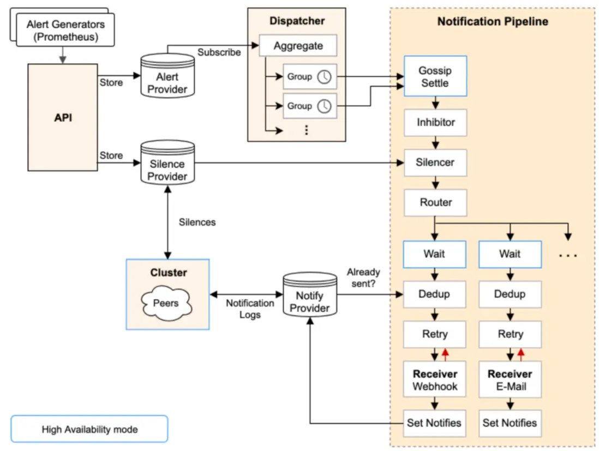
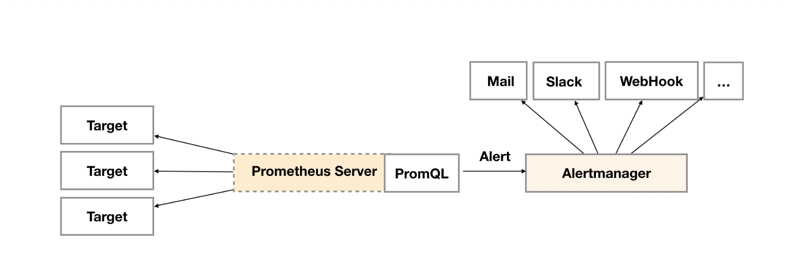
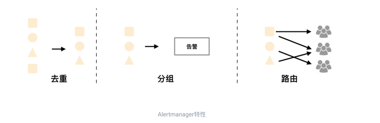

<!-- START doctoc generated TOC please keep comment here to allow auto update -->
<!-- DON'T EDIT THIS SECTION, INSTEAD RE-RUN doctoc TO UPDATE -->
**Table of Contents**  *generated with [DocToc](https://github.com/thlorenz/doctoc)*

- [alertmanager](#alertmanager)
  - [架构](#%E6%9E%B6%E6%9E%84)
  - [操作](#%E6%93%8D%E4%BD%9C)
  - [流程](#%E6%B5%81%E7%A8%8B)
  - [Alertmanager的配置](#alertmanager%E7%9A%84%E9%85%8D%E7%BD%AE)
    - [global](#global)
    - [route](#route)
    - [接收人（receivers)](#%E6%8E%A5%E6%94%B6%E4%BA%BAreceivers)
      - [集成邮件系统](#%E9%9B%86%E6%88%90%E9%82%AE%E4%BB%B6%E7%B3%BB%E7%BB%9F)
  - [应用举例](#%E5%BA%94%E7%94%A8%E4%B8%BE%E4%BE%8B)
    - [1. 告警分组](#1-%E5%91%8A%E8%AD%A6%E5%88%86%E7%BB%84)
    - [2. 告警抑制 Inhibition](#2-%E5%91%8A%E8%AD%A6%E6%8A%91%E5%88%B6-inhibition)
    - [3. silences 告警静默](#3-silences-%E5%91%8A%E8%AD%A6%E9%9D%99%E9%BB%98)
  - [核心代码分析](#%E6%A0%B8%E5%BF%83%E4%BB%A3%E7%A0%81%E5%88%86%E6%9E%90)
    - [Alerts 接口](#alerts-%E6%8E%A5%E5%8F%A3)
    - [API接收alert](#api%E6%8E%A5%E6%94%B6alert)
    - [Dispatcher](#dispatcher)
  - [高可用](#%E9%AB%98%E5%8F%AF%E7%94%A8)
  - [参考](#%E5%8F%82%E8%80%83)

<!-- END doctoc generated TOC please keep comment here to allow auto update -->

# alertmanager


在Prometheus的架构中被划分成两个独立的部分。Prometheus负责产生告警，而AlertManager负责告警产生后的后续处理.

Alertmanager 主要用于接收 Prometheus 发送的告警信息，它支持丰富的告警通知渠道，而且很容易做到告警信息进行去重，降噪，分组等，是一款前卫的告警通知系统。

## 架构



Alertmanager由以下6部分组成：

- API组件——用于接收Prometheus Server的http请求，主要是告警相关的内容。
- Alert Provider组件——API层将来自Prometheus Server的告警信息存储到Alert Provider上。
- Dispatcher组件——不断的通过订阅的方式从Alert Provider获取新的告警，并根据yaml配置的routing tree将告警通过label路由到不同的分组中，以实现告警信息的分组处理。
- Notification Pipeline组件——这是一个责任链模式的组件，它通过一系列的逻辑（抑制、静默、去重）来优化告警质量。
- Silence Provider组件——API层将来自prometheus server的告警信息存储到silence provider上，然后由这个组件实现去重逻辑处理。
- Notify Provider组件——是Silence Provider组件的下游，会在本地记录日志，并通过peers的方式将日志广播给集群中的其他节点，判断当前节点自身或者集群中其他节点是否已经发送过了，避免告警信息在集群中重复出现。

## 操作
1. 搭建配置 Alertmanager
2. Prometheus 与 Alertmanager进行交流
3. 在Prometheus创建 alerting rules

## 流程


通过在Prometheus中定义AlertRule（告警规则），Prometheus会周期性的对告警规则进行计算，如果满足告警触发条件就会向Alertmanager发送告警信息。


## Alertmanager的配置
```yaml
global:
  resolve_timeout: 5m
  http_config:
    follow_redirects: true
    enable_http2: true
  smtp_hello: localhost
  smtp_require_tls: true
  pagerduty_url: https://events.pagerduty.com/v2/enqueue
  opsgenie_api_url: https://api.opsgenie.com/
  wechat_api_url: https://qyapi.weixin.qq.com/cgi-bin/
  victorops_api_url: https://alert.victorops.com/integrations/generic/20131114/alert/
  telegram_api_url: https://api.telegram.org
  webex_api_url: https://webexapis.com/v1/messages
route:
  receiver: "null"
  group_by:
  - namespace
  continue: false
  routes:
  - receiver: "null"
    matchers:
    - alertname=~"InfoInhibitor|Watchdog"
    continue: false
  group_wait: 30s
  group_interval: 5m
  repeat_interval: 12h
inhibit_rules:
- source_matchers:
  - severity="critical"
  target_matchers:
  - severity=~"warning|info"
  equal:
  - namespace
  - alertname
- source_matchers:
  - severity="warning"
  target_matchers:
  - severity="info"
  equal:
  - namespace
  - alertname
- source_matchers:
  - alertname="InfoInhibitor"
  target_matchers:
  - severity="info"
  equal:
  - namespace
receivers:
- name: "null"
templates:
- /etc/alertmanager/config/*.tmpl
```
Alertmanager配置中一般会包含以下几个主要部分：
- 全局配置（global）：用于定义一些全局的公共参数，如全局的SMTP配置，Slack配置等内容；
- 模板（templates）：用于定义告警通知时的模板，如HTML模板，邮件模板等；
- 告警路由（route）：根据标签匹配，确定当前告警应该如何处理；
- 接收人（receivers）：接收人是一个抽象的概念，它可以是一个邮箱也可以是微信，Slack或者Webhook等，接收人一般配合告警路由使用；
- 抑制规则（inhibit_rules）：合理设置抑制规则可以减少垃圾告警的产生

### global

resolve_timeout 当告警的状态有firing变为resolve的以后还要呆多长时间，才宣布告警解除。这个主要是解决某些监控指标在阀值边缘上波动，一会儿好一会儿不好。


### route
每一个告警都会从配置文件中顶级的route进入路由树，需要注意的是顶级的route必须匹配所有告警(即不能有任何的匹配设置match和match_re)，每一个路由都可以定义自己的接受人以及匹配规则。
默认情况下，告警进入到顶级route后会遍历所有的子节点，直到找到最深的匹配route，并将告警发送到该route定义的receiver中。

但如果route中设置continue的值为false，那么告警在匹配到第一个子节点之后就直接停止。
如果continue为true，报警则会继续进行后续子节点的匹配。如果当前告警匹配不到任何的子节点，那该告警将会基于当前路由节点的接收器配置方式进行处理

```yaml
route:
  receiver: 'default-receiver'
  group_wait: 30s
  group_interval: 5m
  repeat_interval: 4h
  group_by: [cluster, alertname]
  routes:
  - receiver: 'database-pager'
    group_wait: 10s
    match_re:
      service: mysql|cassandra
  - receiver: 'frontend-pager'
    group_by: [product, environment]
    match:
      team: frontend
```
- group_by：指定一系列的label键值作为分组的依据，示例中利用cluster和alertname作为分组依据，则同一集群中，所有名称相同的告警都将统一通知。若不想对任何告警进行分组，则可以将该字段指定为'...'
- group_wait：当相应的Group从创建到第一次发送通知的等待时间，默认为30s，该字段的目的为进行适当的等待从而在一次通知中发送尽量多的告警。在每次通知之后会将已经消除的告警从Group中移除。
- group_interval：Group在第一次通知之后会周期性地尝试发送Group中告警信息，因为Group中可能有新的告警实例加入，本字段为该周期的时间间隔
- repeat_interval：在Group没有发生更新的情况下重新发送通知的时间间隔


默认情况下所有的告警都会发送给集群管理员default-receiver，因此在Alertmanager的配置文件的根路由中，对告警信息按照集群以及告警的名称对告警进行分组。

如果告警时来源于数据库服务如MySQL或者Cassandra，此时则需要将告警发送给相应的数据库管理员(database-pager)。
这里定义了一个单独子路由，如果告警中包含service标签，并且service为MySQL或者Cassandra,则向database-pager发送告警通知，由于这里没有定义group_by等属性，这些属性的配置信息将从上级路由继承，database-pager将会接收到按cluster和alertname进行分组的告警通知。

### 接收人（receivers)
每一个receiver具有一个全局唯一的名称，并且对应一个或者多个通知方式：

```yaml
name: <string>
email_configs:
  [ - <email_config>, ... ]
hipchat_configs:
  [ - <hipchat_config>, ... ]
pagerduty_configs:
  [ - <pagerduty_config>, ... ]
pushover_configs:
  [ - <pushover_config>, ... ]
slack_configs:
  [ - <slack_config>, ... ]
opsgenie_configs:
  [ - <opsgenie_config>, ... ]
webhook_configs:
  [ - <webhook_config>, ... ]
victorops_configs:
  [ - <victorops_config>, ... ]
```

目前官方内置的第三方通知集成包括：邮件、 即时通讯软件（如Slack、Hipchat）、移动应用消息推送(如Pushover)和自动化运维工具（例如：Pagerduty、Opsgenie、Victorops）。
Alertmanager的通知方式中还可以支持Webhook，通过这种方式开发者可以实现更多个性化的扩展支持。


#### 集成邮件系统
在Alertmanager中我们可以直接在配置文件的global中定义全局的SMTP配置：

```yaml
global:
  [ smtp_from: <tmpl_string> ]
  [ smtp_smarthost: <string> ]
  [ smtp_hello: <string> | default = "localhost" ]
  [ smtp_auth_username: <string> ]
  [ smtp_auth_password: <secret> ]
  [ smtp_auth_identity: <string> ]
  [ smtp_auth_secret: <secret> ]
  [ smtp_require_tls: <bool> | default = true ]
```

完成全局SMTP之后，我们只需要为receiver配置email_configs用于定义一组接收告警的邮箱地址即可，如下所示：
```yaml
name: <string>
email_configs:
  [ - <email_config>, ... ]
```


## 应用举例



### 1. 告警分组
分组机制可以将某一类型的告警信息合并成一个大的告警信息，避免发送太多的告警邮件。

我们有3台服务器都介入了Prometheus，这3台服务器同时宕机了，那么如果不分组可能会发送3个告警信息，如果分组了，那么会合并成一个大的告警信息


1. 定义告警规则:监控服务器宕机的时间超过1分钟就发送告警邮件。
```yaml
groups:
- name: Test-Group-001 # 组的名字，在这个文件中必须要唯一
  rules:
  - alert: InstanceDown # 告警的名字，在组中需要唯一
    expr: up == 0 # 表达式, 执行结果为true: 表示需要告警
    for: 1m # 超过多少时间才认为需要告警(即up==0需要持续的时间)
    labels:
      severity: warning # 定义标签
    annotations:
      summary: "服务 {{ $labels.instance }} 下线了"
      description: "{{ $labels.instance }} of job {{ $labels.job }} has been down for more than 1 minutes."

```
在一个规则文件中可以指定若干个group，每个group内可以指定多条告警规则. 
在每一个group中我们可以定义多个告警规则(rule)。一条告警规则主要由以下几部分组成：
- alert：告警规则的名称。
- expr：基于PromQL表达式告警触发条件，用于计算是否有时间序列满足该条件。
- for：评估等待时间，可选参数。用于表示只有当触发条件持续一段时间后才发送告警。在等待期间新产生告警的状态为pending。
- labels：自定义标签，允许用户指定要附加到告警上的一组附加标签。
- annotations：用于指定一组附加信息，比如用于描述告警详细信息的文字等，annotations的内容在告警产生时会一同作为参数发送到Alertmanager。
  在告警规则文件的annotations中使用summary描述告警的概要信息，description用于描述告警的详细信息。
  同时Alertmanager的UI也会根据这两个标签值，显示告警信息。为了让告警信息具有更好的可读性，Prometheus支持模板化label和annotations的中标签的值

通过$labels.<labelname>变量可以访问当前告警实例中指定标签的值。$value则可以获取当前PromQL表达式计算的样本值。


2. alertmanager.yml 配置
```yaml
global:
  resolve_timeout: 5m
  # 整合qq邮件
  smtp_smarthost: 'smtp.qq.com:465'
  smtp_from: '1451578387@qq.com'
  smtp_auth_username: '1451578387@qq.com'
  smtp_auth_identity: 'xxxxxx'
  smtp_auth_password: 'xxxxxx'
  smtp_require_tls: false 
# 路由  
route:
  group_by: ['alertname'] # 根据什么分组，此处配置的是根据告警的名字分组,没有指定 group_by 貌似是根据规则文件的 groups[n].name 来分组的。
  group_wait: 10s # 当产生一个新分组时，告警信息需要等到 group_wait 才可以发送出去。
  group_interval: 10s # 如果上次告警信息发送成功，此时又来了一个新的告警数据，则需要等待 group_interval 才可以发送出去
  repeat_interval: 120s # 如果上次告警信息发送成功，且问题没有解决，则等待 repeat_interval 再次发送告警数据
  receiver: 'email' # 告警的接收者，需要和 receivers[n].name 的值一致。
receivers:
- name: 'email'
  email_configs:
  - to: '1451578387@qq.com'

```
- group_by :alertmanager可以对告警通知进行分组，将多条告警合合并为一个通知。这里我们可以使用group_by来定义分组规则。
  基于告警中包含的标签，如果满足group_by中定义标签名称，那么这些告警将会合并为一个通知发送给接收器。

- group_wait: 有的时候为了能够一次性收集和发送更多的相关信息时，可以通过group_wait参数设置等待时间，如果在等待时间内当前group接收到了新的告警，这些告警将会合并为一个通知向receiver发送。
- group_interval :而group_interval配置，则用于定义相同的Group之间发送告警通知的时间间隔。

### 2. 告警抑制 Inhibition

指的是当某类告警产生的时候，于此相关的别的告警就不用发送告警信息了。

我们对某台机器的CPU的使用率进行了监控，比如 使用到 80% 和 90% 都进行了监控，那么我们可能想如果CPU使用率达到了90%就不要发送80%的邮件了。

1. 告警规则
```yaml
groups:
- name: Cpu
  rules:
    - alert: Cpu01
      expr: "(1 - avg(irate(node_cpu_seconds_total{mode='idle'}[5m])) by (instance,job)) * 100 > 80"
      for: 1m
      labels:
        severity: info # 自定一个一个标签 info 级别
      annotations:
        summary: "服务 {{ $labels.instance }} cpu 使用率过高"
        description: "{{ $labels.instance }} of job {{ $labels.job }} 的 cpu 在过去5分钟内使用过高，cpu 使用率 {{humanize $value}}."
    - alert: Cpu02
      expr: "(1 - avg(irate(node_cpu_seconds_total{mode='idle'}[5m])) by (instance,job)) * 100 > 90"
      for: 1m
      labels:
        severity: warning # 自定一个一个标签 warning 级别
      annotations:
        summary: "服务 {{ $labels.instance }} cpu 使用率过高"
        description: "{{ $labels.instance }} of job {{ $labels.job }} 的 cpu 在过去5分钟内使用过高，cpu 使用率 {{humanize $value}}."

```

2. alertmanager.yml 配置抑制规则

如果 告警的名称 alertname = Cpu02 并且 告警级别 severity = warning ，那么抑制住 新的告警信息中 标签为 severity = info 的告警数据。并且源告警和目标告警数据的 instance 标签的值必须相等。
```yaml
# 抑制规则，减少告警数据
inhibit_rules:
- source_match: # 匹配当前告警规则后，抑制住target_match的告警规则
    alertname: Cpu02 # 标签的告警名称是 Cpu02
    severity: warning # 自定义的告警级别是 warning
  target_match: # 被抑制的告警规则
    severity: info # 抑制住的告警级别
  equal:
  - instance # source 和 target 告警数据中，instance的标签对应的值需要相等。

```

### 3. silences 告警静默

指的是处于静默期，不发送告警信息。

我们系统某段时间进行停机维护，由此可能会产生一堆的告警信息，但是这个时候的告警信息是没有意义的，就可以配置静默规则过滤掉


## 核心代码分析
主要组件或者package：

- API接收alert
- Alerts接口
- Inhibitor抑制
- Silencer屏蔽
- Pipeline
- Dispatcher


### Alerts 接口
```go
type Alerts interface {
	// 所有调用者返回一个channel，可以通过该channel监听是否有接收到新的alerts
	// 不保证时间顺序
	Subscribe() AlertIterator
	// GetPending returns an iterator over all alerts that have
	// pending notifications.
	GetPending() AlertIterator
	// Get returns the alert for a given fingerprint.
	Get(model.Fingerprint) (*types.Alert, error)
	// Put adds the given set of alerts to the set.
	// 给每个监听的channel发送一次收到的alerts
	Put(...*types.Alert) error
}

```

订阅
```go
func (a *Alerts) Subscribe() provider.AlertIterator {
	a.mtx.Lock()
	defer a.mtx.Unlock()

	var (
		done   = make(chan struct{})
		alerts = a.alerts.List() // 首先，得到store.Alerts中的所有告警；
		ch     = make(chan *types.Alert, max(len(alerts), alertChannelLength))
	)

	for _, a := range alerts {
		ch <- a // 然后，将告警发送到chan中
	}

	a.listeners[a.next] = listeningAlerts{alerts: ch, done: done}
	a.next++

	// 最后，包装chan到Iterator中返回
	return provider.NewAlertIterator(ch, done, nil)
}

```

放入 alerts 信息

```go
func (a *Alerts) Put(alerts ...*types.Alert) error {
	for _, alert := range alerts {
		fp := alert.Fingerprint()

		existing := false

		// Check that there's an alert existing within the store before
		// trying to merge.
		if old, err := a.alerts.Get(fp); err == nil {
			existing = true

			// Merge alerts if there is an overlap in activity range.
			if (alert.EndsAt.After(old.StartsAt) && alert.EndsAt.Before(old.EndsAt)) ||
				(alert.StartsAt.After(old.StartsAt) && alert.StartsAt.Before(old.EndsAt)) {
				alert = old.Merge(alert)
			}
		}

		if err := a.callback.PreStore(alert, existing); err != nil {
			level.Error(a.logger).Log("msg", "pre-store callback returned error on set alert", "err", err)
			continue
		}

		if err := a.alerts.Set(alert); err != nil {
			level.Error(a.logger).Log("msg", "error on set alert", "err", err)
			continue
		}

		a.callback.PostStore(alert, existing)

		a.mtx.Lock()
		for _, l := range a.listeners {
			select {
			// 给每个监听者发送
			case l.alerts <- alert:
			case <-l.done:
			}
		}
		a.mtx.Unlock()
	}

	return nil
}


func (a *Alerts) Set(alert *types.Alert) error {
	a.Lock()
	defer a.Unlock()

	// store.Alerts中以map结构保存告警对象，保存在内存中
	a.c[alert.Fingerprint()] = alert
	return nil
}

```

### API接收alert
```go
func (api *API) postAlertsHandler(params alert_ops.PostAlertsParams) middleware.Responder {
	logger := api.requestLogger(params.HTTPRequest)

	alerts := OpenAPIAlertsToAlerts(params.Alerts)
	now := time.Now()

	api.mtx.RLock()
	resolveTimeout := time.Duration(api.alertmanagerConfig.Global.ResolveTimeout)
	api.mtx.RUnlock()

    // ...
	
	// 放入 alerts 信息
	if err := api.alerts.Put(validAlerts...); err != nil {
		level.Error(logger).Log("msg", "Failed to create alerts", "err", err)
		return alert_ops.NewPostAlertsInternalServerError().WithPayload(err.Error())
	}

	if validationErrs.Len() > 0 {
		// 错误返回
		level.Error(logger).Log("msg", "Failed to validate alerts", "err", validationErrs.Error())
		return alert_ops.NewPostAlertsBadRequest().WithPayload(validationErrs.Error())
	}

	return alert_ops.NewPostAlertsOK()
}
```


### Dispatcher
```go
func (d *Dispatcher) run(it provider.AlertIterator) {
	cleanup := time.NewTicker(30 * time.Second)
	defer cleanup.Stop()

	defer it.Close()

	for {
		select {
		case alert, ok := <-it.Next(): // 读取
            // ...

			now := time.Now()
			for _, r := range d.route.Match(alert.Labels) {
				d.processAlert(alert, r) //  处理
			}
			d.metrics.processingDuration.Observe(time.Since(now).Seconds())

		case <-cleanup.C:
            // ...

		case <-d.ctx.Done():
			return
		}
	}
}

// 处理报警
func (d *Dispatcher) processAlert(alert *types.Alert, route *Route) {
	groupLabels := getGroupLabels(alert, route)

	fp := groupLabels.Fingerprint()

	d.mtx.Lock()
	defer d.mtx.Unlock()

	routeGroups, ok := d.aggrGroupsPerRoute[route]
	if !ok {
		routeGroups = map[model.Fingerprint]*aggrGroup{}
		d.aggrGroupsPerRoute[route] = routeGroups
	}

	ag, ok := routeGroups[fp]
	if ok {
		ag.insert(alert)
		return
	}

	// If the group does not exist, create it. But check the limit first.
	if limit := d.limits.MaxNumberOfAggregationGroups(); limit > 0 && d.aggrGroupsNum >= limit {
		d.metrics.aggrGroupLimitReached.Inc()
		level.Error(d.logger).Log("msg", "Too many aggregation groups, cannot create new group for alert", "groups", d.aggrGroupsNum, "limit", limit, "alert", alert.Name())
		return
	}

	ag = newAggrGroup(d.ctx, groupLabels, route, d.timeout, d.logger)
	routeGroups[fp] = ag
	d.aggrGroupsNum++
	d.metrics.aggrGroups.Inc()

	// Insert the 1st alert in the group before starting the group's run()
	// function, to make sure that when the run() will be executed the 1st
	// alert is already there.
	ag.insert(alert)

	go ag.run(func(ctx context.Context, alerts ...*types.Alert) bool {
		// 告警分发给notify模块
		_, _, err := d.stage.Exec(ctx, d.logger, alerts...)
		if err != nil {
			lvl := level.Error(d.logger)
			if ctx.Err() == context.Canceled {
				// It is expected for the context to be canceled on
				// configuration reload or shutdown. In this case, the
				// message should only be logged at the debug level.
				lvl = level.Debug(d.logger)
			}
			lvl.Log("msg", "Notify for alerts failed", "num_alerts", len(alerts), "err", err)
		}
		return err == nil
	})
}
```

stage对象，实际就是notify的pipeline
```go
// https://github.com/prometheus/alertmanager/blob/d155153305afc25471b9879928d8d93df77b12a8/cmd/alertmanager/main.go
func run() int {
	
  // ...  
  pipeline := pipelineBuilder.New(
              receivers,
              waitFunc,
              inhibitor,
              silencer,
              timeIntervals,
              notificationLog,
              pipelinePeer,
          )
  // ...
  disp = dispatch.NewDispatcher(alerts, routes, pipeline, marker, timeoutFunc, nil, logger, dispMetrics)
}
```

```go
func (pb *PipelineBuilder) New(
	receivers map[string][]Integration,
	wait func() time.Duration,
	inhibitor *inhibit.Inhibitor,
	silencer *silence.Silencer,
	times map[string][]timeinterval.TimeInterval,
	notificationLog NotificationLog,
	peer Peer,
) RoutingStage {
	rs := make(RoutingStage, len(receivers))

	ms := NewGossipSettleStage(peer)
	is := NewMuteStage(inhibitor)
	ss := NewMuteStage(silencer)
	tms := NewTimeMuteStage(times)
	tas := NewTimeActiveStage(times)

	for name := range receivers 
	    // 创建接收者 stage
		st := createReceiverStage(name, receivers[name], wait, notificationLog, pb.metrics)
		rs[name] = MultiStage{ms, is, tas, tms, ss, st}
	}
	return rs
}


func createReceiverStage(
	name string,
	integrations []Integration,
	wait func() time.Duration,
	notificationLog NotificationLog,
	metrics *Metrics,
) Stage {
	var fs FanoutStage
	for i := range integrations {
		recv := &nflogpb.Receiver{
			GroupName:   name,
			Integration: integrations[i].Name(),
			Idx:         uint32(integrations[i].Index()),
		}
		var s MultiStage
		s = append(s, NewWaitStage(wait))
		s = append(s, NewDedupStage(&integrations[i], notificationLog, recv))
		s = append(s, NewRetryStage(integrations[i], name, metrics))
		s = append(s, NewSetNotifiesStage(notificationLog, recv))

		fs = append(fs, s)
	}
	return fs
}
```


在Notify的pipeline中调用流程：

- 首先，先进行GossipSettle、inhibitor、silencer等操作；
  - 这里面的每个Stage，若其中一个失败，则直接返回err;
- 然后，针对每个receiver，再进行Wait、Dedupe、Retry、SetNotifies操作；
  - 这里面的每个Stage，若其中一个失败，则直接返回err;
```go
type RoutingStage map[string]Stage

// Exec implements the Stage interface.
func (rs RoutingStage) Exec(ctx context.Context, l log.Logger, alerts ...*types.Alert) (context.Context, []*types.Alert, error) {
	receiver, ok := ReceiverName(ctx)
	if !ok {
		return ctx, nil, errors.New("receiver missing")
	}

	s, ok := rs[receiver]
	if !ok {
		return ctx, nil, errors.New("stage for receiver missing")
	}

	// 单个 receiver 租个执行 stage 
	return s.Exec(ctx, l, alerts...)
}

```

单个 receiver 处理
```go
type MultiStage []Stage

// Exec implements the Stage interface.
func (ms MultiStage) Exec(ctx context.Context, l log.Logger, alerts ...*types.Alert) (context.Context, []*types.Alert, error) {
	var err error
	// 对每个 stage 逐个调用
	for _, s := range ms {
		if len(alerts) == 0 {
			return ctx, nil, nil
		}

		ctx, alerts, err = s.Exec(ctx, l, alerts...)
		if err != nil {
			return ctx, nil, err
		}
	}
	return ctx, alerts, nil
}

```

## 高可用

因为AlertManager并非是无状态的，它有如下两个关键信息需要同步：

1. 告警静默规则：当存在多个AlertManager实例时，用户依然只会向其中一个实例发起请求，对静默规则进行增删。但是对于静默规则的应用显然应当是全局的，因此各个实例应当广播各自的静默规则，直到全局一致。
2. Notification Log：既然要保证高可用，即确保告警实例不丢失，而AlertManager实例又是将告警保存在各自的内存中的，因此Prometheus显然不应该在多个AlertManager实例之间做负载均衡而是应该将告警发往所有的AlertManager实例。但是对于同一个Alert Group的通知则只能由一个AlertManager发送，因此我们也应该把Notification Log在全集群范围内进行同步

Notification Log的同步并没有静默规则这么容易。我们可以假设如下场景：由于高可用的要求，Prometheus会向每个AlertManager发送告警实例。如果该告警实例不属于任何之前已有的Alert Group，则会新建一个Group并最终创建一个相应的Notification Log。而Notification Log是在通知完成之后创建的，所以在这种情况下，针对同一个告警发送了多次通知。

为了避免这种情况的发生，社区给出的解决方案是错开各个AlertManager发送通知的时间。如上文的整体架构图所示，Notification Pipeline在进行去重之前其实还有一个Wait阶段。该阶段会将对于告警的通知处理暂停一段时间，不同的AlertManager实例等待的时间会因为该实例在整个集群中的位置有所不同。根据实例名进行排序，排名每靠后一位，默认多等待15秒。

假设集群中有两个AlertManager实例，排名靠前的实例为A0，排名靠后的实例为A1，此时对于上述问题的处理如下：

1. 假设两个AlertManager同时收到告警实例并同时到达Notification Pipeline的Wait阶段。在该阶段A0无需等待而A1需要等待15秒。
2. A0直接发送通知，生成相应的Notification Log并广播
3. A1等待15秒之后进入去重阶段，但是由于已经同步到A0广播的Notification Log，通知不再发送
   可以看到，Gossip协议事实上是一个弱一致性的协议，上述的机制能在绝大多数情况下保证AlertManager集群的高可用并且避免实例间同步的不及时对用户造成的困扰


## 参考
- https://prometheus.io/docs/alerting/latest/overview/
- [alertmanager的使用](https://blog.csdn.net/fu_huo_1993/article/details/114597863)
- [Prometheus AlertManager讲解与实战操作](https://www.cnblogs.com/liugp/p/16974615.html)
- [alertmanager源码：整体架构和流程分析](https://segmentfault.com/a/1190000044895864)
- [Prometheus告警模型分析.md](https://github.com/YaoZengzeng/KubernetesResearch/blob/master/Prometheus%E5%91%8A%E8%AD%A6%E6%A8%A1%E5%9E%8B%E5%88%86%E6%9E%90.md)