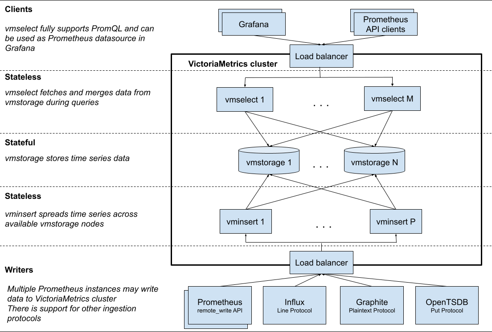
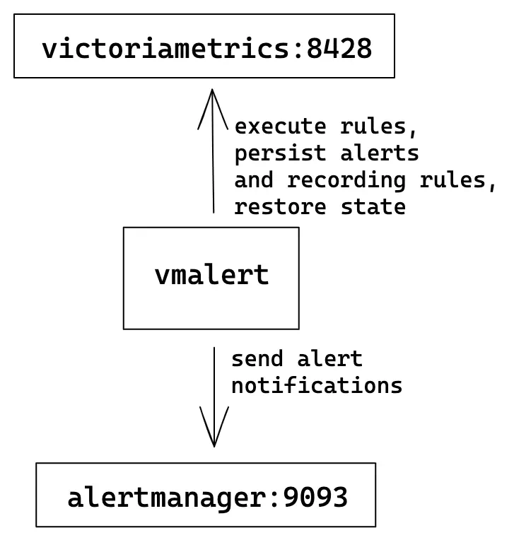
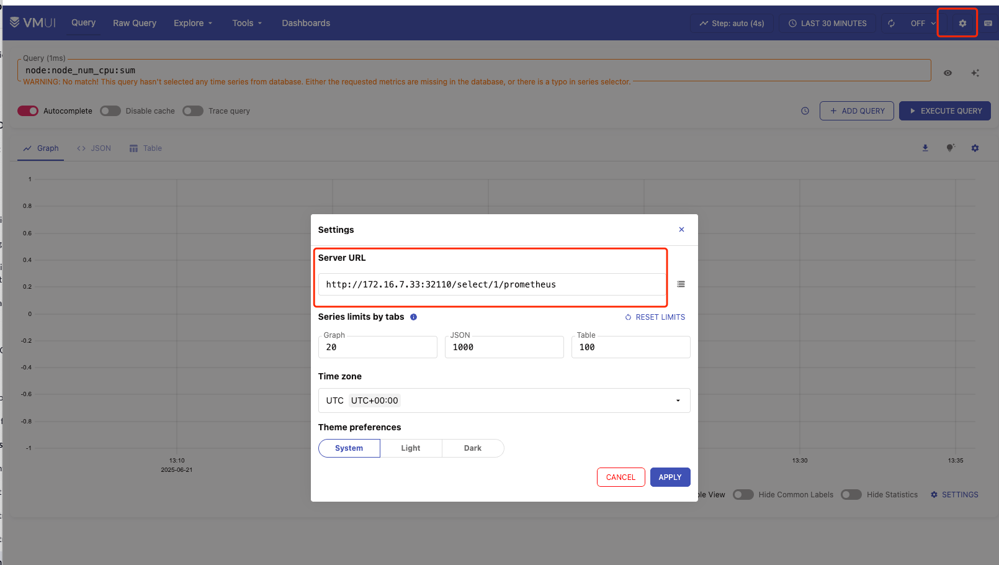

<!-- START doctoc generated TOC please keep comment here to allow auto update -->
<!-- DON'T EDIT THIS SECTION, INSTEAD RE-RUN doctoc TO UPDATE -->
**Table of Contents**  *generated with [DocToc](https://github.com/thlorenz/doctoc)*

- [VictoriaMetrics](#victoriametrics)
  - [架构](#%E6%9E%B6%E6%9E%84)
    - [vmui](#vmui)
    - [vmagent](#vmagent)
    - [vmalert](#vmalert)
    - [vminsert](#vminsert)
    - [vmselect](#vmselect)
    - [vmstorage](#vmstorage)
  - [特点](#%E7%89%B9%E7%82%B9)
  - [部署](#%E9%83%A8%E7%BD%B2)
  - [VictoriaMetrics 对比 prometheus](#victoriametrics-%E5%AF%B9%E6%AF%94-prometheus)
  - [数据格式](#%E6%95%B0%E6%8D%AE%E6%A0%BC%E5%BC%8F)
    - [数据目录 data](#%E6%95%B0%E6%8D%AE%E7%9B%AE%E5%BD%95-data)
    - [索引目录 indexdb](#%E7%B4%A2%E5%BC%95%E7%9B%AE%E5%BD%95-indexdb)
  - [prometheus 迁移到 VictoriaMetrics](#prometheus-%E8%BF%81%E7%A7%BB%E5%88%B0-victoriametrics)
  - [复制和数据安全](#%E5%A4%8D%E5%88%B6%E5%92%8C%E6%95%B0%E6%8D%AE%E5%AE%89%E5%85%A8)
    - [常见问题](#%E5%B8%B8%E8%A7%81%E9%97%AE%E9%A2%98)
    - [prometheus 存在的问题](#prometheus-%E5%AD%98%E5%9C%A8%E7%9A%84%E9%97%AE%E9%A2%98)
  - [自身监控](#%E8%87%AA%E8%BA%AB%E7%9B%91%E6%8E%A7)
  - [多租户](#%E5%A4%9A%E7%A7%9F%E6%88%B7)
  - [参考](#%E5%8F%82%E8%80%83)

<!-- END doctoc generated TOC please keep comment here to allow auto update -->


# VictoriaMetrics 


VictoriaMetrics 主要是一个可水平扩容的本地全量持久化存储方案

## 架构

https://docs.victoriametrics.com/victoriametrics/cluster-victoriametrics/#architecture-overview

VictoriaMetrics在保持更简单的架构的同时，还包括几个核心组件：

- vmstorage：数据存储以及查询结果返回，默认端口为 8482
- vminsert：数据录入，可实现类似分片、副本功能，默认端口 8480
- vmselect：数据查询，汇总和数据去重，默认端口 8481
- vmagent：数据指标抓取，支持多种后端存储，会占用本地磁盘缓存，默认端口 8429
- vmalert：报警相关组件，默认端口为 8880



### vmui 

地址: http://<vmselect>:8481/select/<accountID>/vmui/

url 格式: https://docs.victoriametrics.com/victoriametrics/cluster-victoriametrics/#url-format

```shell
✗ kubectl get svc -n victoria                                                                             
NAME                         TYPE        CLUSTER-IP      EXTERNAL-IP   PORT(S)                      AGE
my-vmselect-vmcluster-svc    NodePort    10.233.6.15     <none>        8481:32110/TCP               38m
vmagent-vmagent              ClusterIP   10.233.34.26    <none>        8429/TCP                     5h27m
vmclusterlb-vmcluster        ClusterIP   10.233.29.230   <none>        8427/TCP                     5h27m
vminsert-vmcluster           ClusterIP   10.233.52.18    <none>        8480/TCP                     5h25m
vminsertinternal-vmcluster   ClusterIP   None            <none>        8480/TCP                     5h25m
vmselect-vmcluster           ClusterIP   10.233.28.216   <none>        8481/TCP                     5h25m
vmselectinternal-vmcluster   ClusterIP   None            <none>        8481/TCP                     5h25m
vmstorage-vmcluster          ClusterIP   None            <none>        8482/TCP,8400/TCP,8401/TCP   5h26m

```
- grafana 配置地址: 如果使用 prometheus 接口, http://vmselect-vmcluster.victoria.svc:8481/select/0/prometheus


### vmagent
vmagent是一个轻量级工具，用于采集不同源的指标。vmagent可以在转发指标前(通过"relabeling")定制指标(降低基数、流聚合、去重等)。
- https://docs.victoriametrics.com/victoriametrics/vmagent/
- https://docs.victoriametrics.com/operator/resources/vmagent/


单个 vmagent 实例可以抓取数万个抓取目标，但是有时由于 CPU、网络、内存等方面的限制，这还不够。
在这种情况下，抓取目标可以在多个 vmagent 实例之间进行拆分。集群中的每个 vmagent 实例必须使用具有不同 -promscrape.cluster.memberNum 值的相同 -promscrape.config 配置文件，该参数值必须在 0 ... N-1 范围内，其中 N 是集群中 vmagent 实例的数量。
集群中 vmagent 实例的数量必须传递给 -promscrape.cluster.membersCount 命令行标志。


### vmalert

vmalert 会针对 -datasource.url 地址执行配置的报警或记录规则，然后可以将报警发送给 -notifier.url 配置的 Alertmanager，记录规则结果会通过远程写入的协议进行保存，所以需要配置 -remoteWrite.url


### vminsert

vminsert：接受摄取的数据并根据指标名称及其所有标签的一致性哈希将其分散存储到 vmstorage 节点。

```go
// https://github.com/VictoriaMetrics/VictoriaMetrics/blob/b745f8eb2b392d7b167708c9952de2f075cd4fb4/app/vminsert/netstorage/insert_ctx.go

func (ctx *InsertCtx) GetStorageNodeIdx(at *auth.Token, labels []prompbmarshal.Label) int {
	if len(ctx.snb.sns) == 1 {
		// Fast path - only a single storage node.
		return 0
	}

	buf := ctx.labelsBuf[:0]
	buf = encoding.MarshalUint32(buf, at.AccountID)
	buf = encoding.MarshalUint32(buf, at.ProjectID)
	for i := range labels {
		label := &labels[i]
		buf = marshalStringFast(buf, label.Name)
		buf = marshalStringFast(buf, label.Value)
	}
	h := xxhash.Sum64(buf)
	ctx.labelsBuf = buf

	// Do not exclude unavailable storage nodes in order to properly account for rerouted rows in storageNode.push().
	idx := ctx.snb.nodesHash.getNodeIdx(h, nil)
	return idx
}
```


### vmselect 

vmselect：通过从所有配置的 vmstorage 节点获取所需数据来执行查询

```go
func startStorageNodesRequest(qt *querytracer.Tracer, sns []*storageNode, denyPartialResponse bool,
	f func(qt *querytracer.Tracer, workerID uint, sn *storageNode) any,
) *storageNodesRequest {
	resultsCh := make(chan rpcResult, len(sns))
	qts := make(map[*querytracer.Tracer]string, len(sns))
	for idx, sn := range sns {
		// Do not use qt.NewChild.
		// StorageNodesRequest may be finished before goroutine returns.
		// Caller must register tracker manually with finishQueryTracer after goroutine returns result.
		// It ensures that tracker is no longer referenced by any concurrent goroutines.
		//
		// See this issue: https://github.com/VictoriaMetrics/VictoriaMetrics/issues/8114
		qtOrphan := querytracer.NewOrphan(qt, "rpc at vmstorage %s", sn.connPool.Addr())
		qts[qtOrphan] = sn.connPool.Addr()
		go func(workerID uint, sn *storageNode) {
			data := f(qtOrphan, workerID, sn)
			resultsCh <- rpcResult{
				data:  data,
				qt:    qtOrphan,
				group: sn.group,
			}
		}(uint(idx), sn)
	}
	return &storageNodesRequest{
		denyPartialResponse: denyPartialResponse,
		resultsCh:           resultsCh,
		qt:                  qt,
		qts:                 qts,
		sns:                 sns,
	}
}
```


### vmstorage

高基数限制
```go
// https://github.com/VictoriaMetrics/VictoriaMetrics/blob/2acc6c1106367e6b69cc9ff900c7099959c0f5f9/lib/storage/storage.go
func (s *Storage) registerSeriesCardinality(metricID uint64, metricNameRaw []byte) bool {
	if sl := s.hourlySeriesLimiter; sl != nil && !sl.Add(metricID) {
		s.hourlySeriesLimitRowsDropped.Add(1)
		logSkippedSeries(metricNameRaw, "-storage.maxHourlySeries", sl.MaxItems())
		return false
	}
	if sl := s.dailySeriesLimiter; sl != nil && !sl.Add(metricID) {
		s.dailySeriesLimitRowsDropped.Add(1)
		logSkippedSeries(metricNameRaw, "-storage.maxDailySeries", sl.MaxItems())
		return false
	}
	return true
}
```

## 特点

- 高基数问题 high cardinality 优化: up to 7x less RAM than Prometheus
- 高流失率 high churn rate(time series 频繁被替代) 优化
- 存储空间降低:7x less storage space is required compared to Prometheus
- 存储支持 nfs


## 部署
使用 operator 的方式:https://docs.victoriametrics.com/guides/getting-started-with-vm-operator/
```shell
helm install victoria-operator vm/victoria-metrics-operator --version 0.47.0
```

这里使用 local-path storageclass 
```yaml
apiVersion: operator.victoriametrics.com/v1beta1
kind: VMCluster
metadata:
  name: vmcluster
  namespace: monitoring
spec:
  retentionPeriod: "14"
  vmstorage:
    extraArgs:
      dedup.minScrapeInterval: 30s
    replicaCount: 2
    image:
      repository: swr.cn-north-4.myhuaweicloud.com/ddn-k8s/docker.io/victoriametrics/vmstorage
      tag: v1.115.0-cluster
      pullPolicy: IfNotPresent
    storage:
      volumeClaimTemplate:
        metadata:
          name: data
        spec:
          accessModes: [ "ReadWriteOnce" ]
          storageClassName: local-path
          resources:
            requests:
              storage: 5Gi
    resources:
      limits:
        cpu: "1"
        memory: "1Gi"
      requests:
        cpu: "0.5"
        memory: "500Mi"

  vmselect:
    extraArgs:
      dedup.minScrapeInterval: 30s
    replicaCount: 1
    cacheMountPath: "/select-cache"
    logLevel: INFO
    image:
      repository: swr.cn-north-4.myhuaweicloud.com/ddn-k8s/docker.io/victoriametrics/vmselect
      tag: v1.115.0-cluster
      pullPolicy: IfNotPresent
    storage:
      volumeClaimTemplate:
        spec:
          storageClassName: local-path
          resources:
            requests:
              storage: "1Gi"
    resources:
      limits:
        cpu: "1"
        memory: "1Gi"
      requests:
        cpu: "0.5"
        memory: "500Mi"

  vminsert:
    replicaCount: 1
    image:
      repository: swr.cn-north-4.myhuaweicloud.com/ddn-k8s/docker.io/victoriametrics/vminsert
      tag: v1.115.0-cluster
      pullPolicy: IfNotPresent
    resources:
      limits:
        cpu: "1"
        memory: "1Gi"
      requests:
        cpu: "0.5"
        memory: "500Mi"

```

vmagent : 修改 remoteWrite

```yaml
apiVersion: operator.victoriametrics.com/v1beta1
kind: VMAgent
metadata:
  name: vmagent
  namespace: monitoring
spec:
  image:
    repository: swr.cn-north-4.myhuaweicloud.com/ddn-k8s/docker.io/victoriametrics/vmagent
    tag: v1.116.0
  serviceScrapeNamespaceSelector: {}
  podScrapeNamespaceSelector: {}
  podScrapeSelector: {}
  serviceScrapeSelector: {}
  nodeScrapeSelector: {}
  nodeScrapeNamespaceSelector: {}
  staticScrapeSelector: {}
  staticScrapeNamespaceSelector: {}
  replicaCount: 1
  remoteWrite:
    - url: "http://vminsert-vmcluster.monitoring.svc.cluster.local:8480/insert/0/prometheus/api/v1/write"
#  secrets:
#    - etcd-client-cert

```


vmalert 部署
```yaml
apiVersion: operator.victoriametrics.com/v1beta1
kind: VMAlert
metadata:
  name: vmalert-ha
  namespace: monitoring
spec:
  image:
    repository: swr.cn-north-4.myhuaweicloud.com/ddn-k8s/docker.io/victoriametrics/vmalert
    tag: v1.116.0
  replicaCount: 2
  # prometheus 兼容查询数据源
  datasource:
    url: http://vmselect-vmcluster.monitoring.svc:8481/select/0/prometheus
  #  AlertManager URL
  notifiers:
    - url: http://alertmanager-main.monitoring.svc:9093
  remoteWrite:
    url: http://vminsert-vmcluster.monitoring.svc:8480/insert/0/prometheus
  remoteRead:
    url: http://vmselect-vmcluster.monitoring.svc:8481/select/0/prometheus
  evaluationInterval: "10s"
  ruleSelector: {}
```

## VictoriaMetrics 对比 prometheus 

- https://last9.io/blog/prometheus-vs-victoriametrics/


## 数据格式
```shell
/vmstorage-data # tree -L 2 /vmstorage-data
-L [error opening dir]
2 [error opening dir]
.
├── data
│   ├── big
│   │   ├── 2025_06
│   │   └── snapshots
│   └── small
│       ├── 2025_06
│       │   ├── 1848DA53DBC2BFDA
│       │   │   ├── index.bin
│       │   │   ├── metadata.json
│       │   │   ├── metaindex.bin
│       │   │   ├── timestamps.bin
│       │   │   └── values.bin
            // ...
│       │   ├── 1848DA53DBC2C383
│       │   │   ├── index.bin
│       │   │   ├── metadata.json
│       │   │   ├── metaindex.bin
│       │   │   ├── timestamps.bin
│       │   │   └── values.bin
│       │   └── parts.json
│       └── snapshots
├── flock.lock
├── indexdb
│   ├── 1848CA450436BA0C
│   │   └── parts.json
│   ├── 1848CA450436BA0D
│   │   ├── 1848CA45062B2EC6
│   │   │   ├── index.bin
│   │   │   ├── items.bin
│   │   │   ├── lens.bin
│   │   │   ├── metadata.json
│   │   │   └── metaindex.bin
        // ...
│   │   └── parts.json
│   ├── 1848CA450436BA0E
│   │   └── parts.json
│   └── snapshots
├── metadata
│   └── minTimestampForCompositeIndex
└── snapshots
```

最主要的是数据目录data和索引目录indexdb，flock.lock文件为文件锁文件，用于VictoriaMetrics进程锁住文件，不允许别的进程进行修改目录或文件。


TSID 生成
```go

func generateTSID(dst *TSID, mn *MetricName) {
	dst.AccountID = mn.AccountID
	dst.ProjectID = mn.ProjectID
	dst.MetricGroupID = xxhash.Sum64(mn.MetricGroup)
	// Assume that the job-like metric is put at mn.Tags[0], while instance-like metric is put at mn.Tags[1]
	// This assumption is true because mn.Tags must be sorted with mn.sortTags() before calling generateTSID() function.
	// This allows grouping data blocks for the same (job, instance) close to each other on disk.
	// This reduces disk seeks and disk read IO when data blocks are read from disk for the same job and/or instance.
	// For example, data blocks for time series matching `process_resident_memory_bytes{job="vmstorage"}` are physically adjacent on disk.
	if len(mn.Tags) > 0 {
		dst.JobID = uint32(xxhash.Sum64(mn.Tags[0].Value))
	}
	if len(mn.Tags) > 1 {
		dst.InstanceID = uint32(xxhash.Sum64(mn.Tags[1].Value))
	}
	// 基于时间
	dst.MetricID = generateUniqueMetricID()
}
```

### 数据目录 data 

VictoriaMetrics分成small目录和big目录，主要是兼顾近期数据的读取和历史数据的压缩率。

在small目录下，以月为单位不断生成partition目录.

big目录下的数据由small目录下的数据在后台compaction时合并生成.


### 索引目录 indexdb

VictoriaMetrics每次内存Flush或者后台Merge时生成的索引part，主要包含metaindex.bin、index.bin、lens.bin、items.bin等4个文件。


VictoriaMetrics索引文件都是围绕着item来组织的
```go

const (
	// Prefix for MetricName->TSID entries.
	// 此索引 -disablePerDayIndex开启才会写
	nsPrefixMetricNameToTSID = 0

	// Prefix for Tag->MetricID entries.
	nsPrefixTagToMetricIDs = 1

	// Prefix for MetricID->TSID entries.
	nsPrefixMetricIDToTSID = 2

	// Prefix for MetricID->MetricName entries.
	nsPrefixMetricIDToMetricName = 3

    // ...

	// Prefix for (Date,MetricName)->TSID entries.
	nsPrefixDateMetricNameToTSID = 7
)
```

写索引
```go
func (is *indexSearch) createGlobalIndexes(tsid *TSID, mn *MetricName) {
	ii := getIndexItems()
	defer putIndexItems(ii)

	if is.db.s.disablePerDayIndex {
		// Create metricName -> TSID entry.
		// This index is used for searching a TSID by metric name during data
		// ingestion or metric name registration when -disablePerDayIndex flag
		// is set.
		//
		// Do not use marshalCommonPrefix() here, since mn already contains (AccountID, ProjectID)
		ii.B = append(ii.B, nsPrefixMetricNameToTSID)
		ii.B = mn.Marshal(ii.B)
		ii.B = append(ii.B, kvSeparatorChar)
		ii.B = tsid.Marshal(ii.B)
		ii.Next()
	}

	// Create metricID -> metricName entry.
	ii.B = marshalCommonPrefix(ii.B, nsPrefixMetricIDToMetricName, mn.AccountID, mn.ProjectID)
	ii.B = encoding.MarshalUint64(ii.B, tsid.MetricID)
	ii.B = mn.Marshal(ii.B)
	ii.Next()

	// Create metricID -> TSID entry.
	ii.B = marshalCommonPrefix(ii.B, nsPrefixMetricIDToTSID, mn.AccountID, mn.ProjectID)
	ii.B = encoding.MarshalUint64(ii.B, tsid.MetricID)
	ii.B = tsid.Marshal(ii.B)
	ii.Next()

	// Create tag -> metricID entries for every tag in mn.
	kb := kbPool.Get()
	kb.B = marshalCommonPrefix(kb.B[:0], nsPrefixTagToMetricIDs, mn.AccountID, mn.ProjectID)
	ii.registerTagIndexes(kb.B, mn, tsid.MetricID)
	kbPool.Put(kb)

	is.db.tb.AddItems(ii.Items)
}
```

以写入http_requests_total{status="200", method="GET"}为例，则MetricName为http_requests_total{status="200", method="GET"}， 
假设生成的TSID为{metricGroupID=0, jobID=0, instanceID=0, metricID=51106185174286}，则VictoriaMetrics在写入时就构建了如下几种类型的索引item，其他类型的索引item是在后台或者查询时构建的。

- metricName -> TSID, 即http_requests_total{status="200", method="GET"} -> {metricGroupID=0, jobID=0, instanceID=0, metricID=51106185174286}
- metricID -> metricName，即51106185174286 -> http_requests_total{status="200", method="GET"}
- metricID -> TSID，即51106185174286 -> {metricGroupID=0, jobID=0, instanceID=0, metricID=51106185174286}
- tag -> metricID，即 status="200" -> 51106185174286, method="GET" -> 51106185174286, "" = http_requests_total -> 51106185174286


## prometheus 迁移到 VictoriaMetrics


- vmagent 替换  prometheus 的 scraping target
- VMServiceScrape (instead of ServiceMonitor)
- VMPodScrape (instead of PodMonitor
- VMRule (instead of PrometheusRule)


会自动将 Prometheus ServiceMonitor, PodMonitor, PrometheusRule, Probe and ScrapeConfig objects 转换成  VictoriaMetrics Operator objects.


## 复制和数据安全

默认情况下，VictoriaMetrics 的数据复制依赖 -storageDataPath 指向的底层存储来完成。

但是我们也可以手动通过将 -replicationFactor=N 命令参数传递给 vminsert 来启用复制，这保证了如果多达 N-1 个 vmstorage 节点不可用，所有数据仍可用于查询。集群必须至少包含 2*N-1 个 vmstorage 节点，其中 N 是复制因子，以便在 N-1 个存储节点丢失时为新摄取的数据维持指定的复制因子。

例如，当 -replicationFactor=3 传递给 vminsert 时，它将所有摄取的数据复制到 3 个不同的 vmstorage 节点，因此最多可以丢失 2 个 vmstorage 节点而不会丢失数据。vmstorage 节点的最小数量应该等于 2*3-1 = 5，因此当 2 个 vmstorage 节点丢失时，剩余的 3 个 vmstorage 节点可以为新摄取的数据提供服务


### 常见问题
1.  duplicate time series on the right side of `* on(cluster,instance) group_left(node)`
```
ERROR: 422, error when executing query="histogram_quantile(0.99, sum(rate(kubelet_pod_worker_duration_seconds_bucket{job=\"kubelet\", metrics_path=\"/metrics\"}[5m])) by (cluster, instance, le)) * on(cluster, instance) group_left(node) kubelet_node_name{job=\"kubelet\", metrics_path=\"/metrics\"}\n" on the time range (start=1750211640085, end=1750213440085, step=5000): 
cannot evaluate "histogram_quantile(0.99, sum(rate(kubelet_pod_worker_duration_seconds_bucket{job=\"kubelet\",metrics_path=\"/metrics\"}[5m])) by(cluster,instance,le)) * on(cluster,instance) group_left(node) kubelet_node_name{job=\"kubelet\",metrics_path=\"/metrics\"}": 
duplicate time series on the right side of `* on(cluster,instance) group_left(node)`: 
{endpoint="https-metrics", instance="172.16.7.33:10250", job="kubelet", metrics_path="/metrics", namespace="kube-system", node="node4", prometheus="monitoring/k8s", prometheus_replica="prometheus-k8s-0", service="kubelet"} and {endpoint="https-metrics", instance="172.16.7.33:10250", job="kubelet", metrics_path="/metrics", namespace="kube-system", node="node4", prometheus="monitoring/vmagent", service="kubelet"}
```
重复数据
{endpoint="https-metrics", instance="172.16.7.31:10250", job="kubelet", metrics_path="/metrics", namespace="kube-system", node="node2", prometheus="monitoring/k8s", prometheus_replica="prometheus-k8s-0", service="kubelet"} 
and 
{endpoint="https-metrics", instance="172.16.7.31:10250", job="kubelet", metrics_path="/metrics", namespace="kube-system", node="node2", prometheus="monitoring/vmagent", service="kubelet"}

因为部署还有一个prometheus使用远程写到 vmstorage,  prometheus="monitoring/vmagent" 和 prometheus="monitoring/k8s" 指标重复冲突


### prometheus 存在的问题
https://zetablogs.medium.com/supercharge-your-monitoring-migrate-from-prometheus-to-victoriametrics-for-scalability-and-speed-e1e9df786145
- 单体结构
- 非分布式,只能垂直伸缩
- wal 回放慢
- 内存占用高


## 自身监控

vmcluster grafana Id 11176: https://grafana.com/grafana/dashboards/11176-victoriametrics-cluster/

vmagent grafana Id 12683: https://grafana.com/grafana/dashboards/12683-victoriametrics-vmagent/


## 多租户



 


当第一个数据点写入指定租户时，租户被自动创建。 remote write 多配置一个 URL : 
```yaml
apiVersion: operator.victoriametrics.com/v1beta1
kind: VMAgent
metadata:
  name: vmagent
  namespace: monitoring
spec:
  
  remoteWrite:
    # 多租户支持
    - url: "http://vminsert-vmcluster.monitoring.svc.cluster.local:8480/insert/0/prometheus/api/v1/write"
    - url: "http://vminsert-vmcluster.monitoring.svc.cluster.local:8480/insert/1/prometheus/api/v1/write"
#  secrets:
#    - etcd-client-cert
```

## 参考

- [浅析下开源时序数据库VictoriaMetrics的存储机制](https://zhuanlan.zhihu.com/p/368912946)
- [一文搞懂 VictoriaMetrics 的使用](https://www.qikqiak.com/post/victoriametrics-usage/)
- [vmagent如何快速采集和转发Metrics](https://www.cnblogs.com/charlieroro/p/18614022)
- [云原生监控-- VictoriaMetrics -源码解析数据写入过程篇](https://zhuanlan.zhihu.com/p/680593453)
- https://victoriametrics.com/blog/vmstorage-how-indexdb-works/

