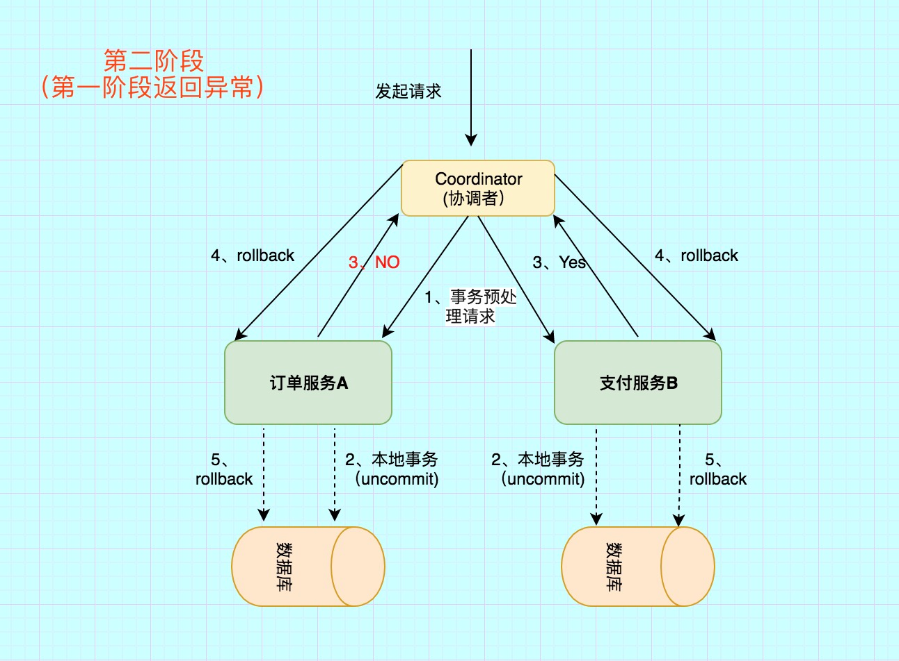

# 两阶段提交(2PC)/XA    
2PC是一个非常经典的强一致、中心化的原子提交协议。
中心化是指协议中有两类节点：一个是中心化协调者节点（coordinator）和N个参与者节点（partcipant）

两个阶段：第一阶段：投票阶段 和第二阶段：提交/执行阶段。
1. 第一阶段（prepare）：即所有的参与者RM准备执行事务并锁住需要的资源。参与者ready时，向TM报告已准备就绪。
2. 第二阶段 (commit/rollback)：当事务管理者(TM)确认所有参与者(RM)都ready后，向所有参与者发送commit命令。

## 应用
目前主流的数据库基本都支持XA事务，包括mysql、oracle、sqlserver、postgre

## X/Open Distributed Transaction Processing (DTP标准分布式事务) Model (X/Open XA)

- XA是由X/Open组织提出的分布式事务的规范。 XA规范主要定义了(全局)事务管理器(TM)和(局 部)资源管理器(RM)之间的接口。主流的关系型 数据库产品都是实现了XA接口的。

- XA接口是双向的系统接口，在事务管理器 （TM）以及一个或多个资源管理器（RM）之 间形成通信桥梁。

- XA之所以需要引入事务管理器是因为，在分布 式系统中，从理论上讲两台机器理论上无法达 到一致的状态，需要引入一个单点进行协调。

- 由全局事务管理器管理和协调的事务，可以跨 越多个资源（如数据库或JMS队列）和进程。 全局事务管理器一般使用 XA 二阶段提交协议 与数据库进行交互。

资源管理器RM（resource manager）：用来管理系统资源，是通向事务资源的途径。数据库就是一种资源管理器。资源管理还应该具有管理事务提交或回滚的能力

### 了解规范
有个叫做 The Open Group 的组织，制定了一个叫做 X/Open Distributed Transaction Processing (DTP) Model，简称 X/Open XA ，（呃，这个组织的名字和这个缩写。。。），已经成为事实上的事务模型组件的行为标准。
这个标准里描述了 global transaction manager 和 local resource manager 之间的接口。。 XA 的目标是允许多个资源（数据库， 应用服务器， 消息队列， 事务缓存等）可以在一个事务中处理，同时跨应用满足 ACID 属性。
这里，其实就需要分两部分来描述清楚了。第一部分是关于这个模型，第二部分，是这个模型主要使用的两步提交算法（与之对应的，还有三步提交算法，TCC）

## 1、第一阶段：投票阶段

订单服务A，需要调用 支付服务B 去支付，支付成功则处理购物订单为待发货状态，否则就需要将购物订单处理为失败状态

1. 事务询问

协调者 向所有的 参与者 发送事务预处理请求，称之为Prepare，并开始等待各 参与者 的响应。

2. 执行本地事务

各个 参与者 节点执行本地事务操作,但在执行完成后并不会真正提交数据库本地事务，而是先向 协调者 报告说：“我这边可以处理了/我这边不能处理”。.

3. 各参与者向协调者反馈事务询问的响应

如果 参与者 成功执行了事务操作,那么就反馈给协调者 Yes 响应,表示事务可以执行,如果没有 参与者 成功执行事务,那么就反馈给协调者 No 响应,表示事务不可以执行

## 2.第二阶段：提交/执行阶段
### 成功流程

### 失败流程

## 2PC缺点

1. 性能问题

无论是在第一阶段的过程中,还是在第二阶段,所有的参与者资源和协调者资源都是被锁住的,只有当所有节点准备完毕，事务 协调者 才会通知进行全局提交，

参与者 进行本地事务提交后才会释放资源。这样的过程会比较漫长，对性能影响比较大。

2. 单节点故障

由于协调者的重要性，一旦 协调者 发生故障。参与者 会一直阻塞下去。尤其在第二阶段，协调者 发生故障，那么所有的 参与者 还都处于

锁定事务资源的状态中，而无法继续完成事务操作。（虽然协调者挂掉，可以重新选举一个协调者，但是无法解决因为协调者宕机导致的参与者处于阻塞状态的问题）
    
2PC出现单点问题的三种情况
    
    (1) 协调者正常,参与者宕机
    
     由于 协调者 无法收集到所有 参与者 的反馈，会陷入阻塞情况。
    
     解决方案:引入超时机制,如果协调者在超过指定的时间还没有收到参与者的反馈,事务就失败,向所有节点发送终止事务请求。
    
    (2) 协调者宕机,参与者正常
    
     无论处于哪个阶段，由于协调者宕机，无法发送提交请求，所有处于执行了操作但是未提交状态的参与者都会陷入阻塞情况.
    
     解决方案:引入协调者备份,同时协调者需记录操作日志.当检测到协调者宕机一段时间后，协调者备份取代协调者，并读取操作日志，向所有参与者询问状态。
    
    (3) 协调者和参与者都宕机
    
    1)发生在第一阶段： 因为第一阶段，所有参与者都没有真正执行commit，所以只需重新在剩余的参与者中重新选出一个协调者，新的协调者在重新执行第一阶段和第二阶段就可以了。

    2)发生在第二阶段 并且 挂了的参与者在挂掉之前没有收到协调者的指令。也就是上面的第4步挂了，这是可能协调者还没有发送第4步就挂了。这种情形下，新的协调者重新执行第一阶段和第二阶段操作。
    
    3)发生在第二阶段 并且 有部分参与者已经执行完commit操作。就好比这里订单服务A和支付服务B都收到协调者 发送的commit信息，开始真正执行本地事务commit,
    但突发情况，Acommit成功，B确挂了。这个时候目前来讲数据是不一致的。虽然这个时候可以再通过手段让他和协调者通信，再想办法把数据搞成一致的，但是，这段时间内他的数据状态已经是不一致的了！ 2PC 无法解决这个问题。

## 2pc代码参考案例

- MemoryQueue: 用于模拟消息队列，接收事件分发事件
- Worker: 模拟具体业务服务，接收消息，存入本地延迟更新存储，或者提交事务触发业务回调

# 三阶段提交

为了解决两阶段提交的问题，三阶段提交做了改进：

- 在协调节点和事务参与者都引入了超时机制。
- 第一阶段的 prepare 阶段分成了两步，canCommit 和 preCommit。

    