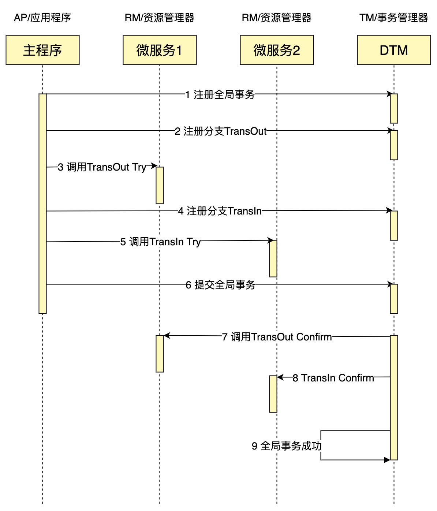
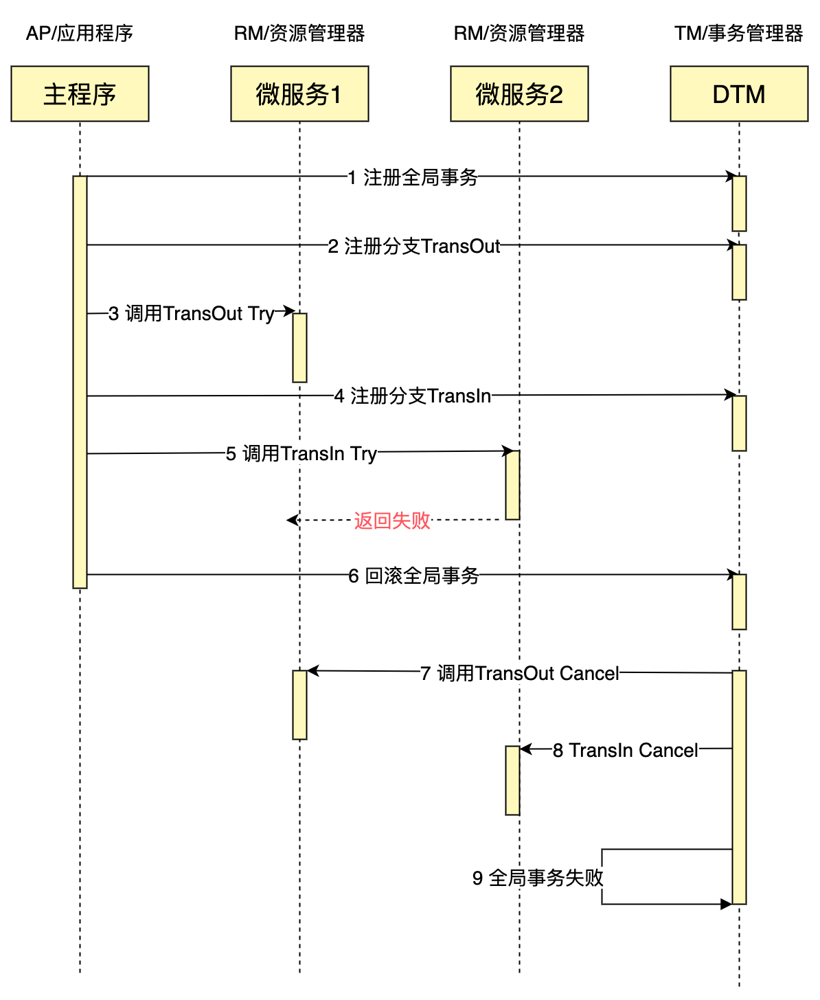

<!-- START doctoc generated TOC please keep comment here to allow auto update -->
<!-- DON'T EDIT THIS SECTION, INSTEAD RE-RUN doctoc TO UPDATE -->
**Table of Contents**  *generated with [DocToc](https://github.com/thlorenz/doctoc)*

- [TCC事务模式](#tcc%E4%BA%8B%E5%8A%A1%E6%A8%A1%E5%BC%8F)
  - [构成](#%E6%9E%84%E6%88%90)
  - [TCC 设计原则](#tcc-%E8%AE%BE%E8%AE%A1%E5%8E%9F%E5%88%99)

<!-- END doctoc generated TOC please keep comment here to allow auto update -->

# TCC事务模式
TCC是Try、Confirm、Cancel三个词语的缩写，最早是由 Pat Helland 于 2007 年发表的一篇名为《Life beyond Distributed Transactions:an Apostate’s Opinion》的论文提出。

## 构成
TCC分为3个阶段

- Try 阶段：尝试执行，完成所有业务检查（一致性）, 预留必须业务资源（准隔离性）
- Confirm 阶段：如果所有分支的Try都成功了，则走到Confirm阶段。Confirm真正执行业务，不作任何业务检查，只使用 Try 阶段预留的业务资源
- Cancel 阶段：如果所有分支的Try有一个失败了，则走到Cancel阶段。Cancel释放 Try 阶段预留的业务资源。

如果我们要进行一个类似于银行跨行转账的业务，转出（TransOut）和转入（TransIn）分别在不同的微服务里，一个成功完成的TCC事务典型的时序图如下

## TCC 设计原则
在设计上，TCC主要用于处理一致性要求较高、需要较多灵活性的短事务：

对于我们的 A 跨行转账给 B 的场景，如果采用SAGA，在正向操作中调余额，在补偿操作中，反向调整余额，那么会出现这种情况：如果A扣款成功，金额转入B失败，最后回滚，把A的余额调整为初始值。整个过程中如果A发现自己的余额被扣减了，但是收款方B迟迟没有收到资金，那么会对A造成非常大的困扰。

上述需求在SAGA中无法解决，但是可以通过TCC来解决，设计技巧如下：

在账户中的 balance 字段之外，再引入一个 trading_balance 字段
- Try 阶段检查账户是否被冻结，检查账户余额是否充足，没问题后，调整 trading_balance （即业务上的冻结资金）
- Confirm 阶段，调整 balance ，调整 trading_balance （即业务上的解冻资金）
- Cancel 阶段，调整 trading_balance （即业务上的解冻资金）
这种情况下，终端用户 A 就不会看到自己的余额扣减了，但是 B 又迟迟收不到资金的情况