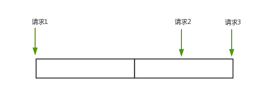
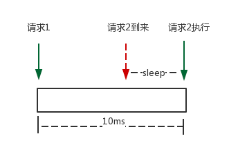

<!-- START doctoc generated TOC please keep comment here to allow auto update -->
<!-- DON'T EDIT THIS SECTION, INSTEAD RE-RUN doctoc TO UPDATE -->
**Table of Contents**  *generated with [DocToc](https://github.com/thlorenz/doctoc)*

- [uber-go/ratelimit](#uber-goratelimit)
  - [初始化](#%E5%88%9D%E5%A7%8B%E5%8C%96)
  - [限流接口](#%E9%99%90%E6%B5%81%E6%8E%A5%E5%8F%A3)
  - [参考](#%E5%8F%82%E8%80%83)

<!-- END doctoc generated TOC please keep comment here to allow auto update -->

# uber-go/ratelimit

组件基于 Leaky Bucket(漏桶) 实现. 漏桶可以看作是一个带有常量服务时间的单服务器队列，

相比于 TokenBucket 中，只要桶内还有剩余令牌，调用方就可以一直消费的策略。Leaky Bucket 相对来说更加严格，调用方只能严格按照预定的间隔顺序进行消费调用。


uber 对基于漏桶实现的 ratelimit 进行了一些优化，让其限流更加的平滑.uber 对基于漏桶实现的 ratelimit 进行了一些优化，让其限流更加的平滑

## 初始化

```go
// go.uber.org/ratelimit@v0.3.1/ratelimit.go
func New(rate int, opts ...Option) Limiter {
	return newAtomicInt64Based(rate, opts...)
}
```

提供了 atomic 和 mutex 两个版本.

这里默认用原子版本
```go
func newAtomicInt64Based(rate int, opts ...Option) *atomicInt64Limiter {
	// TODO consider moving config building to the implementation
	// independent code.
	config := buildConfig(opts)
	perRequest := config.per / time.Duration(rate) // 计算产生一个令牌话费的时间
	l := &atomicInt64Limiter{
		perRequest: perRequest,
		maxSlack:   time.Duration(config.slack) * perRequest,
		clock:      config.clock,
	}
	atomic.StoreInt64(&l.state, 0)
	return l
}


func buildConfig(opts []Option) config {
	c := config{
		clock: clock.New(),
		slack: 10,  // 最大松弛量 (maxSlack)
		per:   time.Second,  // 默认 1 s 
	}

	for _, opt := range opts {
		opt.apply(&c)
	}
	return c
}

```


传统的 Leaky Bucket 每个请求的间隔是固定的，然而在实际上的互联网应用中，流量经常是突发性的。
对于这种情况，uber-go 对 Leaky Bucket 做了一些改良，引入了最大松弛量 (maxSlack) 的概念。


请求 1 完成后，15ms 后，请求 2 才到来，可以对请求 2 立即处理。请求 2 完成后，5ms 后，请求 3 到来，这个时候距离上次请求还不足 10ms，因此还需要等待 5ms。

但是，对于这种情况，实际上三个请求一共消耗了 25ms 才完成，并不是预期的 20ms。在 uber-go 实现的 ratelimit 中，可以把之前间隔比较长的请求的时间，匀给后面的使用，保证每秒请求数 (RPS) 即可。

对于以上 case，因为请求 2 相当于多等了 5ms，我们可以把这 5ms 移给请求 3 使用。加上请求 3 本身就是 5ms 之后过来的，一共刚好 10ms，所以请求 3 无需等待，直接可以处理。此时三个请求也恰好一共是 20ms



## 限流接口
```go
type Limiter interface {
	// Take should block to make sure that the RPS is met.
	Take() time.Time
}

```

当请求 1 处理结束后, 我们记录下请求 1 的处理完成的时刻, 记为 limiter.last。
稍后请求 2 到来, 如果此刻的时间与 limiter.last 相比并没有达到 perRequest 的间隔大小，那么 sleep 一段时间即可。



实现
```go
func (t *atomicInt64Limiter) Take() time.Time {
	var (
		newTimeOfNextPermissionIssue int64
		now                          int64
	)
	for {
		// 获取当前时间
		now = t.clock.Now().UnixNano()
		// 上一次允许请求时间
		timeOfNextPermissionIssue := atomic.LoadInt64(&t.state)

		switch {
		// 如果第一次启动 或则 (最大松弛量为0且 本次请求时间与上次放行时间 > 时间间隔时即可放行，并记录本次访问时间)
		case timeOfNextPermissionIssue == 0 || (t.maxSlack == 0 && now-timeOfNextPermissionIssue > int64(t.perRequest)):
			// if this is our first call or t.maxSlack == 0 we need to shrink issue time to now
			newTimeOfNextPermissionIssue = now
			
        //  最大松弛量 大于0, 且上次请求相隔较长时，后续的大量请求会被直接放行
		case t.maxSlack > 0 && now-timeOfNextPermissionIssue > int64(t.maxSlack)+int64(t.perRequest):
			// a lot of nanoseconds passed since the last Take call
			// we will limit max accumulated time to maxSlack
			newTimeOfNextPermissionIssue = now - int64(t.maxSlack)
		default:
			// calculate the time at which our permission was issued
			newTimeOfNextPermissionIssue = timeOfNextPermissionIssue + int64(t.perRequest)
		}

		if atomic.CompareAndSwapInt64(&t.state, timeOfNextPermissionIssue, newTimeOfNextPermissionIssue) {
			break
		}
	}

	sleepDuration := time.Duration(newTimeOfNextPermissionIssue - now)
	if sleepDuration > 0 {
		t.clock.Sleep(sleepDuration)
		return time.Unix(0, newTimeOfNextPermissionIssue)
	}
	// return now if we don't sleep as atomicLimiter does
	return time.Unix(0, now)
}

```


## 参考

- [uber-go 漏桶限流器使用与原理分析](https://www.cyhone.com/articles/analysis-of-uber-go-ratelimit/)
- [开源限流组件分析（一）：Uber 的 Leaky Bucket](https://pandaychen.github.io/2020/07/31/A-UBER-LEAKY-BUCKET-LIMITER-ANALYSIS/)