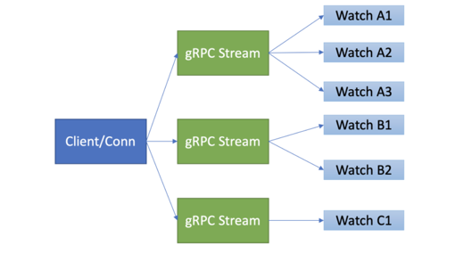
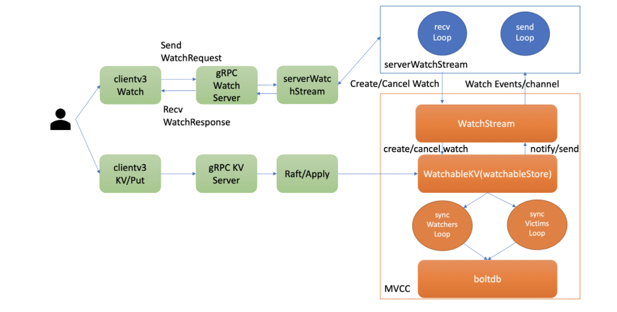
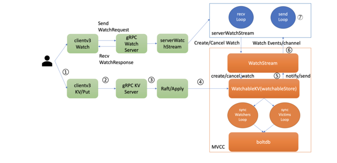
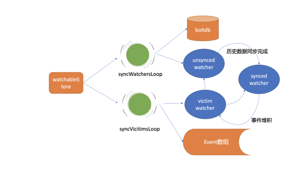
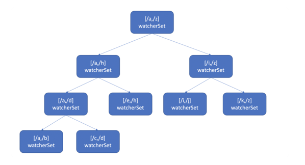

# etcd的watch机制

在 Kubernetes 中，各种各样的控制器实现了 Deployment、StatefulSet、Job 等功能强大的 Workload。控制器的核心思想是监听、比较资源实际状态与期望状态是否一致，若不一致则进行协调工作，使其最终一致。


## 基本使用
```

$ etcdctl put hello world1
$ etcdctl put hello world2
$ etcdctl watch hello -w=json --rev=1
{
    "Events":[
        {
            "kv":{
                "key":"aGVsbG8=",
                "create_revision":2,
                "mod_revision":2,
                "version":1,
                "value":"d29ybGQx"
            }
        },
        {
            "kv":{
                "key":"aGVsbG8=",
                "create_revision":2,
                "mod_revision":3,
                "version":2,
                "value":"d29ybGQy"
            }
        }
    ],
    "CompactRevision":0,
    "Canceled":false,
    "Created":false
}
```

## 源码proto
```protobuf
// api/etcdserverpb/rpc.proto 66 行
service Watch {
  // Watch watches for events happening or that have happened. Both input and output
  // are streams; the input stream is for creating and canceling watchers and the output
  // stream sends events. One watch RPC can watch on multiple key ranges, streaming events
  // for several watches at once. The entire event history can be watched starting from the
  // last compaction revision.
  rpc Watch(stream WatchRequest) returns (stream WatchResponse) {
      option (google.api.http) = {
        post: "/v3/watch"
        body: "*"
    }; 
  }
}
```


## 四大核心问题
1. client 获取事件的机制，etcd 是使用轮询模式还是推送模式呢？两者各有什么优缺点？

2. 事件是如何存储的？ 会保留多久？watch 命令中的版本号具有什么作用？

3. 当 client 和 server 端出现短暂网络波动等异常因素后，导致事件堆积时，server 端会丢弃事件吗？若你监听的历史版本号 server 端不存在了，你的代码该如何处理？

4. 如果你创建了上万个 watcher 监听 key 变化，当 server 端收到一个写请求后，etcd 是如何根据变化的 key 快速找到监听它的 watcher 呢？


## 问题一回答：分析获取事件的机制 (轮询 vs 流式推送)

在 etcd v2 Watch 机制实现中，使用的是 HTTP/1.x 协议，实现简单、兼容性好，每个 watcher 对应一个 TCP 连接。client 通过 HTTP/1.1 协议长连接定时轮询 server，获取最新的数据变化事件。

然而当你的 watcher 成千上万的时，即使集群空负载，大量轮询也会产生一定的 QPS，server 端会消耗大量的 socket、内存等资源，导致 etcd 的扩展性、稳定性无法满足 Kubernetes 等业务场景诉求。

在 etcd v3 中，为了解决 etcd v2 的以上缺陷，使用的是基于 HTTP/2 的 gRPC 协议，双向流的 Watch API 设计，实现了连接多路复用。


etcd 基于HTTP/2 协议的多路复用等机制，实现了一个 client/TCP 连接支持多 gRPC Stream， 一个 gRPC Stream 又支持多个 watcher，
如下图所示。同时事件通知模式也从 client 轮询优化成 server 流式推送，极大降低了 server 端 socket、内存等资源。

在 clientv3 库中，Watch 特性被抽象成 Watch、Close、RequestProgress 三个简单 API 提供给开发者使用，屏蔽了 client 与 gRPC WatchServer 交互的复杂细节，
实现了一个 client 支持多个 gRPC Stream，一个 gRPC Stream 支持多个 watcher，显著降低了你的开发复杂度。

同时当 watch 连接的节点故障，clientv3 库支持自动重连到健康节点，并使用之前已接收的最大版本号创建新的 watcher，避免旧事件回放等。


## 问题二回答：滑动窗口 vs MVCC

第二个问题的本质是历史版本存储，etcd 经历了从滑动窗口到 MVCC 机制的演变，滑动窗口是仅保存有限的最近历史版本到内存中，
而 MVCC 机制则将历史版本保存在磁盘中，避免了历史版本的丢失，极大的提升了 Watch 机制的可靠性。


## 问题三回答：可靠事件推送机制


第三个问题的本质是可靠事件推送机制。

### 监听流程
```go
// server/etcdserver/api/v3rpc/watch.go 152行
func (ws *watchServer) Watch(stream pb.Watch_WatchServer) (err error) {
	sws := serverWatchStream{
		lg: ws.lg,

		clusterID: ws.clusterID,
		memberID:  ws.memberID,

		maxRequestBytes: ws.maxRequestBytes,

		sg:        ws.sg,
		watchable: ws.watchable,
		ag:        ws.ag,

		gRPCStream:  stream,
		watchStream: ws.watchable.NewWatchStream(),
		// chan for sending control response like watcher created and canceled.
		ctrlStream: make(chan *pb.WatchResponse, ctrlStreamBufLen),

		progress: make(map[mvcc.WatchID]bool),
		prevKV:   make(map[mvcc.WatchID]bool),
		fragment: make(map[mvcc.WatchID]bool),

		closec: make(chan struct{}),
	}

	sws.wg.Add(1)
    // 第一个 goroutine sendLoop 
	go func() {
		sws.sendLoop()
		sws.wg.Done()
	}()

	errc := make(chan error, 1)
    // 第二个 goroutine recvLoop
	go func() {
		if rerr := sws.recvLoop(); rerr != nil {
			if isClientCtxErr(stream.Context().Err(), rerr) {
				sws.lg.Debug("failed to receive watch request from gRPC stream", zap.Error(rerr))
			} else {
				sws.lg.Warn("failed to receive watch request from gRPC stream", zap.Error(rerr))
				streamFailures.WithLabelValues("receive", "watch").Inc()
			}
			errc <- rerr
		}
	}()


	select {
	case err = <-errc:
		if err == context.Canceled {
			err = rpctypes.ErrGRPCWatchCanceled
		}
		close(sws.ctrlStream)
	case <-stream.Context().Done():
		err = stream.Context().Err()
		if err == context.Canceled {
			err = rpctypes.ErrGRPCWatchCanceled
		}
	}

	sws.close()
	return err
}
```
在 etcd 启动的时候，WatchableKV 模块会运行 syncWatchersLoop 和 syncVictimsLoop goroutine，分别负责不同场景下的事件推送，它们也是 Watch 特性可靠性的核心之一。


1. 当你通过 etcdctl 或 API 发起一个 watch key 请求的时候，etcd 的 gRPCWatchServer 收到 watch 请求后，
会创建一个 serverWatchStream, 它负责接收 client 的 gRPC Stream 的 create/cancel watcher 请求 (recvLoop goroutine)，
并将从 MVCC 模块接收的 Watch 事件转发给 client(sendLoop goroutine)。

2. 当 serverWatchStream 收到 create watcher 请求后，serverWatchStream 会调用 MVCC 模块的 WatchStream 子模块分配一个 watcher id，
   并将 watcher 注册到 MVCC 的 WatchableKV 模块。
   
### 监听的相关概念

- synced watcher，顾名思义，表示此类 watcher 监听的数据都已经同步完毕，在等待新的变更。

- unsynced watcher，表示此类 watcher 监听的数据还未同步完成，落后于当前最新数据变更，正在努力追赶

如果你创建的 watcher 未指定版本号 (默认 0)、或指定的版本号大于 etcd sever 当前最新的版本号 (currentRev)，那么它就会保存到 synced watcherGroup 中。
watcherGroup 负责管理多个 watcher，能够根据 key 快速找到监听该 key 的一个或多个 watcher。


我们可以将可靠的事件推送机制拆分成最新事件推送、异常场景重试、历史事件推送机制三个子问题来进行分析.

### 1. 最新事件推送机制

当你创建完成 watcher 后，此时你执行 put hello 修改操作时，如上图所示，请求经过 KVServer、Raft 模块后 Apply 到状态机时，在 MVCC 的 put 事务中，它会将本次修改的后的 mvccpb.KeyValue 保存到一个 changes 数组中。

在 put 事务结束时，如下面的精简代码所示，它会将 KeyValue 转换成 Event 事件，然后回调 watchableStore.notify 函数（流程 5）。
```go

evs := make([]mvccpb.Event, len(changes))
for i, change := range changes {
   evs[i].Kv = &changes[i]
   if change.CreateRevision == 0 {
      evs[i].Type = mvccpb.DELETE
      evs[i].Kv.ModRevision = rev
   } else {
      evs[i].Type = mvccpb.PUT
   }
}
tw.s.notify(rev, evs)
```

notify 会匹配出监听过此 key 并处于 synced watcherGroup 中的 watcher，同时事件中的版本号要大于等于 watcher 监听的最小版本号，才能将事件发送到此 watcher 的事件 channel 中。

serverWatchStream 的 sendLoop goroutine 监听到 channel 消息后，读出消息立即推送给 client（流程 6 和 7），至此，完成一个最新修改事件推送。

注意接收 Watch 事件 channel 的 buffer 容量默认 1024(etcd v3.4.9)。若 client 与 server 端因网络波动、高负载等原因导致推送缓慢，buffer 满了，事件会丢失吗？

### 2. 异常场景重试机制


若出现 channel buffer 满了，etcd 为了保证 Watch 事件的高可靠性，并不会丢弃它，
而是将此 watcher 从 synced watcherGroup 中删除，然后将此 watcher 和事件列表保存到一个名为受害者 victim 的 watcherBatch 结构中，通过异步机制重试保证事件的可靠性。

WatchableKV 模块会启动两个异步 goroutine，其中一个是 syncVictimsLoop，正是它负责 slower watcher 的堆积的事件推送。

它的基本工作原理是，遍历 victim watcherBatch 数据结构，尝试将堆积的事件再次推送到 watcher 的接收 channel 中。若推送失败，则再次加入到 victim watcherBatch 数据结构中等待下次重试。

若推送成功，watcher 监听的最小版本号 (minRev) 小于等于 server 当前版本号 (currentRev)，说明可能还有历史事件未推送，需加入到 unsynced watcherGroup 中，由下面介绍的历史事件推送机制，推送 minRev 到 currentRev 之间的事件。


若 watcher 的最小版本号大于 server 当前版本号，则加入到 synced watcher 集合中，进入上面介绍的最新事件通知机制。
### 3. 历史事件推送机制

WatchableKV 模块的另一个 goroutine，syncWatchersLoop，正是负责 unsynced watcherGroup 中的 watcher 历史事件推送。


#### 在历史事件推送机制中，如果你监听老的版本号已经被 etcd 压缩了，client 该如何处理？

syncWatchersLoop，它会遍历处于 unsynced watcherGroup 中的每个 watcher，为了优化性能，它会选择一批 unsynced watcher 批量同步，找出这一批 unsynced watcher 中监听的最小版本号

因 boltdb 的 key 是按版本号存储的，因此可通过指定查询的 key 范围的最小版本号作为开始区间，当前 server 最大版本号作为结束区间，遍历 boltdb 获得所有历史数据。

然后将 KeyValue 结构转换成事件，匹配出监听过事件中 key 的 watcher 后，将事件发送给对应的 watcher 事件接收 channel 即可。
发送完成后，watcher 从 unsynced watcherGroup 中移除、添加到 synced watcherGroup 中，如下面的 watcher 状态转换图黑色虚线框所示

若 watcher 监听的版本号已经小于当前 etcd server 压缩的版本号，历史变更数据就可能已丢失，因此 etcd server 会返回 ErrCompacted 错误给 client。client 收到此错误后，需重新获取数据最新版本号后，再次 Watch。


### 问题四回答：高效的事件匹配

那使用什么数据结构来快速查找哪些 watcher 监听了一个事件中的 key 呢？

也许你会说使用 map 记录下哪些 watcher 监听了什么 key 不就可以了吗？ 
1. etcd 的确使用 map 记录了监听单个 key 的 watcher，
2. 但是你要注意的是 Watch 特性不仅仅可以监听单 key，它还可以指定监听 key 范围、key 前缀，因此 etcd 还使用了如下的区间树。



当产生一个事件时，etcd 首先需要从 map 查找是否有 watcher 监听了单 key，其次它还需要从区间树找出与此 key 相交的所有区间，然后从区间的值获取监听的 watcher 集合

区间树支持快速查找一个 key 是否在某个区间内，时间复杂度 O(LogN)，因此 etcd 基于 map 和区间树实现了 watcher 与事件快速匹配，具备良好的扩展性。


