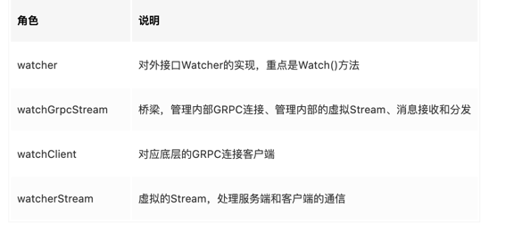

<!-- START doctoc generated TOC please keep comment here to allow auto update -->
<!-- DON'T EDIT THIS SECTION, INSTEAD RE-RUN doctoc TO UPDATE -->
**Table of Contents**  *generated with [DocToc](https://github.com/thlorenz/doctoc)*

- [etcd的watch机制](#etcd%E7%9A%84watch%E6%9C%BA%E5%88%B6)
  - [基本使用](#%E5%9F%BA%E6%9C%AC%E4%BD%BF%E7%94%A8)
  - [源码proto](#%E6%BA%90%E7%A0%81proto)
  - [四大核心问题](#%E5%9B%9B%E5%A4%A7%E6%A0%B8%E5%BF%83%E9%97%AE%E9%A2%98)
  - [问题一回答：分析获取事件的机制 (轮询 vs 流式推送)](#%E9%97%AE%E9%A2%98%E4%B8%80%E5%9B%9E%E7%AD%94%E5%88%86%E6%9E%90%E8%8E%B7%E5%8F%96%E4%BA%8B%E4%BB%B6%E7%9A%84%E6%9C%BA%E5%88%B6-%E8%BD%AE%E8%AF%A2-vs-%E6%B5%81%E5%BC%8F%E6%8E%A8%E9%80%81)
  - [问题二回答：滑动窗口 vs MVCC](#%E9%97%AE%E9%A2%98%E4%BA%8C%E5%9B%9E%E7%AD%94%E6%BB%91%E5%8A%A8%E7%AA%97%E5%8F%A3-vs-mvcc)
  - [问题三回答：可靠事件推送机制](#%E9%97%AE%E9%A2%98%E4%B8%89%E5%9B%9E%E7%AD%94%E5%8F%AF%E9%9D%A0%E4%BA%8B%E4%BB%B6%E6%8E%A8%E9%80%81%E6%9C%BA%E5%88%B6)
    - [服务端监听流程](#%E6%9C%8D%E5%8A%A1%E7%AB%AF%E7%9B%91%E5%90%AC%E6%B5%81%E7%A8%8B)
    - [监听的相关概念](#%E7%9B%91%E5%90%AC%E7%9A%84%E7%9B%B8%E5%85%B3%E6%A6%82%E5%BF%B5)
    - [1. 最新事件推送机制](#1-%E6%9C%80%E6%96%B0%E4%BA%8B%E4%BB%B6%E6%8E%A8%E9%80%81%E6%9C%BA%E5%88%B6)
    - [2. 异常场景重试机制](#2-%E5%BC%82%E5%B8%B8%E5%9C%BA%E6%99%AF%E9%87%8D%E8%AF%95%E6%9C%BA%E5%88%B6)
    - [3. 历史事件推送机制](#3-%E5%8E%86%E5%8F%B2%E4%BA%8B%E4%BB%B6%E6%8E%A8%E9%80%81%E6%9C%BA%E5%88%B6)
      - [在历史事件推送机制中，如果你监听老的版本号已经被 etcd 压缩了，client 该如何处理？](#%E5%9C%A8%E5%8E%86%E5%8F%B2%E4%BA%8B%E4%BB%B6%E6%8E%A8%E9%80%81%E6%9C%BA%E5%88%B6%E4%B8%AD%E5%A6%82%E6%9E%9C%E4%BD%A0%E7%9B%91%E5%90%AC%E8%80%81%E7%9A%84%E7%89%88%E6%9C%AC%E5%8F%B7%E5%B7%B2%E7%BB%8F%E8%A2%AB-etcd-%E5%8E%8B%E7%BC%A9%E4%BA%86client-%E8%AF%A5%E5%A6%82%E4%BD%95%E5%A4%84%E7%90%86)
    - [问题四回答：高效的事件匹配](#%E9%97%AE%E9%A2%98%E5%9B%9B%E5%9B%9E%E7%AD%94%E9%AB%98%E6%95%88%E7%9A%84%E4%BA%8B%E4%BB%B6%E5%8C%B9%E9%85%8D)
  - [watch的proto文件](#watch%E7%9A%84proto%E6%96%87%E4%BB%B6)
  - [client的watch流程源码](#client%E7%9A%84watch%E6%B5%81%E7%A8%8B%E6%BA%90%E7%A0%81)
    - [当wgs == nil创建watchGrpcStream](#%E5%BD%93wgs--nil%E5%88%9B%E5%BB%BAwatchgrpcstream)

<!-- END doctoc generated TOC please keep comment here to allow auto update -->

# etcd的watch机制

在 Kubernetes 中，各种各样的控制器实现了 Deployment、StatefulSet、Job 等功能强大的 Workload。控制器的核心思想是监听、比较资源实际状态与期望状态是否一致，若不一致则进行协调工作，使其最终一致。


## 基本使用
```

$ etcdctl put hello world1
$ etcdctl put hello world2
$ etcdctl watch hello -w=json --rev=1
{
    "Events":[
        {
            "kv":{
                "key":"aGVsbG8=",
                "create_revision":2,
                "mod_revision":2,
                "version":1,
                "value":"d29ybGQx"
            }
        },
        {
            "kv":{
                "key":"aGVsbG8=",
                "create_revision":2,
                "mod_revision":3,
                "version":2,
                "value":"d29ybGQy"
            }
        }
    ],
    "CompactRevision":0,
    "Canceled":false,
    "Created":false
}
```

## 源码proto
```protobuf
// api/etcdserverpb/rpc.proto 66 行
service Watch {
  // Watch watches for events happening or that have happened. Both input and output
  // are streams; the input stream is for creating and canceling watchers and the output
  // stream sends events. One watch RPC can watch on multiple key ranges, streaming events
  // for several watches at once. The entire event history can be watched starting from the
  // last compaction revision.
  rpc Watch(stream WatchRequest) returns (stream WatchResponse) {
      option (google.api.http) = {
        post: "/v3/watch"
        body: "*"
    }; 
  }
}
```


## 四大核心问题
1. client 获取事件的机制，etcd 是使用轮询模式还是推送模式呢？两者各有什么优缺点？

2. 事件是如何存储的？ 会保留多久？watch 命令中的版本号具有什么作用？

3. 当 client 和 server 端出现短暂网络波动等异常因素后，导致事件堆积时，server 端会丢弃事件吗？若你监听的历史版本号 server 端不存在了，你的代码该如何处理？

4. 如果你创建了上万个 watcher 监听 key 变化，当 server 端收到一个写请求后，etcd 是如何根据变化的 key 快速找到监听它的 watcher 呢？


## 问题一回答：分析获取事件的机制 (轮询 vs 流式推送)

在 etcd v2 Watch 机制实现中，使用的是 HTTP/1.x 协议，实现简单、兼容性好，每个 watcher 对应一个 TCP 连接。client 通过 HTTP/1.1 协议长连接定时轮询 server，获取最新的数据变化事件。

然而当你的 watcher 成千上万的时，即使集群空负载，大量轮询也会产生一定的 QPS，server 端会消耗大量的 socket、内存等资源，导致 etcd 的扩展性、稳定性无法满足 Kubernetes 等业务场景诉求。

在 etcd v3 中，为了解决 etcd v2 的以上缺陷，使用的是基于 HTTP/2 的 gRPC 协议，双向流的 Watch API 设计，实现了连接多路复用。


etcd 基于HTTP/2 协议的多路复用等机制，实现了一个 client/TCP 连接支持多 gRPC Stream， 一个 gRPC Stream 又支持多个 watcher，
如下图所示。同时事件通知模式也从 client 轮询优化成 server 流式推送，极大降低了 server 端 socket、内存等资源。

在 clientv3 库中，Watch 特性被抽象成 Watch、Close、RequestProgress 三个简单 API 提供给开发者使用，屏蔽了 client 与 gRPC WatchServer 交互的复杂细节，
实现了一个 client 支持多个 gRPC Stream，一个 gRPC Stream 支持多个 watcher，显著降低了你的开发复杂度。

同时当 watch 连接的节点故障，clientv3 库支持自动重连到健康节点，并使用之前已接收的最大版本号创建新的 watcher，避免旧事件回放等。


## 问题二回答：滑动窗口 vs MVCC

第二个问题的本质是历史版本存储，etcd 经历了从滑动窗口到 MVCC 机制的演变，滑动窗口是仅保存有限的最近历史版本到内存中，
而 MVCC 机制则将历史版本保存在磁盘中，避免了历史版本的丢失，极大的提升了 Watch 机制的可靠性。


## 问题三回答：可靠事件推送机制


第三个问题的本质是可靠事件推送机制。

### 服务端监听流程
```go
// server/etcdserver/api/v3rpc/watch.go 152行
func (ws *watchServer) Watch(stream pb.Watch_WatchServer) (err error) {
	sws := serverWatchStream{
		lg: ws.lg,

		clusterID: ws.clusterID,
		memberID:  ws.memberID,

		maxRequestBytes: ws.maxRequestBytes,

		sg:        ws.sg,
		watchable: ws.watchable,
		ag:        ws.ag,

		gRPCStream:  stream,
		watchStream: ws.watchable.NewWatchStream(),
		// chan for sending control response like watcher created and canceled.
		ctrlStream: make(chan *pb.WatchResponse, ctrlStreamBufLen),

		progress: make(map[mvcc.WatchID]bool),
		prevKV:   make(map[mvcc.WatchID]bool),
		fragment: make(map[mvcc.WatchID]bool),

		closec: make(chan struct{}),
	}

	sws.wg.Add(1)
    // 第一个 goroutine sendLoop 
	go func() {
		sws.sendLoop()
		sws.wg.Done()
	}()

	errc := make(chan error, 1)
    // 第二个 goroutine recvLoop
	go func() {
		if rerr := sws.recvLoop(); rerr != nil {
			if isClientCtxErr(stream.Context().Err(), rerr) {
				sws.lg.Debug("failed to receive watch request from gRPC stream", zap.Error(rerr))
			} else {
				sws.lg.Warn("failed to receive watch request from gRPC stream", zap.Error(rerr))
				streamFailures.WithLabelValues("receive", "watch").Inc()
			}
			errc <- rerr
		}
	}()


	select {
	case err = <-errc:
		if err == context.Canceled {
			err = rpctypes.ErrGRPCWatchCanceled
		}
		close(sws.ctrlStream)
	case <-stream.Context().Done():
		err = stream.Context().Err()
		if err == context.Canceled {
			err = rpctypes.ErrGRPCWatchCanceled
		}
	}

	sws.close()
	return err
}
```
在 etcd 启动的时候，WatchableKV 模块会运行 syncWatchersLoop 和 syncVictimsLoop goroutine，分别负责不同场景下的事件推送，它们也是 Watch 特性可靠性的核心之一。


1. 当你通过 etcdctl 或 API 发起一个 watch key 请求的时候，etcd 的 gRPCWatchServer 收到 watch 请求后，
会创建一个 serverWatchStream, 它负责接收 client 的 gRPC Stream 的 create/cancel watcher 请求 (recvLoop goroutine)，
并将从 MVCC 模块接收的 Watch 事件转发给 client(sendLoop goroutine)。

2. 当 serverWatchStream 收到 create watcher 请求后，serverWatchStream 会调用 MVCC 模块的 WatchStream 子模块分配一个 watcher id，
   并将 watcher 注册到 MVCC 的 WatchableKV 模块。
### 监听的相关概念

- synced watcher，顾名思义，表示此类 watcher 监听的数据都已经同步完毕，在等待新的变更。

- unsynced watcher，表示此类 watcher 监听的数据还未同步完成，落后于当前最新数据变更，正在努力追赶

如果你创建的 watcher 未指定版本号 (默认 0)、或指定的版本号大于 etcd sever 当前最新的版本号 (currentRev)，那么它就会保存到 synced watcherGroup 中。
watcherGroup 负责管理多个 watcher，能够根据 key 快速找到监听该 key 的一个或多个 watcher。


我们可以将可靠的事件推送机制拆分成最新事件推送、异常场景重试、历史事件推送机制三个子问题来进行分析.

### 1. 最新事件推送机制

当你创建完成 watcher 后，此时你执行 put hello 修改操作时，如上图所示，请求经过 KVServer、Raft 模块后 Apply 到状态机时，在 MVCC 的 put 事务中，它会将本次修改的后的 mvccpb.KeyValue 保存到一个 changes 数组中。

在 put 事务结束时，如下面的精简代码所示，它会将 KeyValue 转换成 Event 事件，然后回调 watchableStore.notify 函数（流程 5）。
```go

evs := make([]mvccpb.Event, len(changes))
for i, change := range changes {
   evs[i].Kv = &changes[i]
   if change.CreateRevision == 0 {
      evs[i].Type = mvccpb.DELETE
      evs[i].Kv.ModRevision = rev
   } else {
      evs[i].Type = mvccpb.PUT
   }
}
tw.s.notify(rev, evs)
```

notify 会匹配出监听过此 key 并处于 synced watcherGroup 中的 watcher，同时事件中的版本号要大于等于 watcher 监听的最小版本号，才能将事件发送到此 watcher 的事件 channel 中。

serverWatchStream 的 sendLoop goroutine 监听到 channel 消息后，读出消息立即推送给 client（流程 6 和 7），至此，完成一个最新修改事件推送。

注意接收 Watch 事件 channel 的 buffer 容量默认 1024(etcd v3.4.9)。若 client 与 server 端因网络波动、高负载等原因导致推送缓慢，buffer 满了，事件会丢失吗？

### 2. 异常场景重试机制


若出现 channel buffer 满了，etcd 为了保证 Watch 事件的高可靠性，并不会丢弃它，
而是将此 watcher 从 synced watcherGroup 中删除，然后将此 watcher 和事件列表保存到一个名为受害者 victim 的 watcherBatch 结构中，通过异步机制重试保证事件的可靠性。

WatchableKV 模块会启动两个异步 goroutine，其中一个是 syncVictimsLoop，正是它负责 slower watcher 的堆积的事件推送。

它的基本工作原理是，遍历 victim watcherBatch 数据结构，尝试将堆积的事件再次推送到 watcher 的接收 channel 中。若推送失败，则再次加入到 victim watcherBatch 数据结构中等待下次重试。

若推送成功，watcher 监听的最小版本号 (minRev) 小于等于 server 当前版本号 (currentRev)，说明可能还有历史事件未推送，需加入到 unsynced watcherGroup 中，由下面介绍的历史事件推送机制，推送 minRev 到 currentRev 之间的事件。


若 watcher 的最小版本号大于 server 当前版本号，则加入到 synced watcher 集合中，进入上面介绍的最新事件通知机制。

### 3. 历史事件推送机制

WatchableKV 模块的另一个 goroutine，syncWatchersLoop，正是负责 unsynced watcherGroup 中的 watcher 历史事件推送。


#### 在历史事件推送机制中，如果你监听老的版本号已经被 etcd 压缩了，client 该如何处理？

syncWatchersLoop，它会遍历处于 unsynced watcherGroup 中的每个 watcher，为了优化性能，它会选择一批 unsynced watcher 批量同步，找出这一批 unsynced watcher 中监听的最小版本号

因 boltdb 的 key 是按版本号存储的，因此可通过指定查询的 key 范围的最小版本号作为开始区间，当前 server 最大版本号作为结束区间，遍历 boltdb 获得所有历史数据。

然后将 KeyValue 结构转换成事件，匹配出监听过事件中 key 的 watcher 后，将事件发送给对应的 watcher 事件接收 channel 即可。
发送完成后，watcher 从 unsynced watcherGroup 中移除、添加到 synced watcherGroup 中，如下面的 watcher 状态转换图黑色虚线框所示

若 watcher 监听的版本号已经小于当前 etcd server 压缩的版本号，历史变更数据就可能已丢失，因此 etcd server 会返回 ErrCompacted 错误给 client。client 收到此错误后，需重新获取数据最新版本号后，再次 Watch。


### 问题四回答：高效的事件匹配

那使用什么数据结构来快速查找哪些 watcher 监听了一个事件中的 key 呢？

也许你会说使用 map 记录下哪些 watcher 监听了什么 key 不就可以了吗？ 
1. etcd 的确使用 map 记录了监听单个 key 的 watcher，
2. 但是你要注意的是 Watch 特性不仅仅可以监听单 key，它还可以指定监听 key 范围、key 前缀，因此 etcd 还使用了如下的区间树。


当产生一个事件时，etcd 首先需要从 map 查找是否有 watcher 监听了单 key，其次它还需要从区间树找出与此 key 相交的所有区间，然后从区间的值获取监听的 watcher 集合

区间树支持快速查找一个 key 是否在某个区间内，时间复杂度 O(LogN)，因此 etcd 基于 map 和区间树实现了 watcher 与事件快速匹配，具备良好的扩展性。


## watch的proto文件
```protobuf
service Watch {
  // Watch watches for events happening or that have happened. Both input and output
  // are streams; the input stream is for creating and canceling watchers and the output
  // stream sends events. One watch RPC can watch on multiple key ranges, streaming events
  // for several watches at once. The entire event history can be watched starting from the
  // last compaction revision.
  rpc Watch(stream WatchRequest) returns (stream WatchResponse) {
      option (google.api.http) = {
        post: "/v3/watch"
        body: "*"
    };
  }
}
```
请求内容
```protobuf
message WatchRequest {
  // request_union is a request to either create a new watcher or cancel an existing watcher.
  oneof request_union {
    WatchCreateRequest create_request = 1; // 创建
    WatchCancelRequest cancel_request = 2; // 取消
    WatchProgressRequest progress_request = 3; // 进展
  }
}

message WatchCreateRequest {
  // watch的key.
  bytes key = 1;

  // range_end is the end of the range [key, range_end) to watch. If range_end is not given,
  // only the key argument is watched. If range_end is equal to '\0', all keys greater than
  // or equal to the key argument are watched.
  // If the range_end is one bit larger than the given key,
  // then all keys with the prefix (the given key) will be watched.
  bytes range_end = 2;

  // start_revision is an optional revision to watch from (inclusive). No start_revision is "now".
  int64 start_revision = 3;

  // progress_notify is set so that the etcd server will periodically send a WatchResponse with
  // no events to the new watcher if there are no recent events. It is useful when clients
  // wish to recover a disconnected watcher starting from a recent known revision.
  // The etcd server may decide how often it will send notifications based on current load.
  bool progress_notify = 4;

  enum FilterType {
    // filter out put event.
    NOPUT = 0;
    // filter out delete event.
    NODELETE = 1;
  }

  // filters filter the events at server side before it sends back to the watcher.
  repeated FilterType filters = 5;

  // If prev_kv is set, created watcher gets the previous KV before the event happens.
  // If the previous KV is already compacted, nothing will be returned.
  bool prev_kv = 6;

  // If watch_id is provided and non-zero, it will be assigned to this watcher.
  // Since creating a watcher in etcd is not a synchronous operation,
  // this can be used ensure that ordering is correct when creating multiple
  // watchers on the same stream. Creating a watcher with an ID already in
  // use on the stream will cause an error to be returned.
  int64 watch_id = 7;

  // fragment enables splitting large revisions into multiple watch responses.
  bool fragment = 8;
}

message WatchCancelRequest {
  // watch_id is the watcher id to cancel so that no more events are transmitted.
  int64 watch_id = 1;
}

// Requests the a watch stream progress status be sent in the watch response stream as soon as
// possible.
message WatchProgressRequest {
}
```

返回
```protobuf
message WatchResponse {
  ResponseHeader header = 1;
  // watch_id is the ID of the watcher that corresponds to the response.
  int64 watch_id = 2;

  // created is set to true if the response is for a create watch request.
  // The client should record the watch_id and expect to receive events for
  // the created watcher from the same stream.
  // All events sent to the created watcher will attach with the same watch_id.
  bool created = 3;

  // canceled is set to true if the response is for a cancel watch request.
  // No further events will be sent to the canceled watcher.
  bool canceled = 4;

  // compact_revision is set to the minimum index if a watcher tries to watch
  // at a compacted index.
  //
  // This happens when creating a watcher at a compacted revision or the watcher cannot
  // catch up with the progress of the key-value store.
  //
  // The client should treat the watcher as canceled and should not try to create any
  // watcher with the same start_revision again.
  int64 compact_revision = 5;

  // cancel_reason indicates the reason for canceling the watcher.
  string cancel_reason = 6;

  // framgment is true if large watch response was split over multiple responses.
  bool fragment = 7;

  // put,delete事件
  repeated mvccpb.Event events = 11;
}

```


## client的watch流程源码



watcher结构体
```go
type watcher struct {
	remote   pb.WatchClient  // 底层Grpc连接客户端
	callOpts []grpc.CallOption

	// mu protects the grpc streams map
	mu sync.Mutex

	// streams 通过ctx的value管理所有的活跃stream
	streams map[string]*watchGrpcStream 
	lg      *zap.Logger
}
```


主要watch方法
```go
func (w *watcher) Watch(ctx context.Context, key string, opts ...OpOption) WatchChan {
	// 应用option
	ow := opWatch(key, opts...)

	// 过滤不需要的操作，比如put操作和delete操作
	var filters []pb.WatchCreateRequest_FilterType
	if ow.filterPut {
		filters = append(filters, pb.WatchCreateRequest_NOPUT)
	}
	if ow.filterDelete {
		filters = append(filters, pb.WatchCreateRequest_NODELETE)
	}

	// watch请求
	wr := &watchRequest{
		ctx:            ctx,
		createdNotify:  ow.createdNotify,
		key:            string(ow.key),
		end:            string(ow.end),
		rev:            ow.rev,
		progressNotify: ow.progressNotify,
		fragment:       ow.fragment,
		filters:        filters,
		prevKV:         ow.prevKV,
		retc:           make(chan chan WatchResponse, 1),
	}

	ok := false
    // 上面说一般是共用GRPC的Stream连接
    // 其实如果你传进来的ctx带的value不一样
    // 它就不会共用连接了。
    // 不过我们一般是用不上的，所以读者们可以忽略
    // ，记住是共用连接就好。
    // ps. 一般传进来的ctx有两种：
    //     1. context.Background()
    //     2. clientv3.WithRequireLeader(ctx)
	ctxKey := streamKeyFromCtx(ctx)

	var closeCh chan WatchResponse
	for {
		// find or allocate appropriate grpc watch stream
		w.mu.Lock()
		if w.streams == nil {
			// closed
			w.mu.Unlock()
			ch := make(chan WatchResponse)
			close(ch)
			return ch
		}
		wgs := w.streams[ctxKey]
		if wgs == nil {
			wgs = w.newWatcherGrpcStream(ctx)
			w.streams[ctxKey] = wgs
		}
		donec := wgs.donec
		reqc := wgs.reqc
		w.mu.Unlock()

		// couldn't create channel; return closed channel
		if closeCh == nil {
			closeCh = make(chan WatchResponse, 1)
		}

		// 这里也只是把 wr 通过 reqc 通道 发到核心goroutine就完事了。
		select {
		case reqc <- wr:
			ok = true
		case <-wr.ctx.Done():
			ok = false
		case <-donec:
			ok = false
			if wgs.closeErr != nil {
				closeCh <- WatchResponse{Canceled: true, closeErr: wgs.closeErr}
				break
			}
			// retry; may have dropped stream from no ctxs
			continue
		}

		// receive channel
		if ok {
			select {
			case ret := <-wr.retc:
				return ret
			case <-ctx.Done():
			case <-donec:
				if wgs.closeErr != nil {
					closeCh <- WatchResponse{Canceled: true, closeErr: wgs.closeErr}
					break
				}
				// retry; may have dropped stream from no ctxs
				continue
			}
		}
		break
	}

	close(closeCh)
	return closeCh
}
```
整个Watch()函数就做了三件事：

1. 创建或使用缓存的watchGrpcStream
2. 将WatchRequest发送到watchGrpcStream
3. watchGrpcStream会为WatchRequest生成 chan WatchResponse用于接收结果 ,并通过chan chan WatchResponse 返回给用户。

### 当wgs == nil创建watchGrpcStream
```go
func (w *watcher) newWatcherGrpcStream(inctx context.Context) *watchGrpcStream {
	ctx, cancel := context.WithCancel(&valCtx{inctx})
	wgs := &watchGrpcStream{
		owner:      w,
		remote:     w.remote,
		callOpts:   w.callOpts,
		ctx:        ctx,
		ctxKey:     streamKeyFromCtx(inctx),
		cancel:     cancel,
		substreams: make(map[int64]*watcherStream),
		respc:      make(chan *pb.WatchResponse),
		reqc:       make(chan watchStreamRequest),
		donec:      make(chan struct{}),
		errc:       make(chan error, 1),
		closingc:   make(chan *watcherStream),
		resumec:    make(chan struct{}),
		lg:         w.lg,
	}
	go wgs.run()
	return wgs
}
```
watchGrpcStream做了两件事：
1. 管理自己的底层GRPC连接（处理Request、Response）；
2. 管理共用底层连接的watcherStream。

主要的run方法
```go
func (w *watchGrpcStream) run() {
	var wc pb.Watch_WatchClient
	var closeErr error

	// substreams marked to close but goroutine still running; needed for
	// avoiding double-closing recvc on grpc stream teardown
	closing := make(map[*watcherStream]struct{})

	defer func() {
		w.closeErr = closeErr
		// shutdown substreams and resuming substreams
		for _, ws := range w.substreams {
			if _, ok := closing[ws]; !ok {
				close(ws.recvc)
				closing[ws] = struct{}{}
			}
		}
		for _, ws := range w.resuming {
			if _, ok := closing[ws]; ws != nil && !ok {
				close(ws.recvc)
				closing[ws] = struct{}{}
			}
		}
		w.joinSubstreams()
		for range closing {
			w.closeSubstream(<-w.closingc)
		}
		w.wg.Wait()
		w.owner.closeStream(w)
	}()

	// 启动底层GRPC连接
	if wc, closeErr = w.newWatchClient(); closeErr != nil {
		return
	}

	cancelSet := make(map[int64]struct{})

	var cur *pb.WatchResponse
	for {
		select {
		// Watch() requested
		case req := <-w.reqc:
			switch wreq := req.(type) {
			// 根据请求类型
			case *watchRequest:
				outc := make(chan WatchResponse, 1)
				// TODO: pass custom watch ID?
				// 每个 wr 都会建立虚拟的Stream
                // 因为 watcherStream 实际上在共用底层连接
                // 所以我叫它叫虚拟的Stream
				ws := &watcherStream{
					// wr 和 ws 是一对一关系
					initReq: *wreq,
					// 每个 ws 都会在ETCD服务端生成watchId
                    // 用于标识这个虚拟的Stream
					id:      -1,
					outc:    outc,
					// unbuffered so resumes won't cause repeat events
					recvc: make(chan *WatchResponse),
				}

               // 建立好一个ws，WaitGroup都会加1
               // 记录建立了多少个ws
				ws.donec = make(chan struct{})
				w.wg.Add(1)
				// 虚拟的Stream开始提供服务
				go w.serveSubstream(ws, w.resumec)

				// queue up for watcher creation/resume
				w.resuming = append(w.resuming, ws)
				if len(w.resuming) == 1 {
					// head of resume queue, can register a new watcher
					if err := wc.Send(ws.initReq.toPB()); err != nil {
						w.lg.Debug("error when sending request", zap.Error(err))
					}
				}
			case *progressRequest:
				if err := wc.Send(wreq.toPB()); err != nil {
					w.lg.Debug("error when sending request", zap.Error(err))
				}
			}

		// new events from the watch client
		// 底层收到了ETCD发来的一个 WatchResponse
		case pbresp := <-w.respc:
           // cur 专门用来支持 Fragment 功能
           // 也就是ETCD服务器可能会把比较大的wresp分片发送
           // cur 是用来把这些分片重新整合成完整的 wresp
			if cur == nil || pbresp.Created || pbresp.Canceled {
				cur = pbresp
			} else if cur != nil && cur.WatchId == pbresp.WatchId {
				// merge new events
				cur.Events = append(cur.Events, pbresp.Events...)
				// update "Fragment" field; last response with "Fragment" == false
				cur.Fragment = pbresp.Fragment
			}

			switch {
			case pbresp.Created:
				// response to head of queue creation
               // 收到响应后，resuming队列的
               // 第一个ws成功从预备役转为正式役
               //（被ETCD服务端分配了一个WatchId
				if len(w.resuming) != 0 {
					if ws := w.resuming[0]; ws != nil {
                        // dispatchEvent
                        // 会把wresp分给substreams里的 ws
                        // 根据 wresp 中的 WatchId 匹配
						w.addSubstream(pbresp, ws)
						w.dispatchEvent(pbresp)
						w.resuming[0] = nil
					}
				}
                // 顺序发送下个resuming队列的ws（保证了顺序发送接收）
				if ws := w.nextResume(); ws != nil {
					if err := wc.Send(ws.initReq.toPB()); err != nil {
						w.lg.Debug("error when sending request", zap.Error(err))
					}
				}

				// reset for next iteration
				cur = nil

			case pbresp.Canceled && pbresp.CompactRevision == 0:
				delete(cancelSet, pbresp.WatchId)
				if ws, ok := w.substreams[pbresp.WatchId]; ok {
					// signal to stream goroutine to update closingc
					close(ws.recvc)
					closing[ws] = struct{}{}
				}

				// reset for next iteration
				cur = nil

			case cur.Fragment:
				// watch response events are still fragmented
				// continue to fetch next fragmented event arrival
				continue

			default:
				// dispatch to appropriate watch stream
				ok := w.dispatchEvent(cur)

				// reset for next iteration
				cur = nil

				if ok {
					break
				}

				// watch response on unexpected watch id; cancel id
				if _, ok := cancelSet[pbresp.WatchId]; ok {
					break
				}

				cancelSet[pbresp.WatchId] = struct{}{}
				cr := &pb.WatchRequest_CancelRequest{
					CancelRequest: &pb.WatchCancelRequest{
						WatchId: pbresp.WatchId,
					},
				}
				req := &pb.WatchRequest{RequestUnion: cr}
				w.lg.Debug("sending watch cancel request for failed dispatch", zap.Int64("watch-id", pbresp.WatchId))
				if err := wc.Send(req); err != nil {
					w.lg.Debug("failed to send watch cancel request", zap.Int64("watch-id", pbresp.WatchId), zap.Error(err))
				}
			}

		// watch client failed on Recv; spawn another if possible
		case err := <-w.errc:
			if isHaltErr(w.ctx, err) || toErr(w.ctx, err) == v3rpc.ErrNoLeader {
				closeErr = err
				return
			}
			if wc, closeErr = w.newWatchClient(); closeErr != nil {
				return
			}
			if ws := w.nextResume(); ws != nil {
				if err := wc.Send(ws.initReq.toPB()); err != nil {
					w.lg.Debug("error when sending request", zap.Error(err))
				}
			}
			cancelSet = make(map[int64]struct{})

		case <-w.ctx.Done():
			return

		case ws := <-w.closingc:
			w.closeSubstream(ws)
			delete(closing, ws)
			// no more watchers on this stream, shutdown, skip cancellation
			if len(w.substreams)+len(w.resuming) == 0 {
				return
			}
			if ws.id != -1 {
				// client is closing an established watch; close it on the server proactively instead of waiting
				// to close when the next message arrives
				cancelSet[ws.id] = struct{}{}
				cr := &pb.WatchRequest_CancelRequest{
					CancelRequest: &pb.WatchCancelRequest{
						WatchId: ws.id,
					},
				}
				req := &pb.WatchRequest{RequestUnion: cr}
				w.lg.Debug("sending watch cancel request for closed watcher", zap.Int64("watch-id", ws.id))
				if err := wc.Send(req); err != nil {
					w.lg.Debug("failed to send watch cancel request", zap.Int64("watch-id", ws.id), zap.Error(err))
				}
			}
		}
	}
}

```

```go
func (w *watchGrpcStream) newWatchClient() (pb.Watch_WatchClient, error) {
	// mark all substreams as resuming
	close(w.resumec)
	w.resumec = make(chan struct{})
	w.joinSubstreams()
	for _, ws := range w.substreams {
		ws.id = -1
		w.resuming = append(w.resuming, ws)
	}
	// strip out nils, if any
	var resuming []*watcherStream
	for _, ws := range w.resuming {
		if ws != nil {
			resuming = append(resuming, ws)
		}
	}
	w.resuming = resuming
	w.substreams = make(map[int64]*watcherStream)

	// connect to grpc stream while accepting watcher cancelation
	stopc := make(chan struct{})
	donec := w.waitCancelSubstreams(stopc)
	wc, err := w.openWatchClient()
	close(stopc)
	<-donec

	// serve all non-closing streams, even if there's a client error
	// so that the teardown path can shutdown the streams as expected.
	for _, ws := range w.resuming {
		if ws.closing {
			continue
		}
		ws.donec = make(chan struct{})
		w.wg.Add(1)
		go w.serveSubstream(ws, w.resumec)
	}

	if err != nil {
		return nil, v3rpc.Error(err)
	}

	// 里面调用rec方法接收grpc数据
	go w.serveWatchClient(wc)
	return wc, nil
}

```
