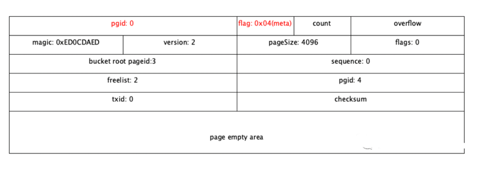
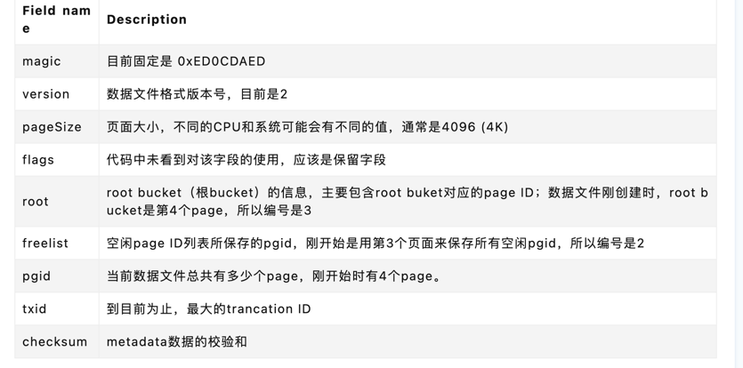
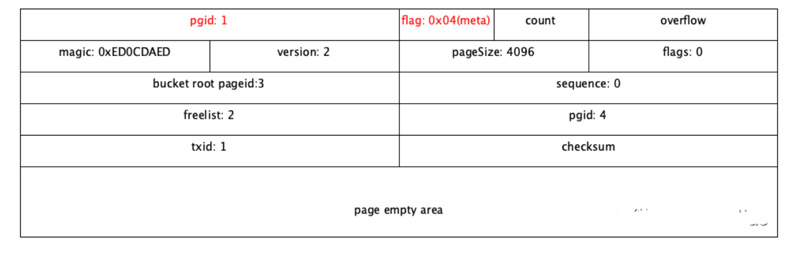

# bbolt
CoreOS公司fork了BoltDB，继续维护这个项目。不过名字改成了bbolt.

bbolt已经被很多其它项目所依赖，而且用到了生产环境中，其中就包含知名的consul、InfluxDB以及etcd。


而BoltDB/bbolt的定位只是提供一个key-value的存储，以library的形式提供给客户应用程序使用，最终是运行在客户程序的进程空间中。
如果想在分布式环境中使用bbolt，就要对其做进一步的改进并封装；
etcd就是在bbolt的基础上，针对分布式环境做了大量的改进和封装


## 文件头格式
与其它数据库一样，bbolt数据文件的存储结构可以分成header和body两部分。
这里要注意一点，数据库文件存储空间的分配是以页面(page)为单位进行分配的。如果没有指定页面大小，默认就通过系统调用获取os的页面大小：

```go
// default page size for db is set to the OS page size.

var defaultPageSize = os.Getpagesize()
```
通常一个页面的大小是4K，所以数据库文件的大小一般是4K的整数倍。

header的大小虽然不到4K，但是由于最小分配单位是页面，所以开始也分配了4K的空间。
header主要包含page header与metadata，定义分别如下



为了防止metadata page由于各种原因被破坏，所以定义了两个metadata page，分别是编号为0、1的page.



```go
// page header

type page struct {

  id       pgid

  flags    uint16

  count    uint16

  overflow uint32

}


// metadata
type meta struct {

  magic    uint32

  version  uint32

  pageSize uint32

  flags    uint32

  root     bucket

  freelist pgid

  pgid     pgid

  txid     txid

  checksum uint64

}
```

bbolt数据文件除了header之外，最主要的就是body了。body包含两种类型的数据：空闲页面列表与key-value数据。
bbolt数据文件刚初始化的时候，会将第三个page(编号为2)分配给空闲页面链表，将第四个page(编号为3)分配给一个叶子节点(存储key-value数据)。所以一个刚创建并初始化的bbolt数据文件的大小通常是16K