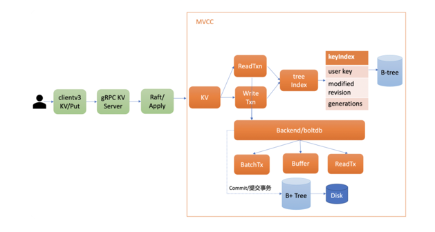
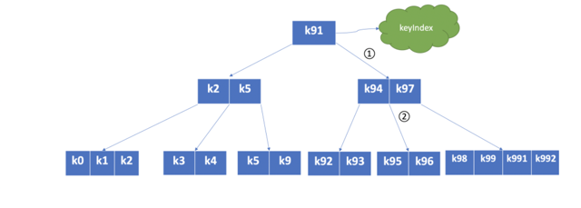
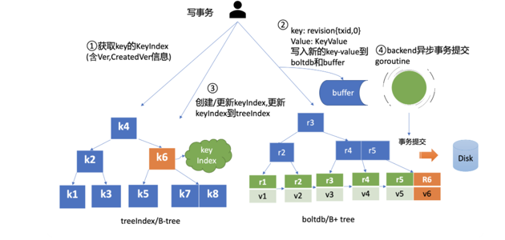
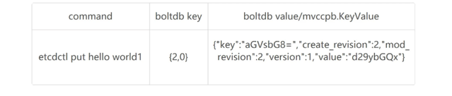
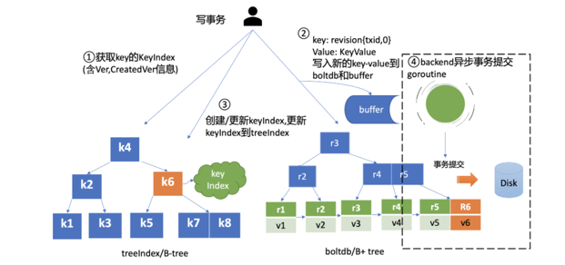
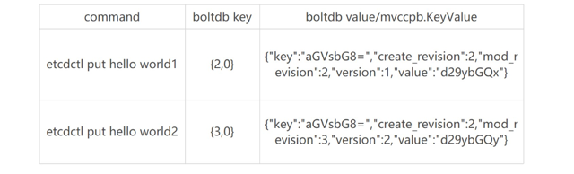
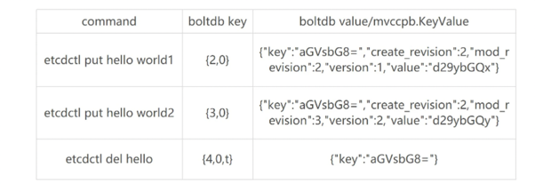

<!-- START doctoc generated TOC please keep comment here to allow auto update -->
<!-- DON'T EDIT THIS SECTION, INSTEAD RE-RUN doctoc TO UPDATE -->
**Table of Contents**  *generated with [DocToc](https://github.com/thlorenz/doctoc)*

- [etcd的MVCC(Multiversion concurrency control）机制](#etcd%E7%9A%84mvccmultiversion-concurrency-control%E6%9C%BA%E5%88%B6)
  - [背景](#%E8%83%8C%E6%99%AF)
  - [使用](#%E4%BD%BF%E7%94%A8)
  - [整体架构](#%E6%95%B4%E4%BD%93%E6%9E%B6%E6%9E%84)
  - [treeIndex](#treeindex)
    - [背景](#%E8%83%8C%E6%99%AF-1)
    - [MVCC 更新 key 原理](#mvcc-%E6%9B%B4%E6%96%B0-key-%E5%8E%9F%E7%90%86)
    - [MVCC 查询 key 原理](#mvcc-%E6%9F%A5%E8%AF%A2-key-%E5%8E%9F%E7%90%86)
      - [那指定版本号读取历史记录又是怎么实现的呢？](#%E9%82%A3%E6%8C%87%E5%AE%9A%E7%89%88%E6%9C%AC%E5%8F%B7%E8%AF%BB%E5%8F%96%E5%8E%86%E5%8F%B2%E8%AE%B0%E5%BD%95%E5%8F%88%E6%98%AF%E6%80%8E%E4%B9%88%E5%AE%9E%E7%8E%B0%E7%9A%84%E5%91%A2)
    - [MVCC 删除 key 原理](#mvcc-%E5%88%A0%E9%99%A4-key-%E5%8E%9F%E7%90%86)
      - [什么时候会真正删除它呢？](#%E4%BB%80%E4%B9%88%E6%97%B6%E5%80%99%E4%BC%9A%E7%9C%9F%E6%AD%A3%E5%88%A0%E9%99%A4%E5%AE%83%E5%91%A2)

<!-- END doctoc generated TOC please keep comment here to allow auto update -->

# etcd的MVCC(Multiversion concurrency control）机制

MVCC 机制的核心思想是保存一个 key-value 数据的多个历史版本，etcd 基于它不仅实现了可靠的 Watch 机制，
避免了 client 频繁发起 List Pod 等 expensive request 操作，保障 etcd 集群稳定性。
而且 MVCC 还能以较低的并发控制开销，实现各类隔离级别的事务，保障事务的安全性，是事务特性的基础


## 背景
etcd v2 时，提到过它存在的若干局限，如仅保留最新版本 key-value 数据、丢弃历史版本。

而 etcd 核心特性 watch 又依赖历史版本，因此 etcd v2 为了缓解这个问题，会在内存中维护一个较短的全局事件滑动窗口，保留最近的 1000 条变更事件。

但是在集群写请求较多等场景下，它依然无法提供可靠的 Watch 机制。

## 使用
```shell

# 更新key hello为world1
$ etcdctl put hello world1
OK
# 通过指定输出模式为json,查看key hello更新后的详细信息
$ etcdctl get hello -w=json
{
    "kvs":[
        {
            "key":"aGVsbG8=",
            "create_revision":2,
            "mod_revision":2,
            "version":1,
            "value":"d29ybGQx"
        }
    ],
    "count":1
}
# 再次修改key hello为world2
$ etcdctl put hello world2
OK
# 确认修改成功,最新值为wolrd2
$ etcdctl get hello
hello
world2
# 指定查询版本号,获得了hello上一次修改的值
$ etcdctl get hello --rev=2
hello
world1
# 删除key hello
$ etcdctl del  hello
1
# 删除后指定查询版本号3,获得了hello删除前的值
$ etcdctl get hello --rev=3
hello
world2
```

## 整体架构

Apply 模块通过 MVCC 模块来执行 put 请求，持久化 key-value 数据。MVCC 模块将请求请划分成两个类别，分别是读事务（ReadTxn）和写事务（WriteTxn）。
读事务负责处理 range 请求，写事务负责 put/delete 操作。读写事务基于 treeIndex、Backend/boltdb 提供的能力，实现对 key-value 的增删改查功能。

treeIndex 模块基于内存版 B-tree 实现了 key 索引管理，它保存了用户 key 与版本号（revision）的映射关系等信息。

Backend 模块负责 etcd 的 key-value 持久化存储，主要由 ReadTx、BatchTx、Buffer 组成，ReadTx 定义了抽象的读事务接口，BatchTx 在 ReadTx 之上定义了抽象的写事务接口，Buffer 是数据缓存区

etcd 设计上支持多种 Backend 实现，目前实现的 Backend 是 boltdb。boltdb 是一个基于 B+ tree 实现的、支持事务的 key-value 嵌入式数据库。

## treeIndex 

tcd 保存用户 key 与版本号映射关系的数据结构 B-tree，为什么 etcd 使用它而不使用哈希表、平衡二叉树？

从 etcd 的功能特性上分析， 因 etcd 支持范围查询，因此保存索引的数据结构也必须支持范围查询才行。所以哈希表不适合，而 B-tree 支持范围查询。

从性能上分析，平横二叉树每个节点只能容纳一个数据、导致树的高度较高，而 B-tree 每个节点可以容纳多个数据, 所以树的高度更低，更扁平，涉及的查找次数更少，具有优越的增、删、改、查性能。

通过 put/txn 命令写入的一系列 key，treeIndex 模块基于 B-tree 将其组织起来，节点之间基于用户 key 比较大小。当你查找一个 key k95 时，通过 B-tree 的特性，你仅需通过图中流程 1 和 2 两次快速比较，就可快速找到 k95 所在的节点

在 treeIndex 中，每个节点的 key 是一个 keyIndex 结构，etcd 就是通过它保存了用户的 key 与版本号的映射关系
```go

type keyIndex struct {
    key         []byte //用户的key名称，比如我们案例中的"hello"
    modified    revision //最后一次修改key时的etcd版本号,比如我们案例中的刚写入hello为world1时的，版本号为2
    generations []generation //generation保存了一个key若干代版本号信息，每代中包含对key的多次修改的版本号列表
}


type generation struct {
   ver     int64    //表示此key的修改次数
   created revision //表示generation结构创建时的版本号
   revs    []revision //每次修改key时的revision追加到此数组
}

```
note:版本号（revision）并不是一个简单的整数，而是一个结构体
```go

type revision struct {
   main int64    // 一个全局递增的主版本号，随put/txn/delete事务递增，一个事务内的key main版本号是一致的
   sub int64    // 一个事务内的子版本号，从0开始随事务内put/delete操作递增
}
```
revision 包含 main 和 sub 两个字段，main 是全局递增的版本号，它是个 etcd 逻辑时钟，随着 put/txn/delete 等事务递增。
sub 是一个事务内的子版本号，从 0 开始随事务内的 put/delete 操作递增。


### 背景
对于 etcd v2 来说，当你通过 etcdctl 发起一个 put hello 操作时，etcd v2 直接更新内存树，这就导致历史版本直接被覆盖，无法支持保存 key 的历史版本。
在 etcd v3 中引入 treeIndex 模块正是为了解决这个问题，支持保存 key 的历史版本，提供稳定的 Watch 机制和事务隔离等能力。


### MVCC 更新 key 原理

在 put 写事务中，首先它需要从 treeIndex 模块中查询 key 的 keyIndex 索引信息，keyIndex 中存储了 key 的创建版本号、修改的次数等信息，这些信息在事务中发挥着重要作用，因此会存储在 boltdb 的 value 中。

第一次创建 hello key，此时 keyIndex 索引为空。

其次 etcd 会根据当前的全局版本号（空集群启动时默认为 1）自增，生成 put hello 操作对应的版本号 revision{2,0}，这就是 boltdb 的 key


boltdb 的 value 是 mvccpb.KeyValue 结构体，它是由用户 key、value、create_revision、mod_revision、version、lease 组成。它们的含义分别如下：

- create_revision 表示此 key 创建时的版本号。在我们的案例中，key hello 是第一次创建，那么值就是 2。
  当你再次修改 key hello 的时候，写事务会从 treeIndex 模块查询 hello 第一次创建的版本号，也就是 keyIndex.generations[i].created 字段，赋值给 create_revision 字段；
  
- mod_revision 表示 key 最后一次修改时的版本号，即 put 操作发生时的全局版本号加 1；
  
- version 表示此 key 的修改次数。每次修改的时候，写事务会从 treeIndex 模块查询 hello 已经历过的修改次数，也就是 keyIndex.generations[i].ver 字段，将 ver 字段值加 1 后，赋值给 version 字段。


填充好 boltdb 的 KeyValue 结构体后，这时就可以通过 Backend 的写事务 batchTx 接口将 key{2,0},value 为 mvccpb.KeyValue 保存到 boltdb 的缓存中，并同步更新 buffer，如上图中的流程二所示。

此时存储到 boltdb 中的 key、value 数据如下


因为 key hello 是首次创建，treeIndex 模块它会生成 key hello 对应的 keyIndex 对象，并填充相关数据结构

```

key hello的keyIndex:
key:     "hello"
modified: <2,0>
generations:
[{ver:1,created:<2,0>,revisions: [<2,0>]} ]
```
- key 为 hello，modified 为最后一次修改版本号 <2,0>，key hello 是首次创建的，因此新增一个 generation 代跟踪它的生命周期、修改记录；
  
- generation 的 ver 表示修改次数，首次创建为 1，后续随着修改操作递增；
  generation.created 表示创建 generation 时的版本号为 <2,0>；
  
- revision 数组保存对此 key 修改的版本号列表，每次修改都会将将相应的版本号追加到 revisions 数组中


但是此时数据还并未持久化，为了提升 etcd 的写吞吐量、性能，一般情况下（默认堆积的写事务数大于 1 万才在写事务结束时同步持久化），
数据持久化由 Backend 的异步 goroutine 完成，它通过事务批量提交，定时将 boltdb 页缓存中的脏数据提交到持久化存储磁盘中，也就是下图中的黑色虚线框住的流程四



### MVCC 查询 key 原理
完成 put hello 为 world1 操作后，这时你通过 etcdctl 发起一个 get hello 操作，MVCC 模块首先会创建一个读事务对象（TxnRead），
在 etcd 3.4 中 Backend 实现了 ConcurrentReadTx， 也就是并发读特性。


并发读特性的核心原理是创建读事务对象时，它会全量拷贝当前写事务未提交的 buffer 数据，并发的读写事务不再阻塞在一个 buffer 资源锁上，实现了全并发读。

在读事务中，它首先需要根据 key 从 treeIndex 模块获取版本号，因我们未带版本号读，默认是读取最新的数据。treeIndex 模块从 B-tree 中，根据 key 查找到 keyIndex 对象后，匹配有效的 generation，返回 generation 的 revisions 数组中最后一个版本号{2,0}给读事务对象。

#### 那指定版本号读取历史记录又是怎么实现的呢？
当你再次发起一个 put hello 为 world2 修改操作时，key hello 对应的 keyIndex 的结果如下面所示，keyIndex.modified 字段更新为 <3,0>，generation 的 revision 数组追加最新的版本号 <3,0>，ver 修改为 2。

```

key hello的keyIndex:
key:     "hello"
modified: <3,0>
generations:
[{ver:2,created:<2,0>,revisions: [<2,0>,<3,0>]}]
```

boltdb 插入一个新的 key revision{3,0}，此时存储到 boltdb 中的 key-value 数据如下：


这时你再发起一个指定历史版本号为 2 的读请求时，实际是读版本号为 2 的时间点的快照数据。treeIndex 模块会遍历 generation 内的历史版本号，返回小于等于 2 的最大历史版本号，
在我们这个案例中，也就是 revision{2,0}，以它作为 boltdb 的 key，从 boltdb 中查询出 value 即可

### MVCC 删除 key 原理

当你执行 etcdctl del hello 命令时，etcd 会立刻从 treeIndex 和 boltdb 中删除此数据吗？还是增加一个标记实现延迟删除（lazy delete）呢？
答案为 etcd 实现的是延期删除模式，原理与 key 更新类似。

与更新 key 不一样之处:
- 一方面，生成的 boltdb key 版本号{4,0,t}追加了删除标识（tombstone, 简写 t），boltdb value 变成只含用户 key 的 KeyValue 结构体。
- 另一方面 treeIndex 模块也会给此 key hello 对应的 keyIndex 对象，追加一个空的 generation 对象，表示此索引对应的 key 被删除了

当你再次查询 hello 的时候，treeIndex 模块根据 key hello 查找到 keyindex 对象后，若发现其存在空的 generation 对象，并且查询的版本号大于等于被删除时的版本号，则会返回空。

keyIndex 的结果如下面所示：
```

key hello的keyIndex:
key:     "hello"
modified: <4,0>
generations:
[
{ver:3,created:<2,0>,revisions: [<2,0>,<3,0>,<4,0>(t)]}，             
{empty}
]
```
boltdb 此时会插入一个新的 key revision{4,0,t}，此时存储到 boltdb 中的 key-value 数据如下


#### 什么时候会真正删除它呢？
1. 一方面删除 key 时会生成 events，Watch 模块根据 key 的删除标识，会生成对应的 Delete 事件

2. 另一方面，当你重启 etcd，遍历 boltdb 中的 key 构建 treeIndex 内存树时，你需要知道哪些 key 是已经被删除的，并为对应的 key 索引生成 tombstone 标识。
   而真正删除 treeIndex 中的索引对象、boltdb 中的 key 是通过压缩 (compactor) 组件异步完成


正因为 etcd 的删除 key 操作是基于以上延期删除原理实现的，因此只要压缩组件未回收历史版本，我们就能从 etcd 中找回误删的数据


