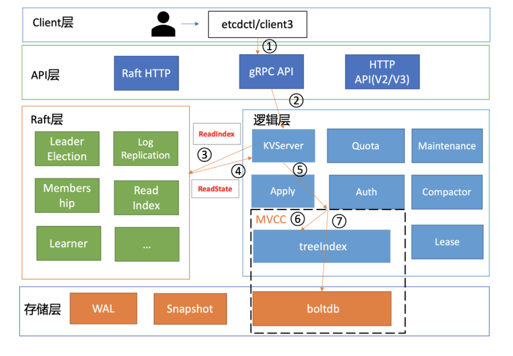
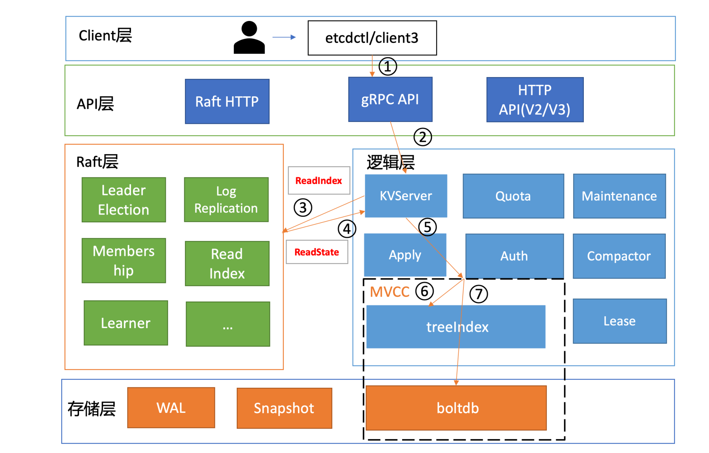
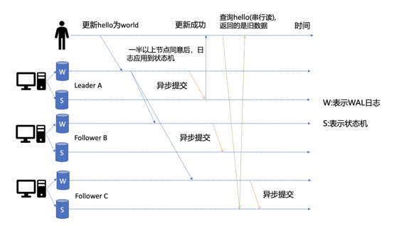
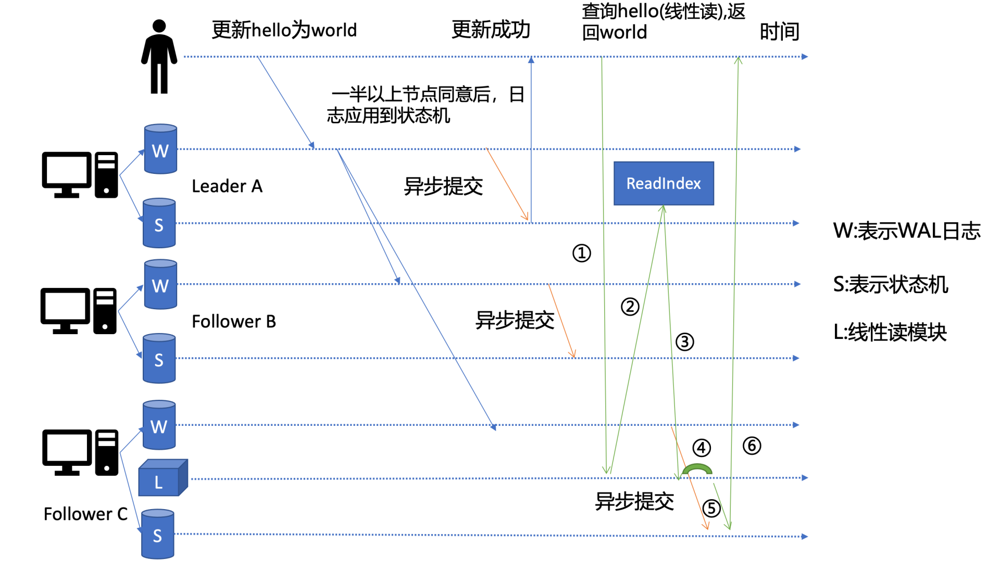
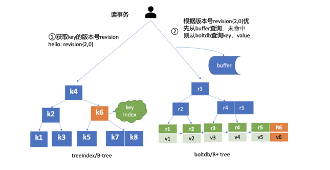
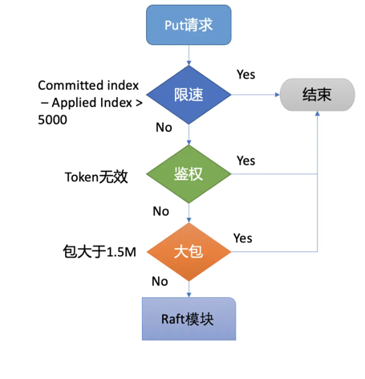
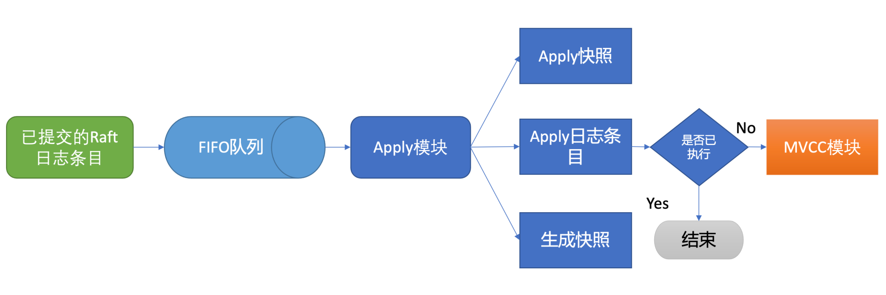
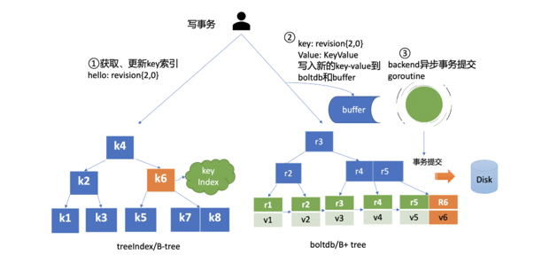

<!-- START doctoc generated TOC please keep comment here to allow auto update -->
<!-- DON'T EDIT THIS SECTION, INSTEAD RE-RUN doctoc TO UPDATE -->
**Table of Contents**  *generated with [DocToc](https://github.com/thlorenz/doctoc)*

- [Etcd的读写](#etcd%E7%9A%84%E8%AF%BB%E5%86%99)
  - [分层模型](#%E5%88%86%E5%B1%82%E6%A8%A1%E5%9E%8B)
  - [1. 读请求](#1-%E8%AF%BB%E8%AF%B7%E6%B1%82)
    - [串行读与线性读](#%E4%B8%B2%E8%A1%8C%E8%AF%BB%E4%B8%8E%E7%BA%BF%E6%80%A7%E8%AF%BB)
      - [线性读之 ReadIndex](#%E7%BA%BF%E6%80%A7%E8%AF%BB%E4%B9%8B-readindex)
    - [MVCC](#mvcc)
      - [treeIndex](#treeindex)
      - [buffer](#buffer)
      - [boltdb](#boltdb)
  - [2. 写请求](#2-%E5%86%99%E8%AF%B7%E6%B1%82)
    - [Quota模块](#quota%E6%A8%A1%E5%9D%97)
      - [解决方式](#%E8%A7%A3%E5%86%B3%E6%96%B9%E5%BC%8F)
    - [KVServer 模块](#kvserver-%E6%A8%A1%E5%9D%97)
      - [Preflight Check](#preflight-check)
      - [Propose](#propose)
    - [WAL 模块](#wal-%E6%A8%A1%E5%9D%97)
    - [APPLY模块](#apply%E6%A8%A1%E5%9D%97)
    - [MVCC](#mvcc-1)
      - [treeIndex索引模块](#treeindex%E7%B4%A2%E5%BC%95%E6%A8%A1%E5%9D%97)
      - [boltdb模块](#boltdb%E6%A8%A1%E5%9D%97)
      - [事务提交的过程](#%E4%BA%8B%E5%8A%A1%E6%8F%90%E4%BA%A4%E7%9A%84%E8%BF%87%E7%A8%8B)
  - [参考](#%E5%8F%82%E8%80%83)

<!-- END doctoc generated TOC please keep comment here to allow auto update -->

# Etcd的读写
## 分层模型

- Client 层：Client 层包括 client v2 和 v3 两个大版本 API 客户端库，提供了简洁易用的 API，同时支持负载均衡、节点间故障自动转移，
可极大降低业务使用 etcd 复杂度，提升开发效率、服务可用性。

- API 网络层：API 网络层主要包括 client 访问 server 和 server 节点之间的通信协议。一方面，client 访问 etcd server 的 API 分为 v2 和 v3 两个大版本。
v2 API 使用 HTTP/1.x 协议，v3 API 使用 gRPC 协议。同时 v3 通过 etcd grpc-gateway 组件也支持 HTTP/1.x 协议，便于各种语言的服务调用。
另一方面，server 之间通信协议，是指节点间通过 Raft 算法实现数据复制和 Leader 选举等功能时使用的 HTTP 协议。

- Raft 算法层：Raft 算法层实现了 Leader 选举、日志复制、ReadIndex 等核心算法特性，用于保障 etcd 多个节点间的数据一致性、提升服务可用性等，
是 etcd 的基石和亮点。

- 功能逻辑层：etcd 核心特性实现层，如典型的 KVServer 模块、MVCC 模块、Auth 鉴权模块、Lease 租约模块、Compactor 压缩模块等，
其中 MVCC 模块主要由 treeIndex 模块和 boltdb 模块组成。

- 存储层：存储层包含预写日志 (WAL) 模块、快照 (Snapshot) 模块、boltdb 模块。其中 WAL 可保障 etcd crash 后数据不丢失，boltdb 则保存了集群元数据和用户写入的数据。

## 1. 读请求



在解析完请求中的参数后，etcdctl 会创建一个 clientv3 库对象，使用 KVServer 模块的 API 来访问 etcd server。


### 串行读与线性读
   
当 client 发起一个更新 hello 为 world 请求后，若 Leader 收到写请求，它会将此请求持久化到 WAL 日志，并广播给各个节点，若一半以上节点持久化成功，则该请求对应的日志条目被标识为已提交，etcdserver 模块异步从 Raft 模块获取已提交的日志条目，应用到状态机 (boltdb 等)。

若 client 发起一个读取 hello 的请求，假设此请求直接从状态机中读取， 如果连接到的是 C 节点，若 C 节点磁盘 I/O 出现波动，可能导致它应用已提交的日志条目很慢，则会出现更新 hello 为 world 的写命令，在 client 读 hello 的时候还未被提交到状态机，因此就可能读取到旧数据

串行 (Serializable) 读：直接读状态机数据返回、无需通过 Raft 协议与集群进行交互的模式，它具有低延时、高吞吐量的特点，适合对数据一致性要求不高的场景。   

假如老板让你做一个旁路数据统计服务，希望你每分钟统计下 etcd 里的服务、配置信息等，这种场景其实对数据时效性要求并不高，读请求可直接从节点的状态机获取数据。即便数据落后一点，也不影响业务，毕竟这是一个定时统计的旁路服务而已.

线性(linearizable)读 ：一旦一个值更新成功，随后任何通过线性读的 client 都能及时访问到。虽然集群中有多个节点，但 client 通过线性读就如访问一个节点一样。etcd 默认读模式是线性读，
因为它需要经过 Raft 协议模块，反应的是集群共识，因此在延时和吞吐量上相比串行读略差一点，适用于对数据一致性要求高的场景。

```go
func (s *EtcdServer) Range(ctx context.Context, r *pb.RangeRequest) (*pb.RangeResponse, error) {
	var resp *pb.RangeResponse
	var err error
	defer func(start time.Time) {
		warnOfExpensiveReadOnlyRangeRequest(s.getLogger(), start, r, resp, err)
	}(time.Now())
    // serializable read 会直接读取当前节点的数据返回给客户端，它并不能保证返回给客户端的数据是最新的  
	// Linearizable Read 需要阻塞等待直到读到最新的数据
	if !r.Serializable {
		// 线性读等待 
		err = s.linearizableReadNotify(ctx)
		if err != nil {
			return nil, err
		}
	}
	chk := func(ai *auth.AuthInfo) error {
		return s.authStore.IsRangePermitted(ai, r.Key, r.RangeEnd)
	}

	get := func() { resp, err = s.applyV3Base.Range(nil, r) }
	if serr := s.doSerialize(ctx, chk, get); serr != nil {
		err = serr
		return nil, err
	}
	return resp, err
}

// 线性读等待 
func (s *EtcdServer) linearizableReadNotify(ctx context.Context) error {
	s.readMu.RLock()
	nc := s.readNotifier // 读取通知信号chan
	s.readMu.RUnlock()

	select {
    // linearizableReadLoop会阻塞监听readwaitc
    // 这边写入一个空结构体到readwaitc中，linearizableReadLoop就会开始结束阻塞开始工作 
	case s.readwaitc <- struct{}{}:
	default:
	}

	// wait for read state notification
	select {
	case <-nc.c: // 获取到可以读的信号
		return nc.err
	case <-ctx.Done():
		return ctx.Err()
	case <-s.done:
		return ErrStopped
	}
}


```


早期 etcd 线性读使用的 Raft log read，也就是说把读请求像写请求一样走一遍 Raft 的协议，基于 Raft 的日志的有序性，实现线性读。但此方案读涉及磁盘 IO 开销，性能较差，
后来实现了 ReadIndex 读机制来提升读性能，满足了 Kubernetes 等业务的诉求.

#### 线性读之 ReadIndex

它是在 etcd 3.1 中引入的。当收到一个线性读请求时，它首先会从 Leader 获取集群最新的已提交的日志索引 (committed index)， 如上图中的流程二所示。

Leader 收到 ReadIndex 请求时，为防止脑裂等异常场景，会向 Follower 节点发送心跳确认，
一半以上节点确认 Leader 身份后才能将已提交的索引 (committed index) 返回给节点 C(上图中的流程三)。

C 节点则会等待，直到状态机已应用索引 (applied index) 大于等于 Leader 的已提交索引时 (committed Index)(上图中的流程四)，然后去通知读请求，
数据已赶上 Leader，你可以去状态机中访问数据了 (上图中的流程五)。以上就是线性读通过 ReadIndex 机制保证数据一致性原理，

总体而言，KVServer 模块收到线性读请求后，通过架构图中流程三向 Raft 模块发起 ReadIndex 请求，Raft 模块将 Leader 最新的已提交日志索引封装在流程四的 ReadState 结构体，通过 channel 层层返回给线性读模块，线性读模块等待本节点状态机追赶上 Leader 进度，追赶完成后，就通知 KVServer 模块，进行架构图中流程五，与状态机中的 MVCC 模块进行进行交互了


```go
// 线性读循环
func (s *EtcdServer) linearizableReadLoop() {
	var rs raft.ReadState

	for {
		ctxToSend := make([]byte, 8)
		id1 := s.reqIDGen.Next()
		binary.BigEndian.PutUint64(ctxToSend, id1)
		leaderChangedNotifier := s.leaderChangedNotify()
		select {
		case <-leaderChangedNotifier:
			continue
		case <-s.readwaitc: // 在client发起一次Linearizable Read的时候，会向readwaitc写入一个空的结构体作为信号
		case <-s.stopping:
			return
		}

		nextnr := newNotifier()

		s.readMu.Lock()
		nr := s.readNotifier
		s.readNotifier = nextnr
		s.readMu.Unlock()

		lg := s.getLogger()
		cctx, cancel := context.WithTimeout(context.Background(), s.Cfg.ReqTimeout())
		if err := s.r.ReadIndex(cctx, ctxToSend); err != nil {
            // ...
			continue
		}
		cancel()

		var (
			timeout bool
			done    bool
		)
		for !timeout && !done {
			select {
			case rs = <-s.r.readStateC: // Raft 模块将 Leader 最新的已提交日志索引封装在流程四的 ReadState 结构体
				done = bytes.Equal(rs.RequestCtx, ctxToSend)
				if !done {
                    // ...
				}
            // ... 处理其他case
			case <-s.stopping:
				return
			}
		}
		if !done { // 如果超时没有读取完毕
			continue
		}

		if ai := s.getAppliedIndex(); ai < rs.Index {
			select {
			case <-s.applyWait.Wait(rs.Index): // 等待 apply index >= read index
			case <-s.stopping:
				return
			}
		}
		// unblock all l-reads requested at indices before rs.Index
		nr.notify(nil) // 发出可以进行读取状态机的信号
	}
}
```
```go
func (n *node) ReadIndex(ctx context.Context, rctx []byte) error {
	// 类型是 pb.MsgReadIndex
	return n.step(ctx, pb.Message{Type: pb.MsgReadIndex, Entries: []pb.Entry{{Data: rctx}}})
}

func (n *node) step(ctx context.Context, m pb.Message) error {
	return n.stepWithWaitOption(ctx, m, false)
}


func (n *node) stepWithWaitOption(ctx context.Context, m pb.Message, wait bool) error {
	if m.Type != pb.MsgProp {
		select {
		case n.recvc <- m: // 发送消息
			return nil
		case <-ctx.Done():
			return ctx.Err()
		case <-n.done:
			return ErrStopped
		}
	}
	ch := n.propc
	pm := msgWithResult{m: m}
	if wait {
		pm.result = make(chan error, 1)
	}
	select {
	case ch <- pm:
		if !wait {
			return nil
		}
	case <-ctx.Done():
		return ctx.Err()
	case <-n.done:
		return ErrStopped
	}
	select {
	case err := <-pm.result:
		if err != nil {
			return err
		}
	case <-ctx.Done():
		return ctx.Err()
	case <-n.done:
		return ErrStopped
	}
	return nil
}

```
针对发送的消息
- 如果follower收到了客户端的MsgReadIndex类型的消息，因为客户端不能处理只读请求，需要将消息转发到leader节点进行处理；
```go
func stepFollower(r *raft, m pb.Message) error {
	switch m.Type {
    // ...
	case pb.MsgReadIndex:
        // .. 
		m.To = r.lead // 转发给 leader 处理
		r.send(m)
	case pb.MsgReadIndexResp: // follower收到leader 响应，将MsgReadIndex消息中的已提交位置和消息id封装成ReadState实例，添加到readStates
		if len(m.Entries) != 1 {
			r.logger.Errorf("%x invalid format of MsgReadIndexResp from %x, entries count: %d", r.id, m.From, len(m.Entries))
			return nil
		}
		r.readStates = append(r.readStates, ReadState{Index: m.Index, RequestCtx: m.Entries[0].Data})
	}
	return nil
}

```
- 如果是leader收到了MsgReadIndex, 区分来源处理
```go
func stepLeader(r *raft, m pb.Message) error {
	// These message types do not require any progress for m.From.
	switch m.Type {
    // ...
	case pb.MsgReadIndex:
		// If more than the local vote is needed, go through a full broadcast,
		// otherwise optimize.
		if !r.prs.IsSingleton() {
			if r.raftLog.zeroTermOnErrCompacted(r.raftLog.term(r.raftLog.committed)) != r.Term {
				// Reject read only request when this leader has not committed any log entry at its term.
				return nil
			}

			// thinking: use an interally defined context instead of the user given context.
			// We can express this in terms of the term and index instead of a user-supplied value.
			// This would allow multiple reads to piggyback on the same message.
			switch r.readOnly.option {
			case ReadOnlySafe: // ReadOnlySafe是ETCD作者推荐的模式，因为这种模式不受节点之间时钟差异和网络分区的影响
				r.readOnly.addRequest(r.raftLog.committed, m)
				// The local node automatically acks the request.
				r.readOnly.recvAck(r.id, m.Entries[0].Data)
				// leader 节点向其他节点发起广播
				r.bcastHeartbeatWithCtx(m.Entries[0].Data)
			case ReadOnlyLeaseBased:
				ri := r.raftLog.committed
				if m.From == None || m.From == r.id { // from local member
                    // 如果消息来自客户端，直接写入到readStates，start函数会将readStates中最后的一个放到readStateC，通知上游的处理结果；
					r.readStates = append(r.readStates, ReadState{Index: ri, RequestCtx: m.Entries[0].Data})
				} else {
                    // 如果消息来自follower，通过消息MsgReadIndexResp回复follower的响应结果，同时follower也是会将readStates中最后的一个放到readStateC，通知上游的处理结果；
					r.send(pb.Message{To: m.From, Type: pb.MsgReadIndexResp, Index: ri, Entries: m.Entries})
				}
			}
		} else {  // 表示当前只有一个节点，当前节点就是leader

            // 如果当前只有一个节点，那么当前的节点也是leader节点，所有的只读请求，将会发送到leader，leader直接对信息进行处理
			if m.From == None || m.From == r.id { // from leader itself
				r.readStates = append(r.readStates, ReadState{Index: r.raftLog.committed, RequestCtx: m.Entries[0].Data})
			} else { 
				r.send(pb.Message{To: m.From, Type: pb.MsgReadIndexResp, Index: r.raftLog.committed, Entries: m.Entries})
			}
		}

		return nil
	}

	// All other message types require a progress for m.From (pr).
	pr := r.prs.Progress[m.From]
	if pr == nil {
		r.logger.Debugf("%x no progress available for %x", r.id, m.From)
		return nil
	}
	switch m.Type {
    // ...
	case pb.MsgHeartbeatResp:
		pr.RecentActive = true
		pr.ProbeSent = false

		// free one slot for the full inflights window to allow progress.
		if pr.State == tracker.StateReplicate && pr.Inflights.Full() {
			pr.Inflights.FreeFirstOne()
		}
		if pr.Match < r.raftLog.lastIndex() {
			r.sendAppend(m.From)
		}

		if r.readOnly.option != ReadOnlySafe || len(m.Context) == 0 {
			return nil
		}
        
		// 判断leader有没有收到大多数节点的确认
		if r.prs.Voters.VoteResult(r.readOnly.recvAck(m.From, m.Context)) != quorum.VoteWon {
			return nil
		}
        // 收到了响应节点超过半数，会清空readOnly中指定消息ID及之前的所有记录
		rss := r.readOnly.advance(m)
		for _, rs := range rss { // 返回follower的心跳回执
			req := rs.req
			if req.From == None || req.From == r.id { // from local member
				r.readStates = append(r.readStates, ReadState{Index: rs.index, RequestCtx: req.Entries[0].Data})
			} else {
				r.send(pb.Message{To: req.From, Type: pb.MsgReadIndexResp, Index: rs.index, Entries: req.Entries})
			}
		}
	// ...
	return nil
}
```
raft 模块有一个for-loop的goroutine，来读取该数组，并对MsgReadIndex进行响应，将ReadStates中的最后一项将写入到readStateC中，通知监听readStateC的linearizableReadLoop函数的结果

```go
func (r *raftNode) start(rh *raftReadyHandler) {
	internalTimeout := time.Second

	go func() {
		defer r.onStop()
		islead := false

		for {
			select {
			case <-r.ticker.C:
				r.tick()
			case rd := <-r.Ready():
                // ...

				if len(rd.ReadStates) != 0 {
					select {
					case r.readStateC <- rd.ReadStates[len(rd.ReadStates)-1]: // ReadStates中最后意向将会被写入到readStateC中
                    // ...
					case <-r.stopped:
						return
					}
				}

				notifyc := make(chan struct{}, 1)
				ap := apply{
					entries:  rd.CommittedEntries,
					snapshot: rd.Snapshot,
					notifyc:  notifyc,
				}
				// 更新本地 committedIndex
				updateCommittedIndex(&ap, rh)

				select {
				case r.applyc <- ap:
				case <-r.stopped:
					return
				}

        
                // ...

				r.Advance()
			case <-r.stopped:
				return
			}
		}
	}()
}

```


当然还有其它机制也能实现线性读，如在早期 etcd 3.0 中读请求通过走一遍 Raft 协议保证一致性， 这种 Raft log read 机制依赖磁盘 IO， 性能相比 ReadIndex 较差.

### MVCC

流程五中的多版本并发控制 (MultiVersion concurrency control) 模块是为了解决 etcd v2 不支持保存 key 的历史版本、不支持多 key 事务等问题而产生的。

它核心由内存树形索引模块 (treeIndex) 和嵌入式的 KV 持久化存储库 boltdb 组成。

那么 etcd 如何基于 boltdb 保存一个 key 的多个历史版本呢?比如我们现在有以下方案：

1. 方案 1 是一个 key 保存多个历史版本的值；
2. 方案 2 每次修改操作，生成一个新的版本号 (revision)，以版本号为 key， value 为用户 key-value 等信息组成的结构体。

分析：
很显然方案 1 会导致 value 较大，存在明显读写放大、并发冲突等问题，

方案 2 正是 etcd 所采用的。boltdb 的 key 是全局递增的版本号 (revision)，value 是用户 key、value 等字段组合成的结构体，
然后通过 treeIndex 模块来保存用户 key 和版本号的映射关系。treeIndex 与 boltdb 关系如下面的读事务流程图所示，

   
从 treeIndex 中获取 key hello 的版本号，再以版本号作为 boltdb 的 key，从 boltdb 中获取其 value 信息。

#### treeIndex
treeIndex 模块是基于 Google 开源的内存版 btree 库实现的.

treeIndex 模块只会保存用户的 key 和相关版本号信息，用户 key 的 value 数据存储在 boltdb 里面，相比 ZooKeeper 和 etcd v2 全内存存储，etcd v3 对内存要求更低。

#### buffer
在获取到版本号信息后，就可从 boltdb 模块中获取用户的 key-value 数据了。不过有一点你要注意，并不是所有请求都一定要从 boltdb 获取数据。
etcd 出于数据一致性、性能等考虑，在访问 boltdb 前，首先会从一个内存读事务 buffer 中，二分查找你要访问 key 是否在 buffer 里面，若命中则直接返回

#### boltdb
若 buffer 未命中，此时就真正需要向 boltdb 模块查询数据了，进入了流程七。我们知道 MySQL 通过 table 实现不同数据逻辑隔离，那么在 boltdb 是如何隔离集群元数据与用户数据的呢？
答案是 bucket。

boltdb 里每个 bucket 类似对应 MySQL 一个表，用户的 key 数据存放的 bucket 名字的是 key，etcd MVCC 元数据存放的 bucket 是 meta。
因 boltdb 使用 B+ tree 来组织用户的 key-value 数据，获取 bucket key 对象后，通过 boltdb 的游标 Cursor 可快速在 B+ tree 找到 key hello 对应的 value 数据，返回给 client


## 2. 写请求


首先 client 端通过负载均衡算法选择一个 etcd 节点，发起 gRPC 调用。然后 etcd 节点收到请求后经过 gRPC 拦截器、Quota 模块后，进入 KVServer 模块，
KVServer 模块向 Raft 模块提交一个提案，提案内容为“大家好，请使用 put 方法执行一个 key 为 hello，value 为 world 的命令”。


随后此提案通过 RaftHTTP 网络模块转发、经过集群多数节点持久化后，状态会变成已提交，etcdserver 从 Raft 模块获取已提交的日志条目，传递给 Apply 模块，
Apply 模块通过 MVCC 模块执行提案内容，更新状态机。与读流程不一样的是写流程还涉及 Quota、WAL、Apply 三个模块。
crash-safe 及幂等性也正是基于 WAL 和 Apply 流程的 consistent index 等实现的

### Quota模块
当 etcd server 收到 put/txn 等写请求的时候，会首先检查下当前 etcd db 大小加上你请求的 key-value 大小之和是否超过了配额（quota-backend-bytes）。

如果超过了配额，它会产生一个告警（Alarm）请求，告警类型是 NO SPACE，并通过 Raft 日志同步给其它节点，告知 db 无空间了，并将告警持久化存储到 db 中。

最终，无论是 API 层 gRPC 模块还是负责将 Raft 侧已提交的日志条目应用到状态机的 Apply 模块，都拒绝写入，集群只读.

```go
func (s *quotaKVServer) Put(ctx context.Context, r *pb.PutRequest) (*pb.PutResponse, error) {
	if err := s.qa.
		check(ctx, r); err != nil {
		return nil, err
	}
	return s.KVServer.Put(ctx, r)
}

```
```go
func (qa *quotaAlarmer) check(ctx context.Context, r interface{}) error {
	if qa.q.Available(r) {
		return nil
	}
	req := &pb.AlarmRequest{
		MemberID: uint64(qa.id),
		Action:   pb.AlarmRequest_ACTIVATE,
		Alarm:    pb.AlarmType_NOSPACE,
	}
	qa.a.Alarm(ctx, req)
	return rpctypes.ErrGRPCNoSpace // 空间不足
}

```
```go
func (b *backendQuota) Available(v interface{}) bool {
	//  etcd db 大小加上你请求的 key-value 大小之和是否超过了配额（quota-backend-bytes
	return b.s.Backend().Size()+int64(b.Cost(v)) < b.maxBackendBytes
}

```

#### 解决方式 

首先当然是调大配额。具体多大合适呢？etcd 社区建议不超过 8G。遇到过这个错误的你是否还记得，为什么当你把配额（quota-backend-bytes）调大后，
集群依然拒绝写入呢?原因就是我们前面提到的 NO SPACE 告警。Apply 模块在执行每个命令的时候，都会去检查当前是否存在 NO SPACE 告警，如果有则拒绝写入。
所以还需要你额外发送一个取消告警（etcdctl alarm disarm）的命令，以消除所有告警。

其次你需要检查 etcd 的压缩（compact）配置是否开启、配置是否合理。
etcd 保存了一个 key 所有变更历史版本，如果没有一个机制去回收旧的版本，那么内存和 db 大小就会一直膨胀，在 etcd 里面，压缩模块负责回收旧版本的工作。

压缩模块支持按多种方式回收旧版本，比如保留最近一段时间内的历史版本。不过你要注意，它仅仅是将旧版本占用的空间打个空闲（Free）标记，
后续新的数据写入的时候可复用这块空间，而无需申请新的空间。

如果你需要回收空间，减少 db 大小，得使用碎片整理（defrag），它会遍历旧的 db 文件数据，写入到一个新的 db 文件。但是它对服务性能有较大影响，不建议你在生产集群频繁使用。
```go
// 碎片整理
func (b *backend) Defrag() error {
	return b.defrag()
}

func (b *backend) defrag() error {
	now := time.Now()

	// TODO: make this non-blocking?
	// lock batchTx to ensure nobody is using previous tx, and then
	// close previous ongoing tx.
	b.batchTx.Lock()
	defer b.batchTx.Unlock()

	// lock database after lock tx to avoid deadlock.
	b.mu.Lock()
	defer b.mu.Unlock()

	// block concurrent read requests while resetting tx
	b.readTx.Lock()
	defer b.readTx.Unlock()

	b.batchTx.unsafeCommit(true)

	b.batchTx.tx = nil

	tmpdb, err := bolt.Open(b.db.Path()+".tmp", 0600, boltOpenOptions)
	if err != nil {
		return err
	}

	dbp := b.db.Path()
	tdbp := tmpdb.Path()
	size1, sizeInUse1 := b.Size(), b.SizeInUse()
	if b.lg != nil {
        // ..
	}

	err = defragdb(b.db, tmpdb, defragLimit)
	if err != nil {
		tmpdb.Close()
		os.RemoveAll(tmpdb.Path())
		return err
	}

	err = b.db.Close()
	if err != nil {
		if b.lg != nil {
			b.lg.Fatal("failed to close database", zap.Error(err))
		} else {
			plog.Fatalf("cannot close database (%s)", err)
		}
	}
	err = tmpdb.Close()
	if err != nil {
		if b.lg != nil {
			b.lg.Fatal("failed to close tmp database", zap.Error(err))
		} else {
			plog.Fatalf("cannot close database (%s)", err)
		}
	}
	err = os.Rename(tdbp, dbp)
	if err != nil {
        // .
	}

	b.db, err = bolt.Open(dbp, 0600, boltOpenOptions)
	if err != nil {
		if b.lg != nil {
			b.lg.Fatal("failed to open database", zap.String("path", dbp), zap.Error(err))
		} else {
			plog.Panicf("cannot open database at %s (%v)", dbp, err)
		}
	}
	b.batchTx.tx = b.unsafeBegin(true)

	b.readTx.reset()
	b.readTx.tx = b.unsafeBegin(false)

	size := b.readTx.tx.Size()
	db := b.readTx.tx.DB()
	atomic.StoreInt64(&b.size, size)
	atomic.StoreInt64(&b.sizeInUse, size-(int64(db.Stats().FreePageN)*int64(db.Info().PageSize)))

	took := time.Since(now)
	defragSec.Observe(took.Seconds())

	size2, sizeInUse2 := b.Size(), b.SizeInUse()
	if b.lg != nil {
		b.lg.Info(
			"defragmented",
			zap.String("path", dbp),
			zap.Int64("current-db-size-bytes-diff", size2-size1),
			zap.Int64("current-db-size-bytes", size2),
			zap.String("current-db-size", humanize.Bytes(uint64(size2))),
			zap.Int64("current-db-size-in-use-bytes-diff", sizeInUse2-sizeInUse1),
			zap.Int64("current-db-size-in-use-bytes", sizeInUse2),
			zap.String("current-db-size-in-use", humanize.Bytes(uint64(sizeInUse2))),
			zap.Duration("took", took),
		)
	}
	return nil
}
```

### KVServer 模块
通过流程二的配额检查后，请求就从 API 层转发到了流程三的 KVServer 模块的 put 方法，我们知道 etcd 是基于 Raft 算法实现节点间数据复制的，
因此它需要将 put 写请求内容打包成一个提案消息，提交给 Raft 模块。不过 KVServer 模块在提交提案前，还有如下的一系列检查和限速。

#### Preflight Check
  
1. 为了保证集群稳定性，避免雪崩，任何提交到 Raft 模块的请求，都会做一些简单的限速判断。如下面的流程图所示，首先，
如果 Raft 模块已提交的日志索引（committed index）比已应用到状态机的日志索引（applied index）超过了 5000，
那么它就返回一个"etcdserver: too many requests"错误给 client

2. 然后它会尝试去获取请求中的鉴权信息，若使用了密码鉴权、请求中携带了 token，如果 token 无效，则返回"auth: invalid auth token"错误给 client。

3. 其次它会检查你写入的包大小是否超过默认的 1.5MB， 如果超过了会返回"etcdserver: request is too large"错误给给 client。

```go
func (s *EtcdServer) processInternalRaftRequestOnce(ctx context.Context, r pb.InternalRaftRequest) (*applyResult, error) {
	ai := s.getAppliedIndex()
	ci := s.getCommittedIndex()
	// 不能超过 5000
	if ci > ai+maxGapBetweenApplyAndCommitIndex {
		return nil, ErrTooManyRequests
	}

	r.Header = &pb.RequestHeader{
		ID: s.reqIDGen.Next(),
	}
    // 鉴权
	authInfo, err := s.AuthInfoFromCtx(ctx)
	if err != nil {
		return nil, err
	}
	if authInfo != nil {
		r.Header.Username = authInfo.Username
		r.Header.AuthRevision = authInfo.Revision
	}

	data, err := r.Marshal()
	if err != nil {
		return nil, err
	}
    
	// 包大小校验
	if len(data) > int(s.Cfg.MaxRequestBytes) {
		return nil, ErrRequestTooLarge
	}

	id := r.ID
	if id == 0 {
		id = r.Header.ID
	}
	ch := s.w.Register(id)

	cctx, cancel := context.WithTimeout(ctx, s.Cfg.ReqTimeout())
	defer cancel()

	start := time.Now()
	err = s.r.Propose(cctx, data)
	if err != nil {
		proposalsFailed.Inc()
		s.w.Trigger(id, nil) // GC wait
		return nil, err
	}
	proposalsPending.Inc()
	defer proposalsPending.Dec()

	select {
	case x := <-ch:
		return x.(*applyResult), nil
	case <-cctx.Done():
		proposalsFailed.Inc()
		s.w.Trigger(id, nil) // GC wait
		return nil, s.parseProposeCtxErr(cctx.Err(), start)
	case <-s.done:
		return nil, ErrStopped
	}
}
```

#### Propose
最后通过一系列检查之后，会生成一个唯一的 ID，将此请求关联到一个对应的消息通知 channel，然后向 Raft 模块发起（Propose）一个提案（Proposal），
提案内容为“大家好，请使用 put 方法执行一个 key 为 hello，value 为 world 的命令”，也就是整体架构图里的流程四。
向 Raft 模块发起提案后，KVServer 模块会等待此 put 请求，等待写入结果通过消息通知 channel 返回或者超时。

etcd 默认超时时间是 7 秒（5 秒磁盘 IO 延时 +2*1 秒竞选超时时间），如果一个请求超时未返回结果，则可能会出现你熟悉的 etcdserver: request timed out 错误。

```go
// https://github.com/etcd-io/etcd/blob/c7c9428f6b0513f24f9da4db82a6abb5915a13bb/raft/node.go
func (n *node) Propose(ctx context.Context, data []byte) error {
	return n.stepWait(ctx, pb.Message{Type: pb.MsgProp, Entries: []pb.Entry{{Data: data}}})
}

// 阻塞等待返回
func (n *node) stepWait(ctx context.Context, m pb.Message) error {
	return n.stepWithWaitOption(ctx, m, true)
}
```

### WAL 模块
Raft 模块收到提案后，如果当前节点是 Follower，它会转发给 Leader，只有 Leader 才能处理写请求。

Leader 收到提案后，通过 Raft 模块输出待转发给 Follower 节点的消息和待持久化的日志条目，日志条目则封装了我们上面所说的 put hello 提案内容。
etcdserver 从 Raft 模块获取到以上消息和日志条目后，作为 Leader，它会将 put 提案消息广播给集群各个节点，
同时需要把集群 Leader 任期号、投票信息、已提交索引、提案内容持久化到一个 WAL（Write Ahead Log）日志文件中，用于保证集群的一致性、可恢复性，也就是我们图中的流程五模块.


```go
func stepLeader(r *raft, m pb.Message) error {
	// These message types do not require any progress for m.From.
	switch m.Type {
    // ...
	case pb.MsgProp:
        // ...
		for i := range m.Entries {
			e := &m.Entries[i]
            // ...
		}

		if !r.appendEntry(m.Entries...) {
			return ErrProposalDropped
		}
		// 广播发送 pb.MsgApp 类型
		r.bcastAppend()
		return nil
    // ...
	}

	// All other message types require a progress for m.From (pr).
	pr := r.prs.Progress[m.From]
	if pr == nil {
		r.logger.Debugf("%x no progress available for %x", r.id, m.From)
		return nil
	}
	switch m.Type {
	// ..
		
	case pb.MsgAppResp: // follower 处理完返回
		pr.RecentActive = true

		if m.Reject { // 拒绝
            // ... 
		} else {
			oldPaused := pr.IsPaused()
			if pr.MaybeUpdate(m.Index) {
				switch {
				case pr.State == tracker.StateProbe:
					pr.BecomeReplicate()
				case pr.State == tracker.StateSnapshot && pr.Match >= pr.PendingSnapshot:
					// TODO(tbg): we should also enter this branch if a snapshot is
					// received that is below pr.PendingSnapshot but which makes it
					// possible to use the log again.
					r.logger.Debugf("%x recovered from needing snapshot, resumed sending replication messages to %x [%s]", r.id, m.From, pr)
					// Transition back to replicating state via probing state
					// (which takes the snapshot into account). If we didn't
					// move to replicating state, that would only happen with
					// the next round of appends (but there may not be a next
					// round for a while, exposing an inconsistent RaftStatus).
					pr.BecomeProbe()
					pr.BecomeReplicate()
				case pr.State == tracker.StateReplicate:
					pr.Inflights.FreeLE(m.Index)
				}

				if r.maybeCommit() {
					r.bcastAppend()
				} else if oldPaused {
					// If we were paused before, this node may be missing the
					// latest commit index, so send it.
					r.sendAppend(m.From)
				}
				// We've updated flow control information above, which may
				// allow us to send multiple (size-limited) in-flight messages
				// at once (such as when transitioning from probe to
				// replicate, or when freeTo() covers multiple messages). If
				// we have more entries to send, send as many messages as we
				// can (without sending empty messages for the commit index)
				for r.maybeSendAppend(m.From, false) {
				}
				// Transfer leadership is in progress.
				if m.From == r.leadTransferee && pr.Match == r.raftLog.lastIndex() {
					r.logger.Infof("%x sent MsgTimeoutNow to %x after received MsgAppResp", r.id, m.From)
					r.sendTimeoutNow(m.From)
				}
			}
		}
    return nil
}
```

```go
func (r *raft) appendEntry(es ...pb.Entry) (accepted bool) {
	li := r.raftLog.lastIndex()
	for i := range es {
		es[i].Term = r.Term // 任期信息补充 
		es[i].Index = li + 1 + uint64(i) 
	}
	// Track the size of this uncommitted proposal.
	if !r.increaseUncommittedSize(es) {
		r.logger.Debugf(
			"%x appending new entries to log would exceed uncommitted entry size limit; dropping proposal",
			r.id,
		)
		// Drop the proposal.
		return false
	}
	// use latest "last" index after truncate/append
	li = r.raftLog.append(es...)
	r.prs.Progress[r.id].MaybeUpdate(li)
	// Regardless of maybeCommit's return, our caller will call bcastAppend.
	r.maybeCommit()
	return true
}
```

```go
func (l *raftLog) append(ents ...pb.Entry) uint64 {
	if len(ents) == 0 {
		return l.lastIndex()
	}
	if after := ents[0].Index - 1; after < l.committed {
		l.logger.Panicf("after(%d) is out of range [committed(%d)]", after, l.committed)
	}
	// 可能覆盖,可能直接追加
	l.unstable.truncateAndAppend(ents)
	return l.lastIndex()
}

```


   
```protobuf
// https://github.com/etcd-io/etcd/blob/45390b9fb8b05dfae14bc9b0bd2b5ff7d39143f3/wal/walpb/record.proto
message Record {
	optional int64 type  = 1 [(gogoproto.nullable) = false];
	optional uint32 crc  = 2 [(gogoproto.nullable) = false];
	optional bytes data  = 3;
}
```
上图是 WAL 结构，它由多种类型的 WAL 记录顺序追加写入组成，每个记录由类型、数据、循环冗余校验码组成。不同类型的记录通过 Type 字段区分，Data 为对应记录内容，CRC 为循环校验码信息

WAL 记录类型目前支持 5 种，分别是文件元数据记录、日志条目记录、状态信息记录、CRC 记录、快照记录：

- 文件元数据记录包含节点 ID、集群 ID 信息，它在 WAL 文件创建的时候写入；

- 日志条目记录包含 Raft 日志信息，如 put 提案内容；

- 状态信息记录，包含集群的任期号、节点投票信息等，一个日志文件中会有多条，以最后的记录为准；

- CRC 记录包含上一个 WAL 文件的最后的 CRC（循环冗余校验码）信息， 在创建、切割 WAL 文件时，作为第一条记录写入到新的 WAL 文件， 用于校验数据文件的完整性、准确性等；

- 快照记录包含快照的任期号、日志索引信息，用于检查快照文件的准确性。

Raft 日志条目的数据结构信息
```go
// Entry记录: 节点之间的传递是通过message进行的，每条消息中可以携带多条Entry记录,每条Entry对应一条一个独立的操作
type Entry struct {
	// Term 是 Leader 任期号，随着 Leader 选举增加
   Term             uint64    `protobuf:"varint，2，opt，name=Term" json:"Term"`   
   
   // Index 是日志条目的索引，单调递增增加,有了Term和Index之后，一个`log entry`就能被唯一标识。
    Index            uint64    `protobuf:"varint，3，opt，name=Index" json:"Index"`
   
   // Type 是日志类型，比如是普通的命令日志（EntryNormal）还是集群配置变更日志（EntryConfChange)
   Type             EntryType `protobuf:"varint，1，opt，name=Type，enum=Raftpb.EntryType" json:"Type"`
   
   // Data 保存我们上面描述的 put 提案内容
   Data             []byte    `protobuf:"bytes，4，opt，name=Data" json:"Data，omitempty"`
}
```
WAL 模块如何持久化 Raft 日志条目:

它首先先将 Raft 日志条目内容（含任期号、索引、提案内容）序列化后保存到 WAL 记录的 Data 字段， 然后计算 Data 的 CRC 值，设置 Type 为 Entry Type，
以上信息就组成了一个完整的 WAL 记录。最后计算 WAL 记录的长度，顺序先写入 WAL 长度（Len Field），然后写入记录内容，调用 fsync 持久化到磁盘，
完成将日志条目保存到持久化存储中。


当一半以上节点持久化此日志条目后， Raft 模块就会通过 channel 告知 etcdserver 模块，put 提案已经被集群多数节点确认，提案状态为已提交，你可以执行此提案内容了。
于是进入流程六，etcdserver 模块从 channel 取出提案内容，添加到先进先出（FIFO）调度队列，随后通过 Apply 模块按入队顺序，异步、依次执行提案内容。
```go
func (r *raftNode) start(rh *raftReadyHandler) {
	internalTimeout := time.Second

	go func() {
		defer r.onStop()
		islead := false

		for {
			select {
			case <-r.ticker.C:
				r.tick()
			case rd := <-r.Ready():
                // ..

				notifyc := make(chan struct{}, 1)
				ap := apply{
					entries:  rd.CommittedEntries,
					snapshot: rd.Snapshot,
					notifyc:  notifyc,
				}

				updateCommittedIndex(&ap, rh)

				select {
				case r.applyc <- ap:
				case <-r.stopped:
					return
				}

				// the leader can write to its disk in parallel with replicating to the followers and them
				// writing to their disks.
				// For more details, check raft thesis 10.2.1
				if islead {
					// gofail: var raftBeforeLeaderSend struct{}
					r.transport.Send(r.processMessages(rd.Messages))
				}

				// gofail: var raftBeforeSave struct{}
				if err := r.storage.Save(rd.HardState, rd.Entries); err != nil {
                    // ...
				}
				if !raft.IsEmptyHardState(rd.HardState) {
					proposalsCommitted.Set(float64(rd.HardState.Commit))
				}
				// gofail: var raftAfterSave struct{}

				if !raft.IsEmptySnap(rd.Snapshot) {
	                // ...
				}

				r.raftStorage.Append(rd.Entries)

				if !islead {
					// finish processing incoming messages before we signal raftdone chan
					msgs := r.processMessages(rd.Messages)

					// now unblocks 'applyAll' that waits on Raft log disk writes before triggering snapshots
					notifyc <- struct{}{}

					// Candidate or follower needs to wait for all pending configuration
					// changes to be applied before sending messages.
					// Otherwise we might incorrectly count votes (e.g. votes from removed members).
					// Also slow machine's follower raft-layer could proceed to become the leader
					// on its own single-node cluster, before apply-layer applies the config change.
					// We simply wait for ALL pending entries to be applied for now.
					// We might improve this later on if it causes unnecessary long blocking issues.
					waitApply := false
					for _, ent := range rd.CommittedEntries {
						if ent.Type == raftpb.EntryConfChange {
							waitApply = true
							break
						}
					}
					if waitApply {
						// blocks until 'applyAll' calls 'applyWait.Trigger'
						// to be in sync with scheduled config-change job
						// (assume notifyc has cap of 1)
						select {
						case notifyc <- struct{}{}:
						case <-r.stopped:
							return
						}
					}

					// gofail: var raftBeforeFollowerSend struct{}
					r.transport.Send(msgs)
				} else {
					// leader already processed 'MsgSnap' and signaled
					notifyc <- struct{}{}
				}

				r.Advance()
			case <-r.stopped:
				return
			}
		}
	}()
}
```

wal 存储
```go
func (w *WAL) Save(st raftpb.HardState, ents []raftpb.Entry) error {
	w.mu.Lock()
	defer w.mu.Unlock()

	// short cut, do not call sync
	if raft.IsEmptyHardState(st) && len(ents) == 0 {
		return nil
	}

	mustSync := raft.MustSync(st, w.state, len(ents))

	// TODO(xiangli): no more reference operator
	for i := range ents {
		if err := w.saveEntry(&ents[i]); err != nil {
			return err
		}
	}
	if err := w.saveState(&st); err != nil {
		return err
	}

	curOff, err := w.tail().Seek(0, io.SeekCurrent)
	if err != nil {
		return err
	}
	if curOff < SegmentSizeBytes {
		if mustSync {
			return w.sync()
		}
		return nil
	}

	return w.cut()
}
```

### APPLY模块

apply 模块从 Raft 模块获得的日志条目信息里，是否有唯一的字段能标识这个提案？

答案就是我们上面介绍 Raft 日志条目中的索引（index）字段。日志条目索引是全局单调递增的，每个日志条目索引对应一个提案， 如果一个命令执行后，
我们在 db 里面也记录下当前已经执行过的日志条目索引，是不是就可以解决幂等性问题呢？

是的。但是这还不够安全，如果执行命令的请求更新成功了，更新 index 的请求却失败了，是不是一样会导致异常？因此我们在实现上，还需要将两个操作作为原子性事务提交，才能实现幂等。
正如我们上面的讨论的这样，

etcd 通过引入一个 consistent index 的字段，来存储系统当前已经执行过的日志条目索引，实现幂等性。Apply 模块在执行提案内容前，首先会判断当前提案是否已经执行过了，如果执行了则直接返回，
若未执行同时无 db 配额满告警，则进入到 MVCC 模块，开始与持久化存储模块打交道。


fifo 队列
```go
func (f *fifo) Schedule(j Job) {
	f.mu.Lock()
	defer f.mu.Unlock()

	if f.cancel == nil {
		panic("schedule: schedule to stopped scheduler")
	}

	if len(f.pendings) == 0 {
		select {
		case f.resume <- struct{}{}: // 通知继续
		default:
		}
	}
	f.pendings = append(f.pendings, j)
}


func (f *fifo) run() {
	// TODO: recover from job panic?
	defer func() {
		close(f.donec)
		close(f.resume)
	}()

	for {
		var todo Job
		f.mu.Lock()
		if len(f.pendings) != 0 {
			f.scheduled++
			todo = f.pendings[0]
		}
		f.mu.Unlock()
		if todo == nil {  
			select {
			case <-f.resume: // 等待新的数据
			case <-f.ctx.Done():
				f.mu.Lock()
				pendings := f.pendings
				f.pendings = nil
				f.mu.Unlock()
				// clean up pending jobs
				for _, todo := range pendings {
					todo(f.ctx)
				}
				return
			}
		} else { // 处理数据
			todo(f.ctx) 
			f.finishCond.L.Lock()
			f.finished++
			f.pendings = f.pendings[1:]
			f.finishCond.Broadcast()
			f.finishCond.L.Unlock()
		}
	}
}

```


```go
// fifo 中需要处理的函数
func (s *EtcdServer) applyAll(ep *etcdProgress, apply *apply) {
	s.applySnapshot(ep, apply) // 从快照恢复
	s.applyEntries(ep, apply) // 日志条目处理

	proposalsApplied.Set(float64(ep.appliedi))
	s.applyWait.Trigger(ep.appliedi)

	// wait for the raft routine to finish the disk writes before triggering a
	// snapshot. or applied index might be greater than the last index in raft
	// storage, since the raft routine might be slower than apply routine.
	<-apply.notifyc // 等待 wal 日志处理完毕

	s.triggerSnapshot(ep) // 生成快找
	select {
	// snapshot requested via send()
	case m := <-s.r.msgSnapC:
		merged := s.createMergedSnapshotMessage(m, ep.appliedt, ep.appliedi, ep.confState)
		s.sendMergedSnap(merged)
	default:
	}
}

// 日志条目处理
func (s *EtcdServer) applyEntries(ep *etcdProgress, apply *apply) {
    // ...
	firsti := apply.entries[0].Index
	// ..
	var ents []raftpb.Entry
	if ep.appliedi+1-firsti < uint64(len(apply.entries)) {
		ents = apply.entries[ep.appliedi+1-firsti:]
	}
	if len(ents) == 0 {
		return
	}
	var shouldstop bool
	if ep.appliedt, ep.appliedi, shouldstop = s.apply(ents, &ep.confState); shouldstop {
		go s.stopWithDelay(10*100*time.Millisecond, fmt.Errorf("the member has been permanently removed from the cluster"))
	}
}

func (s *EtcdServer) apply(
	es []raftpb.Entry,
	confState *raftpb.ConfState,
) (appliedt uint64, appliedi uint64, shouldStop bool) {
	for i := range es {
		e := es[i]
		switch e.Type {
		case raftpb.EntryNormal:
			s.applyEntryNormal(&e)
			s.setAppliedIndex(e.Index)
			s.setTerm(e.Term)

		case raftpb.EntryConfChange:
            // ...

		default:
			if lg := s.getLogger(); lg != nil {
				lg.Panic(
					"unknown entry type; must be either EntryNormal or EntryConfChange",
					zap.String("type", e.Type.String()),
				)
			} else {
				plog.Panicf("entry type should be either EntryNormal or EntryConfChange")
			}
		}
		appliedi, appliedt = e.Index, e.Term
	}
	return appliedt, appliedi, shouldStop
}
```
```go
func (s *EtcdServer) applyEntryNormal(e *raftpb.Entry) {
	shouldApplyV3 := false
	if e.Index > s.consistIndex.ConsistentIndex() {
		// set the consistent index of current executing entry
		s.consistIndex.setConsistentIndex(e.Index)
		shouldApplyV3 = true
	}

    // ...

	var raftReq pb.InternalRaftRequest
	if !pbutil.MaybeUnmarshal(&raftReq, e.Data) { // backward compatible
		var r pb.Request
		rp := &r
		pbutil.MustUnmarshal(rp, e.Data)
		s.w.Trigger(r.ID, s.applyV2Request((*RequestV2)(rp)))
		return
	}
	if raftReq.V2 != nil {
		req := (*RequestV2)(raftReq.V2)
		s.w.Trigger(req.ID, s.applyV2Request(req))
		return
	}

	// do not re-apply applied entries.
	if !shouldApplyV3 { // 判断当前提案是否已经执行过了，如果执行了则直接返回
		return
	}

	id := raftReq.ID
	if id == 0 {
		id = raftReq.Header.ID
	}

	var ar *applyResult
	needResult := s.w.IsRegistered(id)
	if needResult || !noSideEffect(&raftReq) {
		if !needResult && raftReq.Txn != nil {
			removeNeedlessRangeReqs(raftReq.Txn)
		}
		ar = s.applyV3.Apply(&raftReq)
	}

	if ar == nil {
		return
	}

	if ar.err != ErrNoSpace || len(s.alarmStore.Get(pb.AlarmType_NOSPACE)) > 0 {
		s.w.Trigger(id, ar)
		return
	}

	if lg := s.getLogger(); lg != nil {
		lg.Warn(
			"message exceeded backend quota; raising alarm",
			zap.Int64("quota-size-bytes", s.Cfg.QuotaBackendBytes),
			zap.String("quota-size", humanize.Bytes(uint64(s.Cfg.QuotaBackendBytes))),
			zap.Error(ar.err),
		)
	} else {
		plog.Errorf("applying raft message exceeded backend quota")
	}

	s.goAttach(func() {
		a := &pb.AlarmRequest{
			MemberID: uint64(s.ID()),
			Action:   pb.AlarmRequest_ACTIVATE,
			Alarm:    pb.AlarmType_NOSPACE,
		}
		s.raftRequest(s.ctx, pb.InternalRaftRequest{Alarm: a})
		s.w.Trigger(id, ar)
	})
}

```

### MVCC
MVCC 主要由两部分组成，一个是内存索引模块 treeIndex，保存 key 的历史版本号信息，另一个是 boltdb 模块，用来持久化存储 key-value 数据

```go
func (tw *storeTxnWrite) put(key, value []byte, leaseID lease.LeaseID) {
	rev := tw.beginRev + 1 // 版本加一
	c := rev
	oldLease := lease.NoLease

	// if the key exists before, use its previous created and
	// get its previous leaseID
	_, created, ver, err := tw.s.kvindex.Get(key, rev)
	if err == nil {
		c = created.main // 使用 key 的创建版本号
		oldLease = tw.s.le.GetLease(lease.LeaseItem{Key: string(key)})
	}

	ibytes := newRevBytes()
	idxRev := revision{main: rev, sub: int64(len(tw.changes))}
	revToBytes(idxRev, ibytes)

	ver = ver + 1
	// 为了构建索引和支持 Lease 等特性，etcd 会持久化以下信息
	kv := mvccpb.KeyValue{
		Key:            key,
		Value:          value,
		CreateRevision: c,
		ModRevision:    rev,
		Version:        ver,
		Lease:          int64(leaseID),
	}

	d, err := kv.Marshal()
	if err != nil {
		if tw.storeTxnRead.s.lg != nil {
			tw.storeTxnRead.s.lg.Fatal(
				"failed to marshal mvccpb.KeyValue",
				zap.Error(err),
			)
		} else {
			plog.Fatalf("cannot marshal event: %v", err)
		}
	}

	tw.tx.UnsafeSeqPut(keyBucketName, ibytes, d)
	tw.s.kvindex.Put(key, idxRev)
	tw.changes = append(tw.changes, kv)

	if oldLease != lease.NoLease {
		if tw.s.le == nil {
			panic("no lessor to detach lease")
		}
		err = tw.s.le.Detach(oldLease, []lease.LeaseItem{{Key: string(key)}})
		if err != nil {
			if tw.storeTxnRead.s.lg != nil {
				tw.storeTxnRead.s.lg.Fatal(
					"failed to detach old lease from a key",
					zap.Error(err),
				)
			} else {
				plog.Errorf("unexpected error from lease detach: %v", err)
			}
		}
	}
	if leaseID != lease.NoLease {
		if tw.s.le == nil {
			panic("no lessor to attach lease")
		}
		err = tw.s.le.Attach(leaseID, []lease.LeaseItem{{Key: string(key)}})
		if err != nil {
			panic("unexpected error from lease Attach")
		}
	}
}

```


#### treeIndex索引模块

版本号（revision）在 etcd 里面发挥着重大作用，它是 etcd 的逻辑时钟。etcd 启动的时候默认版本号是 1，随着你对 key 的增、删、改操作而全局单调递增。

因为 boltdb 中的 key 就包含此信息，所以 etcd 并不需要再去持久化一个全局版本号。我们只需要在启动的时候，从最小值 1 开始枚举到最大值，
未读到数据的时候则结束，最后读出来的版本号即是当前 etcd 的最大版本号 currentRevision。

MVCC 写事务在执行 put hello 为 world 的请求时，会基于 currentRevision 自增生成新的 revision 如{2,0}，然后从 treeIndex 模块中查询 key 的创建版本号、修改次数信息。
这些信息将填充到 boltdb 的 value 中，同时将用户的 hello key 和 revision 等信息存储到 B-tree，

#### boltdb模块
写入 boltdb 的 value 含有哪些信息呢？

写入 boltdb 的 value， 并不是简单的"world"，如果只存一个用户 value，索引又是保存在易失的内存上，那重启 etcd 后，我们就丢失了用户的 key 名，无法构建 treeIndex 模块了。

因此为了构建索引和支持 Lease 等特性，etcd 会持久化以下信息:
- key 名称；
- key 创建时的版本号（create_revision）、最后一次修改时的版本号（mod_revision）、key 自身修改的次数（version）；
- value 值
- 租约信息

boltdb value 的值就是将含以上信息的结构体序列化成的二进制数据，然后通过 boltdb 提供的 put 接口，etcd 就快速完成了将你的数据写入 boltdb，对应上面简易写事务图的流程二。

但是 put 调用成功，就能够代表数据已经持久化到 db 文件了吗？

这里需要注意的是，在以上流程中，etcd 并未提交事务（commit），因此数据只更新在 boltdb 所管理的内存数据结构中。

#### 事务提交的过程
包含 B+tree 的平衡、分裂，将 boltdb 的脏数据（dirty page）、元数据信息刷新到磁盘，因此事务提交的开销是昂贵的。如果我们每次更新都提交事务，etcd 写性能就会较差。那么解决的办法是什么呢？

etcd 的解决方案是合并再合并。

1. 首先 boltdb key 是版本号，put/delete 操作时，都会基于当前版本号递增生成新的版本号，因此属于顺序写入，可以调整 boltdb 的 bucket.FillPercent 参数，使每个 page 填充更多数据，
减少 page 的分裂次数并降低 db 空间。
```go
func (t *batchTx) unsafePut(bucketName []byte, key []byte, value []byte, seq bool) {
	bucket := t.tx.Bucket(bucketName)
    // ...
	if seq {
		// it is useful to increase fill percent when the workloads are mostly append-only.
		// this can delay the page split and reduce space usage.
		bucket.FillPercent = 0.9
	}
	if err := bucket.Put(key, value); err != nil {
        // ...
	}
	t.pending++
}

```

2. 其次 etcd 通过合并多个写事务请求，通常情况下，是异步机制定时（默认每隔 100ms）将批量事务一次性提交（pending 事务过多才会触发同步提交）， 从而大大提高吞吐量，对应上面简易写事务图的流程三。
```go
func (b *backend) run() {
	defer close(b.donec)
	t := time.NewTimer(b.batchInterval)
	defer t.Stop()
	for {
		select {
		case <-t.C:
		case <-b.stopc:
			b.batchTx.CommitAndStop()
			return
		}
		// 批量事务一次性提交
		if b.batchTx.safePending() != 0 {
			b.batchTx.Commit()
		}
		t.Reset(b.batchInterval)
	}
}

```

但是这优化又引发了另外的一个问题， 因为事务未提交，读请求可能无法从 boltdb 获取到最新数据。

为了解决这个问题，etcd 引入了一个 bucket buffer 来保存暂未提交的事务数据。

在更新 boltdb 的时候，etcd 也会同步数据到 bucket buffer。因此 etcd 处理读请求的时候会优先从 bucket buffer 里面读取，
其次再从 boltdb 读，通过 bucket buffer 实现读写性能提升，同时保证数据一致性
```go
// etcd 引入了一个 bucket buffer 来保存暂未提交的事务数据。在更新 boltdb 的时候，etcd 也会同步数据到 bucket buffer
func (t *batchTxBuffered) UnsafeSeqPut(bucketName []byte, key []byte, value []byte) {
	// 写入 boltdb
	t.batchTx.UnsafeSeqPut(bucketName, key, value)
	// 写入缓存
	t.buf.putSeq(bucketName, key, value)
}
```


## 参考

- [etcd学习(7)-etcd中的线性一致性实现](https://www.cnblogs.com/ricklz/p/15204381.html)
