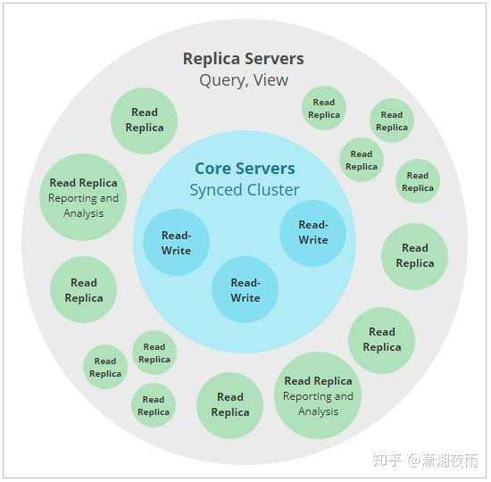
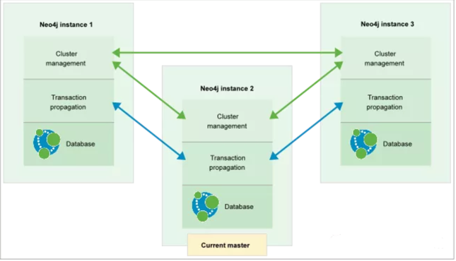
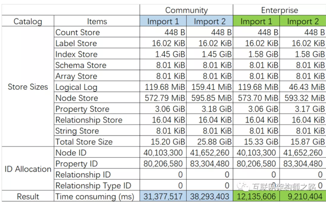
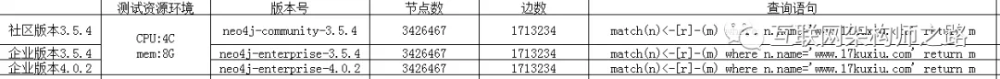
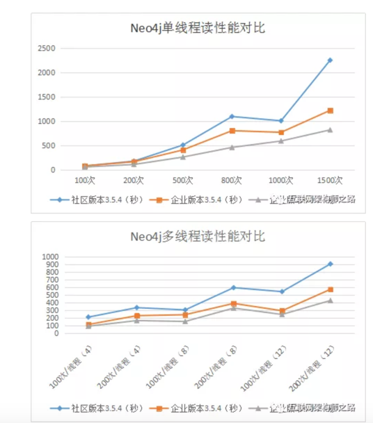

<!-- START doctoc generated TOC please keep comment here to allow auto update -->
<!-- DON'T EDIT THIS SECTION, INSTEAD RE-RUN doctoc TO UPDATE -->
**Table of Contents**  *generated with [DocToc](https://github.com/thlorenz/doctoc)*

- [graph database图数据库-neo4j](#graph-database%E5%9B%BE%E6%95%B0%E6%8D%AE%E5%BA%93-neo4j)
  - [市场上的图数据](#%E5%B8%82%E5%9C%BA%E4%B8%8A%E7%9A%84%E5%9B%BE%E6%95%B0%E6%8D%AE)
  - [Neo4j的特点](#neo4j%E7%9A%84%E7%89%B9%E7%82%B9)
  - [集群模式](#%E9%9B%86%E7%BE%A4%E6%A8%A1%E5%BC%8F)
    - [因果集群](#%E5%9B%A0%E6%9E%9C%E9%9B%86%E7%BE%A4)
    - [角色](#%E8%A7%92%E8%89%B2)
      - [Core Servers](#core-servers)
      - [Read Replicas](#read-replicas)
  - [测试:简单docker安装](#%E6%B5%8B%E8%AF%95%E7%AE%80%E5%8D%95docker%E5%AE%89%E8%A3%85)
    - [因果一致性](#%E5%9B%A0%E6%9E%9C%E4%B8%80%E8%87%B4%E6%80%A7)
    - [高可用集群](#%E9%AB%98%E5%8F%AF%E7%94%A8%E9%9B%86%E7%BE%A4)
      - [仲裁者实例](#%E4%BB%B2%E8%A3%81%E8%80%85%E5%AE%9E%E4%BE%8B)
      - [事务传播](#%E4%BA%8B%E5%8A%A1%E4%BC%A0%E6%92%AD)
      - [故障转移](#%E6%95%85%E9%9A%9C%E8%BD%AC%E7%A7%BB)
      - [法定人数](#%E6%B3%95%E5%AE%9A%E4%BA%BA%E6%95%B0)
      - [选举规则](#%E9%80%89%E4%B8%BE%E8%A7%84%E5%88%99)
      - [数据分支](#%E6%95%B0%E6%8D%AE%E5%88%86%E6%94%AF)
    - [索引配置](#%E7%B4%A2%E5%BC%95%E9%85%8D%E7%BD%AE)
      - [字段索引](#%E5%AD%97%E6%AE%B5%E7%B4%A2%E5%BC%95)
    - [Bolt连接池管理](#bolt%E8%BF%9E%E6%8E%A5%E6%B1%A0%E7%AE%A1%E7%90%86)
      - [线程池的工作机制](#%E7%BA%BF%E7%A8%8B%E6%B1%A0%E7%9A%84%E5%B7%A5%E4%BD%9C%E6%9C%BA%E5%88%B6)
      - [配置选项](#%E9%85%8D%E7%BD%AE%E9%80%89%E9%A1%B9)
    - [性能](#%E6%80%A7%E8%83%BD)
      - [测试环境](#%E6%B5%8B%E8%AF%95%E7%8E%AF%E5%A2%83)
      - [写入测试结果](#%E5%86%99%E5%85%A5%E6%B5%8B%E8%AF%95%E7%BB%93%E6%9E%9C)
      - [读取测试结果](#%E8%AF%BB%E5%8F%96%E6%B5%8B%E8%AF%95%E7%BB%93%E6%9E%9C)

<!-- END doctoc generated TOC please keep comment here to allow auto update -->

# graph database图数据库-neo4j
## 市场上的图数据
图数据库常规的有：neo4j（支持超多语言）、JanusGraph/Titan（分布式）、Orientdb，google也开源了图数据库Cayley（Go语言构成）、PostgreSQL存储RDF格式数据。

## Neo4j的特点

* SQL就像简单的查询语言Neo4j CQL

* 遵循属性图数据模型

* 通过使用Apache Lucence支持索引

* 支持UNIQUE约束

* 包含一个用于执行CQL命令的UI：Neo4j数据浏览器

* 支持完整的ACID（原子性，一致性，隔离性和持久性）规则

* 采用原生图形库与本地GPE（图形处理引擎）

* 支持查询的数据导出到JSON和XLS格式

* 提供了REST API，可以被任何编程语言（如Java，Spring，Scala等）访问

* 提供了可以通过任何UI MVC框架（如Node JS）访问的Java脚本

* 支持两种Java API：Cypher API和Native Java API来开发Java应用程序
## 集群模式 
NEO4J提供了两种集群模式，
1. 一种是HA（主备模式），在neo4j 4.0之后就废弃了；
2. 另外一种是因果集群模式(causal cluster),它们的架构和特点如下。
### 因果集群


Neo4j集群由两个不同的角色Core Servers和Read Replicas组成，这两个角色是任何生产部署中的基础，但彼此之间的管理规模不同，并且在管理整个集群的容错性和可伸缩性方面承担着不同的角色

### 角色
#### Core Servers
核心服务器的主要责任是保护数据。 核心服务器通过使用Raft协议复制所有事务来做到这一点。 在确认向最终用户应用程序提交事务之前，Raft确保数据安全持久。
在实际环境中，这意味着一旦集群（N / 2 + 1）中的大多数核心服务器都接受了事务，安全性要求会影响写入延迟。 隐式写入将以最快的多数Core Servers被确认，但是随着群集中核心服务器数量的增加，确认一次写入所需的Core Servers的数量也会增加。
实际上，这意味着典型的Core Server集群中需要一定数量的服务器，足以为特定部署提供足够的容错能力。 这是使用公式M = 2F +1计算的，其中M是容忍F故障所需的核心服务器数量。 例如：

* 为了容忍两个发生故障的核心服务器，我们需要部署五个核心的集群。
* 最小的容错群集（一个可以容忍一个故障的群集）必须具有三个内核。
* 也可以创建仅包含两个核心的因果集群。 但是，该群集不是容错的。 如果两个服务器之一发生故障，其余服务器将变为只读。
请注意，如果Core Server集群遭受足够的故障而无法处理写入，则它将变为只读状态以保持安全。

#### Read Replicas

只读副本的主要职责是扩展图数据负载能力（密码查询，过程等）。 只读副本的作用类似于Core Server保护的数据的缓存，但它们不是简单的键值缓存。 
实际上，只读副本是功能齐全的Neo4j数据库，能够完成任意（只读）图数据查询和过程。

只读副本是通过事务日志传送从Core Servers异步复制的。 只读副本将定期（通常在ms范围内）轮询核心服务器以查找自上次轮询以来已处理的任何新事务，并且核心服务器会将这些事务发送到只读副本。
可以从相对较少的Core Server中馈送许多只读副本数据，从而使查询工作量大为增加，从而扩大规模。

但是，与核心服务器不同，只读副本不参与有关群集拓扑的决策。 只读副本通常应以相对较大的数量运行，并视为一次性使用。 
丢失只读副本不会影响群集的可用性，除了丢失其图表查询吞吐量的一部分。 它不会影响群集的容错能力

## 测试:简单docker安装
```shell
docker run \
    --name testneo4j \
    -p7474:7474 -p7687:7687 \
    -d \
    -v $HOME/neo4j/data:/data \
    -v $HOME/neo4j/logs:/logs \
    -v $HOME/neo4j/import:/var/lib/neo4j/import \
    -v $HOME/neo4j/plugins:/plugins \
    --env NEO4J_AUTH=neo4j/chuanzhi \
    neo4j:latest
```

### 因果一致性
从应用程序的角度来看，集群的运行机制很有趣，但是考虑应用程序将如何使用数据库完成工作也很有帮助。在应用程序中，我们通常希望从图中读取并写入图中。根据工作负载的性质，我们通常希望从图中进行读取以考虑先前的写入，以确保因果一致性。

因果一致性使得可以写入Core Server（数据是安全的）并从Read Replica（其中图操作被扩展）中读取这些写入。例如，因果一致性可确保当该用户随后尝试登录时，会出现创建该用户帐户的写操作。

在执行事务时，客户可以要求书签，然后将其作为参数提供给后续事务。使用该书签，集群可以确保只有处理了该客户已添加书签的事务的服务器才能运行其下一个事务。这提供了因果链，从客户的角度确保了正确的写后读语义。

除了书签之外，其他所有事情都由集群处理。数据库驱动程序与群集拓扑管理器一起使用，以选择最合适的核心服务器和只读副本，以提供高质量的服务。


### 高可用集群
Neo4j HA群集由一个主实例和多个从属实例组成。集群中的所有实例在其本地数据库文件中均具有数据的完整副本。基本集群配置包含三个实例：

每个实例都包含集群管理功能、数据复制功能和选举管理功能，如上图的绿色箭头所示。每个非仲裁实例(从属实例)均与主实例进行通信，以使数据库保持最新状态，如上图中的蓝色箭头所示。

#### 仲裁者实例

从属实例的一个特例是仲裁者实例。仲裁程序实例包含在仲裁程序模式下运行的完整Neo4j软件，因此它参与集群通信，但不复制数据存储的副本

#### 事务传播
直接在主服务器上执行的写事务和在非集群模式下执行模式一致。成功后，该事务将被推送到其它从属实例。如果其它实例推送失败，此事务仍然保持成功，这种模式和乐观锁类似。

在从实例上执行写事务时，每个写操作将与主机同步。主锁和从锁都将获得锁。当事务提交时，它将首先在主服务器上提交，如果成功，则在从服务器上提交。
为了确保一致性，在执行写操作之前，主从必须保持一致并且最新。从实例的自动更新内置在主从之间的通信协议中。


#### 故障转移
每当Neo4j数据库不可用（例如，由硬件故障或网络中断引起）时，群集中的其他实例将检测到该情况并将其标记为暂时失败。数据库实例故障恢复后将自动追赶集群。

如果主服务器出现故障，则在集群中达到法定人数后，将选举另一个成员，并将其角色从从服务器切换为主服务器。新的主服务器将向群集的所有其他成员广播其可用性。通常，几秒钟之内就会选出一个新的主机并启动。在这段时间内无法进行写操作。

#### 法定人数
群集必须具有法定人数才能选举新的主服务器。法定人数定义为：活动集群成员的50％以上。设计集群时的经验法则是：必须能够容忍n个主实例故障的集群需要2n + 1个实例来满足仲裁并允许进行选举。因此，最简单的有效群集大小是三个实例，这允许单个主服务器故障。

#### 选举规则

如果主服务器发生故障，或者在集群的冷启动时，具有最高已提交事务ID的从服务器将被选作新的主服务器。该规则确保具有最新数据存储的从站成为新的主服务器。

如果一个主服务器发生故障，并且两个或多个从服务器绑定在一起，即具有相同的最高提交事务ID，则ha.server_id值最低的从属服务器将被选举为新的主服务器。
这是一个简易并快速的做法，因为ha.server_id在集群中是唯一的，并且可配置。

#### 数据分支

数据分支的产生可能有如下两种不同的方式：

一个从服务器落在主服务器之后，然后离开或重新加入集群。这种分支是无害的。

发生主服务器重新选举，并且旧的主服务器具有一个或多个已提交的事务，而从服务器在死前没有收到。这种分支是有害的，需要采取措施。

数据库通过创建一个目录来充分利用这种情况，该目录包含分支发生之前的数据库文件的内容，以便可以对其进行检查并解决该情况。在正常操作下不会发生数据分支


### 索引配置


#### 字段索引

NEO4J采用了apache lucene进行本地化索引，采取的索引存储结构是B+树，可通过dbms.index.default_schema_provider来修改索引器版本，NEO4J提供如下几种索引类型：

- native-btree-1.0：支持空间，时间，数值，字符串，数组，布尔类型索引

- lucene+native-2.0：支持空间，时间，数字，字符串

- lucene+native-1.0：支持空间，时间，数值

- lucene-1.0：只支持空间索引

### Bolt连接池管理


Bolt是NEO4J自定义的一种连接协议，连接器由服务器端的线程池支持。


#### 线程池的工作机制
Bolt线程池可以设置最小和最大容量。它从可用线程的最小数量开始，然后根据工作负载增长到最大数量。空闲时间超过指定阈值的线程将被停止并从池中删除，以释放资源。

建立的每个连接都分配给连接器的线程池。空闲连接不会占用服务器端的任何资源，并且会针对来自客户端的消息进行监视。每个到达连接的消息都会在线程池中的可用线程上触发连接调度。如果所有可用线程都忙，并且仍有增长空间，则会创建一个新线程，并将连接移交给该线程进行处理。如果池容量已满，并且没有线程可用于处理，则作业提交将被拒绝，并生成一条失败消息以将问题通知客户端。

分配给Bolt线程池的默认值将适合大多数工作负载，因此通常不必显式配置连接池。如果最大池大小设置得太低，会出现没有可用的线程可以使用的异常。

#### 配置选项

dbms.connector.bolt.thread_pool_min_size：运行状态的最小线程数，默认是5

dbms.connector.bolt.thread_pool_max_size：最大线程数，默认是400

dbms.connector.bolt.thread_pool_keep_alive：线程空闲等待时间，超过此时间线程会被回收，默认5分钟


### 性能

#### 测试环境

机器：Surface Pro 4

系统：Microsoft Windows 10 专业版 64 位 版本 10.0.15063

处理器：Intel® Core™ i7-6650U CPU @ 2.20GHz 2208Mhz, 2 个内核, 4 个逻辑处理器

硬盘：1 TB SSD

内存：16 GB

版本：neo4j-community-3.4.1-windows.zip vs neo4j-enterprise-3.4.1-windows.zip

配置：

dbms.memory.heap.initial_size=5g

dbms.memory.heap.max_size=5g

dbms.memory.pagecache.size=7g

数据源：https://snap.stanford.edu/data/twitter-2010.txt.gz

twitter-2010.txt.gz （5,501,785,223 字节，展开后 26,141,060,589 字节，1,468,365,182 行

#### 写入测试结果

两次导入，共导入：

节点 81,755,560 个

属性 163,511,060 个

社区版用时：

第一次导入：31,377,517 ms

第二次导入：38,293,403 ms

企业版用时：

第一次导入：12,135,606 ms

第二次导入：99,210,404 ms

性能对比（企业版比社区版）：

第一次导入：2.58 倍

第二次导入：4.15 倍

#### 读取测试结果

1、通过neo4j官方提供的neo4j-driver进行连接；

2、读取数据节点数：3426467；边数：1713234；

3、一种是单线程从100-1500次分批读取；一种是多线程100-200次分批读取。

1、企业版相比于社区版性能随着并发访问量不断加大，性能优势逐渐提升，两种场景下提升分别58%~84%不等；

2、企业版3.x和4.x版本随着并发加大也有性能提升，平均来说读取性能有32%的提升。
