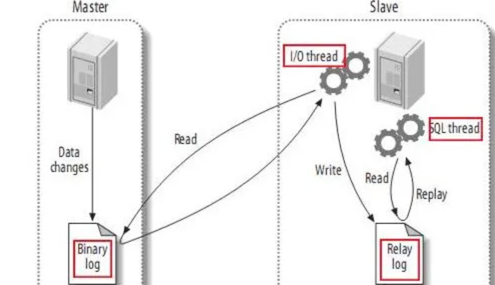
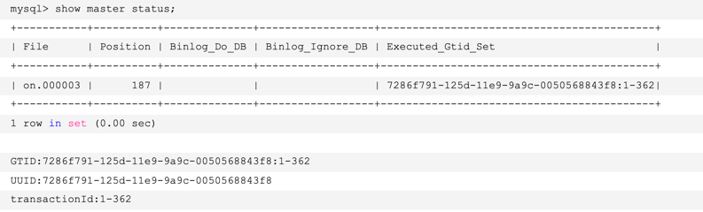
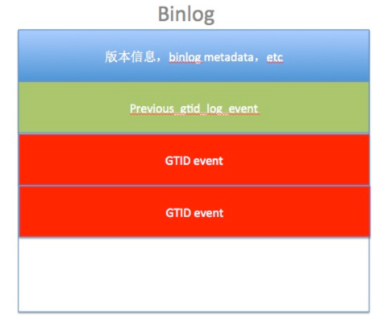
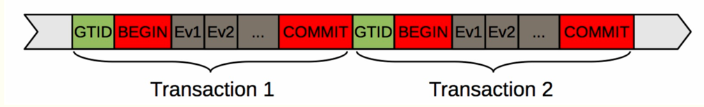
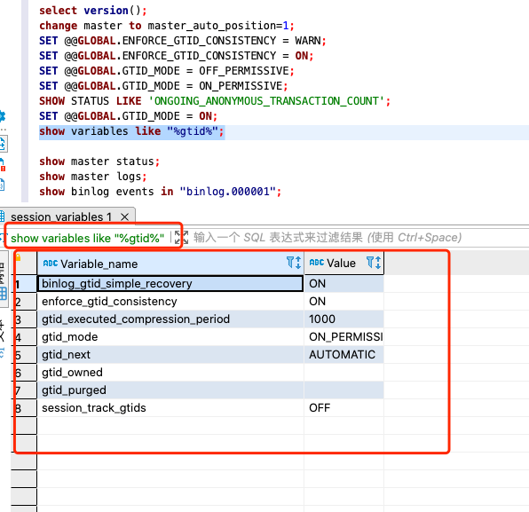

# mysql的binlog二进制日志((归档日志)

## MySQL的主从复制

1. master将改变记录到二进制日志(binary log)中（这些记录叫做二进制日志事件，binary log events，可以通过show binlog events进行查看）；
2. slave将master的binary log events拷贝到它的中继日志(relay log)；
3. slave重做中继日志中的事件，将改变反映它自己的数据

## 常用的Binlog操作命令
```shell
# 是否启用binlog日志
show variables like 'log_bin';

# 查看详细的日志配置信息
show global variables like '%log%';

# mysql数据存储目录
show variables like '%dir%';

# 查看binlog的目录
show global variables like "%log_bin%";

# 事件查询命令
# IN 'log_name' ：指定要查询的binlog文件名(不指定就是第一个binlog文件)
# FROM pos ：指定从哪个pos起始点开始查起(不指定就是从整个文件首个pos点开始算)
# LIMIT [offset,] ：偏移量(不指定就是0)
# row_count ：查询总条数(不指定就是所有行)
show binlog events [IN 'log_name'] [FROM pos] [LIMIT [offset,] row_count];


# 删除当前的binlog文件
reset master; 

# 删除slave的中继日志
reset slave;

# 删除指定日期前的日志索引中binlog日志文件
purge master logs before '2019-03-09 14:00:00';

# 删除指定日志文件
purge master logs to 'master.000003';
```
查看bin_log格式:   
 

获取binlog文件列表:   
   

查看当前正在写入的binlog文件:    
  

GTID即全局事务ID (global transaction identifier)

查看指定binlog文件的内容
- 只查看第一个binlog文件的内容
show binlog events;

- 查看具体一个binlog文件的内容 （in 后面为binlog的文件名）
show binlog events in 'binlog.000003';   


查看master上的binlog   
   

查看log过期时间
    
设置binlog文件保存事件，过期删除，单位天
set global expire_logs_days=3;

## Binlog 文件以及扩展
binlog日志包括两类文件:
- 二进制日志索引文件（文件名后缀为.index）用于记录所有有效的的二进制文件
- 二进制日志文件（文件名后缀为.00000*）记录数据库所有的DDL和DML语句事件

binlog是一个二进制文件集合，每个binlog文件以一个4字节的魔数开头，接着是一组Events:
- 魔数：0xfe62696e对应的是0xfebin；
- Event：每个Event包含header和data两个部分；header提供了Event的创建时间，哪个服务器等信息，data部分提供的是针对该Event的具体信息，如具体数据的修改；
- 第一个Event用于描述binlog文件的格式版本，这个格式就是event写入binlog文件的格式；
- 其余的Event按照第一个Event的格式版本写入；
- 最后一个Event用于说明下一个binlog文件；
- binlog的索引文件是一个文本文件，其中内容为当前的binlog文件列表

当遇到以下3种情况时，MySQL会重新生成一个新的日志文件，文件序号递增：

- MySQL服务器停止或重启时
- 使用 flush logs 命令；
- 当 binlog 文件大小超过 max_binlog_size 变量的值时

Note:

    max_binlog_size 的最小值是4096字节，最大值和默认值是 1GB (1073741824字节)。
    事务被写入到binlog的一个块中，所以它不会在几个二进制日志之间被拆分。
    因此，如果你有很大的事务，为了保证事务的完整性，不可能做切换日志的动作，只能将该事务的日志都记录到当前日志文件中，直到事务结束，
    你可能会看到binlog文件大于 max_binlog_size 的情况。

## GTID在binlog中的结构


- GTID event 结构



- Previous_gtid_log_event
Previous_gtid_log_event 在每个binlog 头部都会有每次binlog rotate的时候存储在binlog头部Previous-GTIDs在binlog中只会存储在这台机器上执行过的所有binlog，不包括手动设置gtid_purged值。
换句话说，如果你手动set global gtid_purged=xx； 那么xx是不会记录在Previous_gtid_log_event中的。

- GTID和Binlog之间的关系是怎么对应的呢? 如何才能找到GTID=? 对应的binlog文件呢？


    假设有4个binlog: bin.001,bin.002,bin.003,bin.004
    bin.001 : Previous-GTIDs=empty; binlog_event有: 1-40
    bin.002 : Previous-GTIDs=1-40; binlog_event有: 41-80
    bin.003 : Previous-GTIDs=1-80; binlog_event有: 81-120
    bin.004 : Previous-GTIDs=1-120; binlog_event有: 121-160
    
    假设现在我们要找GTID=$A，那么MySQL的扫描顺序为:
    - 从最后一个binlog开始扫描（即: bin.004）
    - bin.004的Previous-GTIDs=1-120，如果$A=140 > Previous-GTIDs,那么肯定在bin.004中
    - bin.004的Previous-GTIDs=1-120，如果$A=88 包含在Previous-GTIDs中,那么继续对比上一个binlog文件 bin.003,然后再循环前面2个步骤，直到找到为止.

### GTID相关参数



### GTID的工作原理
从服务器连接到主服务器之后，把自己执行过的GTID (Executed_Gtid_Set: 即已经执行的事务编码)<SQL线程> 、获取到的GTID (Retrieved_Gtid_Set: 即从库已经接收到主库的事务编号) <IO线程>发给主服务器，
主服务器把从服务器缺少的GTID及对应的transactions发过去补全即可。当主服务器挂掉的时候，找出同步最成功的那台从服务器，直接把它提升为主即可。
如果硬要指定某一台不是最新的从服务器提升为主， 先change到同步最成功的那台从服务器， 等把GTID全部补全了，就可以把它提升为主了。

GTID是MySQL 5.6的新特性，可简化MySQL的主从切换以及Failover。
GTID用于在binlog中唯一标识一个事务。当事务提交时，MySQL Server在写binlog的时候，会先写一个特殊的Binlog Event，类型为GTID_Event，指定下一个事务的GTID，然后再写事务的Binlog。
主从同步时GTID_Event和事务的Binlog都会传递到从库，从库在执行的时候也是用同样的GTID写binlog，这样主从同步以后，就可通过GTID确定从库同步到的位置了。
也就是说，无论是级联情况，还是一主多从情况，都可以通过GTID自动找点儿，而无需像之前那样通过File_name和File_position找点儿了。

简而言之，GTID的工作流程为：
- master更新数据时，会在事务前产生GTID，一同记录到binlog日志中。
- slave端的i/o 线程将变更的binlog，写入到本地的relay log中。
- sql线程从relay log中获取GTID，然后对比slave端的binlog是否有记录。
- 如果有记录，说明该GTID的事务已经执行，slave会忽略。
- 如果没有记录，slave就会从relay log中执行该GTID的事务，并记录到binlog。
- 在解析过程中会判断是否有主键，如果没有就用二级索引，如果没有就用全部扫描

### GTID优缺点
GTID的优点
-  一个事务对应一个唯一ID，一个GTID在一个服务器上只会执行一次;
-  GTID是用来代替传统复制的方法，GTID复制与普通复制模式的最大不同就是不需要指定二进制文件名和位置;
-  减少手工干预和降低服务故障时间，当主机挂了之后通过软件从众多的备机中提升一台备机为主机;

GTID复制是怎么实现自动同步，自动对应位置的呢？
比如这样一个主从架构：ServerC <-----ServerA ----> ServerB
即一个主数据库ServerA，两个从数据库ServerB和ServerC

当主机ServerA 挂了之后 ，此时ServerB执行完了所有从ServerA 传过来的事务，ServerC 延时一点。这个时候需要把 ServerB 提升为主机 ，Server C 继续为备机；当ServerC 链接ServerB 之后,首先在自己的二进制文件中找到从ServerA 传过来的最新的GTID，然后将这个GTID 发送到ServerB ,ServerB 获得这个GTID之后,就开始从这个GTID的下一个GTID开始发送事务给ServerC。这种自我寻找复制位置的模式减少事务丢失的可能性以及故障恢复的时间。

GTID的缺点(限制)
-  不支持非事务引擎;
-  不支持create table ... select 语句复制(主库直接报错);(原理: 会生成两个sql, 一个是DDL创建表SQL, 一个是insert into 插入数据的sql; 由于DDL会导致自动提交, 所以这个sql至少需要两个GTID, 但是GTID模式下, 只能给这个sql生成一个GTID)
-  不允许一个SQL同时更新一个事务引擎表和非事务引擎表;
-  在一个复制组中，必须要求统一开启GTID或者是关闭GTID;
-  开启GTID需要重启 (mysql5.7除外);
-  开启GTID后，就不再使用原来的传统复制方式;
-  对于create temporary table 和 drop temporary table语句不支持;
-  不支持sql_slave_skip_counter;


## binlog dump
最开始的时候，MySQL只支持一种binlog dump方式，也就是指定binlog filename + position，向master发送COM_BINLOG_DUMP命令。
在发送dump命令的时候，我们可以指定flag为BINLOG_DUMP_NON_BLOCK，这样master在没有可发送的binlog event之后，就会返回一个EOF package。
不过通常对于slave来说，一直把连接挂着可能更好，这样能更及时收到新产生的binlog event。
在MySQL 5.6之后，支持了另一种dump方式，也就是GTID dump，通过发送COM_BINLOG_DUMP_GTID命令实现，需要带上的是相应的GTID信息.

## Binlog 的日志格式
记录在二进制日志中的事件的格式取决于二进制记录格式。支持三种格式类型：

- STATEMENT：基于SQL语句的复制（statement-based replication, SBR）
- ROW：基于行的复制（row-based replication, RBR）
- MIXED：混合模式复制（mixed-based replication, MBR

在 MySQL 5.7.7 之前，默认的格式是 STATEMENT，在 MySQL 5.7.7 及更高版本中，默认值是 ROW。
日志格式通过 binlog-format 指定，如 binlog-format=STATEMENT、binlog-format=ROW、binlog-format=MIXED

### 1. statement
每一条会修改数据的sql都会记录在binlog中。

优点：不需要记录每一行的变化，减少了binlog日志量，节约了IO，提高性能。

缺点：由于记录的只是执行语句，为了这些语句能在slave上正确运行，因此还必须记录每条语句在执行的时候的一些相关信息，以保证所有语句能在slave得到和在master端执行时候相同 的结果。
另外mysql 的复制,像一些特定函数功能，slave可与master上要保持一致会有很多相关问题。

ps：相比row能节约多少性能与日志量，这个取决于应用的SQL情况，正常同一条记录修改或者插入row格式所产生的日志量还小于Statement产生的日志量，
但是考虑到如果带条件的update操作，以及整表删除，alter表等操作，ROW格式会产生大量日志，因此在考虑是否使用ROW格式日志时应该跟据应用的实际情况，其所产生的日志量会增加多少，以及带来的IO性能问题。

### 2. row

5.1.5版本的MySQL才开始支持row level的复制,它不记录sql语句上下文相关信息，仅保存哪条记录被修改。

优点： binlog中可以不记录执行的sql语句的上下文相关的信息，仅需要记录那一条记录被修改成什么了。
所以rowlevel的日志内容会非常清楚的记录下每一行数据修改的细节。而且不会出现某些特定情况下的存储过程，或function，以及trigger的调用和触发无法被正确复制的问题.

缺点:所有的执行的语句当记录到日志中的时候，都将以每行记录的修改来记录，这样可能会产生大量的日志内容。

ps:新版本的MySQL中对row level模式也被做了优化，并不是所有的修改都会以row level来记录，像遇到表结构变更的时候就会以statement模式来记录，如果sql语句确实就是update或者delete等修改数据的语句，那么还是会记录所有行的变更

### 3. mixed
从5.1.8版本开始，MySQL提供了Mixed格式，实际上就是Statement与Row的结合。

在Mixed模式下，一般的语句修改使用statment格式保存binlog，如一些函数，statement无法完成主从复制的操作，则采用row格式保存binlog，MySQL会根据执行的每一条具体的sql语句来区分对待记录的日志形式，也就是在Statement和Row之间选择一种


