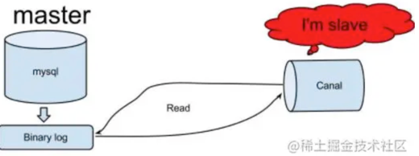
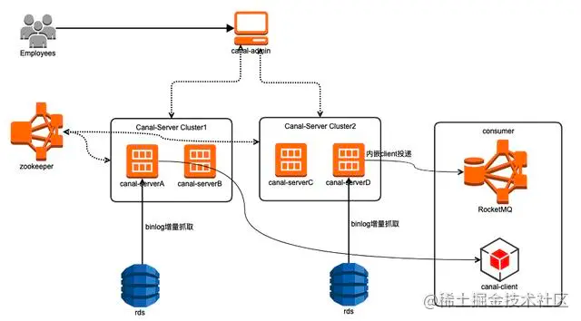
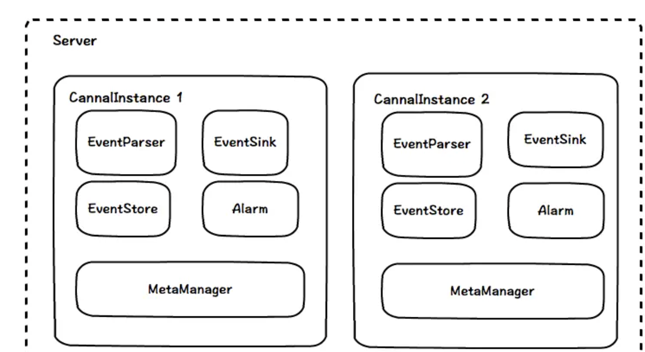
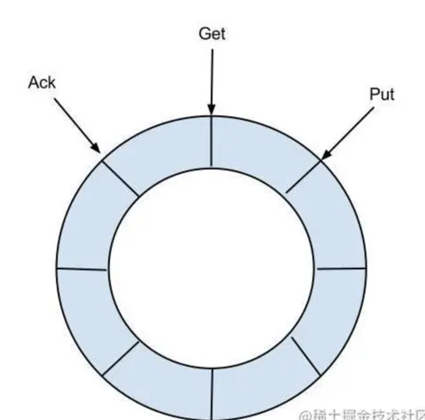
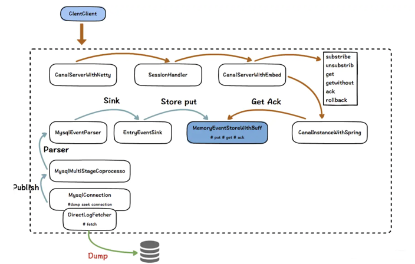
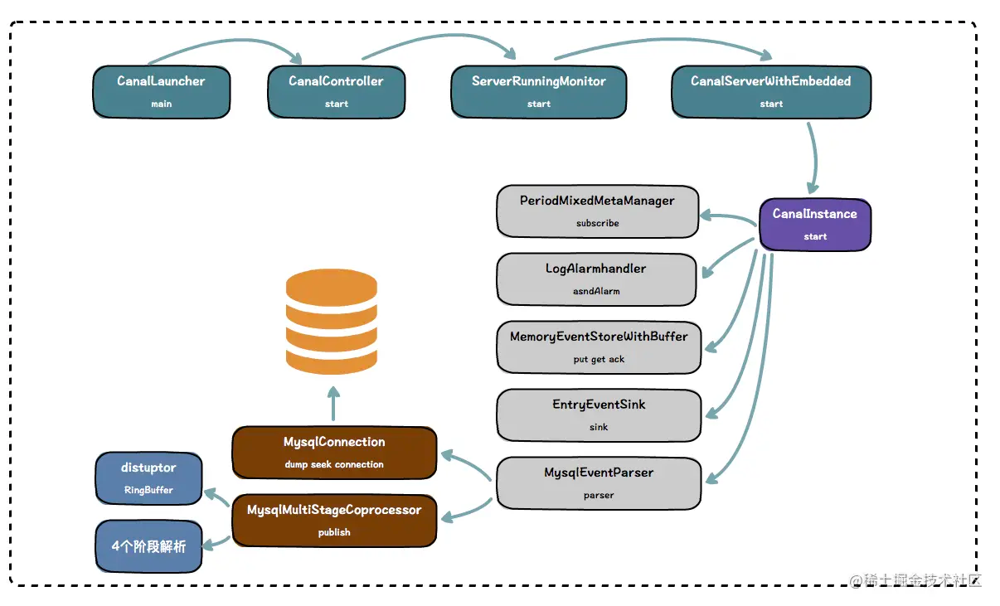

# Canal
canal [kə'næl]，译意为水道/管道/沟渠，主要用途是基于 MySQL 数据库增量日志解析，提供增量数据 订阅 和 消费。
应该是阿里云DTS（Data Transfer Service）的开源版本。

阿里巴巴mysql数据库binlog的增量订阅&消费组件

## 能力
Canal与DTS提供的功能基本相似：
1. 基于Mysql的Slave协议实时dump binlog流，解析为事件发送给订阅方。
2. 单Canal instance，单DTS数据订阅通道均只支持订阅一个RDS，提供给一个消费者。
3. 可以使用canal-client客户端进行消息消费。
4. 也可以通过简单配置，也可以不需要自行使用canal-client消费，可以选择直接投递到kafka或者RocketMQ集群，用户只需要使用消息队列的consumer消费即可。
5. 成功消费消息后需要进行Ack，以确保一致性，服务端则会维护客户端目前的消费位点。

## 原理

1. canal模拟 MySQL slave 的交互协议，伪装自己为 MySQL slave ，向 MySQL master 发送 dump 协议；
2. MySQL master 收到 dump 请求，开始推送 binary log 给 slave (即 canal )；
3. canal 解析 binary log 对象(原始为 byte 流)

## Canal架构

###  admin版本整体架构

canal 1.1.4开始支持admin管理，通过canal-admin为canal提供整体配置管理、节点运维等面向运维的功能，提供相对友好的WebUI操作界面，
方便更多用户快速和安全的操作，替代了过去繁琐的配置文件管理。

- 多个canal-server可以组成集群模式，每个instance任务通过zookeeper在集群中实现高可用
- 通过多个集群，可以实现同步资源的物理隔离
- 可以直接抓取消费投递MQ，可以实现生产/消费解耦、消息堆积、消息回溯
- 可以抓取消费投递给canal-client，在用户的服务中进行消息处理，减少中间过程

### canal-server架构

- server代表一个canal-server运行实例，对应于一个jvm
- instance对应于一个数据队列，是真正的变更抓取的实体 （1个server可以对应多个instance)

Instance模块
- EventParser解析 ：数据源接入，模拟slave协议和master进行交互，协议解析
- EventSink过滤 ：Parser和Store链接器，进行数据过滤，加工，分发的工作
- EventStore存储 ：数据存储
- MetaManager元数据管理：增量订阅&消费信息管理器
- Alarm 报警


#### 1. EventParser子模块
主要有两个核心组件组成：

- CanalLogPositionManager：用来记录最新解析成功的binlog position信息，在canal重启后，作为起始位点
- CanalHAController：支持Mysql主备，基于Heartbeat判断当前数据库连接的有效性，一旦主库失去心跳，就切换连接备库

EventParser从CanalHAController确定连接mysql的位置，然后通过LogPositionManager确定binlog解析位点的起点，最后便通过dump协议拉取binlog进行解析,把解析后的消息存入EventSink

#### 2. EventSink子模块
目前只提供了一个带有实际作用的实现：GroupEventSink.

GroupEventSink用于将多个instance上的数据进行归并，常用于分库后的多数据源归并

#### 3. EventStore子模块
目前只实现了基于内存存储的MemoryEventStoreWithBuffer.

MemoryEventStoreWIthBuffer内部采用的是一个RingBuffer，我们可以理解为基于内存的高性能消息队列。如果使用canal-client直接消费canal-server的数据，那么只能通过这个消息队列做一定程度的消息堆积。

- Put : Sink模块进行数据存储的最后一次写入位置
- Get : 数据订阅获取的最后一次提取位置
- Ack : 数据消费成功的最后一次消费位置

这些位点信息通过MetaManager进行管理。这也解释了为什么一个canal instance只能支撑一个消费者：EventStore的RingBuffer只为一个消费者维护信息。

## Canal 启动流程
canal 代码量目前有 6 万多行，去除 2 个 ProtocolBuffer 生成类大概 1.7 万行，也还有 4.3 万行，代码还是不少的。


## Canal 数据流向



## 客户端使用
Canal和DTS客户端 
```css
拉取事件 -> 消费 -> 消费成功后ACK
```
这样的消费模式，并支持消费不成功时进行rollback，重新消费该数据。

## 优点
1）性能优异、功能全面
- canal 1.1.x 版本（release_note）,性能与功能层面有较大的突破,重要提升包括:
- 整体性能测试&优化,提升了150%. #726
- 原生支持prometheus监控 #765
- 原生支持kafka消息投递 #695
- 原生支持aliyun rds的binlog订阅 (解决自动主备切换/oss binlog离线解析) （无法拒绝它的理由！）
- 原生支持docker镜像 #801

2）运维方便
- canal 1.1.4版本，迎来最重要的WebUI能力，引入canal-admin工程，支持面向WebUI的canal动态管理能力，支持配置、任务、日志等在线白屏运维能力
- Standalone的一体化解决方案，无外部服务依赖，运维更简单，在某种程度上也意味着更稳定。
- 开箱即用，节约开发与定制成本。
- 有良好的管理控制平台与监控系统（如果你已经有promethus监控，可以秒接canal监控）

3）多语言支持
- canal 特别设计了 client-server 模式，交互协议使用 protobuf 3.0 , client 端可采用不同语言实现不同的消费逻辑
- canal 作为 MySQL binlog 增量获取和解析工具，可将变更记录投递到 MQ 系统中，比如 Kafka/RocketMQ，可以借助于 MQ 的多语言能力

## 缺点
- 单instance/订阅通道只支持订阅单个数据库，并只能支持单客户端消费。每当我们需要新增一个消费端->MySQL的订阅：对于Canal而言，就要给MySQL接一个“Slave”，可能会对主库有一定影响。
- 消息的Schema很弱，所有消息的Schema均相同，客户端需要提前知道各个表消息的Schema与各字段的上下文才能正确消费


## go-mysql@v1.3.0/canal源码分析

实际处理的handler
```go
// /Users/xiaxin/go/pkg/mod/github.com/go-mysql-org/go-mysql@v1.3.0/canal/handler.go
package canal

import (
	"github.com/go-mysql-org/go-mysql/mysql"
	"github.com/go-mysql-org/go-mysql/replication"
)

type EventHandler interface {
	OnRotate(roateEvent *replication.RotateEvent) error
	// OnTableChanged is called when the table is created, altered, renamed or dropped.
	// You need to clear the associated data like cache with the table.
	// It will be called before OnDDL.
	OnTableChanged(schema string, table string) error
	OnDDL(nextPos mysql.Position, queryEvent *replication.QueryEvent) error
	OnRow(e *RowsEvent) error
	OnXID(nextPos mysql.Position) error
	OnGTID(gtid mysql.GTIDSet) error
	// OnPosSynced Use your own way to sync position. When force is true, sync position immediately.
	OnPosSynced(pos mysql.Position, set mysql.GTIDSet, force bool) error
	String() string
}

type DummyEventHandler struct {
}

func (h *DummyEventHandler) OnRotate(*replication.RotateEvent) error          { return nil }
func (h *DummyEventHandler) OnTableChanged(schema string, table string) error { return nil }
func (h *DummyEventHandler) OnDDL(nextPos mysql.Position, queryEvent *replication.QueryEvent) error {
	return nil
}
func (h *DummyEventHandler) OnRow(*RowsEvent) error                                { return nil }
func (h *DummyEventHandler) OnXID(mysql.Position) error                            { return nil }
func (h *DummyEventHandler) OnGTID(mysql.GTIDSet) error                            { return nil }
func (h *DummyEventHandler) OnPosSynced(mysql.Position, mysql.GTIDSet, bool) error { return nil }

func (h *DummyEventHandler) String() string { return "DummyEventHandler" }

// `SetEventHandler` registers the sync handler, you must register your
// own handler before starting Canal.
func (c *Canal) SetEventHandler(h EventHandler) {
	c.eventHandler = h
}

```


### 流程分析
```go

```
开始调用
```go
// /Users/xiaxin/go/pkg/mod/github.com/go-mysql-org/go-mysql@v1.3.0/canal/canal.go
// RunFrom will sync from the binlog position directly, ignore mysqldump.
func (c *Canal) RunFrom(pos mysql.Position) error {
	c.master.Update(pos)

	return c.Run()
}
func (c *Canal) Run() error {
    return c.run()
}
func (c *Canal) run() error {
    // ...
    
    if !c.dumped {
        c.dumped = true
        // 开始dump数据
        err := c.tryDump()
        close(c.dumpDoneCh)
        
    if err != nil {
        log.Errorf("canal dump mysql err: %v", err)
        return errors.Trace(err)
        }
    }
    //...
}

// Dump all data from MySQL master `mysqldump`, ignore sync binlog.
func (c *Canal) Dump() error {
	if c.dumped {
		return errors.New("the method Dump can't be called twice")
	}
	c.dumped = true
	defer close(c.dumpDoneCh)
	return c.dump()
}
```
```go
// /Users/xiaxin/go/pkg/mod/github.com/go-mysql-org/go-mysql@v1.3.0/canal/dump.go
func (c *Canal) dump() error {
	//...
	if err := c.dumper.DumpAndParse(h); err != nil {}
	// ...
}
```


