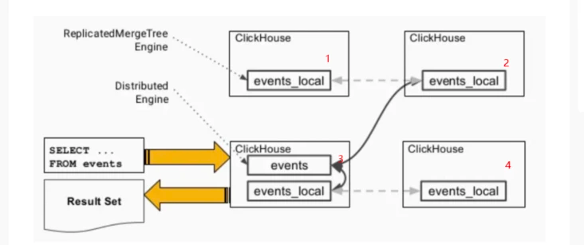

<!-- START doctoc generated TOC please keep comment here to allow auto update -->
<!-- DON'T EDIT THIS SECTION, INSTEAD RE-RUN doctoc TO UPDATE -->
**Table of Contents**  *generated with [DocToc](https://github.com/thlorenz/doctoc)*

- [ClickHouse](#clickhouse)
  - [完备的 DBMS 功能(DataBase Management System，数据库管理系统)](#%E5%AE%8C%E5%A4%87%E7%9A%84-dbms-%E5%8A%9F%E8%83%BDdatabase-management-system%E6%95%B0%E6%8D%AE%E5%BA%93%E7%AE%A1%E7%90%86%E7%B3%BB%E7%BB%9F)
  - [应用场景](#%E5%BA%94%E7%94%A8%E5%9C%BA%E6%99%AF)
  - [列式存储与数据压缩](#%E5%88%97%E5%BC%8F%E5%AD%98%E5%82%A8%E4%B8%8E%E6%95%B0%E6%8D%AE%E5%8E%8B%E7%BC%A9)
    - [列式存储](#%E5%88%97%E5%BC%8F%E5%AD%98%E5%82%A8)
    - [压缩](#%E5%8E%8B%E7%BC%A9)
  - [向量化执行引擎](#%E5%90%91%E9%87%8F%E5%8C%96%E6%89%A7%E8%A1%8C%E5%BC%95%E6%93%8E)
    - [多样化的表引擎](#%E5%A4%9A%E6%A0%B7%E5%8C%96%E7%9A%84%E8%A1%A8%E5%BC%95%E6%93%8E)
  - [数据分片与分布式查询](#%E6%95%B0%E6%8D%AE%E5%88%86%E7%89%87%E4%B8%8E%E5%88%86%E5%B8%83%E5%BC%8F%E6%9F%A5%E8%AF%A2)
  - [架构设计](#%E6%9E%B6%E6%9E%84%E8%AE%BE%E8%AE%A1)
    - [1. 单机结构](#1-%E5%8D%95%E6%9C%BA%E7%BB%93%E6%9E%84)
    - [2. Clickhouse集群架构设计](#2-clickhouse%E9%9B%86%E7%BE%A4%E6%9E%B6%E6%9E%84%E8%AE%BE%E8%AE%A1)
      - [Replicated MergeTree引擎](#replicated-mergetree%E5%BC%95%E6%93%8E)
      - [Distributed引擎](#distributed%E5%BC%95%E6%93%8E)
  - [性能](#%E6%80%A7%E8%83%BD)
  - [MergeTree引擎](#mergetree%E5%BC%95%E6%93%8E)
  - [参考](#%E5%8F%82%E8%80%83)

<!-- END doctoc generated TOC please keep comment here to allow auto update -->

# ClickHouse
ClickHouse 的名字由来: ClickHouse 最初的设计目标是为了服务于自家公司的一款名叫 Metrica 流量分析工具。
Metrica 在采集数据的过程中，一次页面点击（Click），就会产生一个事件（Event），就是基于页面的点击事件流（Stream），然后面向数据仓库进行 OLAP 分析。
所以 ClickHouse 的全称是 Click Stream、Data WareHouse，简称 ClickHouse

## 完备的 DBMS 功能(DataBase Management System，数据库管理系统)
功能：
- DDL（Data Definition Language数据定义语言）：可以动态地创建、修改或者删除数据库、表和视图，而无需重启服务
- DML（Data Manipulation Language数据操作语言）：可以动态地查询、插入、修改或删除数据
- DCL(Data Control Language 数据控制语句)：可以按照用户粒度设置数据库或者表的操作权限，保障数据的安全性
- 数据备份与恢复：提供了数据备份导出与导入恢复机制，满足生产环境的要求
- 分布式管理：提供集群模式，能够自动管理多个数据库节

缺点:
- 不支持事务
- 不擅长根据主键按行粒度进行查询（虽然支持），所以不应该把 ClickHouse 当做键值对数据库使用
- 不擅长按行删除数据（虽然支持）

## 应用场景
- 电信行业用于存储数据和统计数据使用；
- 新浪微博用于用户行为数据记录和分析工作；
- 用于广告网络和RTB,电子商务的用户行为分析；
- 日志分析；
- 检测和遥感信息的挖掘；
- 商业智能；
- 网络游戏以及物联网的数据处理和价值数据分析；
- 最大的应用来自于Yandex的统计分析服务Yandex.Metri ca

## 列式存储与数据压缩
列式存储与数据压缩，对于一款高性能数据库来说是必不可少的特性。一个非常流行的观点认为：
如果你想让查询变得更快，最简单且有效的方法就是减少数据扫描范围和数据传输时的大小，而列式存储和数据压缩就可以实现上面两点.

### 列式存储

首先列式存储，或者说按列存储，相比按行存储，前者可以有效减少查询时需要扫描的数据量，我们可以举个栗子说明一下。
假设一张数据表 A，里面有 50 个字段 A1 ~ A50，如果我们需要查询前 5 个字段的数据的话，那么可以使用如下 SQL 实现：
```sql
SELECT A1, A2, A3, A4, A5 from A;
```
数据库每次都会逐行扫描、并获取每行数据的全部字段，这里就是 50 个，然后再从中返回前 5 个字段。因此不难发现，尽管只需要前 5 个字段，但由于数据是按行进行组织的，实际上还是扫描了所有的字段。
但如果数据是按列进行存储，则不会出现这样的问题，由于数据按列进行组织，数据库可以直接选择 A1 ~ A5 这 5 列的数据并返回，从而避免多余的数据扫描.
  
如果是按行存储的话，那么假设我们要计算 age 这一列的平均值，就需要一行一行扫描，所以最终会至少扫描 11 个值（ 3 + 3 + 3 + 2 ）才能找到 age 这一列所存储的 4 个值。
这意味着我们要花费更多的时间等待 IO 完成，而且读完之后还要扔掉很多（因为我们只需要部分字段）。
但如果是按列存储的话，我们只需要获取 age 这一列的连续快，即可得到我们想要的 4 个值，所以这种操作速度更快、效率更高

### 压缩
假设有个字符串 abcdefghi_bcdefghi，现在对它进行压缩，如下所示：
```
压缩前：abcdefghi_bcdefghi
压缩后：abcdefghi_(9,8)

```
压缩的本质就是按照一定步长对数据进行匹配扫描，当发现重复部分的时候就会编码转换。
例如上面的 (9, 8)，表示从下划线开始向前移动 9 个字节，会匹配到 8 个字节长度的重复项，即 bcdefghi。

尽管真实的压缩算法要比这个复杂许多，但压缩的本质就是如此。数据中的重复项越多，则压缩率越高；压缩率越高，则数据体量越小；
而数据体量越小，在网络中传输的速度则越快，并且对网络带宽和磁盘 IO 的压力也就越小。可怎样的数据最可能具备重复的特性呢？
答案是属于同一个列字段的数据，因为它们具有相同的数据类型和现实语义，重复项的可能性自然就更高。

ClickHouse 就是一款使用列式存储的数据库，数据按列进行组织，属于同一列的数据会被保存在一起，并进行压缩，
而列与列之间的数据也会由不同的文件分别保存（这里主要是指 MergeTree 引擎），
数据默认使用 LZ4 算法压缩，在 Yandex 公司的 Metrica 生产环境中，数据整体的压缩比可以达到 8 比 1（未压缩前 17 PB，压缩后 8 PB）。
另外列式存储除了降低 IO 和存储的压力之外，还为向量化执行做好了铺垫。

## 向量化执行引擎

为了实现向量化执行，需要利用 CPU 的 SIMD 指令。SIMD 的全称是：Single Instruction Multiple Data，即用单条指令操作多条数据。
现代计算机系统概念中，它是通过数据并行以提高性能的一种实现方式（其它的还有指令级并行和线程级并行），它的原理是在 CPU 寄存器层面实现数据的并行计算。

### 多样化的表引擎
ClickHouse 并不是直接就一蹴而就的，Metrica 产品的最初架构是基于MySQL实现的，所以在 ClickHouse 的设计中，能够察觉到一些 MySQL 的影子，
表引擎的设计就是其中之一。与 MySQL 类似，ClickHouse 也将存储部分进行了抽象，把存储引擎作为一层独立的接口，并且拥有合并树、内存、文件、接口等 20 多种引擎。
其中每一种引擎都有着各自的特点，用户可以根据实际业务场景的需求，选择合适的引擎。

通常而言，一个通用系统意味着更广泛的实用性，能够适应更多的场景。但通用的另一种解释是平庸，因为它无法在所有场景中都做到极致。

## 数据分片与分布式查询
Clickhouse拥有分布式能力，自然支持数据分片，数据分片是将数据进行横向切分，这是一种在面对海量数据的场景下，解决存储和查询瓶颈的有效手段。
ClickHouse并不像其他分布式系统那样，拥有高度自动化的分片功能。 ClickHouse提供了本地表 ( Local Table ) 与分布式表 ( Distributed Table ) 的概念。
一张本地表等同于一份数据的分片。而分布式表本身不存储任何数据，它是本地表的访问代理，其作用类似分库中间件。借助分布式表，能够代理访问多个数据分片，从而实现分布式查询。

## 架构设计
### 1. 单机结构
```shell
$ mkdir ch_data ch_logs
$ docker run -d \
    -v $(realpath ./ch_data):/var/lib/clickhouse/ \
    -v $(realpath ./ch_logs):/var/log/clickhouse-server/ -p 18123:8123 -p19000:9000 \
    --name some-clickhouse-server  --ulimit nofile=262144:262144 clickhouse/clickhouse-server:22.2.3.5
```

$ docker exec -it some-clickhouse-server clickhouse-client

1）Parser与Interpreter

Parser和Interpreter是非常重要的两组接口：Parser分析器是将sql语句已递归的方式形成AST语法树的形式，并且不同类型的sql都会调用不同的parse实现类。
而Interpreter解释器则负责解释AST，并进一步创建查询的执行管道。Interpreter解释器的作用就像Service服务层一样，起到串联整个查询过程的作用，
它会根据解释器的类型，聚合它所需要的资源。首先它会解析AST对象；然后执行"业务逻辑" ( 例如分支判断、设置参数、调用接口等 )；
最终返回IBlock对象，以线程的形式建立起一个查询执行管道。

2）表引擎

表引擎是ClickHouse的一个显著特性，上文也有提到，clickhouse有很多种表引擎。不同的表引擎由不同的子类实现。
表引擎是使用IStorage接口的，该接口定义了DDL ( 如ALTER、RENAME、OPTIMIZE和DROP等 ) 、read和write方法，它们分别负责数据的定义、查询与写入。

3）DataType

数据的序列化和反序列化工作由DataType负责。根据不同的数据类型，IDataType接口会有不同的实现类。
DataType虽然会对数据进行正反序列化，但是它不会直接和内存或者磁盘做交互，而是转交给Column和Filed处理。

4）Column与Field

Column和Field是ClickHouse数据最基础的映射单元。作为一款百分之百的列式存储数据库，ClickHouse按列存储数据，内存中的一列数据由一个Column对象表示。
Column对象分为接口和实现两个部分，在IColumn接口对象中，定义了对数据进行各种关系运算的方法，例如插入数据的insertRangeFrom和insertFrom方法、用于分页的cut，以及用于过滤的filter方法等。
而这些方法的具体实现对象则根据数据类型的不同，由相应的对象实现，例如ColumnString、ColumnArray和ColumnTuple等。
在大多数场合，ClickHouse都会以整列的方式操作数据，但凡事也有例外。如果需要操作单个具体的数值 ( 也就是单列中的一行数据 )，则需要使用Field对象，Field对象代表一个单值。
与Column对象的泛化设计思路不同，Field对象使用了聚合的设计模式。在Field对象内部聚合了Null、UInt64、String和Array等13种数据类型及相应的处理逻辑。

5）Block

ClickHouse内部的数据操作是面向Block对象进行的，并且采用了流的形式。虽然Column和Filed组成了数据的基本映射单元，但对应到实际操作，它们还缺少了一些必要的信息，比如数据的类型及列的名称。
于是ClickHouse设计了Block对象，Block对象可以看作数据表的子集。Block对象的本质是由数据对象、数据类型和列名称组成的三元组，即Column、DataType及列名称字符串。
Column提供了数据的读取能力，而DataType知道如何正反序列化，所以Block在这些对象的基础之上实现了进一步的抽象和封装，从而简化了整个使用的过程，仅通过Block对象就能完成一系列的数据操作。
在具体的实现过程中，Block并没有直接聚合Column和DataType对象，而是通过ColumnWith TypeAndName对象进行间接引

### 2. Clickhouse集群架构设计
简单的配置为例
```xml
<yandex>
 <clickhouse_remote_servers>
 <cluster1>
 <shard>
 <internal_replication>true</internal_replication>
 <replica>
 <host>clickhouse-node1</host>
 <port>9000</port>
 </replica>
 <replica>
 <host>clickhouse-node2</host>
 <port>9001</port>
 </replica>
 </shard>
 <shard>
 <internal_replication>true</internal_replication>
 <replica>
 <host>clickhouse-node3</host>
 <port>9000</port>
 </replica>
 <replica>
 <host>clickhouse-node4</host>
 <port>9001</port>
 </replica>
 </shard>
 ...
 </cluster1>
 ...
 </clickhouse_remote_servers>
 ...
</yandex>
```
以上集群配置完之后，想要用到Clickhouse的集群能力，还需要使用Replicated MergeTree+Distributed引擎，该引擎是"本地表 + 分布式表"的方式，因此可以实现多分片多副本
####  Replicated MergeTree引擎

使用ReplicatedMergeTree就是将MergeTree引擎的数据通过Zookeeper调节，达到副本的效果。
比如上述配置中，我们首先可以在cluster1中的每个节点上创建ReplicatedMergeTree表，通过配置文件，可以看到Clickhouse-node1和Clickhouse-node2是在同一个shard里的，
每个shard标签里的replica就代表复制节点。这时我们创建表时将两个副本指定在同一个zookeeper目录下，那么写入到node1的数据会复制到node2，写入node2的数据会同步到node1，达到预计的复制效果。

#### Distributed 引擎

使用Distributed引擎的表本身不存储任何数据，但允许在多个服务器上进行分布式查询处理，读取是自动并行的。
在读取期间，会使用远程服务器上的表索引（也就是我们上述使用的Replicated*MergeTree引擎）

是一个2分片2副本的架构，使用的是Replicated*Merge Tree + Distributed引擎模式。红色的数字代表节点的话，也就是节点1和2互为副本，3和4互为副本。

图中events为Distributed引擎表，也叫分布式表；events_loc al为Replicated*MergeTree引擎表，也叫本地表。
该图中，分布式表只在节点3中创建，线上环境一般会在每个节点上都创建一个分布式表（不会消耗资源，因为分布式表不会存储数据）。

执行查询时，会访问一个节点的分布式表，该图中访问的是节点3中分布式表。然后分布式表会分别的读取2个分片的数据，在这里，它读取了节点3和节点2的本地表数据，这两个节点加在一块就是完整的数据。
汇总查询后将结果（Result Set）返回

## 性能
1）插入：单机100-150M/s的插入速度；

2）查询：单字段groupby没有索引，1亿数据查询需要2.324s。有索引下，查询时间为0.101秒。可以看到Clickhouse的查询速度是及其快的，市面上常见的数据库基本都达不到这种性能；

3）其他：并发，官网默认配置为100。由于是大数据分析数据库主要适用于olap场景，对并发支持略差多个大数据查询可能会直接将cpu等资源占满，故并发实际达不到100


## 表引擎

表引擎（即表的类型）决定了：

- 数据的存储方式和位置，写到哪里以及从哪里读取数据
- 支持哪些查询以及如何支持。
- 并发数据访问。
- 索引的使用（如果存在）。
- 是否可以执行多线程请求。
- 数据复制参数。
### MergeTree引擎
MergeTree这个名词是在我们耳熟能详的LSM Tree之上做减法而来——去掉了MemTable和Log。也就是说，向MergeTree引擎族的表插入数据时，数据会不经过缓冲而直接写到磁盘。

> MergeTree is not an LSM tree because it doesn’t contain "memtable" and "log": inserted data is written directly to the filesystem. 
> This makes it suitable only to INSERT data in batches, not by individual row and not very frequently – about once per second is ok, but a thousand times a second is not. 
> We did it this way for simplicity’s sake, and because we are already inserting data in batches in our applications.


社区通过 https://github.com/ClickHouse/ClickHouse/pull/8290  和 https://github.com/ClickHouse/ClickHouse/pull/10697 两个PR实现了名为Polymorphic Parts的特性，使得MergeTree引擎能够更好地处理频繁的小批量写入，但同时也标志着MergeTree的内核开始向真正的LSM Tree靠拢。


## 参考

- [docker 安装 clickhouse](https://hub.docker.com/_/clickhouse)
- [透过ClickHouse学习列式存储数据库](https://www.luozhiyun.com/archives/837)
- [官方文档:表引擎](https://clickhouse.com/docs/zh/engines/table-engines)