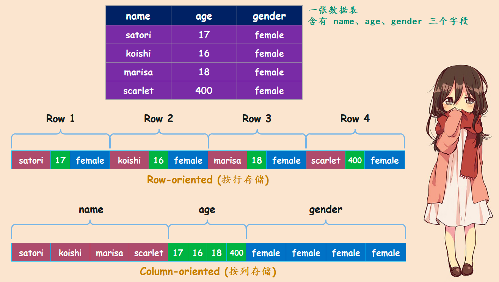
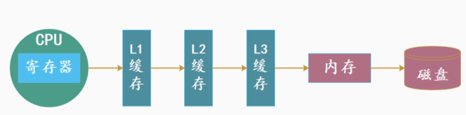
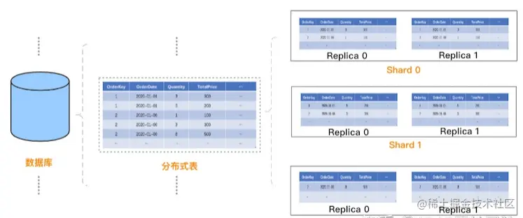

<!-- START doctoc generated TOC please keep comment here to allow auto update -->
<!-- DON'T EDIT THIS SECTION, INSTEAD RE-RUN doctoc TO UPDATE -->
**Table of Contents**  *generated with [DocToc](https://github.com/thlorenz/doctoc)*

- [ClickHouse](#clickhouse)
  - [完备的 DBMS 功能(DataBase Management System 数据库管理系统)](#%E5%AE%8C%E5%A4%87%E7%9A%84-dbms-%E5%8A%9F%E8%83%BDdatabase-management-system-%E6%95%B0%E6%8D%AE%E5%BA%93%E7%AE%A1%E7%90%86%E7%B3%BB%E7%BB%9F)
  - [应用场景](#%E5%BA%94%E7%94%A8%E5%9C%BA%E6%99%AF)
  - [列式存储与数据压缩](#%E5%88%97%E5%BC%8F%E5%AD%98%E5%82%A8%E4%B8%8E%E6%95%B0%E6%8D%AE%E5%8E%8B%E7%BC%A9)
    - [列式存储](#%E5%88%97%E5%BC%8F%E5%AD%98%E5%82%A8)
    - [压缩](#%E5%8E%8B%E7%BC%A9)
  - [向量化执行引擎](#%E5%90%91%E9%87%8F%E5%8C%96%E6%89%A7%E8%A1%8C%E5%BC%95%E6%93%8E)
  - [数据分片与分布式查询](#%E6%95%B0%E6%8D%AE%E5%88%86%E7%89%87%E4%B8%8E%E5%88%86%E5%B8%83%E5%BC%8F%E6%9F%A5%E8%AF%A2)
  - [架构设计](#%E6%9E%B6%E6%9E%84%E8%AE%BE%E8%AE%A1)
    - [1. 单机结构](#1-%E5%8D%95%E6%9C%BA%E7%BB%93%E6%9E%84)
    - [2. Clickhouse 集群架构设计](#2-clickhouse-%E9%9B%86%E7%BE%A4%E6%9E%B6%E6%9E%84%E8%AE%BE%E8%AE%A1)
  - [性能](#%E6%80%A7%E8%83%BD)
  - [参考](#%E5%8F%82%E8%80%83)

<!-- END doctoc generated TOC please keep comment here to allow auto update -->

# ClickHouse
ClickHouse 的名字由来: ClickHouse 最初的设计目标是为了服务于自家公司的一款名叫 Metrica 流量分析工具。
Metrica 在采集数据的过程中，一次页面点击（Click），就会产生一个事件（Event），就是基于页面的点击事件流（Stream），然后面向数据仓库进行 OLAP 分析。
所以 ClickHouse 的全称是 Click Stream、Data WareHouse，简称 ClickHouse

## 完备的 DBMS 功能(DataBase Management System 数据库管理系统)
功能：
- DDL（Data Definition Language数据定义语言）：可以动态地创建、修改或者删除数据库、表和视图，而无需重启服务
- DML（Data Manipulation Language数据操作语言）：可以动态地查询、插入、修改或删除数据
- DCL(Data Control Language 数据控制语句)：可以按照用户粒度设置数据库或者表的操作权限，保障数据的安全性
- 数据备份与恢复：提供了数据备份导出与导入恢复机制，满足生产环境的要求
- 分布式管理：提供集群模式，能够自动管理多个数据库节

缺点:
- 不支持事务
- 不擅长根据主键按行粒度进行查询（虽然支持），所以不应该把 ClickHouse 当做键值对数据库使用
- 不擅长按行删除数据（虽然支持）

## 应用场景
- 电信行业用于存储数据和统计数据使用；
- 新浪微博用于用户行为数据记录和分析工作；
- 用于广告网络和RTB,电子商务的用户行为分析；
- 日志分析；
- 检测和遥感信息的挖掘；
- 商业智能；
- 网络游戏以及物联网的数据处理和价值数据分析；
- 最大的应用来自于Yandex的统计分析服务Yandex.Metri ca

## 列式存储与数据压缩
列式存储与数据压缩，对于一款高性能数据库来说是必不可少的特性。一个非常流行的观点认为：
如果你想让查询变得更快，最简单且有效的方法就是减少数据扫描范围和数据传输时的大小，而列式存储和数据压缩就可以实现上面两点.

### 列式存储

首先列式存储，或者说按列存储，相比按行存储，前者可以有效减少查询时需要扫描的数据量，我们可以举个栗子说明一下。
假设一张数据表 A，里面有 50 个字段 A1 ~ A50，如果我们需要查询前 5 个字段的数据的话，那么可以使用如下 SQL 实现：
```sql
SELECT A1, A2, A3, A4, A5 from A;
```
数据库每次都会逐行扫描、并获取每行数据的全部字段，这里就是 50 个，然后再从中返回前 5 个字段。因此不难发现，尽管只需要前 5 个字段，但由于数据是按行进行组织的，实际上还是扫描了所有的字段。
但如果数据是按列进行存储，则不会出现这样的问题，由于数据按列进行组织，数据库可以直接选择 A1 ~ A5 这 5 列的数据并返回，从而避免多余的数据扫描.



如果是按行存储的话，那么假设我们要计算 age 这一列的平均值，就需要一行一行扫描，所以最终会至少扫描 11 个值（ 3 + 3 + 3 + 2 ）才能找到 age 这一列所存储的 4 个值。
这意味着我们要花费更多的时间等待 IO 完成，而且读完之后还要扔掉很多（因为我们只需要部分字段）。
但如果是按列存储的话，我们只需要获取 age 这一列的连续快，即可得到我们想要的 4 个值，所以这种操作速度更快、效率更高

### 压缩
假设有个字符串 abcdefghi_bcdefghi，现在对它进行压缩，如下所示：
```
压缩前：abcdefghi_bcdefghi
压缩后：abcdefghi_(9,8)

```
压缩的本质就是按照一定步长对数据进行匹配扫描，当发现重复部分的时候就会编码转换。
例如上面的 (9, 8)，表示从下划线开始向前移动 9 个字节，会匹配到 8 个字节长度的重复项，即 bcdefghi。

尽管真实的压缩算法要比这个复杂许多，但压缩的本质就是如此。数据中的重复项越多，则压缩率越高；压缩率越高，则数据体量越小；
而数据体量越小，在网络中传输的速度则越快，并且对网络带宽和磁盘 IO 的压力也就越小。可怎样的数据最可能具备重复的特性呢？
答案是属于同一个列字段的数据，因为它们具有相同的数据类型和现实语义，重复项的可能性自然就更高。

ClickHouse 就是一款使用列式存储的数据库，数据按列进行组织，属于同一列的数据会被保存在一起，并进行压缩，
而列与列之间的数据也会由不同的文件分别保存（这里主要是指 MergeTree 引擎），
数据默认使用 LZ4 算法压缩，在 Yandex 公司的 Metrica 生产环境中，数据整体的压缩比可以达到 8 比 1（未压缩前 17 PB，压缩后 8 PB）。
另外列式存储除了降低 IO 和存储的压力之外，还为向量化执行做好了铺垫。

## 向量化执行引擎

为了实现向量化执行，需要利用 CPU 的 SIMD 指令。SIMD 的全称是：Single Instruction Multiple Data，即用单条指令操作多条数据。
现代计算机系统概念中，它是通过数据并行以提高性能的一种实现方式（其它的还有指令级并行和线程级并行），它的原理是在 CPU 寄存器层面实现数据的并行计算。


## 数据分片与分布式查询
Clickhouse拥有分布式能力，自然支持数据分片，数据分片是将数据进行横向切分，这是一种在面对海量数据的场景下，解决存储和查询瓶颈的有效手段。
ClickHouse并不像其他分布式系统那样，拥有高度自动化的分片功能。 
ClickHouse提供了本地表 ( Local Table ) 与分布式表 ( Distributed Table ) 的概念。
一张本地表等同于一份数据的分片shard。而分布式表本身不存储任何数据，它是本地表的访问代理，其作用类似分库中间件。借助分布式表，能够代理访问多个数据分片，从而实现分布式查询。


## 架构设计

### 1. 单机结构
```shell
$ cd /tmp
$ mkdir ch_data ch_logs
$ docker run --rm \
    -v $(realpath ./ch_data):/var/lib/clickhouse/ \
    -v $(realpath ./ch_logs):/var/log/clickhouse-server/ -p 18123:8123 -p19000:9000 \
    -e CLICKHOUSE_PASSWORD=admin -e CLICKHOUSE_USER=admin -e CLICKHOUSE_DB=my_database \
    --name my-clickhouse-server  --ulimit nofile=262144:262144 clickhouse/clickhouse-server:25.1.4
    
$ docker exec -it my-clickhouse-server clickhouse-client
```
端口说明: https://clickhouse.com/docs/zh/guides/sre/network-ports
- 2181: ZooKeeper 默认服务端口
- 8123: HTTP 默认端口
- 9000:原生协议端口（也称为 ClickHouse TCP 协议）。 被 ClickHouse 应用程序和进程使用，如 clickhouse-server, clickhouse-client, 和原生 ClickHouse 工具。用于分布式查询的服务器间通信


1）Parser与Interpreter

Parser和Interpreter是非常重要的两组接口：Parser分析器是将sql语句已递归的方式形成AST语法树的形式，并且不同类型的sql都会调用不同的parse实现类。
而Interpreter解释器则负责解释AST，并进一步创建查询的执行管道。Interpreter解释器的作用就像Service服务层一样，起到串联整个查询过程的作用，
它会根据解释器的类型，聚合它所需要的资源。首先它会解析AST对象；然后执行"业务逻辑" ( 例如分支判断、设置参数、调用接口等 )；
最终返回IBlock对象，以线程的形式建立起一个查询执行管道。

2）表引擎

表引擎是ClickHouse的一个显著特性，上文也有提到，clickhouse有很多种表引擎。不同的表引擎由不同的子类实现。
表引擎是使用IStorage接口的，该接口定义了DDL ( 如ALTER、RENAME、OPTIMIZE和DROP等 ) 、read和write方法，它们分别负责数据的定义、查询与写入。

3）DataType

数据的序列化和反序列化工作由DataType负责。根据不同的数据类型，IDataType接口会有不同的实现类。
DataType虽然会对数据进行正反序列化，但是它不会直接和内存或者磁盘做交互，而是转交给Column和Filed处理。

4）Column与Field

Column和Field是ClickHouse数据最基础的映射单元。作为一款百分之百的列式存储数据库，ClickHouse按列存储数据，内存中的一列数据由一个Column对象表示。
Column对象分为接口和实现两个部分，在IColumn接口对象中，定义了对数据进行各种关系运算的方法，例如插入数据的insertRangeFrom和insertFrom方法、用于分页的cut，以及用于过滤的filter方法等。
而这些方法的具体实现对象则根据数据类型的不同，由相应的对象实现，例如ColumnString、ColumnArray和ColumnTuple等。
在大多数场合，ClickHouse都会以整列的方式操作数据，但凡事也有例外。如果需要操作单个具体的数值 ( 也就是单列中的一行数据 )，则需要使用Field对象，Field对象代表一个单值。
与Column对象的泛化设计思路不同，Field对象使用了聚合的设计模式。在Field对象内部聚合了Null、UInt64、String和Array等13种数据类型及相应的处理逻辑。

5）Block

ClickHouse内部的数据操作是面向Block对象进行的，并且采用了流的形式。虽然Column和Filed组成了数据的基本映射单元，但对应到实际操作，它们还缺少了一些必要的信息，比如数据的类型及列的名称。
于是ClickHouse设计了Block对象，Block对象可以看作数据表的子集。Block对象的本质是由数据对象、数据类型和列名称组成的三元组，即Column、DataType及列名称字符串。
Column提供了数据的读取能力，而DataType知道如何正反序列化，所以Block在这些对象的基础之上实现了进一步的抽象和封装，从而简化了整个使用的过程，仅通过Block对象就能完成一系列的数据操作。
在具体的实现过程中，Block并没有直接聚合Column和DataType对象，而是通过ColumnWith TypeAndName对象进行间接引

### 2. Clickhouse 集群架构设计
https://github.com/bitnami/charts/tree/main/bitnami/clickhouse

```shell
(⎈|kubeasz-test:clickhouse)➜ cat values.yaml
global:
  security:
    allowInsecureImages: true
image:
  registry: swr.cn-north-4.myhuaweicloud.com
  repository: ddn-k8s/docker.io/bitnami/clickhouse
  tag: 24.8.4

zookeeper:
  enabled: true
  image:
    registry: swr.cn-north-4.myhuaweicloud.com
    repository: ddn-k8s/docker.io/bitnami/zookeeper
    tag: 3.9.2-debian-12-r11
podSecurityContext:
  enabled: false
containerSecurityContext:
  enabled: false

resources:
  requests:
    cpu: 500m
    memory: 512Mi
  limits:
    cpu: 2
    memory: 2024Mi
shards: 2
replicaCount: 2
(⎈|kubeasz-test:clickhouse)➜  helm install -f values.yaml my-clickhouse oci://registry-1.docker.io/bitnamicharts/clickhouse -version 8.0.8
(⎈|kubeasz-test:clickhouse)➜  clickhouse helm ls
NAME         	NAMESPACE 	REVISION	UPDATED                             	STATUS  	CHART           	APP VERSION
my-clickhouse	clickhouse	2       	2025-03-31 09:49:31.768305 +0800 CST	deployed	clickhouse-8.0.8	25.3.2
```

ZooKeeper 是第一个知名的开源协调系统之一。它是用 Java 实现的，具有相当简单且强大的数据模型。
ZooKeeper 的协调算法 ZooKeeper Atomic Broadcast (ZAB) 不提供读取的线性可化保证，因为每个 ZooKeeper 节点都是本地处理读取请求。
与 ZooKeeper 不同，ClickHouse Keeper 是用 C++ 编写的，并使用 RAFT 算法的实现。该算法允许读取和写入的线性可化，并在不同语言中有若干开源实现。


查看覆盖配置
```shell
(⎈|kubeasz-test:clickhouse)➜  ~ kubectl get cm -n clickhouse my-clickhouse -o yaml | yq -r '.data["00_default_overrides.xml"]'
<clickhouse>
  <!-- Macros -->
  <macros>
    <shard from_env="CLICKHOUSE_SHARD_ID"></shard>
    <replica from_env="CLICKHOUSE_REPLICA_ID"></replica>
    <layer>my-clickhouse</layer>
  </macros>
  <!-- Log Level -->
  <logger>
    <level>information</level>
  </logger>
  <!-- Cluster configuration - Any update of the shards and replicas requires helm upgrade -->
  <remote_servers>
    <my-clickhouse>
      <shard>
          <replica>
              <host>my-clickhouse-shard0-0.my-clickhouse-headless.clickhouse.svc.cluster.local</host>
              <port>9000</port>
              <user from_env="CLICKHOUSE_ADMIN_USER"></user>
              <password from_env="CLICKHOUSE_ADMIN_PASSWORD"></password>
          </replica>
          <replica>
              <host>my-clickhouse-shard0-1.my-clickhouse-headless.clickhouse.svc.cluster.local</host>
              <port>9000</port>
              <user from_env="CLICKHOUSE_ADMIN_USER"></user>
              <password from_env="CLICKHOUSE_ADMIN_PASSWORD"></password>
          </replica>
      </shard>
      <shard>
          <replica>
              <host>my-clickhouse-shard1-0.my-clickhouse-headless.clickhouse.svc.cluster.local</host>
              <port>9000</port>
              <user from_env="CLICKHOUSE_ADMIN_USER"></user>
              <password from_env="CLICKHOUSE_ADMIN_PASSWORD"></password>
          </replica>
          <replica>
              <host>my-clickhouse-shard1-1.my-clickhouse-headless.clickhouse.svc.cluster.local</host>
              <port>9000</port>
              <user from_env="CLICKHOUSE_ADMIN_USER"></user>
              <password from_env="CLICKHOUSE_ADMIN_PASSWORD"></password>
          </replica>
      </shard>
    </my-clickhouse>
  </remote_servers>
  <!-- Zookeeper configuration -->
  <zookeeper>

    <node>
      <host from_env="KEEPER_NODE_0"></host>
      <port>2181</port>
    </node>
    <node>
      <host from_env="KEEPER_NODE_1"></host>
      <port>2181</port>
    </node>
    <node>
      <host from_env="KEEPER_NODE_2"></host>
      <port>2181</port>
    </node>
  </zookeeper>
  <listen_host>0.0.0.0</listen_host>
  <listen_host>::</listen_host>
  <listen_try>1</listen_try>
</clickhouse>
```
参数说明
- 集群名字: my-clickhouse
- 宏配置: 宏 shard 和 replica 减少了分布式 DDL 的复杂性。配置的值会自动替代您的 DDL 查询，从而简化您的 DDL。
- shard: 集群的分片（即 ClickHouse 节点），集群会有多个 shard，每个 shard 上都存有全部数据的一部分
- replica: 每个 shard 的副本
- zookeeper: node 表示一个 ZooKeeper 节点，可以设置多个


实际生成配置
```shell
# 支持多配置文件管理，主配置文件为 config.xml，默认位于 /etc/clickhouse-server 目录下，其余的配置文件均需包含在 /etc/clickhouse-server/config.d 目录下
$ ls /etc/clickhouse-server
conf.d	config.xml  keeper_config.xml  users.d	users.xml

$ ls /etc/clickhouse-server/conf.d/
00_default_overrides.xml
```

其他常用配置
```xml
<!--最大连接数配置-->
<max_connections>4096</max_connections>


<!--        并发查询数配置-->
<max_concurrent_queries>200</max_concurrent_queries>
```


以上集群配置完之后，想要用到Clickhouse的集群能力，还需要使用Replicated MergeTree+Distributed引擎，该引擎是"本地表 + 分布式表"的方式，因此可以实现多分片多副本.

```clickhouse
my-clickhouse-shard1-0.my-clickhouse-headless.clickhouse.svc.cluster.local :) select * from system.clusters;

SELECT *
FROM system.clusters

Query id: c4eabc48-abbe-42f0-baea-91c4690d9738

   ┌─cluster───────┬─shard_num─┬─shard_weight─┬─internal_replication─┬─replica_num─┬─host_name──────────────────────────────────────────────────────────────────┬─host_address──┬─port─┬─is_local─┬─user────┬─default_database─┬─errors_count─┬─slowdowns_count─┬─estimated_recovery_time─┬─database_shard_name─┬─database_replica_name─┬─is_active─┬─replication_lag─┬─recovery_time─┐
1. │ my-clickhouse │         1 │            1 │                    0 │           1 │ my-clickhouse-shard0-0.my-clickhouse-headless.clickhouse.svc.cluster.local │ 192.168.0.139 │ 9000 │        0 │ default │                  │            0 │               0 │                       0 │                     │                       │      ᴺᵁᴸᴸ │            ᴺᵁᴸᴸ │          ᴺᵁᴸᴸ │
2. │ my-clickhouse │         1 │            1 │                    0 │           2 │ my-clickhouse-shard0-1.my-clickhouse-headless.clickhouse.svc.cluster.local │ 192.168.1.59  │ 9000 │        0 │ default │                  │            0 │               0 │                       0 │                     │                       │      ᴺᵁᴸᴸ │            ᴺᵁᴸᴸ │          ᴺᵁᴸᴸ │
3. │ my-clickhouse │         2 │            1 │                    0 │           1 │ my-clickhouse-shard1-0.my-clickhouse-headless.clickhouse.svc.cluster.local │ 192.168.2.149 │ 9000 │        1 │ default │                  │            0 │               0 │                       0 │                     │                       │      ᴺᵁᴸᴸ │            ᴺᵁᴸᴸ │          ᴺᵁᴸᴸ │
4. │ my-clickhouse │         2 │            1 │                    0 │           2 │ my-clickhouse-shard1-1.my-clickhouse-headless.clickhouse.svc.cluster.local │ 192.168.3.50  │ 9000 │        0 │ default │                  │            0 │               0 │                       0 │                     │                       │      ᴺᵁᴸᴸ │            ᴺᵁᴸᴸ │          ᴺᵁᴸᴸ │
   └───────────────┴───────────┴──────────────┴──────────────────────┴─────────────┴────────────────────────────────────────────────────────────────────────────┴───────────────┴──────┴──────────┴─────────┴──────────────────┴──────────────┴─────────────────┴─────────────────────────┴─────────────────────┴───────────────────────┴───────────┴─────────────────┴───────────────┘

4 rows in set. Elapsed: 0.004 sec.
```



Clickhouse先在每个 Shard 每个节点上创建本地表（即 Shard 的副本），本地表只在对应节点内可见；
然后再创建分布式表[Distributed]，映射到前面创建的本地表。

用户在访问分布式表时，ClickHouse 会自动根据集群架构信息，把请求转发给对应的本地表.

```clickhouse
CREATE DATABASE db1 ON CLUSTER default;
-- 使用 MergeTree 表引擎在集群上创建一个表
CREATE TABLE db1.table1 ON CLUSTER default
(
    `id` UInt64,
    `column1` String
)
    ENGINE = MergeTree
        ORDER BY id;

INSERT INTO db1.table1 (id, column1) VALUES (1, 'abc');
INSERT INTO db1.table1 (id, column1) VALUES (2, 'def');

-- 创建一个分布式表以查询两个节点的两个分片
CREATE TABLE db1.table1_dist ON CLUSTER default
(
    `id` UInt64,
    `column1` String
)
    ENGINE = Distributed('default', 'db1', 'table1', rand())

SELECT * FROM db1.table1_dist;

```


## 性能
1）插入：单机100-150M/s的插入速度；

2）查询：单字段 groupby 没有索引，1亿数据查询需要2.324s。有索引下，查询时间为0.101秒。可以看到Clickhouse的查询速度是及其快的，市面上常见的数据库基本都达不到这种性能；

3）其他：并发，官网默认配置为100。由于是大数据分析数据库主要适用于olap场景，对并发支持略差多个大数据查询可能会直接将cpu等资源占满，故并发实际达不到100


## 参考

- [docker 安装 clickhouse](https://hub.docker.com/_/clickhouse)
- [透过ClickHouse学习列式存储数据库](https://www.luozhiyun.com/archives/837)
- [4万字长文 | ClickHouse基础&实践&调优全视角解析](https://mp.weixin.qq.com/s/e0aZFakj8P93PqwGhwJfTQ)
