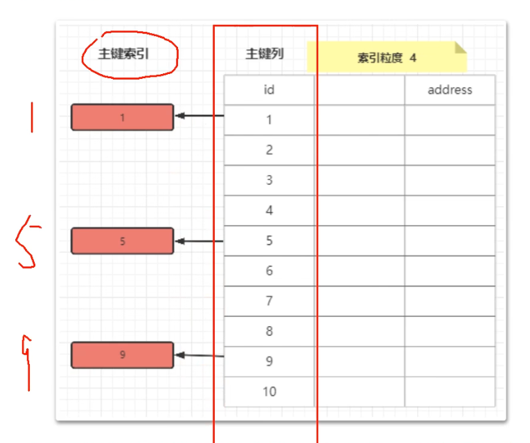
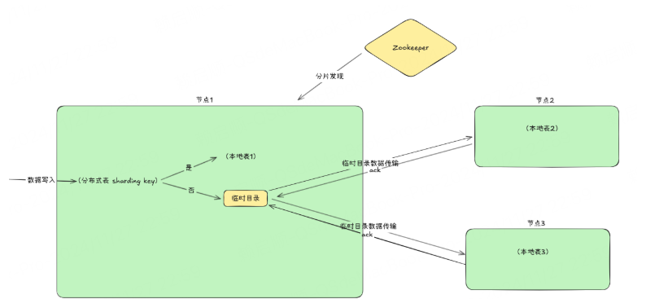

<!-- START doctoc generated TOC please keep comment here to allow auto update -->
<!-- DON'T EDIT THIS SECTION, INSTEAD RE-RUN doctoc TO UPDATE -->
**Table of Contents**  *generated with [DocToc](https://github.com/thlorenz/doctoc)*

- [引擎](#%E5%BC%95%E6%93%8E)
  - [数据库引擎](#%E6%95%B0%E6%8D%AE%E5%BA%93%E5%BC%95%E6%93%8E)
    - [Atomic](#atomic)
  - [表引擎](#%E8%A1%A8%E5%BC%95%E6%93%8E)
    - [MergeTree 合并树引擎](#mergetree-%E5%90%88%E5%B9%B6%E6%A0%91%E5%BC%95%E6%93%8E)
      - [MergeTree 数据表的存储结构](#mergetree-%E6%95%B0%E6%8D%AE%E8%A1%A8%E7%9A%84%E5%AD%98%E5%82%A8%E7%BB%93%E6%9E%84)
      - [ReplacingMergeTree 引擎](#replacingmergetree-%E5%BC%95%E6%93%8E)
    - [Replicated MergeTree 引擎](#replicated-mergetree-%E5%BC%95%E6%93%8E)
    - [Distributed 引擎](#distributed-%E5%BC%95%E6%93%8E)
      - [分布式表数据查询](#%E5%88%86%E5%B8%83%E5%BC%8F%E8%A1%A8%E6%95%B0%E6%8D%AE%E6%9F%A5%E8%AF%A2)
      - [分布式表数据写入](#%E5%88%86%E5%B8%83%E5%BC%8F%E8%A1%A8%E6%95%B0%E6%8D%AE%E5%86%99%E5%85%A5)
  - [参考](#%E5%8F%82%E8%80%83)

<!-- END doctoc generated TOC please keep comment here to allow auto update -->

L
# 引擎

## 数据库引擎

### Atomic 

删除时,延迟时间取决于 database_atomic_delay_before_drop_table_sec: 此设置的默认值为 480（8 分钟）。


## 表引擎

表引擎（即表的类型）决定了：

- 数据的存储方式和位置，写到哪里以及从哪里读取数据
- 支持哪些查询以及如何支持。
- 并发数据访问。
- 索引的使用（如果存在）。
- 是否可以执行多线程请求。
- 数据复制参数。
  

ClickHouse 拥有非常庞大的表引擎体系，总共有合并树、外部存储、内存、文件、接口和其它 6 大类 20 多种表引擎，而在这众多的表引擎中，又属合并树（MergeTree）表引擎及其家族系列（*MergeTree）最为强大，在生产环境中绝大部分场景都会使用此引擎。


ClickHouse 并不是直接就一蹴而就的，Metrica 产品的最初架构是基于MySQL实现的，所以在 ClickHouse 的设计中，能够察觉到一些 MySQL 的影子，
表引擎的设计就是其中之一。与 MySQL 类似，ClickHouse 也将存储部分进行了抽象，把存储引擎作为一层独立的接口，并且拥有合并树、内存、文件、接口等 20 多种引擎。
其中每一种引擎都有着各自的特点，用户可以根据实际业务场景的需求，选择合适的引擎。

通常而言，一个通用系统意味着更广泛的实用性，能够适应更多的场景。但通用的另一种解释是平庸，因为它无法在所有场景中都做到极致。

### MergeTree 合并树引擎
MergeTree这个名词是在我们耳熟能详的 LSM Tree之上做减法而来——去掉了MemTable和Log。也就是说，向MergeTree引擎族的表插入数据时，数据会不经过缓冲而直接写到磁盘。

> MergeTree is not an LSM tree because it doesn’t contain "memtable" and "log": inserted data is written directly to the filesystem.
> This makes it suitable only to INSERT data in batches, not by individual row and not very frequently – about once per second is ok, but a thousand times a second is not.
> We did it this way for simplicity’s sake, and because we are already inserting data in batches in our applications.


社区通过 https://github.com/ClickHouse/ClickHouse/pull/8290  和 https://github.com/ClickHouse/ClickHouse/pull/10697 两个PR实现了名为Polymorphic Parts的特性，使得MergeTree引擎能够更好地处理频繁的小批量写入，但同时也标志着MergeTree的内核开始向真正的LSM Tree靠拢。


MergeTree 作为家族中最为基础的表引擎，提供了主键索引、数据分区、数据副本和数据采样等基本能力，而家族中的其它其它表引擎则在 MergeTree 的基础之上各有所长。
比如 ReplacingMergeTree 表引擎具有删除重复数据的特性，而 SummingMergeTree 表引擎则会按照排序键自动聚合数据。
如果再给合并树系列的表引擎加上 Replicated 前缀，又会得到一组支持数据副本的表引擎，例如 ReplicatedMergeTree、ReplicatedReplacingMergeTree、ReplicatedSummingMergeTree、ReplicatedAggregatingMergeTree 等等


```clickhouse
-- 使用 MergeTree 创建表
CREATE TABLE [IF NOT EXISTS] [db.]table_name [ON CLUSTER cluster]
(
    name1 [type1] [[NOT] NULL] [DEFAULT|MATERIALIZED|ALIAS|EPHEMERAL expr1] [COMMENT ...] [CODEC(codec1)] [STATISTICS(stat1)] [TTL expr1] [PRIMARY KEY] [SETTINGS (name = value, ...)],
    name2 [type2] [[NOT] NULL] [DEFAULT|MATERIALIZED|ALIAS|EPHEMERAL expr2] [COMMENT ...] [CODEC(codec2)] [STATISTICS(stat2)] [TTL expr2] [PRIMARY KEY] [SETTINGS (name = value, ...)],
    ...
    INDEX index_name1 expr1 TYPE type1(...) [GRANULARITY value1],
    INDEX index_name2 expr2 TYPE type2(...) [GRANULARITY value2],
    ...
    PROJECTION projection_name_1 (SELECT <COLUMN LIST EXPR> [GROUP BY] [ORDER BY]),
    PROJECTION projection_name_2 (SELECT <COLUMN LIST EXPR> [GROUP BY] [ORDER BY])
) ENGINE = MergeTree()
ORDER BY expr
[PARTITION BY expr]
[PRIMARY KEY expr]
[SAMPLE BY expr]
[TTL expr
    [DELETE|TO DISK 'xxx'|TO VOLUME 'xxx' [, ...] ]
    [WHERE conditions]
    [GROUP BY key_expr [SET v1 = aggr_func(v1) [, v2 = aggr_func(v2) ...]] ] ]
[SETTINGS name = value, ...]
```

- PARTITION BY：选填，表示分区键，用于指定表数据以何种标准进行分区。分区键既可以是单个字段、也可以通过元组的形式指定多个字段，同时也支持使用列表达式。
- ORDER BY：必填，表示排序键，用于指定在一个分区内，数据以何种标准进行排序。排序键既可以是单个字段，例如 ORDER BY CounterID，也可以是通过元组声明的多个字段，例如 ORDER BY (CounterID, EventDate)。
- SAMPLE BY ：抽样表达式，如果要用抽样表达式，主键中必须包含这个表达式。
- setting 影响 性能的额外参数
  - index_granularity：对于 MergeTree 而言是一个非常重要的参数，它表示索引的粒度，默认值为 8192。所以 ClickHouse 根据主键生成的索引实际上稀疏索引，默认情况下是每隔 8192 行数据才生成一条索引.


- TTL即 Time To Live。 可以用来指定行存储的持续时间。MergeTree可以针对表或者列声明数据存活时间。设置TTL需要指定一个表达式来表示数据的存活时间。
表达式中必须存在至少一个表示时间的Date或DateTime类型的列。比如 TTL date + INTERVAL 1 DAY 。也就是说，存活时间必须跟数据相关联。
  - 当列中的值过期时，clickhouse会将他们替换成该列数据类型的默认值。
  - 设置表级TTL时，除了设置一个过期表达式之外，还可以配置一个数据移除规则。Delete - 删除过期的行 默认行为.

#### MergeTree 数据表的存储结构

数据存储格式  Wide or Compact format. 
- In Wide format 每列在不同的文件
- in Compact format  所有列在一个文件

```clickhouse
-- ClickHouse server version 25.1.4

-- 该表负责存储用户参加过的活动，每参加一个活动，就会生成一条记录
CREATE TABLE IF NOT EXISTS user_activity_event (
    ID UInt64,  -- 表的 ID
    UserName String,  -- 用户名
    ActivityName String,  -- 活动名称
    ActivityType String,  -- 活动类型
    ActivityLevel Enum('Easy' = 0, 'Medium' = 1, 'Hard' = 2),  -- 活动难度等级
    IsSuccess Int8,  -- 是否成功
    JoinTime DATE  -- 参加时间
) ENGINE = MergeTree()
PARTITION BY toYYYYMM(JoinTime)  -- 按照 toYYYYMM(JoinTime) 进行分区
ORDER BY ID;  -- 按照 ID 字段排序

-- 插入一条数据
INSERT INTO user_activity_event VALUES (1, '张三', '寻找遗失的时间', '市场营销', 'Medium', 1, '2020-05-13')

```

```shell
# 数据表 data 目录

# 分区 202005  分块信息 1_1_0 
root@635e708a264a:/var/lib/clickhouse# ls data/helloworld/user_activity_event/202005_1_1_0/ -al
total 44
drwxr-x--- 13 root       root       416 Feb 23 10:02 .
drwxr-x---  5 clickhouse clickhouse 160 Feb 23 10:02 ..
-rw-r-----  1 root       root       330 Feb 23 10:02 checksums.txt  # 校验文件，使用二进制的格式进行存储，它保存了余下各类文件（primary.txt、count.txt 等等）的 size 大小以及哈希值，用于快速校验文件的完整性和正确性
-rw-r-----  1 root       root       204 Feb 23 10:02 columns.txt
-rw-r-----  1 root       root         1 Feb 23 10:02 count.txt
-rw-r-----  1 clickhouse clickhouse 237 Feb 23 10:02 data.bin # 数据文件，使用压缩格式存储，默认为 LZ4 格式，用于存储表的数据。
-rw-r-----  1 clickhouse clickhouse  78 Feb 23 10:02 data.cmrk3 # 标记文件，使用二进制格式存储，标记文件中保存了 data.bin 文件中数据的偏移量信息，并且标记文件与稀疏索引对齐，因此 MergeTree 通过标记文件建立了稀疏索引（primary.idx）与数据文件（data.bin）之间的映射关系。而在读取数据的时候，首先会通过稀疏索引（primary.idx）找到对应数据的偏移量信息（data.mrk），因为两者是对齐的，然后再根据偏移量信息直接从 data.bin 文件中读取数据。
-rw-r-----  1 root       root        10 Feb 23 10:02 default_compression_codec.txt
-rw-r-----  1 root       root         1 Feb 23 10:02 metadata_version.txt
-rw-r-----  1 root       root         4 Feb 23 10:02 minmax_JoinTime.idx
-rw-r-----  1 root       root         4 Feb 23 10:02 partition.dat
-rw-r-----  1 root       root        50 Feb 23 10:02 primary.cidx # 一级索引文件，使用二进制格式存储，用于存储稀疏索引，一张 MergeTree 表只能声明一次一级索引（通过 ORDER BY 或 PRIMARY KEY）。
-rw-r-----  1 root       root       502 Feb 23 10:02 serialization.json

# columns.txt：列信息文件，使用明文格式存储，用于保存此分区下的列字段信息
root@635e708a264a:/var/lib/clickhouse# cat data/helloworld/user_activity_event/202005_1_1_0/columns.txt
columns format version: 1
7 columns:
`ID` UInt64
`UserName` String
`ActivityName` String
`ActivityType` String
`ActivityLevel` Enum8('Easy' = 0, 'Medium' = 1, 'Hard' = 2)
`IsSuccess` Int8
`JoinTime` Date

# count.txt：计数文件，使用明文格式存储，用于记录当前分区下的数据总数。
root@635e708a264a:/var/lib/clickhouse# cat data/helloworld/user_activity_event/202005_1_1_0/count.txt
1
```

- partition.dat 和 minmax_[Column].idx：如果使用了分区键，例如上面的 PARTITION BY toYYYYMM(JoinTime)，则会额外生成 partition.dat 与 minmax_JoinTime.idx 索引文件，它们均使用二进制格式存储。
partition.dat 用于保存当前分区下分区表达式最终生成的值，而 minmax_[Column].idx 则负责记录当前分区下分区字段对应原始数据的最小值和最大值。
举个例子，假设我们往上面的 user_activity_event 表中插入了 5 条数据，JoinTime 分别 2020-05-05、2020-05-15、2020-05-31、2020-05-03、2020-05-24，显然这 5 条都会进入到同一个分区，
因为 toYYYMM 之后它们的结果是相同的，都是 2020-05，而 partition.dat 中存储的就是 2020-05，也就是分区表达式最终生成的值；
同时还会有一个 minmax_JoinTime.idx 文件，里面存储的就是 2020-05-03 2020-05-31，也就是分区字段对应的原始数据的最小值和最大值

#### ReplacingMergeTree 引擎
该引擎和 MergeTree 的不同之处在于它会删除排序键值(ORDER BY)相同的重复项.
在设置表引擎时，比MergeTree多了一个参数：ver-版本列，ENGINE = ReplacingMergeTree([ver]) 。

值得注意的是，ReplacingMergeTree只是在一定程度上解决了数据重复问题，但是并不能完全保障数据不重复。


### Replicated MergeTree 引擎

使用ReplicatedMergeTree就是将MergeTree引擎的数据通过Zookeeper调节，达到副本的效果。
比如我们首先可以在cluster1中的每个节点上创建ReplicatedMergeTree表，通过配置文件，可以看到Clickhouse-node1和Clickhouse-node2是在同一个shard里的，
每个shard标签里的replica就代表复制节点。这时我们创建表时将两个副本指定在同一个zookeeper目录下，那么写入到node1的数据会复制到node2，写入node2的数据会同步到node1，达到预计的复制效果。

```clickhouse
CREATE TABLE table_name
(
    EventDate DateTime,
    CounterID UInt32,
    UserID UInt32
)ENGINE=ReplicatedMergeTree('/clickhouse/tables/{layer}-{shard}/table_name', '{replica}')  -- 这里
PARTITION BY toYYYYMM(EventDate)
ORDER BY (CounterID, EventDate, intHash32(UserID))
SAMPLE BY intHash32(UserID)

```
示例中的取值，采用了变量{layer}、{shard}、{replica}，他们的值取得是配置文件中的值


### Distributed 引擎
分布式表引擎，本身不存储数据，也不占用存储空间，在定义时需要指定字段，但必须与要映射的表的结构相同。
允许在多个服务器上进行分布式查询处理，读取是自动并行的。
在读取期间，会使用远程服务器上的表索引（也就是我们上述使用的Replicated*MergeTree引擎）

```clickhouse
CREATE TABLE IF NOT EXISTS {distributed_table} as {local_table}
  ENGINE = Distributed({cluster}, '{local_database}', '{local_table}', rand())

```
- distributed_table：分布式表的表名
- local_table：本地表名
- as local_table：保持分布式表与本地表的表结构一致。此处也可以用 （column dataType）这种定义表结构方式代替
- cluster：集群名
```clickhouse
-- 我们指定集群名称（test_cluster），分片目标表的数据库名称（uk），分片目标表的名称（uk_price_paid_simple），以及用于 INSERT 路由的 分片键。
-- 在此示例中，我们使用 rand 函数随机分配行到分片。然而，可以根据用例使用任何表达式——甚至复杂的表达式——作为分片键
CREATE TABLE uk.uk_price_paid_simple_dist ON CLUSTER test_cluster
(
    date Date,
    town LowCardinality(String),
    street LowCardinality(String),
    price UInt32
)
ENGINE = Distributed('test_cluster', 'uk', 'uk_price_paid_simple', rand());

```

#### 分布式表数据查询


图是一个2分片2副本的架构，使用的是Replicated*Merge Tree + Distributed引擎模式。红色的数字代表节点的话，也就是节点1和2互为副本，3和4互为副本。

图中events为Distributed引擎表，也叫分布式表；events_loc al为Replicated*MergeTree引擎表，也叫本地表。
该图中，分布式表只在节点3中创建，线上环境一般会在每个节点上都创建一个分布式表（不会消耗资源，因为分布式表不会存储数据）。

执行查询时，会访问一个节点的分布式表，该图中访问的是节点3中分布式表。
然后分布式表会分别的读取2个分片的数据，在这里，它读取了节点3和节点2的本地表数据，这两个节点加在一块就是完整的数据。
汇总查询后将结果（Result Set）返回


#### 分布式表数据写入


1. 数据首先写入一个分片
2. 于本分片的数据写入本地表，属于其他分片的数据先写入本分片的临时目录
3. 该分片与集群中其他分片建立连接
4. 将写入本地临时文件的数据异步发送到其他分片(发送数据的周期性由 distributed_background_insert_sleep_time_ms 和 distributed_background_insert_max_sleep_time_ms 设置管理)


为什么要使用临时目录？
- 确保数据的一致性：临时目录允许将数据暂存到本地，直到目标分片可以接收并存储数据，这样可以确保数据不会丢失。
- 避免阻塞：异步发送机制避免了因为分片之间的数据传输而阻塞写入操作，从而提高了写入性能。
- 提高数据路由效率：通过计算分片键并使用临时目录，ClickHouse 能在不同分片之间高效地传输数据，且不会因为一个节点的负载或网络问题而影响其他节点的操作。


## 参考
- https://clickhouse.com/docs/zh/engines/table-engines
- [ClickHouse internal_replication setting](https://simpl1g.medium.com/clickhouse-internal-replication-setting-b6d8c7c2a9f2)
- [MergeTree 的深度原理解析](https://www.cnblogs.com/traditional/p/15218743.html)
- [ClickHouse 技术研究及语法简介](https://juejin.cn/post/7246796364432048184)
- [ClickHouse 分布式表写入基本流程](https://blog.csdn.net/Mylqs/article/details/144096675)