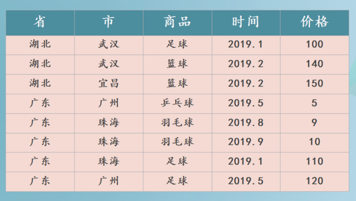
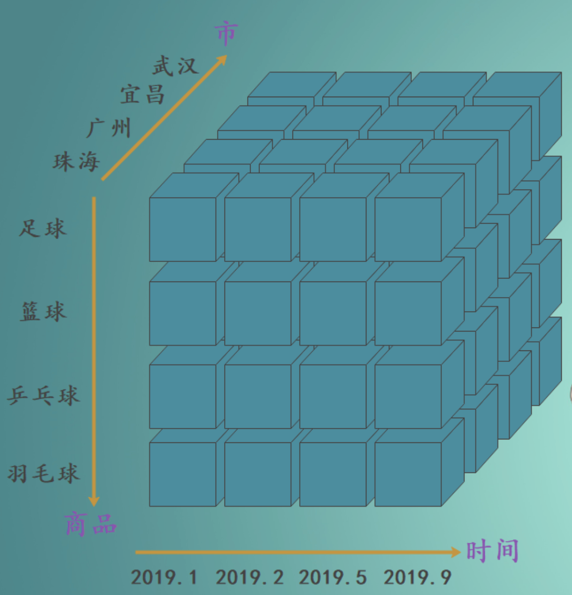
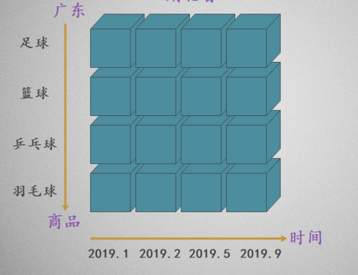
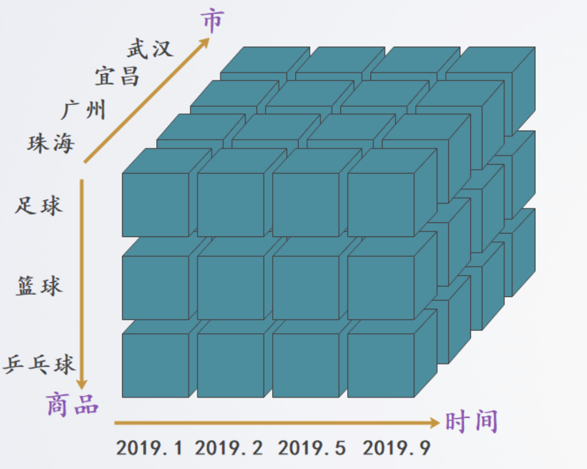
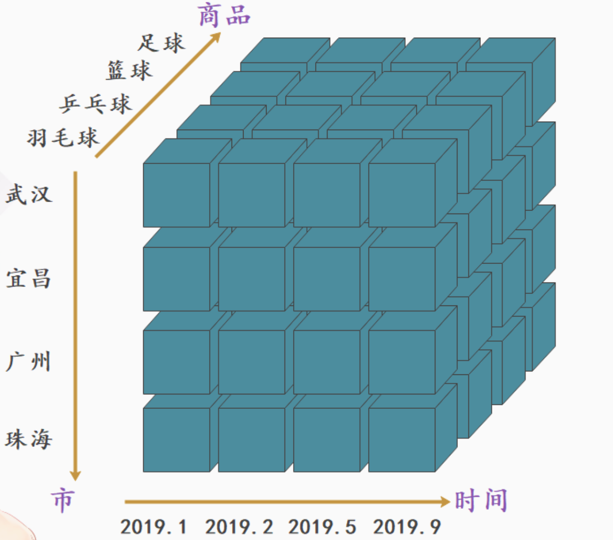

# OLAP
OLAP 名为联机分析处理，又可以称之为多维分析处理，指的是通过多种不同的维度审视数据，进行深层次分析

## 多维度分析案例

### 销售明细表

1. 下钻：从高层次向低层次明细数据进行穿透。例如从 "省" 下钻到 "市"，从 "湖北省" 穿透到 "武汉" 和 "宜昌

2. 和下钻相反，从低层次向高层次汇聚。例如从 "市" 汇聚到 "省"，将 "武汉" 和 "宜昌" 汇聚成 "湖北"

3. 切片：观察立方体的一层，将一个或多个温度设为单个固定的值，然后观察剩余的维度，例如将商品维度固定为 "足球"。

4. 切块：和切片类似，只是将单个固定值变成多个固定值。例如将商品维度固定为"足球"、"篮球" 和 "乒乓球"。

5. 旋转：旋转立方体的一面，如果要将数据映射到一张二维表，那么就要进行旋转，等同于行列转换。

## OLAP分类
1. 第一类架构称为 ROLAP（Relational OLAP，关系型 OLAP），顾名思义，它直接使用关系模型构建，数据模型常使用星型模型或者雪花模型，这是最先能够想到、也是最为直接的实现方法
2. 第二类架构称为 MOLAP（Multidimensional OLAP，多维型 OLAP），它的出现就是为了缓解 ROLAP 性能问题。
   1. MOLAP 使用多维数组的形式存数据，其核心思想是借助预先聚合结果（说白了就是提前先算好，然后将结果保存起来），使用空间换取时间的形式从而提升查询性能。也就是说，用更多的存储空间换得查询时间的减少，其具体的实现方式是依托立方体模型的概念。首先，对需要分析的数据进行建模，框定需要分析的维度字段；然后，通过预处理的形式，对各种维度进行组合并事先聚合；最后，将聚合结果以某种索引或者缓存的形式保存起来（通常只保留聚合后的结果，不存储明细数据），这样一来，在随后的查询过程中，可以直接利用结果返回数据。
3. 第三类架构称为 HOLAP（Hybrid OLAP，混合架构的OLAP），这种思路可以理解成 ROLAP 和 MOLAP 两者的组合