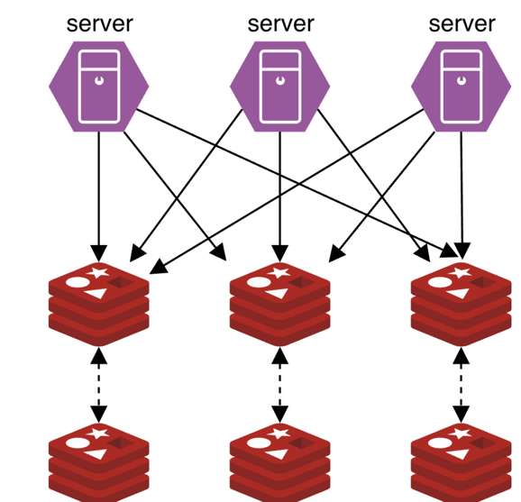
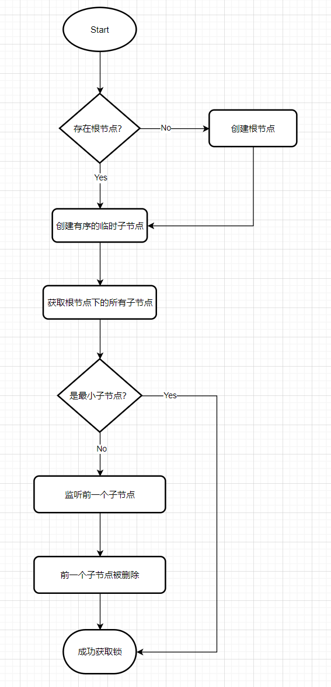
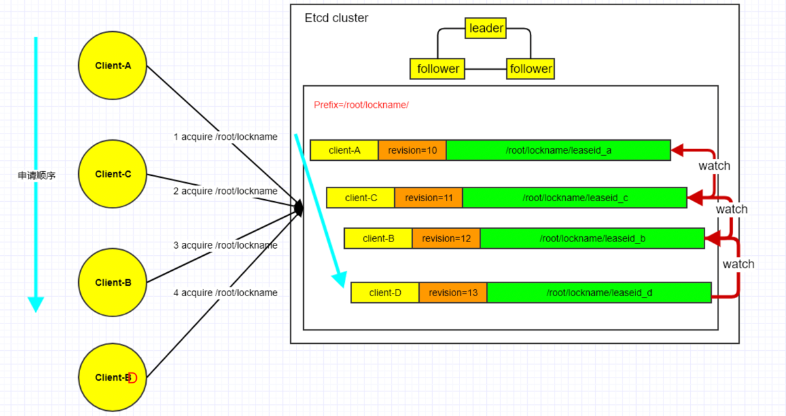

<!-- START doctoc generated TOC please keep comment here to allow auto update -->
<!-- DON'T EDIT THIS SECTION, INSTEAD RE-RUN doctoc TO UPDATE -->
**Table of Contents**  *generated with [DocToc](https://github.com/thlorenz/doctoc)*

- [分布式锁](#%E5%88%86%E5%B8%83%E5%BC%8F%E9%94%81)
  - [应用场景](#%E5%BA%94%E7%94%A8%E5%9C%BA%E6%99%AF)
  - [实现分布式锁方案](#%E5%AE%9E%E7%8E%B0%E5%88%86%E5%B8%83%E5%BC%8F%E9%94%81%E6%96%B9%E6%A1%88)
  - [1. redis实现](#1-redis%E5%AE%9E%E7%8E%B0)
    - [主备版的 Redis 服务，至少具备一个 Slave 节点--采用了主备异步复制协议](#%E4%B8%BB%E5%A4%87%E7%89%88%E7%9A%84-redis-%E6%9C%8D%E5%8A%A1%E8%87%B3%E5%B0%91%E5%85%B7%E5%A4%87%E4%B8%80%E4%B8%AA-slave-%E8%8A%82%E7%82%B9--%E9%87%87%E7%94%A8%E4%BA%86%E4%B8%BB%E5%A4%87%E5%BC%82%E6%AD%A5%E5%A4%8D%E5%88%B6%E5%8D%8F%E8%AE%AE)
      - [加锁](#%E5%8A%A0%E9%94%81)
      - [解锁](#%E8%A7%A3%E9%94%81)
    - [RedLock 算法-->Redis 作者为了解决 SET key value [EX] 10 [NX]命令实现分布式锁不安全的问题](#redlock-%E7%AE%97%E6%B3%95--redis-%E4%BD%9C%E8%80%85%E4%B8%BA%E4%BA%86%E8%A7%A3%E5%86%B3-set-key-value-ex-10-nx%E5%91%BD%E4%BB%A4%E5%AE%9E%E7%8E%B0%E5%88%86%E5%B8%83%E5%BC%8F%E9%94%81%E4%B8%8D%E5%AE%89%E5%85%A8%E7%9A%84%E9%97%AE%E9%A2%98)
    - [redsync(redis官方推荐的go版本分布式锁实现) 源码分析](#redsyncredis%E5%AE%98%E6%96%B9%E6%8E%A8%E8%8D%90%E7%9A%84go%E7%89%88%E6%9C%AC%E5%88%86%E5%B8%83%E5%BC%8F%E9%94%81%E5%AE%9E%E7%8E%B0-%E6%BA%90%E7%A0%81%E5%88%86%E6%9E%90)
      - [与redis通信](#%E4%B8%8Eredis%E9%80%9A%E4%BF%A1)
      - [获取锁](#%E8%8E%B7%E5%8F%96%E9%94%81)
      - [释放锁](#%E9%87%8A%E6%94%BE%E9%94%81)
      - [multierror 库](#multierror-%E5%BA%93)
  - [2. ZooKeeper 分布式锁](#2-zookeeper-%E5%88%86%E5%B8%83%E5%BC%8F%E9%94%81)
  - [3. ectd 分布式锁](#3-ectd-%E5%88%86%E5%B8%83%E5%BC%8F%E9%94%81)
      - [etcd 自带的 concurrency 包](#etcd-%E8%87%AA%E5%B8%A6%E7%9A%84-concurrency-%E5%8C%85)
      - [源码](#%E6%BA%90%E7%A0%81)

<!-- END doctoc generated TOC please keep comment here to allow auto update -->

# 分布式锁

## 应用场景
- 很多应用场景是需要系统保证幂等性的（如api服务或消息消费者），并发情况下或消息重复很容易造成系统重入，那么分布式锁是保障幂等的一个重要手段。

- 另一方面，很多抢单场景或者叫交易撮合场景，如dd司机抢单或唯一商品抢拍等都需要用一把“全局锁”来解决并发造成的问题。在防止并发情况下造成库存超卖的场景，也常用分布式锁来解决。


## 实现分布式锁方案
redis锁、zookeeper锁,etcd锁

## 1. redis实现
### 主备版的 Redis 服务，至少具备一个 Slave 节点--采用了主备异步复制协议
#### 加锁
各节点通过set key value nx ex即可，如果set执行成功，则表明加锁成功，否则失败，其中value为随机串，用来判断是否是当前应用实例加的锁；nx用来判断该key是否存在以实现排他特性，ex用来指定锁的过期时间，避免死锁。


#### 解锁
向redis服务发送并执行一段lua脚本，脚本如下，也很好理解，如果是自己加的锁，那么安全释放，否则什么也不做。
```lua
if redis.call("get",KEYS[1]) == ARGV[1] then
    return redis.call("del",KEYS[1])
else
    return 0
end
```
如果redis采用了主备的部署方式，存在一种场景，master上set成功后宕机，而set的key没有来得及同步到slave的话，会存在不一致的场景，可以通过redis持久化和fsync=always的方式来保持一致，但是有性能损耗。

### RedLock 算法-->Redis 作者为了解决 SET key value [EX] 10 [NX]命令实现分布式锁不安全的问题


设集群有N个redis节点，那么，redlock算法约定，任意应用实例在半数以上（N/2 + 1）的redis节点上执行set成功，就认为当前应用实例成功持有锁.

这里面有几个问题需要考虑：网络延迟、超时处理、节点宕机、新增节点
- 网络延迟
  由于set时指定了ex参数，官方称为TTL，所以锁本身就是有生命周期的。而应用实例又需要与多个redis实例通信，网络io的耗时不能无视，官方给出的建议值是，如果ex参数设置为10s，那么请求单个实例的超时时间应在5-50ms以内，换算下来，就是5‰ - 0.5‰

- 超时处理
  由于TTL中包含了网络传输耗时、各及节点的耗时差异，所以加锁成功后，应用实例有效的持有锁时长 = TTL - （最晚执行set成功的response时间 - 最早执行set成功的response时间） - Clock drift，讲真，这里clock drift我没理解，网上讲这是时钟频率的差异？或者可能是部署在不同时区时，服务之间的时区差值。

  
- 节点宕机
当一个应用实例持有锁时，如果一个持有key的redis实例宕机了，且没有配置主备同步策略，那么锁状态依然可能会出现不一致情形。官方有两个解决方案：一个是像单redis实例一样，对每个实例配置主备同步持久化，并采用fsync=always策略进行主从同步，这会带来性能损耗。另一个不依赖持久化策略，令宕机redis实例延迟启动，延迟启动的作用，就是使宕机节点已经持有的key超时掉，迫使这个节点变为一个未持有key的节点，但这引入一个风险，就是当大多数redis节点同时宕机时，会使分布式锁不可用。

- 新增节点
官方文档没有提及，但是这里有坑，我的理解是，用于实现分布式锁的redis集群，需要显式的配置节点地址，如果采用动态的redis服务发现策略，那么追加节点可能会导致锁状态的不一致。

### redsync(redis官方推荐的go版本分布式锁实现) 源码分析

结构体
```go
// A Mutex is a distributed mutual exclusion lock.
type Mutex struct {
	name         string                 // 锁在redis上的key
	expiry       time.Duration          // 超时时间
	tries        int                    // 重试次数
	delayFunc    DelayFunc              // 延时函数，用于在每两次重试之间的休眠期，避免大量请求拥塞
	factor       float64                // 时钟偏移因子
	quorum       int                    // 成功获取锁需要set成功的最少redis节点数，N/2+1
	genValueFunc func() (string, error) // 用于生成随机value的方法
	value        string                 // 锁在热地上的value值
	until        time.Time              // 持有锁的deadline时间
	pools        []redis.Pool           // redis连接池
}

```
方法
```go
func (m *Mutex) Lock() error 										// 
func (m *Mutex) Unlock() (bool, error)
func (m *Mutex) LockContext(ctx context.Context) error
func (m *Mutex) UnlockContext(ctx context.Context) (bool, error)
func (m *Mutex) Extend() (bool, error)
func (m *Mutex) ExtendContext(ctx context.Context) (bool, error)
func (m *Mutex) Valid() (bool, error)
func (m *Mutex) ValidContext(ctx context.Context) (bool, error)

```
带有context的可以通过应用层控制获取或释放锁的过程。Extend簇函数用来重置key的超时时间，Valid用来验证当前节点是否持有锁。

#### 与redis通信
redsync与redis集群通信时，采用了并发访问方式，并发过程在actOnPoolsAsync函数中，其参数传入的是与单个节点通信的实现函数地址
```go
func (m *Mutex) actOnPoolsAsync(actFn func(redis.Pool) (bool, error)) (int, error) {
	type result struct {
		Status bool
		Err    error
	}

	// 创建用于收集所有redis节点返回值的chan
	ch := make(chan result)
	for _, pool := range m.pools {
		// 并发请求所有redis节点，结果写入chan
		go func(pool redis.Pool) {
			r := result{}
			r.Status, r.Err = actFn(pool)
			ch <- r
		}(pool)
	}
	// 校验所有redis节点的返回值，并返回成功节点数量
	n := 0
	var err error
	// 特殊语法糖-省略
	for range m.pools {
		r := <-ch
		if r.Status {
			n++
		} else if r.Err != nil {
			err = multierror.Append(err, r.Err)
		}
	}
	return n, err
}


```

#### 获取锁
```go
func (m *Mutex) LockContext(ctx context.Context) error {
	// 生成随机value
	value, err := m.genValueFunc()
	if err != nil {
		return err
	}

	// 循环重试
	for i := 0; i < m.tries; i++ {
		if i != 0 {
			time.Sleep(m.delayFunc(i))
		}

		start := time.Now()

		// 并发在所有redis节点上获取锁
		n, err := m.actOnPoolsAsync(func(pool redis.Pool) (bool, error) {
			return m.acquire(ctx, pool, value)
		})
		if n == 0 && err != nil {
			return err
		}

		now := time.Now()
		until := now.Add(m.expiry - now.Sub(start) - time.Duration(int64(float64(m.expiry)*m.factor)))
		// 如果成功在半数以上节点set成功，并且在锁的有效时间内，则说明加锁成功
		if n >= m.quorum && now.Before(until) {
			m.value = value
			m.until = until
			return nil
		}

		// 加锁失败，清除所有set成功的节点上的key
		_, _ = m.actOnPoolsAsync(func(pool redis.Pool) (bool, error) {
			return m.release(ctx, pool, value)
		})
	}

	return ErrFailed
}

```

#### 释放锁

```go
func (m *Mutex) UnlockContext(ctx context.Context) (bool, error) {
	// 并发执行delete lua脚本
	n, err := m.actOnPoolsAsync(func(pool redis.Pool) (bool, error) {
		return m.release(ctx, pool, m.value)
	})
	// 执行成功的节点数小于约定的加锁成功节点数，则说明有节点删除失败了，那么释放锁就会失败
	if n < m.quorum {
		return false, err
	}
	return true, nil
}

```

需要注意的是，在分布式锁场景中，无论获取还是释放锁，与操作系统的锁相比，执行失败会是常态，所以一定要检查Lock、Unlock的返回值。

#### multierror 库
在actOnPoolsAsync方法中，在处理所有redis节点的返回时，引用了multierror库，这个库自定义了Error结构，用于保存多个error，当你的处理过程中在多个位置可能会返回不同error信息，但是返回值又只有一个error时，可以通过multierror.Append方法将这些error合成一个返回。内部创建了一个[]error来保存这些error，保留了层层弹栈返回时，各层的错误信息。代码很少但却很实用


## 2. ZooKeeper 分布式锁
ZooKeeper 也是一个典型的分布式元数据存储服务，它的分布式锁实现基于 ZooKeeper 的临时节点和顺序特性。

临时节点具备数据自动删除的功能。当 client 与 ZooKeeper 连接和 session 断掉时，相应的临时节点就会被删除。

ZooKeeper 也提供了 Watch 特性可监听 key 的数据变化

```go
// github.com/go-zookeeper/zk@v1.0.4/lock.go

func (l *Lock) LockWithData(data []byte) error {
	if l.lockPath != "" {
		return ErrDeadlock
	}

	prefix := fmt.Sprintf("%s/lock-", l.path)

	path := ""
	var err error
	for i := 0; i < 3; i++ { // 重试3次
		
		// 创建临时顺序节点，同名节点会加序列号
		path, err = l.c.CreateProtectedEphemeralSequential(prefix, data, l.acl)
		if err == ErrNoNode {
			// Create parent node.
			parts := strings.Split(l.path, "/")
			pth := ""
			for _, p := range parts[1:] {
				var exists bool
				pth += "/" + p
				// 父路径不存在，创建父节点
				exists, _, err = l.c.Exists(pth)
				if err != nil {
					return err
				}
				if exists == true {
					continue
				}
				_, err = l.c.Create(pth, []byte{}, 0, l.acl)
				if err != nil && err != ErrNodeExists {
					return err
				}
			}
		} else if err == nil {
			break
		} else {
			return err
		}
	}
	if err != nil {
		return err
	}
	
    //  解析序列号 ,案例数据 /distributed_lock/_c_7cb2c17195b52d48749d336695c954b0-lock-0000000003
	seq, err := parseSeq(path)
	if err != nil {
		return err
	}

	for {
		children, _, err := l.c.Children(l.path)
		if err != nil {
			return err
		}

		lowestSeq := seq
		prevSeq := -1
		prevSeqPath := ""
		for _, p := range children {
			s, err := parseSeq(p)
			if err != nil {
				return err
			}
			if s < lowestSeq {
				lowestSeq = s
			}
			if s < seq && s > prevSeq {
				prevSeq = s
				prevSeqPath = p
			}
		}
        // 如果当前节点序列号最低，则获取到锁
		if seq == lowestSeq {
			// Acquired the lock
			break
		}

		// 否则等待节点删除
		// Wait on the node next in line for the lock
		_, _, ch, err := l.c.GetW(l.path + "/" + prevSeqPath)
		if err != nil && err != ErrNoNode {
			return err
		} else if err != nil && err == ErrNoNode {
			// try again
			continue
		}

		ev := <-ch
		if ev.Err != nil {
			return ev.Err
		}
	}

	l.seq = seq
	l.lockPath = path
	return nil
}

```

加锁机制

- 客户端向 Zookeeper 发起请求，在指定节点（例如/lock）下创建一个临时顺序节点（连接断开就会自动删除，解决死锁问题）；
- 客户端获取 Zookeeper 节点/lock下的所有子节点，并且判断刚刚创建的节点是不是最小子节点；
- 如果是最小子节点，加锁成功，返回；
- 如果不是最小子节点，则获取它的前一个子节点（正向排序），并且注册监听；
- 当前一个子节点被删除后（锁被其他进程释放了），Zookeeper 会通知客户端，此时客户端需要再次判断自己创建的节点是不是最小节点，如果是，加锁超过，否则继续2~5步骤。


```go
func (l *Lock) Unlock() error {
	if l.lockPath == "" {
		return ErrNotLocked
	}
	//   删除自己创建的有序临时节点
	if err := l.c.Delete(l.lockPath, -1); err != nil {
		return err
	}
	l.lockPath = ""
	l.seq = 0
	return nil
}

```


优点

- 可靠性高
- 实现较为容易
- 没有惊群效应：没有获取到锁时只监听前一个节点

缺点

- 性能不是最好：每次在创建锁和释放锁的过程中，都要动态创建、销毁瞬时节点来实现锁功能，而 Zookeeper 中创建和删除节点只能通过 Leader 服务器来执行，然后 Leader 服务器还需要将数据同步到所有的 Follower 机器上，这样频繁的网络通信，性能的短板是非常突出的。
- ZooKeeper 是一个 CP 系统，即在网络分区的情况下，系统优先保证一致性，而可能牺牲可用性。


在高性能，高并发的场景下，不建议使用 ZooKeepe r的分布式锁。而由于 ZooKeeper 的高可用特性，所以在并发量不是太高的场景，推荐使用 ZooKeeper 的分布式锁

## 3. ectd 分布式锁
相比 Redis 基于主备异步复制导致锁的安全性问题，etcd 是基于 Raft 共识算法实现的，一个写请求需要经过集群多数节点确认。
因此一旦分布式锁申请返回给 client 成功后，它一定是持久化到了集群多数节点上，不会出现 Redis 主备异步复制可能导致丢数据的问题，具备更高的安全性。

- Lease 机制：即租约机制（TTL，Time To Live），Etcd 可以为存储的 Key-Value 对设置租约，当租约到期，Key-Value 将失效删除；同时也支持续约续期（KeepAlive）
- Revision 机制：每个 key 带有一个 Revision 属性值，Etcd 每进行一次事务对应的全局 Revision 值都会加一，因此每个 Key 对应的 Revision 属性值都是全局唯一的。通过比较 Revision 的大小就可以知道进行写操作的顺序。在实现分布式锁时，多个程序同时抢锁，根据 Revision 值大小依次获得锁，可以避免惊群效应，实现公平锁 
  
- Prefix 机制：即前缀机制（或目录机制）。可以根据前缀（目录）获取该目录下所有的 Key 及对应的属性（包括 Key、Value 以及 Revision 等）
- Watch 机制：即监听机制，Watch 机制支持 Watch 某个固定的 Key，也支持 Watch 一个目录前缀（前缀机制），当被 Watch 的 Key 或目录发生变化，客户端将收到通知

#### etcd 自带的 concurrency 包
etcd 社区提供了一个名为 concurrency 包帮助你更简单、正确地使用分布式锁、分布式选举。

1. 首先通过 concurrency.NewSession 方法创建 Session，本质是创建了一个 TTL 为 10 的 Lease。

2. 其次得到 session 对象后，通过 concurrency.NewMutex 创建了一个 mutex 对象，包含 Lease、key prefix 等信息。
   
3. 然后通过 mutex 对象的 Lock 方法尝试获取锁。
   
4. 最后使用结束，可通过 mutex 对象的 Unlock 方法释放锁。

```go

cli, err := clientv3.New(clientv3.Config{Endpoints: endpoints})
if err != nil {
   log.Fatal(err)
}
defer cli.Close()
// create two separate sessions for lock competition
s1, err := concurrency.NewSession(cli, concurrency.WithTTL(10))
if err != nil {
   log.Fatal(err)
}
defer s1.Close()
m1 := concurrency.NewMutex(s1, "/my-lock/")
// acquire lock for s1
if err := m1.Lock(context.TODO()); err != nil {
   log.Fatal(err)
}
fmt.Println("acquired lock for s1")
if err := m1.Unlock(context.TODO()); err != nil {
   log.Fatal(err)
}
fmt.Println("released lock for s1")
```

#### 源码
在调用NewSession方法时候实际上是初始化了一个用户指定行为的租约（行为可以是指定ttl，或者复用其他的lease等），并异步进行keepalive。

```go
const defaultSessionTTL = 60	//session 的默认 TTL 是 60s

// Session represents a lease kept alive for the lifetime of a client.
// Fault-tolerant applications may use sessions to reason about liveness.
type Session struct {
	client *v3.Client		// 包含一个 clientv3 客户端
	opts   *sessionOptions
	id     v3.LeaseID		//lease 租约
	//s.Lease() 是一个 64 位的整数值，Etcd v3 引入了 lease（租约）的概念
	//concurrency 包基于 lease 封装了 session，每一个客户端都有自己的 lease，也就是说每个客户端都有一个唯一的 64 位整形值
	cancel context.CancelFunc	//context
	donec  <-chan struct{}		//
}
```
```go
func NewSession(client *v3.Client, opts ...SessionOption) (*Session, error) {
	ops := &sessionOptions{ttl: defaultSessionTTL, ctx: client.Ctx()}
	for _, opt := range opts {
		opt(ops)
	}
    // 没有则生成租约Id
	id := ops.leaseID
	if id == v3.NoLease {
		resp, err := client.Grant(ops.ctx, int64(ops.ttl))
		if err != nil {
			return nil, err
		}
		id = resp.ID
	}

	// 异步进行keepalive
	ctx, cancel := context.WithCancel(ops.ctx)
	keepAlive, err := client.KeepAlive(ctx, id)
	if err != nil || keepAlive == nil {
		cancel()
		return nil, err
	}

	donec := make(chan struct{})
	s := &Session{client: client, opts: ops, id: id, cancel: cancel, donec: donec}

	// keep the lease alive until client error or cancelled context
	go func() {
		defer close(donec)
		for range keepAlive {
			// eat messages until keep alive channel closes
		}
	}()

	return s, nil
}

```

```go
type Mutex struct {
    s *Session //保存的租约相关的信息

    pfx   string //锁的名称，key的前缀
    myKey string //锁完整的key，当前持有锁的客户端的 leaseid 值（完整 Key 的组成为 pfx+"/"+leaseid）
    myRev int64  //revision，理解为当前持有锁的 Revision（修改数） 编号 或者是 CreateRevision
    hdr   *pb.ResponseHeader
}

func NewMutex(s *Session, pfx string) *Mutex {
    return &Mutex{s, pfx + "/", "", -1, nil}
}
```
NewMutex实际上创建了一个锁的数据结构，该结构可以保存一些锁的信息，入参的“mutex-prefix”只是一个key的前缀，还有后续要创建的完整key，revision等信息。

上锁Lock
```go
func (m *Mutex) Lock(ctx context.Context) error {
	// 尝试获取锁
    resp, err := m.tryAcquire(ctx)
    if err != nil {
        return err
    }
    //ownerKey 获取当前实际拿到锁的KEY
    ownerKey := resp.Responses[1].GetResponseRange().Kvs
    //如果ownerKey的长度为0或者持有者的Revision与自己的Revision相同，说明自己持有锁，可以直接返回，并对共享资源进行操作
    if len(ownerKey) == 0 || ownerKey[0].CreateRevision == m.myRev {
        m.hdr = resp.Header
        return nil
    }
    // 走到这里代表没有获得锁，需要等待之前的锁被释放，即 CreateRevision 小于当前 CreateRevision 的 kv 被删除
    // 阻塞等待 Owner 释放锁
    client := m.s.Client()
    _, werr := waitDeletes(ctx, client, m.pfx, m.myRev-1)
    if werr != nil {
        m.Unlock(client.Ctx())
        return werr
    }
    //确保session没有过期
    gresp, werr := client.Get(ctx, m.myKey)
    if werr != nil {
        m.Unlock(client.Ctx())
        return werr
    }

    if len(gresp.Kvs) == 0 {
        return ErrSessionExpired
    }
    m.hdr = gresp.Header

    return nil
}


func (m *Mutex) tryAcquire(ctx context.Context) (*v3.TxnResponse, error) {
    s := m.s
    client := m.s.Client()
    //完整key是前缀名称加租约ID，由于不同进程生成的不同租约，所以锁互不相同
    m.myKey = fmt.Sprintf("%s%x", m.pfx, s.Lease())
    //cmp通过比较createRevision是否为0判断当前的key是不是第一次创建
    cmp := v3.Compare(v3.CreateRevision(m.myKey), "=", 0)
    //put会把key绑定上租约并存储
    put := v3.OpPut(m.myKey, "", v3.WithLease(s.Lease()))
    //get会获取当前key的值
    get := v3.OpGet(m.myKey)
    //getOwner获取当前锁的真正持有者，是通过前缀来范围查找，WithFirstCreate()筛选出当前存在的最小revision对应的值
    getOwner := v3.OpGet(m.pfx, v3.WithFirstCreate()...)
    // Txn 事务，判断 cmp 的条件是否成立，成立执行 Then，不成立执行 Else，最终执行 Commit()
    resp, err := client.Txn(ctx).If(cmp).Then(put, getOwner).Else(get, getOwner).Commit()
    if err != nil {
        return nil, err
    }
    //将该事务的revision赋值到锁的myRev字段
    m.myRev = resp.Header.Revision
    if !resp.Succeeded {
        m.myRev = resp.Responses[0].GetResponseRange().Kvs[0].CreateRevision
    }
    return resp, nil
}
```
options
```go
// WithFirstCreate gets the key with the oldest creation revision in the request range.
func WithFirstCreate() []OpOption { return withTop(SortByCreateRevision, SortAscend) }

// withTop gets the first key over the get's prefix given a sort order
func withTop(target SortTarget, order SortOrder) []OpOption {
   return []OpOption{WithPrefix(), WithSort(target, order), WithLimit(1)}
}

// WithPrefix enables 'Get', 'Delete', or 'Watch' requests to operate
// on the keys with matching prefix. For example, 'Get(foo, WithPrefix())'
// can return 'foo1', 'foo2', and so on.
func WithPrefix() OpOption {
	// 返回所有满足 prefix 匹配的 key-value，和 etcdctl get key --prefix 功能一样
   return func(op *Op) {
      if len(op.key) == 0 {
         op.key, op.end = []byte{0}, []byte{0}
         return
      }
      op.end = getPrefix(op.key)
   }
}
```

在获取锁的时候，通过事务操作来尝试加锁。

如果当前的key是第一次创建，则将key绑定租约并存储，否则获取当前的key详细信息。getOwner通过前缀来进行查找最小revision对应的值，
目的是获取当前锁的持有者（如果最小Revision的key释放锁，则该key会被删除，所以最小Revision的key就是当前锁的持有者）。

!resp.Succeeded代表key不是第一次创建，则之前执行的是get操作，获取该key创建时候的revision并赋值到锁的myRev字段。

waitDeletes 模拟了一种公平的先来后到的排队逻辑，等待所有当前比当前 key 的 revision 小的 key 被删除后，锁释放后才返回。

```go
func waitDeletes(ctx context.Context, client *v3.Client, pfx string, maxCreateRev int64) (*pb.ResponseHeader, error) {
	getOpts := append(v3.WithLastCreate(), v3.WithMaxCreateRev(maxCreateRev))
	for {
		resp, err := client.Get(ctx, pfx, getOpts...)
		if err != nil {
			return nil, err
		}
		if len(resp.Kvs) == 0 {
			return resp.Header, nil
		}
		lastKey := string(resp.Kvs[0].Key)
		if err = waitDelete(ctx, client, lastKey, resp.Header.Revision); err != nil {
			return nil, err
		}
	}
}
```
```go
func waitDelete(ctx context.Context, client *v3.Client, key string, rev int64) error {
    cctx, cancel := context.WithCancel(ctx)
    defer cancel()

    var wr v3.WatchResponse
    //通过Revsion来watch key，也就是前一个锁
    wch := client.Watch(cctx, key, v3.WithRev(rev))
    for wr = range wch {
        for _, ev := range wr.Events {
             //监听Delete事件
            if ev.Type == mvccpb.DELETE {
                return nil
            }
        }
    }
    if err := wr.Err(); err != nil {
        return err
    }
    if err := ctx.Err(); err != nil {
        return err
    }
    return fmt.Errorf("lost watcher waiting for delete")
}
```

TryLock:TryLock比Lock，多调用了一个waitDeletes 函数，这个函数模拟了一种公平的先来后到的排队逻辑，
等待所有当前比当前 key 的 revision 小的 key 被删除后，锁释放后才返回。


UnLock：解锁操作会直接删除对应的kv，这会触发下一个锁的获取。
```go
func (m *Mutex) Unlock(ctx context.Context) error {
    client := m.s.Client()
    if _, err := client.Delete(ctx, m.myKey); err != nil {
        return err
    }
    m.myKey = "\x00"
    m.myRev = -1
    return nil
}
```
