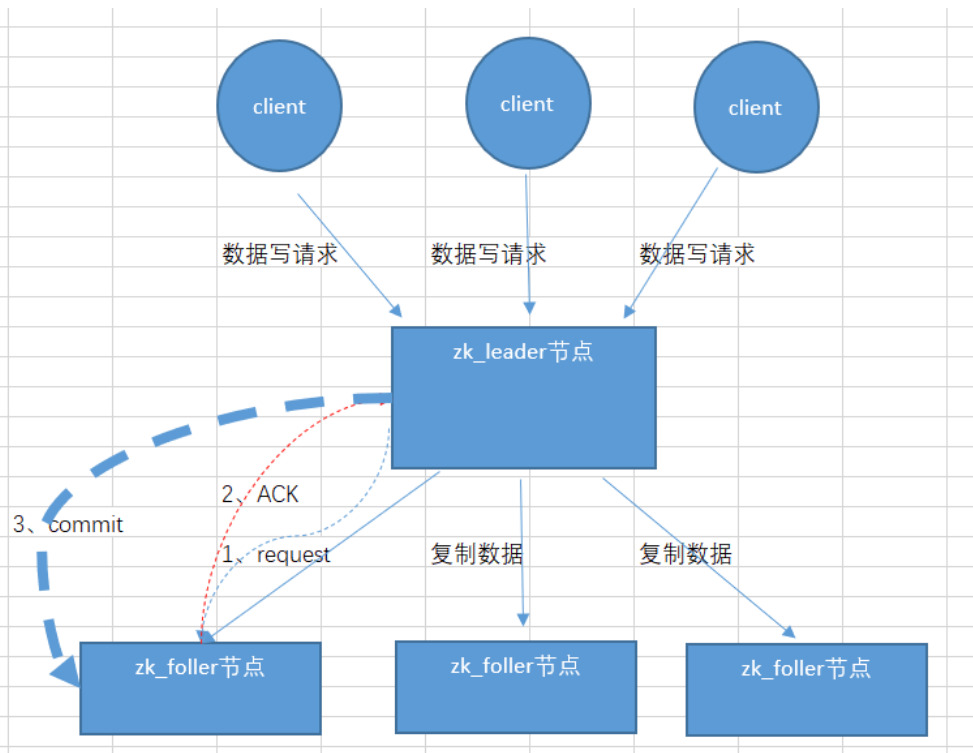
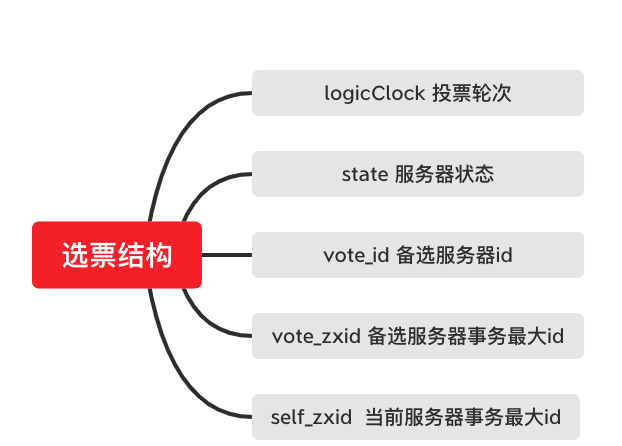

<!-- START doctoc generated TOC please keep comment here to allow auto update -->
<!-- DON'T EDIT THIS SECTION, INSTEAD RE-RUN doctoc TO UPDATE -->
**Table of Contents**  *generated with [DocToc](https://github.com/thlorenz/doctoc)*

- [Zab协议(Zookeeper Atomic Broadcast 原子广播协议)](#zab%E5%8D%8F%E8%AE%AEzookeeper-atomic-broadcast-%E5%8E%9F%E5%AD%90%E5%B9%BF%E6%92%AD%E5%8D%8F%E8%AE%AE)
  - [基本概念](#%E5%9F%BA%E6%9C%AC%E6%A6%82%E5%BF%B5)
    - [zxid (ZooKeeper Transaction Id)](#zxid-zookeeper-transaction-id)
  - [Zookeeper角色](#zookeeper%E8%A7%92%E8%89%B2)
  - [Zab 节点有三种状态](#zab-%E8%8A%82%E7%82%B9%E6%9C%89%E4%B8%89%E7%A7%8D%E7%8A%B6%E6%80%81)
  - [流程](#%E6%B5%81%E7%A8%8B)
  - [崩溃恢复](#%E5%B4%A9%E6%BA%83%E6%81%A2%E5%A4%8D)
    - [什么情况下zab协议会进入崩溃恢复模式？](#%E4%BB%80%E4%B9%88%E6%83%85%E5%86%B5%E4%B8%8Bzab%E5%8D%8F%E8%AE%AE%E4%BC%9A%E8%BF%9B%E5%85%A5%E5%B4%A9%E6%BA%83%E6%81%A2%E5%A4%8D%E6%A8%A1%E5%BC%8F)
    - [投票过程：](#%E6%8A%95%E7%A5%A8%E8%BF%87%E7%A8%8B)
  - [问题](#%E9%97%AE%E9%A2%98)
    - [如何解决 已经被处理的事务请求（proposal）不能丢（commit的） 呢？](#%E5%A6%82%E4%BD%95%E8%A7%A3%E5%86%B3-%E5%B7%B2%E7%BB%8F%E8%A2%AB%E5%A4%84%E7%90%86%E7%9A%84%E4%BA%8B%E5%8A%A1%E8%AF%B7%E6%B1%82proposal%E4%B8%8D%E8%83%BD%E4%B8%A2commit%E7%9A%84-%E5%91%A2)
  - [参考](#%E5%8F%82%E8%80%83)

<!-- END doctoc generated TOC please keep comment here to allow auto update -->

# Zab协议(Zookeeper Atomic Broadcast 原子广播协议)

Zab协议是为分布式协调服务Zookeeper专门设计的一种 支持崩溃恢复 的原子广播协议，是Zookeeper保证数据一致性的核心算法。
Zab借鉴了Paxos算法，但又不像Paxos那样，是一种通用的分布式一致性算法。

## 基本概念

### zxid (ZooKeeper Transaction Id)
一个 zxid 是64位,
高 32 是纪元（epoch）编号，每经过一次 leader 选举产生一个新的 leader，新 leader 会将 epoch 号 +1。
低 32 位是消息计数器，每接收到一条消息这个值 +1，新 leader 选举后这个值重置为 0。

这样设计的好处是旧的 leader 挂了后重启，它不会被选举为 leader，因为此时它的 zxid 肯定小于当前的新 leader。
当旧的 leader 作为 follower 接入新的 leader 后，新的 leader 会让它将所有的拥有旧的 epoch 号的未被 COMMIT 的 proposal 清除。

## Zookeeper角色

leader领导者、follower跟随者、observer观察者、client客户端

（1）leader：负责投票的发起和决议，更新系统状态，处理事务请求。

（2）follower跟随者：参与投票，接收客户端请求，处理非事务请求并返回结果，转发事务请求给leader。

（3）observer观察者：不参与投票过程，只同步leader状态，为了扩展系统，提高读写速度。也接收客户端请求，处理非事务请求并返回结果，转发事务请求给leader。

（4）client客户端：请求发起方。

## Zab 节点有三种状态

Following：当前节点是跟随者，服从 Leader 节点的命令。 

Leading：当前节点是 Leader，负责协调事务。 

Election/Looking：节点处于选举状态，正在寻找 Leader

## 流程

当 ZooKeeper 集群接收到来自客户端的事务性的会话请求后，集群中的其他 Follow 角色服务器会将该请求转发给 Leader 角色服务器进行处理。
当 Leader 节点服务器在处理完该条会话请求后，会将结果通过操作日志的方式同步给集群中的 Follow 角色服务器。然后 Follow 角色服务器根据接收到的操作日志，在本地执行相关的数据处理操作，最终完成整个 ZooKeeper 集群对客户端会话的处理工作。

## 崩溃恢复

整个 ZooKeeper 集群处理客户端会话的核心点在一台 Leader 服务器上。

### 什么情况下zab协议会进入崩溃恢复模式？
1、当服务器启动时

2、当leader 服务器出现网络中断，崩溃或者重启的情况

3、当集群中已经不存在过半的服务器与Leader服务器保持正常通信。

### 投票过程：
当崩溃恢复机制开始的时候，整个 ZooKeeper 集群的每台 Follow 服务器会发起投票，并同步给集群中的其他 Follow 服务器。
在接收到来自集群中的其他 Follow 服务器的投票信息后，集群中的每个 Follow 服务器都会与自身的投票信息进行对比，如果判断新的投票信息更合适，则采用新的投票信息作为自己的投票信息。
在集群中的投票信息还没有达到超过半数原则的情况下，再进行新一轮的投票，最终当整个 ZooKeeper 集群中的 Follow 服务器超过半数投出的结果相同的时候，就会产生新的 Leader 服务器

一个选票的整体结果可以分为一下六个部分：

- logicClock：用来记录服务器的投票轮次。logicClock 会从 1 开始计数，每当该台服务经过一轮投票后，logicClock 的数值就会加 1 。
- state：用来标记当前服务器的状态。在 ZooKeeper 集群中一台服务器具有 LOOKING、FOLLOWING、LEADERING、OBSERVING 这四种状态。
- self_id：用来表示当前服务器的 ID 信息，该字段在 ZooKeeper 集群中主要用来作为服务器的身份标识符。
- self_zxid： 当前服务器上所保存的数据的最大事务 ID ，从 0 开始计数。
- vote_id：投票要被推举的服务器的唯一 ID 。
- vote_zxid：被推举的服务器上所保存的数据的最大事务 ID ，从 0 开始计数。

## 问题

### 如何解决 已经被处理的事务请求（proposal）不能丢（commit的） 呢？
1、选举拥有 proposal 最大值（即 zxid 最大） 的节点作为新的 leader。

由于所有提案被 COMMIT 之前必须有合法数量的 follower ACK，即必须有合法数量的服务器的事务日志上有该提案的 proposal，因此，zxid最大也就是数据最新的节点保存了所有被 COMMIT 消息的 proposal 状态。

2、新的 leader 将自己事务日志中 proposal 但未 COMMIT 的消息处理。

3、新的 leader 与 follower 建立先进先出的队列， 先将自身有而 follower 没有的 proposal 发送给 follower，再将这些 proposal 的 COMMIT 命令发送给 follower，以保证所有的 follower 都保存了所有的 proposal、所有的 follower 都处理了所有的消息。通过以上策略，能保证已经被处理的消息不会丢。

## 参考

- [Zab协议详解-分布式系统](https://cloud.tencent.com/developer/article/1927599)
- [29 ZAB 协议算法：崩溃恢复和消息广播](https://learn.lianglianglee.com/%e4%b8%93%e6%a0%8f/ZooKeeper%e6%ba%90%e7%a0%81%e5%88%86%e6%9e%90%e4%b8%8e%e5%ae%9e%e6%88%98-%e5%ae%8c/29%20ZAB%20%e5%8d%8f%e8%ae%ae%e7%ae%97%e6%b3%95%ef%bc%9a%e5%b4%a9%e6%ba%83%e6%81%a2%e5%a4%8d%e5%92%8c%e6%b6%88%e6%81%af%e5%b9%bf%e6%92%ad.md)