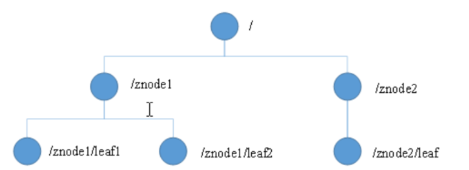

<!-- START doctoc generated TOC please keep comment here to allow auto update -->
<!-- DON'T EDIT THIS SECTION, INSTEAD RE-RUN doctoc TO UPDATE -->
**Table of Contents**  *generated with [DocToc](https://github.com/thlorenz/doctoc)*

- [Zookeeper](#zookeeper)
  - [Zab协议(Zookeeper Atomic Broadcast)](#zab%E5%8D%8F%E8%AE%AEzookeeper-atomic-broadcast)
  - [Zookeeper角色：](#zookeeper%E8%A7%92%E8%89%B2)
  - [node节点](#node%E8%8A%82%E7%82%B9)
    - [节点类型](#%E8%8A%82%E7%82%B9%E7%B1%BB%E5%9E%8B)
      - [1 PERSISTENT（持久节点)](#1-persistent%E6%8C%81%E4%B9%85%E8%8A%82%E7%82%B9)
      - [2 EPHEMERAL](#2-ephemeral)
      - [3 PERSISTENT_SEQUENTIAL](#3-persistent_sequential)
      - [4 EPHEMERAL_SEQUENTIAL](#4-ephemeral_sequential)
  - [Zookeeper的数据模型](#zookeeper%E7%9A%84%E6%95%B0%E6%8D%AE%E6%A8%A1%E5%9E%8B)
  - [客户端基本使用](#%E5%AE%A2%E6%88%B7%E7%AB%AF%E5%9F%BA%E6%9C%AC%E4%BD%BF%E7%94%A8)
  - [参考](#%E5%8F%82%E8%80%83)

<!-- END doctoc generated TOC please keep comment here to allow auto update -->

# Zookeeper
ZooKeeper 是一个分布式的，开放源码的分布式应用程序协调服务，是 Google 的 Chubby 一个开源的实现，是 Hadoop 和 Hbase 的重要组件。它是一个为分布式应用提供一致性服务的软件，提供的功能包括：配置维护、域名服务、分布式同步、组服务等.

- 配置中心:发布者将数据发布到ZK节点上，供订阅者动态获取数据，实现配置信息的集中式管理和动态更新。例如全局的配置信息、服务式服务框架的服务地址列表等就非常适合使用
- 负载均衡: 消息中间件中发布者和订阅者的负载均衡linkedin开源的Kafka和阿里开源的metaq（RocketMQ的前身）都是通过zookeeper来做到生产者、消费者的负载均衡。
- 分布式通知/协调


## Zab协议(Zookeeper Atomic Broadcast)

Zab协议是为分布式协调服务Zookeeper专门设计的一种 支持崩溃恢复 的 原子广播协议 ，是Zookeeper保证数据一致性的核心算法。Zab借鉴了Paxos算法，但又不像Paxos那样，是一种通用的分布式一致性算法。


## Zookeeper角色：
leader领导者、follower跟随者、observer观察者、client客户端

（1）leader：负责投票的发起和决议，更新系统状态，处理事务请求。

（2）follower跟随者：参与投票，接收客户端请求，处理非事务请求并返回结果，转发事务请求给leader。

（3）observer观察者：不参与投票过程，只同步leader状态，为了扩展系统，提高读写速度。也接收客户端请求，处理非事务请求并返回结果，转发事务请求给leader。

（4）client客户端：请求发起方。


## node节点

zookeeper 中数据基本单元叫节点，节点之下可包含子节点，最后以树级方式程现。每个节点拥有唯一的路径path。客户端基于PATH上传节点数据，zookeeper 收到后会实时通知对该路径进行监听的客户端。

zookeeper 中节点叫znode存储结构上跟文件系统类似，以树级结构进行存储。不同之外在于znode没有目录的概念，不能执行类似cd之类的命令。znode结构包含如下：

- path:唯一路径
- childNode：子节点
- stat:状态属性
- type:节点类型

### 节点类型
临时节点（ephemeral）、持久节点（persistent）、顺序节点（sequence）。节点类型在创建时确定，之后不可修改。

#### 1 PERSISTENT（持久节点)

持久节点除非手动删除，否则节点一直存在于 Zookeeper 上

#### 2 EPHEMERAL
临时节点临时节点的生命周期与客户端会话绑定，一旦客户端会话失效（客户端与zookeeper 连接断开不一定会话失效），那么这个客户端创建的所有临时节点都会被移除


#### 3 PERSISTENT_SEQUENTIAL
持久顺序节点基本特性同持久节点，只是增加了顺序属性，节点名后边会追加一个由父节点维护的自增整型数字。

#### 4 EPHEMERAL_SEQUENTIAL
临时顺序节点基本特性同临时节点，增加了顺序属性，节点名后边会追加一个由父节点维护的自增整型数字。

## Zookeeper的数据模型

Zookeeper数据模型的结构与Unix文件系统很类似，整体上可以看作是一颗树，每一个节点称做一个ZNode。
每一个Znode默认能够存储1MB的数据，每个ZNode都可以通过其路径唯一标识。


## 客户端基本使用

```shell
# 部署命令
mkdir data
docker run -d -e TZ="Asia/Shanghai" -p 2181:2181 -v $PWD/data:/data --name zookeeper --restart always zookeeper
```

```shell
# 连接 zk 服务器
zkCli.sh -server ip:port

# 查看子节点-ls
ls /brokers


# create [-s] [-e] path data   
# 其中 -s 为有序节点， -e 临时节点
# 创建持久节点:创建一个名称为 china 的 znode，其值为 999
create /china 999

# 创建持久顺序节点:在/china 节点下创建了顺序子节点 beijing、 shanghai、 guangzhou，它们的数据内容分别为 bj、 sh、 gz
create -s /china/beijing bj
create -s /china/shanghai sh
create -s /china/guangzhou gz

# 创建临时节点
create -e /china/aaa A

# 创建临时顺序节点
create -e  -s /china/bbb B

# 获取节点信息 get
## 获取持久节点数据
get /china

# 更新节点数据内容-set

# 删除节点-delete
```


## 参考

- [ZAB协议概述与选主流程详解](https://github.com/h2pl/JavaTutorial/blob/master/docs/distributed/practice/%E6%90%9E%E6%87%82%E5%88%86%E5%B8%83%E5%BC%8F%E6%8A%80%E6%9C%AF%EF%BC%9AZAB%E5%8D%8F%E8%AE%AE%E6%A6%82%E8%BF%B0%E4%B8%8E%E9%80%89%E4%B8%BB%E6%B5%81%E7%A8%8B%E8%AF%A6%E8%A7%A3.md)
- [zookeeper 全解](https://blog.csdn.net/General_zy/article/details/129233373)
- [Zookeeper基础篇1-Zookeeper安装和客户端使用](https://juejin.cn/post/7098311052831653919)