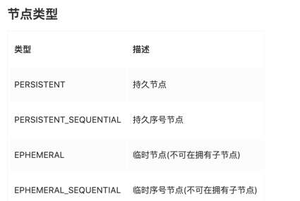

<!-- START doctoc generated TOC please keep comment here to allow auto update -->
<!-- DON'T EDIT THIS SECTION, INSTEAD RE-RUN doctoc TO UPDATE -->
**Table of Contents**  *generated with [DocToc](https://github.com/thlorenz/doctoc)*

- [Zookeeper](#zookeeper)
  - [node节点](#node%E8%8A%82%E7%82%B9)
    - [节点类型](#%E8%8A%82%E7%82%B9%E7%B1%BB%E5%9E%8B)
      - [1. PERSISTENT（持久节点)](#1-persistent%E6%8C%81%E4%B9%85%E8%8A%82%E7%82%B9)

<!-- END doctoc generated TOC please keep comment here to allow auto update -->

# Zookeeper
ZooKeeper是用于分布式应用程序的协调服务。它公开了一组简单的API，分布式应用程序可以基于这些API用于同步，节点状态、配置等信息、服务注册等信息.


## node节点

zookeeper 中数据基本单元叫节点，节点之下可包含子节点，最后以树级方式程现。每个节点拥有唯一的路径path。客户端基于PATH上传节点数据，zookeeper 收到后会实时通知对该路径进行监听的客户端。

zookeeper 中节点叫znode存储结构上跟文件系统类似，以树级结构进行存储。不同之外在于znode没有目录的概念，不能执行类似cd之类的命令。znode结构包含如下：

- path:唯一路径
- childNode：子节点
- stat:状态属性
- type:节点类型

### 节点类型


#### 1. PERSISTENT（持久节点)

持久化保存的节点，也是默认创建的.
```shell
#默认创建的就是持久节点
create /test
```
