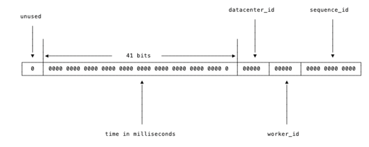
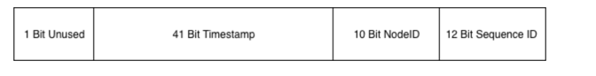
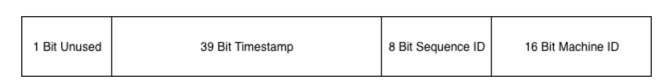

<!-- START doctoc generated TOC please keep comment here to allow auto update -->
<!-- DON'T EDIT THIS SECTION, INSTEAD RE-RUN doctoc TO UPDATE -->
**Table of Contents**  *generated with [DocToc](https://github.com/thlorenz/doctoc)*

- [分布式Id](#%E5%88%86%E5%B8%83%E5%BC%8Fid)
  - [一般分布式 ID 的特点](#%E4%B8%80%E8%88%AC%E5%88%86%E5%B8%83%E5%BC%8F-id-%E7%9A%84%E7%89%B9%E7%82%B9)
  - [生成方式](#%E7%94%9F%E6%88%90%E6%96%B9%E5%BC%8F)
  - [UUID(Universally Unique Identifier)](#uuiduniversally-unique-identifier)
    - [uuid 选择](#uuid-%E9%80%89%E6%8B%A9)
    - [github.com/google/uuid](#githubcomgoogleuuid)
  - [雪花算法](#%E9%9B%AA%E8%8A%B1%E7%AE%97%E6%B3%95)
    - [原生雪花算法优缺点](#%E5%8E%9F%E7%94%9F%E9%9B%AA%E8%8A%B1%E7%AE%97%E6%B3%95%E4%BC%98%E7%BC%BA%E7%82%B9)
    - [twitter的snowflake 算法](#twitter%E7%9A%84snowflake-%E7%AE%97%E6%B3%95)
    - [源码 github.com/bwmarrin/snowflake](#%E6%BA%90%E7%A0%81-githubcombwmarrinsnowflake)
    - [sony/sonyflake](#sonysonyflake)
    - [Sony 关于时间回拨问题](#sony-%E5%85%B3%E4%BA%8E%E6%97%B6%E9%97%B4%E5%9B%9E%E6%8B%A8%E9%97%AE%E9%A2%98)
  - [参考](#%E5%8F%82%E8%80%83)

<!-- END doctoc generated TOC please keep comment here to allow auto update -->

# 分布式Id


## 一般分布式 ID 的特点

1. 全局唯一性
不能出现有重复的ID标识，这是基本要求。

2. 递增性

确保生成ID对于用户或业务是递增的。

3. 高可用性

确保任何时候都能生成正确的ID。

4. 高性能性

在高并发的环境下依然表现良好。


## 生成方式
9种，分布式ID生成器方式以及优缺点：

- UUID
- 数据库自增ID:基于数据库的auto_increment自增ID
- 数据库多主模式:设置起始值和自增步长
- 号段模式:从数据库批量的获取自增ID，每次从数据库取出一个号段范围
- Redis:利用redis的 incr命令实现ID的原子性自增
- 雪花算法（SnowFlake）
- 滴滴出品（github.com/didi/tinyid):基于号段模式
- 百度(github.com/baidu/uid-generator）:uid-generator是基于Snowflake算法实现
- 美团(github.com/Meituan-Dianping/Leaf):同时支持号段模式和snowflake算法模式


## UUID(Universally Unique Identifier)
UUID 是一串全球唯一的(16进制)数字串.UUID有16进制的32个数字组成，故理论上总量为16^32,即使每纳秒生成一万亿个，也好耗尽壹佰亿年才能强所有UUID用完

UUID 的标准格式为“xxxxxxxx-xxxx-xxxx-xxxx-xxxxxxxxxx”，五个部分分别为8个字符、4个字符、4个字符、4个字符、12个字符，中间用“-”号间隔

有 8 个 UUID 版本（v1 到 v8）

- UUID 版本 1 (v1)由时间戳、单调计数器和 MAC 地址生成。
- UUID 版本 2 (v2)保留用于没有已知详细信息的安全 ID。
- UUID 版本 3 (v3)是根据您提供的某些数据的 MD5 哈希值生成的。 RFC 在候选数据中建议了 DNS 和 URL。
- UUID 版本 4 (v4)是根据完全随机的数据生成的。这可能是大多数人对 UUID 的想法和遇到的情况。
- UUID 版本 5 (v5)是根据您提供的一些数据的 SHA1 哈希值生成的。与 v3 一样，RFC 建议使用 DNS 或 URL 作为候选。
- UUID 版本 6 (v6)由时间戳、单调计数器和 MAC 地址生成。这些数据与版本 1 相同，但更改了顺序，以便对它们进行排序时将按创建时间排序。
- UUID 版本 7 (v7)由时间戳和随机数据生成。
- UUID 版本 8 (v8)完全是自定义的（除了所有版本都包含的必需版本/变体字段）。

### uuid 选择

v4 或 v7。也有一些场合选择v5或v8。

- 当您只想要一个随机 ID 时，请使用 v4。这是一个很好的默认选择。
- 如果您要在希望能够排序的上下文中使用 ID，请使用 v7。例如，如果您使用 UUID 作为数据库键，请考虑使用 v7。
- 如果您在 UUID 中有自己想要的数据，则使用 v5 或 v8，但一般来说，您会知道是否需要它。


### github.com/google/uuid
```go
// github.com/google/uuid@v1.6.0/uuid.go

// A UUID is a 128 bit (16 byte) Universal Unique IDentifier as defined in RFC
// 4122.
type UUID [16]byte
```

v4 版本
```go
func NewRandom() (UUID, error) {
	if !poolEnabled {
		return NewRandomFromReader(rander)
	}
	return newRandomFromPool()
}

```

```go
func NewRandomFromReader(r io.Reader) (UUID, error) {
	var uuid UUID
	_, err := io.ReadFull(r, uuid[:])
	if err != nil {
		return Nil, err
	}
	uuid[6] = (uuid[6] & 0x0f) | 0x40 // Version 4
	uuid[8] = (uuid[8] & 0x3f) | 0x80 // Variant is 10
	return uuid, nil
}
```


v7 版本
```go
func NewV7() (UUID, error) {
	uuid, err := NewRandom()
	if err != nil {
		return uuid, err
	}
	makeV7(uuid[:])
	return uuid, nil
}


func makeV7(uuid []byte) {
	/*
		 0                   1                   2                   3
		 0 1 2 3 4 5 6 7 8 9 0 1 2 3 4 5 6 7 8 9 0 1 2 3 4 5 6 7 8 9 0 1
		+-+-+-+-+-+-+-+-+-+-+-+-+-+-+-+-+-+-+-+-+-+-+-+-+-+-+-+-+-+-+-+-+
		|                           unix_ts_ms                          |
		+-+-+-+-+-+-+-+-+-+-+-+-+-+-+-+-+-+-+-+-+-+-+-+-+-+-+-+-+-+-+-+-+
		|          unix_ts_ms           |  ver  |  rand_a (12 bit seq)  |
		+-+-+-+-+-+-+-+-+-+-+-+-+-+-+-+-+-+-+-+-+-+-+-+-+-+-+-+-+-+-+-+-+
		|var|                        rand_b                             |
		+-+-+-+-+-+-+-+-+-+-+-+-+-+-+-+-+-+-+-+-+-+-+-+-+-+-+-+-+-+-+-+-+
		|                            rand_b                             |
		+-+-+-+-+-+-+-+-+-+-+-+-+-+-+-+-+-+-+-+-+-+-+-+-+-+-+-+-+-+-+-+-+
	*/
	_ = uuid[15] // bounds check

	t, s := getV7Time()

	uuid[0] = byte(t >> 40)
	uuid[1] = byte(t >> 32)
	uuid[2] = byte(t >> 24)
	uuid[3] = byte(t >> 16)
	uuid[4] = byte(t >> 8)
	uuid[5] = byte(t)

	uuid[6] = 0x70 | (0x0F & byte(s>>8))
	uuid[7] = byte(s)
}
```

## 雪花算法

SnowFlake 算法，是 Twitter 开源的分布式 id 生成算法。其核心思想就是：使用一个 64 bit的 long 型的数字作为全局唯一 id。在分布式系统中的应用十分广泛，且ID 引入了时间戳，基本上是保持自增的

### 原生雪花算法优缺点
原生的Snowflake算法是完全依赖于时间的，如果有时钟回拨的情况发生，会生成重复的ID，市场上的解决方案也是非常多的：

- 最简单的方案，就是关闭生成唯一ID机器的时间同步。
- 使用阿里云的的时间服务器进行同步，2017年1月1日的闰秒调整，阿里云服务器NTP系统24小时“消化”闰秒，完美解决了问题。
- 如果发现有时钟回拨，时间很短比如5毫秒,就等待，然后再生成。或者就直接报错，交给业务层去处理。
- 可以找2bit位作为时钟回拨位，发现有时钟回拨就将回拨位加1，达到最大位后再从0开始进行循环。

### twitter的snowflake 算法

首先确定我们的数值是64位，int64类型，被划分为四部分，不含开头的第一个bit，因为这个bit是符号位。

1. 雪花算法生成的 ID 是 64 位，是 twitter 开源的。
2. 时间戳（timestamp）：41 位。单位为毫秒，总共可以容纳约 69 年的时间。这里的时间戳只是相对于某个时间点的增量.当然，我们的时间毫秒计数不会真的从1970年开始记，那样我们的系统跑到2039/9/7 23:47:35就不能用了，
   所以这里的timestamp只是相对于某个时间的增量，比如我们的系统上线是2018-08-01，那么我们可以把这个timestamp当作是从2018-08-01 00:00:00.000的偏移量。
3. ⼯作机器 id （instance）占⽤ 10bit，其中⾼位 5bit 是数据中⼼ ID，低位 5bit 是⼯作节点 ID，最多可以容纳1024个节点。即可用于 1024 台机器的分布式系统使用。
4. 序列号 占用 12bit，⽤来记录同毫秒内产⽣的不同 id。最后是12位的循环自增id（到达1111,1111,1111后会归0）.每个节点每毫秒 0 开始不断累加，最多可以累加到 4095（即 0 - 4095）， 1 毫秒内可以产⽣ 4096 个ID.

这样的机制可以支持我们在同一台机器上，同一毫秒内产生2 ^ 12 = 4096条消息。一秒共409.6万条消息。从值域上来讲完全够用了.

数据中心加上实例id共有10位，可以支持我们每数据中心部署32台机器，所有数据中心共1024台实例。


timestamp，datacenter_id，worker_id和sequence_id这四个字段中，timestamp和sequence_id是由程序在运行期生成的。
但datacenter_id和worker_id需要我们在部署阶段就能够获取得到，并且一旦程序启动之后，就是不可更改的了


### 源码 github.com/bwmarrin/snowflake

```go
var(
// Epoch is set to the twitter snowflake epoch of Nov 04 2010 01:42:54 UTC in milliseconds
	// You may customize this to set a different epoch for your application.
	Epoch int64 = 1288834974657   // 对应的是41bit的毫秒时间戳，默认的是Nov 04 2010 01:42:54 UTC的毫秒时间戳，

	// NodeBits holds the number of bits to use for Node
	// 节点id和自增id总共占用22个bit，可以根据节点数自行调整
	NodeBits uint8 = 10    // 节点id占用8个bit

	// StepBits holds the number of bits to use for Step
	// 节点id和自增id总共占用22个bit，可以根据节点数自行调整
	StepBits uint8 = 12    // 自增id占用12个bit
)

```
节点结构体定义
```go
type Node struct {
	mu    sync.Mutex
	epoch time.Time    
	time  int64
	node  int64  
	step  int64

	nodeMax   int64   // 节点的最大id值
	nodeMask  int64   // 节点掩码
	stepMask  int64   // 自增id掩码
	timeShift uint8    // 时间戳移位位数
	nodeShift uint8     // 节点移位位数
}

```
生成节点函数：
```go
func NewNode(node int64) (*Node, error) {
	// 输入的node值为节点id值。
	// re-calc in case custom NodeBits or StepBits were set
	// DEPRECATED: the below block will be removed in a future release.
	mu.Lock()
	nodeMax = -1 ^ (-1 << NodeBits) 
	nodeMask = nodeMax << StepBits 
	stepMask = -1 ^ (-1 << StepBits)  
	timeShift = NodeBits + StepBits   
	nodeShift = StepBits  
	mu.Unlock()

	n := Node{}
	n.node = node
	n.nodeMax = -1 ^ (-1 << NodeBits)//求节点id最大值，当notebits为10时，nodemax值位1023
	n.nodeMask = n.nodeMax << StepBits// 节点id掩码
	n.stepMask = -1 ^ (-1 << StepBits)// 自增id掩码
	n.timeShift = NodeBits + StepBits//时间戳左移的位数
	n.nodeShift = StepBits// 节点id左移的位数

	if n.node < 0 || n.node > n.nodeMax {
		return nil, errors.New("Node number must be between 0 and " + strconv.FormatInt(n.nodeMax, 10))
	}

	var curTime = time.Now()
	// 这里n.epoch的值为默认epoch值，但单掉时间为一个负数，表示当前时间到默认事件的差值。
	n.epoch = curTime.Add(time.Unix(Epoch/1000, (Epoch%1000)*1000000).Sub(curTime))

	return &n, nil
}

```
节点生成id的方法:
```go
func (n *Node) Generate() ID {

	n.mu.Lock()

	now := time.Since(n.epoch).Nanoseconds() / 1000000 
    //求出当前时间，使用的是单调时间
	
    // 如果在同一个时间单位内，就对自增id进行+1操作
	if now == n.time {
		n.step = (n.step + 1) & n.stepMask
		// 当step达到最大值，再加1，就为0。即表示再这个时间单位内，不能再生成更多的id了，需要等待到下一个时间单位内。
		if n.step == 0 {
			for now <= n.time {
				now = time.Since(n.epoch).Nanoseconds() / 1000000
			}
		}
	} else {
        // 反之 自增id设为0
		n.step = 0
	}
	// 将now值赋值给n.time
	n.time = now
	// 合成id，将3部分移位并做或操作
	r := ID((now)<<n.timeShift |(n.node << n.nodeShift) |(n.step),)

	n.mu.Unlock()
	return r
}

```


### sony/sonyflake

索尼公司的Sonyflake对原生的Snowflake进行改进，重新分配了各部分的bit位。

- 39bit 来保存时间戳，但时间的单位变成了10ms，所以理论上比41位表示的时间还要久(174年)。
```go
const sonyflakeTimeUnit = 1e7 // nsec, i.e. 10 msec
func toSonyflakeTime(t time.Time) int64 {
	return t.UTC().UnixNano() / sonyflakeTimeUnit
}
func currentElapsedTime(startTime int64) int64 {
	return toSonyflakeTime(time.Now()) - startTime
}

```

- 8bit 做为序列号，每10毫最大生成256个，1秒最多生成25600个，比原生的Snowflake少好多，如果感觉不够用，目前的解决方案是跑多个实例生成同一业务的ID来弥补。
- 16bit 做为机器号，默认的是当前机器的私有IP的最后两位.
```go
sf.machineID, err = lower16BitPrivateIP()

```
```go
func lower16BitPrivateIP() (uint16, error) {
	ip, err := privateIPv4()
	if err != nil {
		return 0, err
	}
	return uint16(ip[2])<<8 + uint16(ip[3]), nil
}

```


启动阶段的配置参数
```go
func NewSonyflake(st Settings) *Sonyflake
```

```go
type Settings struct {
    StartTime      time.Time
    MachineID      func() (uint16, error)
    CheckMachineID func(uint16) bool
}
```
- StartTime选项和我们之前的Epoch差不多，如果不设置的话，默认是从2014-09-01 00:00:00 +0000 UTC开始。

- MachineID可以由用户自定义的函数，如果用户不定义的话，会默认将本机IP的低16位作为machine id。

- CheckMachineID是由用户提供的检查MachineID是否冲突的函数。这里的设计还是比较巧妙的，
如果有另外的中心化存储并支持检查重复的存储，那我们就可以按照自己的想法随意定制这个检查MachineID是否冲突的逻辑。如果公司有现成的Redis集群，那么我们可以很轻松地用Redis的集合类型来检查冲突。
```shell
redis 127.0.0.1:6379> SADD base64_encoding_of_last16bits MzI0Mgo=
(integer) 1
redis 127.0.0.1:6379> SADD base64_encoding_of_last16bits MzI0Mgo=
(integer) 0
```

### Sony 关于时间回拨问题

- 只有当current大于elapsedTime，才会将current赋值给elapsedTime，也就是说elapsedTime是一直增大的，即使时钟回拨，也不会改变elapsedTime。
- 如果没有发生时间回拨，就是sf.elapsedTime = current，自增id满了以后，这个单位时间内不能再生成id了，就需要睡眠一下，等到下一个时间单位。
- 当发生时间回拨，sequence自增加1。当sequence加满，重新变为0后，为了防止重复id，将elapsedTime+1，这个时候elapsedTime还大于current，睡眠一会儿。

对于时间回拨的问题Sonyflake简单暴力，就是直接等待
```go
func (sf *Sonyflake) NextID() (uint64, error) {
	const maskSequence = uint16(1<<BitLenSequence - 1)
	sf.mutex.Lock()
	defer sf.mutex.Unlock()
	current := currentElapsedTime(sf.startTime)
	if sf.elapsedTime < current {
		sf.elapsedTime = current
		sf.sequence = 0
	} else { // sf.elapsedTime >= current
		sf.sequence = (sf.sequence + 1) & maskSequence
		if sf.sequence == 0 {
			sf.elapsedTime++
			overtime := sf.elapsedTime - current
			time.Sleep(sleepTime((overtime)))
		}
	}	
	return sf.toID()
}

```

## 参考

- https://www.rfc-editor.org/rfc/rfc9562.html#name-introduction
- [9种 分布式ID生成方式](https://mp.weixin.qq.com/s?__biz=MzAxNTM4NzAyNg==&mid=2247483785&idx=1&sn=8b828a8ae1701b810fe3969be536cb14&chksm=9b859174acf21862f0b95e0502a1a441c496a5488f5466b2e147d7bb9de072bde37c4db25d7a&token=745402269&lang=zh_CN#rd)