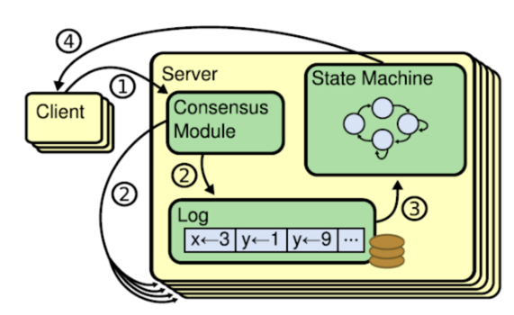
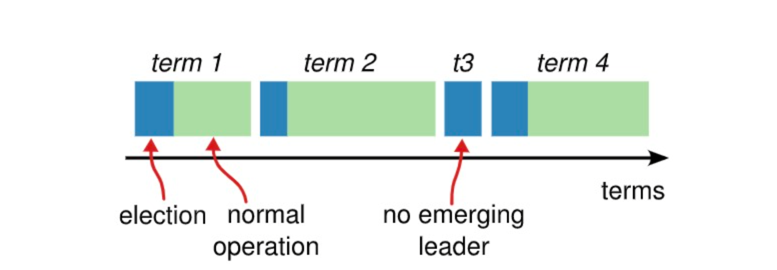
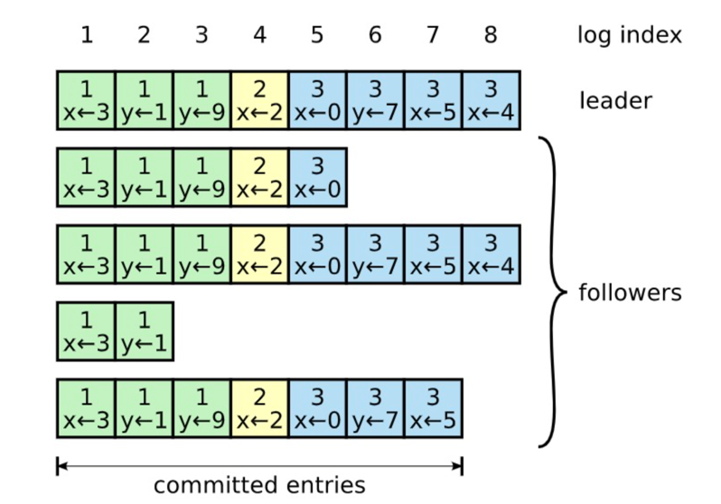

<!-- START doctoc generated TOC please keep comment here to allow auto update -->
<!-- DON'T EDIT THIS SECTION, INSTEAD RE-RUN doctoc TO UPDATE -->
**Table of Contents**  *generated with [DocToc](https://github.com/thlorenz/doctoc)*

- [Raft 算法](#raft-%E7%AE%97%E6%B3%95)
  - [RPC种类](#rpc%E7%A7%8D%E7%B1%BB)
  - [压缩](#%E5%8E%8B%E7%BC%A9)
  - [快照实现以及何时做快照](#%E5%BF%AB%E7%85%A7%E5%AE%9E%E7%8E%B0%E4%BB%A5%E5%8F%8A%E4%BD%95%E6%97%B6%E5%81%9A%E5%BF%AB%E7%85%A7)
  - [1. leader选举](#1-leader%E9%80%89%E4%B8%BE)
  - [2. 日志复制](#2-%E6%97%A5%E5%BF%97%E5%A4%8D%E5%88%B6)
    - [1. 日志复制的两条保证](#1-%E6%97%A5%E5%BF%97%E5%A4%8D%E5%88%B6%E7%9A%84%E4%B8%A4%E6%9D%A1%E4%BF%9D%E8%AF%81)
    - [2. 日志的不正常情况](#2-%E6%97%A5%E5%BF%97%E7%9A%84%E4%B8%8D%E6%AD%A3%E5%B8%B8%E6%83%85%E5%86%B5)
    - [3. 如何保证日志的正常复制](#3-%E5%A6%82%E4%BD%95%E4%BF%9D%E8%AF%81%E6%97%A5%E5%BF%97%E7%9A%84%E6%AD%A3%E5%B8%B8%E5%A4%8D%E5%88%B6)
  - [3. 安全性](#3-%E5%AE%89%E5%85%A8%E6%80%A7)
- [参考](#%E5%8F%82%E8%80%83)

<!-- END doctoc generated TOC please keep comment here to allow auto update -->


## Raft 算法


Raft是一个用于管理日志一致性的协议。它将分布式一致性分解为多个子问题：Leader选举（Leader election）、日志复制（Log replication）、安全性（Safety）、日志压缩（Log compaction）等。

raft的理论基础是Replicated State Machine，Replicated State Machine需要满足如下的条件：
一个server可以有多个state，多个server从同一个start状态出发，都执行相同的command序列，最终到达的state是一样的。



如上图，一般使用replicated log来记录command序列，client的请求被leader转化成log entry，然后通过一致性模块把log同步到各个server，让各个server的log一致。
每个server都有state Machine，从start出发，执行完这些log中的command后，server处于相同的state。所以raft协议的关键就是保证各个server的log一致，然后每个server通过执行相同的log来达到一致的状态

    
复杂的共识问题拆分成三个子问题    
    
1. Leader 选举，Leader 故障后集群能快速选出新 Leader；
2. 日志复制， 集群只有 Leader 能写入日志， Leader 负责复制日志到 Follower 节点，并强制 Follower 节点与自己保持相同；
3. 安全性，一个任期内集群只能产生一个 Leader、已提交的日志条目在发生 Leader 选举时，

一定会存在更高任期的新 Leader 日志中、各个节点的状态机应用的任意位置的日志条目内容应一样.


### RPC种类

1. RequestVote RPC：候选人在选举期间发起,candidate节点请求其他节点投票给自己
   1. 请求参数:
      - term: 当前candidate节点的term值
      - candidateId: 当前candidate节点的编号
      - lastLogIndex: 当前candidate节点最后一个日志的索引
      - lastLogTerm: 当前candidate节点最后一个日志的term值
   2. 返回值
      - term: 接受投票节点的term值, 主要用来更新当前candidate节点的term值
      - voteGranted: 是否给该申请节点投票

2. AppendEntries RPC：leader节点使用该消息向其他节点同步日志, 或者发送空消息作为心跳包以维持leader的统治地位
   1. 请求参数
      - term: 当前leader节点的term值
      - leaderId: 当前leader节点的编号（注：follower根据领导者id把客户端的请求重定向到领导者，比如有时客户端把请求发给了follower而不是leader）
      - prevLogIndex: 当前发送的日志的前面一个日志的索引
      - prevLogTerm: 当前发送的日志的前面一个日志的term值 （这个和上一个作用是follower日志有效性检查）
      - entries[]: 需要各个节点存储的日志条目(用作心跳包时为空, 可能会出于效率发送超过一个日志条目)
      - leaderCommit: 当前leader节点最高的被提交的日志的索引(就是leader节点的commitIndex)
   2. 返回值
      - term: 接收日志节点的term值, 主要用来更新当前leader节点的term值
      - success: 如果接收日志节点的log[]结构中prevLogIndex索引处含有日志并且该日志的term等于prevLogTerm则返回true, 否则返回false
3. InstallSnapshot RPC: 领导者使用该RPC来发送快照给太落后的追随者

### 压缩
日志压缩的大部分责任都落在状态机上。
不同的压缩方法有几个核心的共同点：

1. 不将压缩决定集中在 Leader 上，每个服务器独立地压缩其已提交的日志。这就避免了 Leader 将日志传递给已有该日志的 Follower，同时也增强了模块化，减少交互，将整个系统的复杂性最小化。（对于非常小的状态机，基于 Leader 的日志压缩也许更好。）
2. 将之前的 log 的维护责任从 Raft 转移到状态机。Raft 要保存最后被丢弃的记录的index和term，用于 AppendEntries RPC一致性检查。同时，也需要保存最新的配置信息：成员变更失败需要回退配置，最近的配置必须保存。
3. 一旦丢弃了前面部分的日志，状态机就承担两个新的责任：
   - 如果服务器重启了，需要将最新的快照加载到状态机后再接受 log；此外，
   - 需要向较慢的 follower(日志远落后于 Leader)发送一致的状态镜像。(InstallSnapshot RPC)

### 快照实现以及何时做快照
服务器需要决定什么时候做快照。太过频繁地做快照，将会浪费磁盘带宽和其他资源；太不频繁地做快照，则有存储空间耗尽的风险，并且重启服务需要更长的重放日志时间.
**一个简单的策略是设置一个阈值，当日志大小超过阈值则做快照** 然而，这会导致对于小型状态机时有着不必要的大日志。

一个更好的方法是引入快照大小和日志大小的对比，如果日志超过快照好几倍，可能就需要做快照。但是在做快照之前计算快照的大小是困难并且繁重的，会引入额外负担。所以使用前一个快照的大小是比较合理的行为，一旦日志大小超过之前的快照的大小乘以扩展因子(expansion factor)，服务器就做快照。

这个扩展因子权衡空间和带宽利用率。例如，扩展因子为 4 的话会有 20% 的带宽用于快照(每1byte 的快照写入有对应的 4bytes 的 log 写入)和大约 6 倍的硬盘空间使用(旧的快照+日志+新的快照)。


### 1. leader选举
既然Multi-Paxos支持多个proposer，为什么很多分布式协议仍需要leader？我觉得这是出于对简化一致性协议。
降低log replication的复杂度的角度考虑的。有了leader之后，日志的提交只可以由leader发起。简化了acceptor的处理流程。另外一个好处是，单leader对事务比较友好。

leader选举原则：最大提交原则: During elections, choose candidate with log most likely to contain all committed entries。

Raft算法中服务器有三种角色

- Follower
- Candidate
- Leader

- 选举过程图1（单个节点视角）


Raft 算法中服务器节点之间通信使用远程过程调用（RPC），并且基本的一致性算法只需要两种类型的 RPC，为了在服务器之间传输快照增加了第三种 RPC。

  
- 选举过程图2（整体视角）

  
监听事件-->源码实现

```go
func (r *Raft) run() {
	for {
		// Check if we are doing a shutdown
		select {
		case <-r.shutdownCh:
			// Clear the leader to prevent forwarding
			r.setLeader("")
			return
		default:
		}

		switch r.getState() {
		case Follower:
			r.runFollower()
		case Candidate:
			r.runCandidate()
		case Leader:
			r.runLeader()
		}
	}
}
```
  


### 2. 日志复制

日志格式：日志由有序编号（log index）的日志条目组成。每个日志条目包含它被创建时的任期号（term）和用于状态机执行的命令。
如果一个日志条目被复制到大多数服务器上，就认为可以提交（commit）了。
    
term + index + cmd + type

```go
// github.com/hashicorp/raft@v1.3.5/log.go
type Log struct {
	// Index holds the index of the log entry.
	Index uint64

	// Term holds the election term of the log entry.
	Term uint64

	// Type holds the type of the log entry.
	Type LogType

	// Data holds the log entry's type-specific data.
	Data []byte
	
	// ....
}
```




#### 1. 日志复制的两条保证
如果不同日志中的两个条目有着相同的索引和任期号，则它们所存储的命令是相同的（原因：leader 最多在一个任期里的一个日志索引位置创建一条日志条目，日志条目在日志的位置从来不会改变）。

如果不同日志中的两个条目有着相同的索引和任期号，则它们之前的所有条目都是完全一样的（原因：每次 RPC 发送附加日志时，leader 会把这条日志条目的前面的日志的下标和任期号一起发送给 follower，如果 follower 发现和自己的日志不匹配，那么就拒绝接受这条日志，这个称之为一致性检查）。

#### 2. 日志的不正常情况

一般情况下，Leader和Followers的日志保持一致，因此 AppendEntries 一致性检查通常不会失败。然而，Leader崩溃可能会导致日志不一致：旧的Leader可能没有完全复制完日志中的所有条目。

下图阐述了一些Followers可能和新的Leader日志不同的情况。一个Follower可能会丢失掉Leader上的一些条目，也有可能包含一些Leader没有的条目，也有可能两者都会发生。丢失的或者多出来的条目可能会持续多个任期。

#### 3. 如何保证日志的正常复制
Leader通过强制Followers复制它的日志来处理日志的不一致，Followers上的不一致的日志会被Leader的日志覆盖。Leader为了使Followers的日志同自己的一致，Leader需要找到Followers同它的日志一致的地方，然后覆盖Followers在该位置之后的条目。

具体的操作是：Leader会从后往前试，每次AppendEntries失败后尝试前一个日志条目，直到成功找到每个Follower的日志一致位置点（基于上述的两条保证），然后向后逐条覆盖Followers在该位置之后的条目。

总结一下就是：当 leader 和 follower 日志冲突的时候，leader 将校验 follower 最后一条日志是否和 leader 匹配，如果不匹配，将递减查询，直到匹配，匹配后，删除冲突的日志。这样就实现了主从日志的一致性


详细流程 


### 3. 安全性
Raft增加了如下两条限制以保证安全性：

1. 拥有最新的已提交的log entry的Follower才有资格成为leader。
  - 这个保证是在RequestVote RPC中做的，Candidate在发送RequestVote RPC时，要带上自己的最后一条日志的term和log index，其他节点收到消息时，如果发现自己的日志比请求中携带的更新，则拒绝投票。日志比较的原则是，如果本地的最后一条log entry的term更大，则term大的更新，如果term一样大，则log index更大的更新。
    这点隐含了一个事实：如果一个candidate能当选主，那么它一定包含了最新的日志，并且最新这条日志被半数以上节点承认。
    抽屉原理，选举出来的Leader是多数中数据最新的，一定包含已经在多数节点上commit的数据


2. Leader 只能推进 commit index来提交当前term的已经复制到大多数服务器上的日志，旧term日志的提交要等到提交当前term的日志来间接提交（log index 小于 commit index的日志被间接提交）


## 参考

- [官方介绍及多语言实现链接](https://raft.github.io/#implementations)
- [源码分析 hashicorp raft election 选举的设计实现原理](https://github.com/rfyiamcool/notes/blob/main/hashicorp_raft_election_code.md)
- [源码分析 hashicorp raft 的持久化存储的实现原理](https://github.com/rfyiamcool/notes/blob/main/hashicorp_raft_persistence_code.md)
- [源码分析 hashicorp raft replication 日志复制的实现原理](https://github.com/rfyiamcool/notes/blob/main/hashicorp_raft_replication_code.md)
- [源码分析 hashicorp raft snapshot 快照的实现原理](https://github.com/rfyiamcool/notes/blob/main/hashicorp_raft_snapshot_code.md)