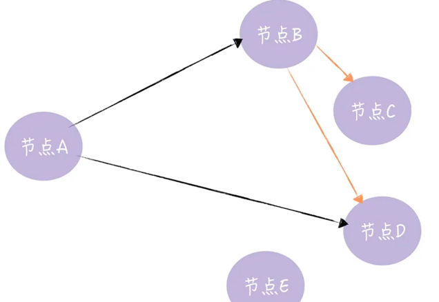

<!-- START doctoc generated TOC please keep comment here to allow auto update -->
<!-- DON'T EDIT THIS SECTION, INSTEAD RE-RUN doctoc TO UPDATE -->
**Table of Contents**  *generated with [DocToc](https://github.com/thlorenz/doctoc)*

- [gossip](#gossip)
  - [传播方式](#%E4%BC%A0%E6%92%AD%E6%96%B9%E5%BC%8F)
    - [反熵传播](#%E5%8F%8D%E7%86%B5%E4%BC%A0%E6%92%AD)
    - [谣言传播](#%E8%B0%A3%E8%A8%80%E4%BC%A0%E6%92%AD)
  - [通信方式](#%E9%80%9A%E4%BF%A1%E6%96%B9%E5%BC%8F)
    - [Push-based 的 Gossip 协议：](#push-based-%E7%9A%84-gossip-%E5%8D%8F%E8%AE%AE)
    - [Pull-based 的 Gossip 协议，正好相反：](#pull-based-%E7%9A%84-gossip-%E5%8D%8F%E8%AE%AE%E6%AD%A3%E5%A5%BD%E7%9B%B8%E5%8F%8D)
  - [golang 库: github.com/hashicorp/memberlist](#golang-%E5%BA%93-githubcomhashicorpmemberlist)
    - [节点状态分为4种](#%E8%8A%82%E7%82%B9%E7%8A%B6%E6%80%81%E5%88%86%E4%B8%BA4%E7%A7%8D)
    - [Delegate](#delegate)
    - [EventDelegate](#eventdelegate)
    - [MergeDelegate](#mergedelegate)
    - [PingDelegate](#pingdelegate)
    - [AliveDelegate](#alivedelegate)
    - [第三方应用 --> alertmanager](#%E7%AC%AC%E4%B8%89%E6%96%B9%E5%BA%94%E7%94%A8----alertmanager)
  - [参考](#%E5%8F%82%E8%80%83)

<!-- END doctoc generated TOC please keep comment here to allow auto update -->

# gossip


## 传播方式
Gossip 协议的消息传播方式主要有两种：Anti-Entropy(反熵传播)和 Rumor-Mongering(谣言传播)。


###  反熵传播


定义：反熵（指消除不同节点中数据的差异，提升节点间数据的相似度，降低熵值）。反熵传播：以固定的概率传播所有的数据，可用来避免因为UDP数据包丢失或者新节点的加入而导致的集群元数据不一致问题。

过程：集群中的节点，每隔段时间就随机选择某个其他节点，然后通过互相交换自己的所有数据来消除两者之间的差异，实现数据的最终一致性。

适用场景：执行反熵时，相关的节点都是已知的，而且节点数量不能太多，如果是一个动态变化或节点数比较多的分布式环境（比如在 DevOps 环境中检测节点故障，并动态维护集群节点状态），这时反熵就不适用了。

缺点：消息数量非常庞大，且无限制；通常只用于新加入节点的数据初始化。可以通过引入校验和（Checksum）等机制，降低需要对比的数据量和通讯消息等。


### 谣言传播

定义：当一个节点有了新数据后，这个节点变成活跃状态，并周期性地联系其他节点向其发送新数据，直到所有的节点都存储了该新数据。

过程：消息只包含最新 update，谣言消息在某个时间点之后会被标记为 removed，并且不再被传播。

当一个新节点A连接到Gossip集群内的某个节点B时，A节点会将自己的信息发送给B节点，然后B节点会在集群中随机选取几个未被传染的节点，向他们广播A节点的信息（首次传染），集群中的其他节点收到A节点的信息后，又会像B节点那样广播A节点的信息给其他未被传染的节点（二次传染）。直至多次传染后，集群所有节点都收到了A节点的信息，同步完成。

适用场景：适合动态变化的分布式系统。

缺点：系统有一定的概率会不一致，通常用于节点间数据增量同步。


## 通信方式

Gossip 协议最终目的是将数据分发到网络中的每一个节点。根据不同的具体应用场景，网络中两个节点之间存在三种通信方式：推送模式、拉取模式、Push/Pull。

Gossip 协议分为 Push-based 和 Pull-based 两种模式，具体工作流程如下：

### Push-based 的 Gossip 协议：

- 网络中的某个节点随机选择N个节点作为数据接收对象
- 该节点向其选中的N个节点传输相应数据
- 接收到数据的节点对数据进行存储
- 接收到数据的节点再从第一步开始周期性执行

### Pull-based 的 Gossip 协议，正好相反：


- 集群内的所有节点，随机选择其它 k 个节点询问有没有新数据

- 接收到请求的节点，返回新数据


## golang 库: github.com/hashicorp/memberlist

memberlist 是HashiCorp公司出品的go语言开发库，使用基于Gossip协议管理集群成员和成员失败检测


严格说起来，memberlist是基于Gossip协议变种实现的，它的指导论文是康奈尔大学计算机科学系Abhinandan Das, Indranil Gupta, Ashish Motivala在2002年发表的《SWIM:Scalable Weakly-consistent/Infection-styleProcess Group Membership Protocol》。


### 节点状态分为4种
```go
type NodeStateType int

const (
	StateAlive NodeStateType = iota // 活动节点
	StateSuspect  // 可疑节点
	StateDead // 死亡节点
	StateLeft  // 已离开节点
)

```

- dead: 
当本节点离开集群时或者本地探测的其他节点超时被标记死亡，会向集群发送本节点dead广播。收到dead广播 消息的节点会跟本地的记录比较，当本地记录也是dead时会忽略消息，当本地的记录不是dead时，会删除本地 的记录再将dead消息再次广播出去，形成再次传播。

- suspect:
当探测一些节点失败时，或者suspect某个节点的信息时，会将本地对应的信息标记为suspect，然后启动一个 定时器，并发出一个suspect广播，此期间内如果收到其他节点发来的相同的suspect信息时，将本地suspect的 确认数+1，当定时器超时后，该节点信息仍然不是alive的，且确认数达到要求，会将该节点标记为dead
```go
func (m *Memberlist) suspectNode(s *suspect) {
	m.nodeLock.Lock()
	defer m.nodeLock.Unlock()
	state, ok := m.nodeMap[s.Node]

	// If we've never heard about this node before, ignore it
	if !ok {
		return
	}

	// Ignore old incarnation numbers
	if s.Incarnation < state.Incarnation {
		return
	}

	// See if there's a suspicion timer we can confirm. If the info is new
	// to us we will go ahead and re-gossip it. This allows for multiple
	// independent confirmations to flow even when a node probes a node
	// that's already suspect.
	if timer, ok := m.nodeTimers[s.Node]; ok {
		if timer.Confirm(s.From) {
			m.encodeAndBroadcast(s.Node, suspectMsg, s)
		}
		return
	}

	// Ignore non-alive nodes
	if state.State != StateAlive {
		return
	}

	// If this is us we need to refute, otherwise re-broadcast
	if state.Name == m.config.Name {
		m.refute(state, s.Incarnation)
		m.logger.Printf("[WARN] memberlist: Refuting a suspect message (from: %s)", s.From)
		return // Do not mark ourself suspect
	} else {
		m.encodeAndBroadcast(s.Node, suspectMsg, s)
	}

	// Update metrics
	metrics.IncrCounter([]string{"memberlist", "msg", "suspect"}, 1)

	// Update the state
	state.Incarnation = s.Incarnation
	state.State = StateSuspect
	changeTime := time.Now()
	state.StateChange = changeTime

	// Setup a suspicion timer. Given that we don't have any known phase
	// relationship with our peers, we set up k such that we hit the nominal
	// timeout two probe intervals short of what we expect given the suspicion
	// multiplier.
	k := m.config.SuspicionMult - 2

	// If there aren't enough nodes to give the expected confirmations, just
	// set k to 0 to say that we don't expect any. Note we subtract 2 from n
	// here to take out ourselves and the node being probed.
	n := m.estNumNodes()
	if n-2 < k {
		k = 0
	}

	// Compute the timeouts based on the size of the cluster.
	min := suspicionTimeout(m.config.SuspicionMult, n, m.config.ProbeInterval)
	max := time.Duration(m.config.SuspicionMaxTimeoutMult) * min
	fn := func(numConfirmations int) {
		var d *dead

		m.nodeLock.Lock()
		state, ok := m.nodeMap[s.Node]
		timeout := ok && state.State == StateSuspect && state.StateChange == changeTime
		if timeout {
			d = &dead{Incarnation: state.Incarnation, Node: state.Name, From: m.config.Name}
		}
		m.nodeLock.Unlock()

		if timeout {
			if k > 0 && numConfirmations < k {
				metrics.IncrCounter([]string{"memberlist", "degraded", "timeout"}, 1)
			}

			m.logger.Printf("[INFO] memberlist: Marking %s as failed, suspect timeout reached (%d peer confirmations)",
				state.Name, numConfirmations)

			m.deadNode(d)
		}
	}
	m.nodeTimers[s.Node] = newSuspicion(s.From, k, min, max, fn)
}

```

消息类型
```go
// WARNING: ONLY APPEND TO THIS LIST! The numeric values are part of the
// protocol itself.
const (
	pingMsg messageType = iota
	indirectPingMsg
	ackRespMsg
	suspectMsg
	aliveMsg
	deadMsg
	pushPullMsg
	compoundMsg
	userMsg // User mesg, not handled by us
	compressMsg
	encryptMsg
	nackRespMsg
	hasCrcMsg
	errMsg
)
```


初始化

```go
func Create(conf *Config) (*Memberlist, error) {
	m, err := newMemberlist(conf)
	if err != nil {
		return nil, err
	}
	if err := m.setAlive(); err != nil {
		m.Shutdown()
		return nil, err
	}
	// 开始调度
	m.schedule()
	return m, nil
}

```
newMemberlist()：初始化 Memberlist 对象，根据配置监听 TCP/UDP 端口，用于之后通信。
这边需要注意一点，虽然是基于 Gossip 协议实现的，但是并不是所有信息都采用 Gossip 进行数据交换。
比如节点加入集群的时候，为了尽快的让集群内所有节点感知到，采用遍历当前已知的所有节点并通过 TCP 连接发送并接收数据的方式，来确保跟所有节点完成数据交换.


```go
// /Users/python/go/pkg/mod/github.com/hashicorp/memberlist@v0.3.0/state.go

// Schedule函数开启probe协程、pushpull协程、gossip协程
func (m *Memberlist) schedule() {
	m.tickerLock.Lock()
	defer m.tickerLock.Unlock()

	// If we already have tickers, then don't do anything, since we're
	// scheduled
	if len(m.tickers) > 0 {
		return
	}

	// Create the stop tick channel, a blocking channel. We close this
	// when we should stop the tickers.
	stopCh := make(chan struct{})

	// Create a new probeTicker
	if m.config.ProbeInterval > 0 {
		t := time.NewTicker(m.config.ProbeInterval)
		go m.triggerFunc(m.config.ProbeInterval, t.C, stopCh, m.probe)
		m.tickers = append(m.tickers, t)
	}

	// Create a push pull ticker if needed
	if m.config.PushPullInterval > 0 {
		go m.pushPullTrigger(stopCh)
	}

	// Create a gossip ticker if needed
	if m.config.GossipInterval > 0 && m.config.GossipNodes > 0 {
		t := time.NewTicker(m.config.GossipInterval)
		go m.triggerFunc(m.config.GossipInterval, t.C, stopCh, m.gossip)
		m.tickers = append(m.tickers, t)
	}

	// If we made any tickers, then record the stopTick channel for
	// later.
	if len(m.tickers) > 0 {
		m.stopTick = stopCh
	}
}
```

- probe协程：进行节点状态维护
```go
func (m *Memberlist) probe() {
	// Track the number of indexes we've considered probing
	numCheck := 0
START:
	m.nodeLock.RLock()

	// Make sure we don't wrap around infinitely
	if numCheck >= len(m.nodes) {
		m.nodeLock.RUnlock()
		return
	}

	// Handle the wrap around case
	if m.probeIndex >= len(m.nodes) {
		m.nodeLock.RUnlock()
		m.resetNodes()
		m.probeIndex = 0
		numCheck++
		goto START
	}

	// Determine if we should probe this node
	skip := false
	var node nodeState

	// 取出 node
	node = *m.nodes[m.probeIndex]
	if node.Name == m.config.Name {
		skip = true
	} else if node.DeadOrLeft() {
		skip = true
	}

	// Potentially skip
	m.nodeLock.RUnlock()
	m.probeIndex++
	if skip {
		numCheck++
		goto START
	}

	// 节点探测
	// Probe the specific node
	m.probeNode(&node)
}

```

- push/pull协程：进行节点状态、用户数据同步

```go
func (m *Memberlist) pushPullTrigger(stop <-chan struct{}) {
	interval := m.config.PushPullInterval

	// Use a random stagger to avoid syncronizing
	randStagger := time.Duration(uint64(rand.Int63()) % uint64(interval))
	select {
	case <-time.After(randStagger):
	case <-stop:
		return
	}

	// Tick using a dynamic timer
	for {
		tickTime := pushPullScale(interval, m.estNumNodes())
		select {
		case <-time.After(tickTime):
			m.pushPull()
		case <-stop:
			return
		}
	}
}

func (m *Memberlist) pushPull() {
	// Get a random live node
	// 随机选择 1 个节点
	m.nodeLock.RLock()
	nodes := kRandomNodes(1, m.nodes, func(n *nodeState) bool {
		return n.Name == m.config.Name ||
			n.State != StateAlive
	})
	m.nodeLock.RUnlock()

	// If no nodes, bail
	if len(nodes) == 0 {
		return
	}
	node := nodes[0]

	// Attempt a push pull
	if err := m.pushPullNode(node.FullAddress(), false); err != nil {
		m.logger.Printf("[ERR] memberlist: Push/Pull with %s failed: %s", node.Name, err)
	}
}

```

- gossip协程：进行 udp 广播发送消息。
```go
// gossip is invoked every GossipInterval period to broadcast our gossip
// messages to a few random nodes.
func (m *Memberlist) gossip() {
	defer metrics.MeasureSince([]string{"memberlist", "gossip"}, time.Now())

	// Get some random live, suspect, or recently dead nodes
	m.nodeLock.RLock()
	// 随机选择 GossipNodes 个节点
	kNodes := kRandomNodes(m.config.GossipNodes, m.nodes, func(n *nodeState) bool {
		if n.Name == m.config.Name {
			return true
		}

		switch n.State {
		case StateAlive, StateSuspect:
			return false

		case StateDead:
			return time.Since(n.StateChange) > m.config.GossipToTheDeadTime

		default:
			return true
		}
	})
	m.nodeLock.RUnlock()

	// Compute the bytes available
	bytesAvail := m.config.UDPBufferSize - compoundHeaderOverhead - labelOverhead(m.config.Label)
	if m.config.EncryptionEnabled() {
		bytesAvail -= encryptOverhead(m.encryptionVersion())
	}

	for _, node := range kNodes {
		// Get any pending broadcasts
		msgs := m.getBroadcasts(compoundOverhead, bytesAvail)
		if len(msgs) == 0 {
			return
		}

		addr := node.Address()
		if len(msgs) == 1 {
			// Send single message as is
			if err := m.rawSendMsgPacket(node.FullAddress(), &node, msgs[0]); err != nil {
				m.logger.Printf("[ERR] memberlist: Failed to send gossip to %s: %s", addr, err)
			}
		} else {
			// Otherwise create and send a compound message
			compound := makeCompoundMessage(msgs)
			if err := m.rawSendMsgPacket(node.FullAddress(), &node, compound.Bytes()); err != nil {
				m.logger.Printf("[ERR] memberlist: Failed to send gossip to %s: %s", addr, err)
			}
		}
	}
}
```


### Delegate
如果要使用 memberlist 的gossip协议，则必须实现该接口。所有这些方法都必须是线程安全的。

```go
// Delegate is the interface that clients must implement if they want to hook
// into the gossip layer of Memberlist. All the methods must be thread-safe,
// as they can and generally will be called concurrently.
type Delegate interface {
	// NodeMeta is used to retrieve meta-data about the current node
	// when broadcasting an alive message. It's length is limited to
	// the given byte size. This metadata is available in the Node structure.
	NodeMeta(limit int) []byte

	// 用于接收用户消息(userMsg)。注意不能阻塞该方法，否则会阻塞整个UDP/TCP报文接收循环。此外由于数据可能在方法调用时被修改，因此应该事先拷贝数据。
	// 该方法用于接收通过UDP/TCP方式发送的用户消息(userMsg)
	NotifyMsg([]byte)

	// GetBroadcasts is called when user data messages can be broadcast.
	// It can return a list of buffers to send. Each buffer should assume an
	// overhead as provided with a limit on the total byte size allowed.
	// The total byte size of the resulting data to send must not exceed
	// the limit. Care should be taken that this method does not block,
	// since doing so would block the entire UDP packet receive loop.
	GetBroadcasts(overhead, limit int) [][]byte

	// 用于TCP Push/Pull，用于向远端发送除成员之外的信息(可以发送任意数据)，用于定期同步成员状态。参数join用于表示将该方法用于join阶段，而非push/pull。
	LocalState(join bool) []byte

	// TCP Push/Pull之后调用，接收到远端的状态(即远端调用LocalState的结果)。参数join用于表示将该方法用于join阶段，而非push/pull
	MergeRemoteState(buf []byte, join bool)
}

```


```go
//使用UDP方式将用户消息传输到给定节点，消息大小受限于memberlist的UDPBufferSize配置。没有使用gossip机制
func (m *Memberlist) SendBestEffort(to *Node, msg []byte) error
//与SendBestEffort机制相同，只不过一个指定了Node，一个指定了Node地址
func (m *Memberlist) SendToAddress(a Address, msg []byte) error
//使用TCP方式将用户消息传输到给定节点，消息没有大小限制。没有使用gossip机制
func (m *Memberlist) SendReliable(to *Node, msg []byte) error
```

### EventDelegate
仅用于接收成员的joining 和leaving通知，可以用于更新本地的成员状态信息。

```go
type EventDelegate interface {
	// NotifyJoin is invoked when a node is detected to have joined.
	// The Node argument must not be modified.
	NotifyJoin(*Node)

	// NotifyLeave is invoked when a node is detected to have left.
	// The Node argument must not be modified.
	NotifyLeave(*Node)

	// NotifyUpdate is invoked when a node is detected to have
	// updated, usually involving the meta data. The Node argument
	// must not be modified.
	NotifyUpdate(*Node)
}


```

### MergeDelegate
在集群执行merge操作时调用。NotifyMerge方法的参数peers提供了对端成员信息。可以不实现该接口。

```go
type MergeDelegate interface {
	// NotifyMerge is invoked when a merge could take place.
	// Provides a list of the nodes known by the peer. If
	// the return value is non-nil, the merge is canceled.
	NotifyMerge(peers []*Node) error
}

```

### PingDelegate
用于通知观察者完成一个ping消息(pingMsg)要花费多长时间。可以在NotifyPingComplete中(使用histogram)统计ping的执行时间。
```go
type PingDelegate interface {
	// AckPayload is invoked when an ack is being sent; the returned bytes will be appended to the ack
	AckPayload() []byte
	// NotifyPing is invoked when an ack for a ping is received
	NotifyPingComplete(other *Node, rtt time.Duration, payload []byte)
}

```

### AliveDelegate
当接收到aliveMsg消息时调用的接口，可以用于添加日志和指标等信息。

```go
type AliveDelegate interface {
	// NotifyAlive is invoked when a message about a live
	// node is received from the network.  Returning a non-nil
	// error prevents the node from being considered a peer.
	NotifyAlive(peer *Node) error
}

```


### 第三方应用 --> alertmanager


```go
// https://github.com/prometheus/alertmanager/blob/fad796931b792fc30f35bb18a580ae7323ef0241/cluster/cluster.go
func Create(
	l log.Logger,
	reg prometheus.Registerer,
	bindAddr string,
	advertiseAddr string,
	knownPeers []string,
	waitIfEmpty bool,
	pushPullInterval time.Duration,
	gossipInterval time.Duration,
	tcpTimeout time.Duration,
	probeTimeout time.Duration,
	probeInterval time.Duration,
	tlsTransportConfig *TLSTransportConfig,
	allowInsecureAdvertise bool,
) (*Peer, error) {
    // ... 

	// TODO(fabxc): generate human-readable but random names?
	name, err := ulid.New(ulid.Now(), rand.New(rand.NewSource(time.Now().UnixNano())))
	if err != nil {
		return nil, err
	}

	p := &Peer{
		states:        map[string]State{},
		stopc:         make(chan struct{}),
		readyc:        make(chan struct{}),
		logger:        l,
		peers:         map[string]peer{},
		resolvedPeers: resolvedPeers,
		knownPeers:    knownPeers,
	}

	p.register(reg, name.String())

	retransmit := len(knownPeers) / 2
	if retransmit < 3 {
		retransmit = 3
	}
	p.delegate = newDelegate(l, reg, p, retransmit)

	cfg := memberlist.DefaultLANConfig()
	cfg.Name = name.String()
	cfg.BindAddr = bindHost
	cfg.BindPort = bindPort
	cfg.Delegate = p.delegate
	cfg.Ping = p.delegate
	cfg.Alive = p.delegate
	cfg.Events = p.delegate
	cfg.GossipInterval = gossipInterval
	cfg.PushPullInterval = pushPullInterval
	cfg.TCPTimeout = tcpTimeout
	cfg.ProbeTimeout = probeTimeout
	cfg.ProbeInterval = probeInterval
	cfg.LogOutput = &logWriter{l: l}
	cfg.GossipNodes = retransmit
	cfg.UDPBufferSize = MaxGossipPacketSize

	if advertiseHost != "" {
		cfg.AdvertiseAddr = advertiseHost
		cfg.AdvertisePort = advertisePort
		p.setInitialFailed(resolvedPeers, fmt.Sprintf("%s:%d", advertiseHost, advertisePort))
	} else {
		p.setInitialFailed(resolvedPeers, bindAddr)
	}

	if tlsTransportConfig != nil {
		level.Info(l).Log("msg", "using TLS for gossip")
		cfg.Transport, err = NewTLSTransport(context.Background(), l, reg, cfg.BindAddr, cfg.BindPort, tlsTransportConfig)
		if err != nil {
			return nil, errors.Wrap(err, "tls transport")
		}
	}

	ml, err := memberlist.Create(cfg)
	if err != nil {
		return nil, errors.Wrap(err, "create memberlist")
	}
	p.mlist = ml
	return p, nil
}
```

alertmanager通过两种方式发送用户消息，即UDP方式和TCP方式。在alertmanager中，当要发送的数据大于MaxGossipPacketSize/2将采用TCP方式(SendReliable方法)，否则使用UDP方式(Broadcast接口)。
```go
// https://github.com/prometheus/alertmanager/blob/b2a4cacb95dfcf1cc2622c59983de620162f360b/cluster/channel.go
func (c *Channel) Broadcast(b []byte) {
	b, err := proto.Marshal(&clusterpb.Part{Key: c.key, Data: b})
	if err != nil {
		return
	}

	if OversizedMessage(b) {
		select {
		case c.msgc <- b:
		default:
			level.Debug(c.logger).Log("msg", "oversized gossip channel full")
			c.oversizeGossipMessageDroppedTotal.Inc()
		}
	} else {
		// 使用 udp
		c.send(b)
	}
}

// OversizedMessage indicates whether or not the byte payload should be sent
// via TCP.
func OversizedMessage(b []byte) bool {
    return len(b) > MaxGossipPacketSize/2
}

```


## 参考

- [数据同步gossip协议原理与应用场景介绍](https://juejin.cn/post/7198212585959096378)
- [通过memberlist库实现gossip管理集群以及集群数据交互](https://www.cnblogs.com/charlieroro/p/16466547.html)
