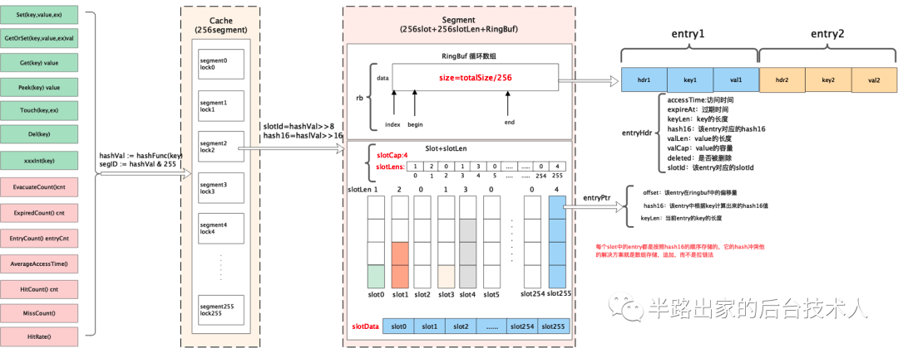
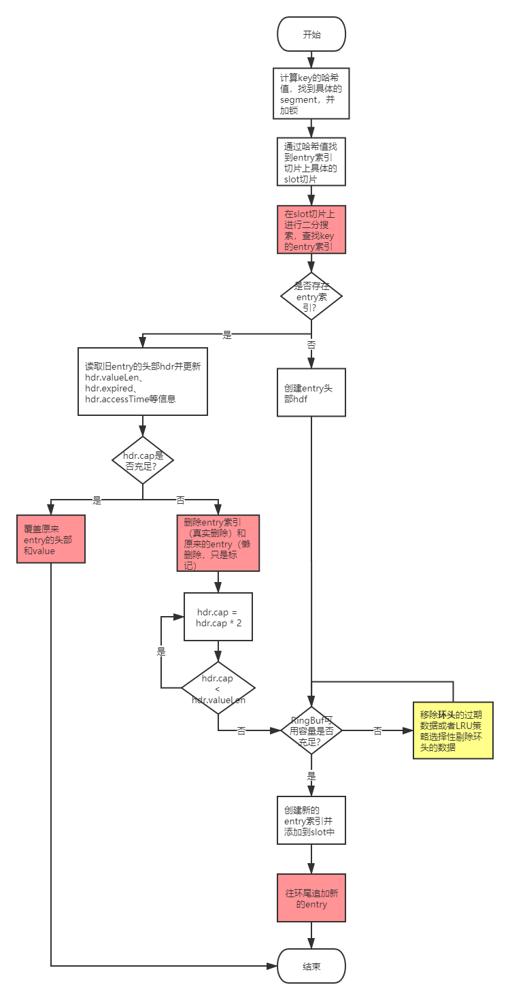
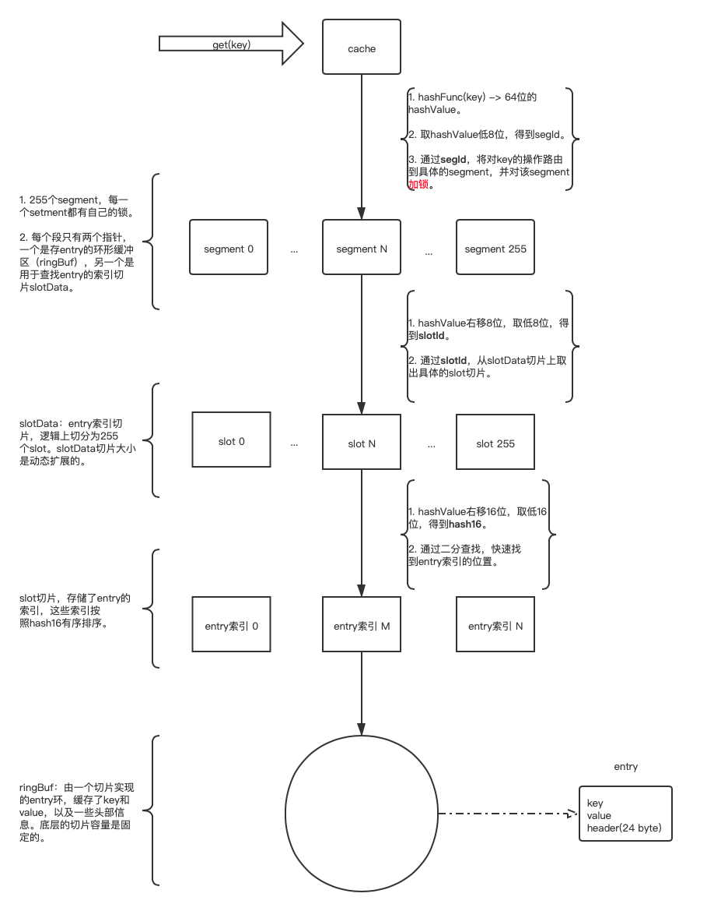
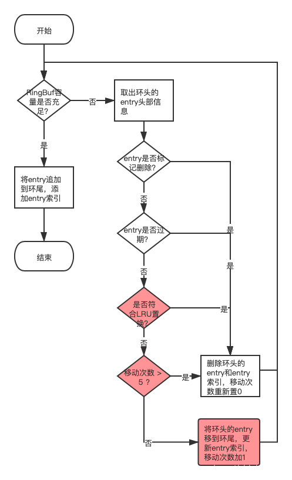

# freecache源码分析


## 特点
- 能存储数亿条记录（entry） 。
- 零GC开销。
- 高并发线程安全访问。
- 纯Golang代码实现。
- 支持记录（entry）过期。
- 接近LRU的替换算法。
- 严格限制内存的使用。
- 提供一个测试用的服务器，支持一些基本 Redis 命令。
- 支持迭代器。

## 初始化
```go

const (
    // segmentCount represents the number of segments within a freecache instance.
    segmentCount = 256 // 256 个 segment
    // segmentAndOpVal is bitwise AND applied to the hashVal to find the segment id.
    segmentAndOpVal = 255
    minBufSize      = 512 * 1024 // 512KB
)
// 最小缓存大小512kb,使用`debug.SetGCPercent()`低百比例来限制 内存消耗和低GC pause时间
func NewCache(size int) (cache *Cache) {
	return NewCacheCustomTimer(size, defaultTimer{})
}

// NewCacheCustomTimer returns new cache with custom timer.
func NewCacheCustomTimer(size int, timer Timer) (cache *Cache) {
	if size < minBufSize {
		size = minBufSize
	}
	if timer == nil {
		timer = defaultTimer{}
	}
	cache = new(Cache)
	for i := 0; i < segmentCount; i++ {
		// 平均分配size
		cache.segments[i] = newSegment(size/segmentCount, i, timer)
	}
	return
}
```
初始化segment
```go
func newSegment(bufSize int, segId int, timer Timer) (seg segment) {
	seg.rb = NewRingBuf(bufSize, 0)
	seg.segId = segId
	seg.timer = timer
	seg.vacuumLen = int64(bufSize)
	seg.slotCap = 1  //初始化slot槽容量是1
	seg.slotsData = make([]entryPtr, 256*seg.slotCap) // 256槽
	return
}
```
## 核心存储结构
```go
const (
	segmentCount = 256
)

//  xxhash算法，算出64位哈希值
func hashFunc(data []byte) uint64 {
    return xxhash.Sum64(data)
}

// Cache is a freecache instance.
type Cache struct {
	locks    [segmentCount]sync.Mutex// 每个segment都有自己的同步控制锁
	segments [segmentCount]segment // 256个 segment， segment实际存储数据的结构
	// segment 里面有一个 环形数组，环形数组的大小按照 size/segmentCount 来确定
}

type segment struct {
	rb  RingBuf // 实际数据存储的数组，存储了所有的entry 
	segId         int // Id，0～～255
	
	// 数据索引地址，用于定位到具体的数据在数组中的位置,容量动态扩展,每个slot上的entry索引都是按照hash16有序排列的
	slotsData  []entryPtr 
	// ...
    totalCount    int64      // number of entries in ring buffer, including deleted entries.
    totalTime     int64      // used to calculate least recent used entry.
}

// entryPtr 索引
type entryPtr struct {
	offset   int64  // 数据entry在环形数组中的偏移量
	hash16   uint16   // 根据key计算出来的hash16，16代表取后16位
	keyLen   uint16   // key的长度
	reserved uint32
}

// RingBuf 存储实际数据
type RingBuf struct {
	begin int64 // 数据流的开始偏移量
	end   int64 // 数据流的结束偏移量

	// 存储了所有entry
	// 每个entry由三部分组成：24个字节的头部header、key、value
	data  []byte
	index int 
}

// RingBuf 中的数据头, 这个记录的是
type entryHdr struct {
	accessTime uint32 // entry最近一次访问的时间戳
	expireAt   uint32 // entry过期时间点
	keyLen     uint16 // key的长度
	hash16     uint16 // entry的hash16值
	valLen     uint32 // value长度
	valCap     uint32  // entry为value预留的容量，valLen <= valCap 
	deleted    bool // 懒删除
	slotId     uint8 // entry索引所在slot的id
	reserved   uint16 // 预留字段，2个字节
}

```
在 freecache 中它通过 segment 来进行对数据分片，freecache 内部包含 256 个 segment，每个 segment 维护一把互斥锁，每一条 kv 数据进来后首先会根据 k 进行计算其 hash 值，然后根据 hash 值决定当前的这条数据落入到哪个 segment 中。

对于每个 segment 而言，它由索引、数据两部分构成
- 索引：其中索引最简单的方式采用 map 来维护，例如 map[uint64]uint32 这种。而 freecache并没有采用这种做法，而是通过采用 slice 来底层实现一套无指针的 map，以此避免 GC 扫描。
- 数据：数据采用环形缓冲区来循环使用，底层采用 []byte 进行封装实现。数据写入环形缓冲区后，记录写入的位置 index 作为索引，读取时首先读取数据 header 信息，然后再读取 kv 数据

## 流程
在 freecache 中数据的传递过程是：freecache->segment->(slot,ringbuffer)

### set

```go
func (cache *Cache) Set(key, value []byte, expireSeconds int) (err error) {
	// Set数据是会先计算出Key对应的hash值，这个数据会在后面计算segID和slotId使用到
	hashVal := hashFunc(key)
	segID := hashVal & segmentAndOpVal
	cache.locks[segID].Lock()
	err = cache.segments[segID].set(key, value, hashVal, expireSeconds)
	cache.locks[segID].Unlock()
	return
}
```
具体设置过程
```go
func (seg *segment) set(key, value []byte, hashVal uint64, expireSeconds int) (err error) {
	// 做一些数据合法的判断
	if len(key) > 65535 {
		return ErrLargeKey
	}
	maxKeyValLen := len(seg.rb.data)/4 - ENTRY_HDR_SIZE
	if len(key)+len(value) > maxKeyValLen {
		// 不接受太大的对象
		return ErrLargeEntry
	}
	now := seg.timer.Now()
	expireAt := uint32(0)
	if expireSeconds > 0 {
		expireAt = now + uint32(expireSeconds)
	}

	slotId := uint8(hashVal >> 8)
	hash16 := uint16(hashVal >> 16)
	// 根据slotId找到slot
	slot := seg.getSlot(slotId)
	// 根据slot和hash16获取到在Key在slot中的index
	idx, match := seg.lookup(slot, hash16, key)

	var hdrBuf [ENTRY_HDR_SIZE]byte
	hdr := (*entryHdr)(unsafe.Pointer(&hdrBuf[0]))
	if match {
		matchedPtr := &slot[idx]
		seg.rb.ReadAt(hdrBuf[:], matchedPtr.offset)
		hdr.slotId = slotId
		hdr.hash16 = hash16
		hdr.keyLen = uint16(len(key))
		originAccessTime := hdr.accessTime
		hdr.accessTime = now
		hdr.expireAt = expireAt
		hdr.valLen = uint32(len(value))
		if hdr.valCap >= hdr.valLen {
			//in place overwrite
			atomic.AddInt64(&seg.totalTime, int64(hdr.accessTime)-int64(originAccessTime))
			seg.rb.WriteAt(hdrBuf[:], matchedPtr.offset)
			seg.rb.WriteAt(value, matchedPtr.offset+ENTRY_HDR_SIZE+int64(hdr.keyLen))
			atomic.AddInt64(&seg.overwrites, 1)
			return
		}
		// avoid unnecessary memory copy.
		seg.delEntryPtr(slotId, slot, idx)
		match = false
		// increase capacity and limit entry len.
		for hdr.valCap < hdr.valLen {
        // 要扩容
			hdr.valCap *= 2
		}
		if hdr.valCap > uint32(maxKeyValLen-len(key)) {
			hdr.valCap = uint32(maxKeyValLen - len(key))
		}
	} else {
		hdr.slotId = slotId
		hdr.hash16 = hash16
		hdr.keyLen = uint16(len(key))
		hdr.accessTime = now
		hdr.expireAt = expireAt
		hdr.valLen = uint32(len(value))
		hdr.valCap = uint32(len(value))
		if hdr.valCap == 0 { // avoid infinite loop when increasing capacity.
			hdr.valCap = 1
		}
	}

	entryLen := ENTRY_HDR_SIZE + int64(len(key)) + int64(hdr.valCap)
	slotModified := seg.evacuate(entryLen, slotId, now)
	if slotModified {
		// the slot has been modified during evacuation, we need to looked up for the 'idx' again.
		// otherwise there would be index out of bound error.
		slot = seg.getSlot(slotId)
		idx, match = seg.lookup(slot, hash16, key)
		// assert(match == false)
	}
	newOff := seg.rb.End()
	seg.insertEntryPtr(slotId, hash16, newOff, idx, hdr.keyLen)
    //（entry=24 byte header + key + value）
	seg.rb.Write(hdrBuf[:])
	seg.rb.Write(key)
	seg.rb.Write(value)
	seg.rb.Skip(int64(hdr.valCap - hdr.valLen))
	atomic.AddInt64(&seg.totalTime, int64(now))
	atomic.AddInt64(&seg.totalCount, 1)
	seg.vacuumLen -= entryLen
	return
}


func (seg *segment) getSlot(slotId uint8) []entryPtr {
	slotOff := int32(slotId) * seg.slotCap
	return seg.slotsData[slotOff : slotOff+seg.slotLens[slotId] : slotOff+seg.slotCap]
}
```

获取索引

```go
// slot的entryPtr按照hash16从小到大排序，存在哈希冲突，可能会存在多个hash16值一样的entryPtr。
// 查询算法大致如下：
// 1. 调用entryPtrIdx()找到第一个entryPtr.hash16 >= hash16的索引下标（二分查找）：idx。
// 2. 存在哈希冲突，可能会存在多个hash16值一样的entryPtr，需要判断是否命中key的entry索引：
//    2.1 如果slot[idx].hash16 != hash16，找不到key的entry索引，查询结束，返回idx和false；
//        否则继续往下执行。
//    2.2 如果slot[idx].keyLen != len(key)， 哈希冲突，slot[idx]不是key的entry索引，idx++，
//        重新返回到2.1；否则继续往下执行。
//    2.3 读取slot[idx]索引所指entry的key值，如果不等于我们要找的key，出现哈希冲突，slot[idx]
//        不是key的entry索引，idx++，重新返回到2.1；否则说明找到了索引，返回idx和true。
func (seg *segment) lookup(slot []entryPtr, hash16 uint16, key []byte) (idx int, match bool) {
	idx = entryPtrIdx(slot, hash16)
	for idx < len(slot) {
		ptr := &slot[idx]
		if ptr.hash16 != hash16 {
			break
		}
		match = int(ptr.keyLen) == len(key) && seg.rb.EqualAt(key, ptr.offset+ENTRY_HDR_SIZE)
		if match {
			return
		}
		idx++
	}
	return
}

// 二分查找
func entryPtrIdx(slot []entryPtr, hash16 uint16) (idx int) {
	high := len(slot)
	for idx < high {
		mid := (idx + high) >> 1
		oldEntry := &slot[mid]
		if oldEntry.hash16 < hash16 {
			idx = mid + 1
		} else {
			high = mid
		}
	}
	return
}
```

具体的写
```go
func (rb *RingBuf) Write(p []byte) (n int, err error) {
	if len(p) > len(rb.data) {
		err = ErrOutOfRange
		return
	}
	for n < len(p) {
		written := copy(rb.data[rb.index:], p[n:])
		rb.end += int64(written)
		n += written
		rb.index += written
		if rb.index >= len(rb.data) {
			rb.index -= len(rb.data)
		}
	}
	if int(rb.end-rb.begin) > len(rb.data) {
		rb.begin = rb.end - int64(len(rb.data))
	}
	return
}
```

####  set操作为什么高效
- 采用二分查找，极大的减少查找entry索引的时间开销。slot切片上的entry索引是根据hash16值有序排列的，对于有序集合，可以采用二分查找算法进行搜索，假设缓存了n个key，那么查找entry索引的时间复杂度为log2(n * 2^-16) = log2(n) - 16。
- 对于key不存在的情况下（找不到entry索引）。
  - 如果Ringbuf容量充足，则直接将entry追加到环尾，时间复杂度为O(1)。
  - 如果RingBuf不充足，需要将一些key移除掉，情况会复杂点，后面会单独讲解这块逻辑，不过freecache通过一定的措施，保证了移除数据的时间复杂度为O(1)，所以对于RingBuf不充足时，entry追加操作的时间复杂度也是O(1)。
- 对于已经存在的key（找到entry索引）。
  - 如果原来给entry的value预留的容量充足的话，则直接更新原来entry的头部和value，时间复杂度为O(1)。
  - 如果原来给entry的value预留的容量不足的话，freecache为了避免移动底层数组数据，不直接对原来的entry进行扩容，而是将原来的entry标记为删除（懒删除），然后在环形缓冲区RingBuf的环尾追加新的entry，时间复杂度为O(1)。

### get

```go
func (cache *Cache) Get(key []byte) (value []byte, err error) {
	hashVal := hashFunc(key)
	// 取低八位
	segID := hashVal & segmentAndOpVal
	cache.locks[segID].Lock()
	value, _, err = cache.segments[segID].get(key, nil, hashVal, false)
	cache.locks[segID].Unlock()
	return
}


func (seg *segment) get(key, buf []byte, hashVal uint64, peek bool) (value []byte, expireAt uint32, err error) {
	// 获取头部信息和数据指针
	hdr, ptr, err := seg.locate(key, hashVal, peek)
	if err != nil {
		return
	}
	expireAt = hdr.expireAt
	if cap(buf) >= int(hdr.valLen) {
		value = buf[:hdr.valLen]
	} else {
		value = make([]byte, hdr.valLen)
	}

	seg.rb.ReadAt(value, ptr.offset+ENTRY_HDR_SIZE+int64(hdr.keyLen))
	if !peek {
		atomic.AddInt64(&seg.hitCount, 1)
	}
	return
}
```
定位过程
```go
func (seg *segment) locate(key []byte, hashVal uint64, peek bool) (hdr *entryHdr, ptr *entryPtr, err error) {
	// 取低8位
	slotId := uint8(hashVal >> 8)
	// 取低16位
	hash16 := uint16(hashVal >> 16)
	// 通过slotId，从slotdata切片中取出具体的slot数据
	slot := seg.getSlot(slotId)
	idx, match := seg.lookup(slot, hash16, key)
	if !match {
		err = ErrNotFound
		if !peek {
			atomic.AddInt64(&seg.missCount, 1)
		}
		return
	}
	ptr = &slot[idx]

	var hdrBuf [ENTRY_HDR_SIZE]byte
	seg.rb.ReadAt(hdrBuf[:], ptr.offset)
	hdr = (*entryHdr)(unsafe.Pointer(&hdrBuf[0]))
	if !peek {
		now := seg.timer.Now()
		if hdr.expireAt != 0 && hdr.expireAt <= now {
			seg.delEntryPtr(slotId, slot, idx)
			atomic.AddInt64(&seg.totalExpired, 1)
			err = ErrNotFound
			atomic.AddInt64(&seg.missCount, 1)
			return
		}
		atomic.AddInt64(&seg.totalTime, int64(now-hdr.accessTime))
		hdr.accessTime = now
		seg.rb.WriteAt(hdrBuf[:], ptr.offset)
	}
	return hdr, ptr, err
}

```


## 淘汰算法
1. 过期删除
```go
func (seg *segment) locate(key []byte, hashVal uint64, peek bool) (hdr *entryHdr, ptr *entryPtr, err error) {
    // ...
	if !peek {
		now := seg.timer.Now()
		if hdr.expireAt != 0 && hdr.expireAt <= now {
			// 发现是过期直接就返回ErrNotFound
			seg.delEntryPtr(slotId, slot, idx)
			atomic.AddInt64(&seg.totalExpired, 1)
			err = ErrNotFound
			atomic.AddInt64(&seg.missCount, 1)
			return
		}
		atomic.AddInt64(&seg.totalTime, int64(now-hdr.accessTime))
		hdr.accessTime = now
		seg.rb.WriteAt(hdrBuf[:], ptr.offset)
	}
	return hdr, ptr, err
}

```

2. 接近LRU的淘汰算法

```go
slotModified := seg.evacuate(entryLen, slotId, now)
```
设置的时候进行驱逐evacuate
```go
func (seg *segment) evacuate(entryLen int64, slotId uint8, now uint32) (slotModified bool) {
	var oldHdrBuf [ENTRY_HDR_SIZE]byte
	consecutiveEvacuate := 0
	// RingBuf容量不足的情况
	for seg.vacuumLen < entryLen {
        // ...
		//  entry是否过期
		expired := oldHdr.expireAt != 0 && oldHdr.expireAt < now
		// entry最近一次访问的时间戳* RingBuffer中entry的总数，包括过期和标记删除的entry<=RingBuffer中每个entry最近一次访问的时间戳总和
		leastRecentUsed := int64(oldHdr.accessTime)*atomic.LoadInt64(&seg.totalCount) <= atomic.LoadInt64(&seg.totalTime)
		if expired || leastRecentUsed || consecutiveEvacuate > 5 {
			// entry如果已经过期了，或者满足置换条件，则删除掉entry
			seg.delEntryPtrByOffset(oldHdr.slotId, oldHdr.hash16, oldOff)
			if oldHdr.slotId == slotId {
				slotModified = true
			}
			consecutiveEvacuate = 0
			atomic.AddInt64(&seg.totalTime, -int64(oldHdr.accessTime))
			atomic.AddInt64(&seg.totalCount, -1)
			seg.vacuumLen += oldEntryLen
			if expired {
				atomic.AddInt64(&seg.totalExpired, 1)
			} else {
				atomic.AddInt64(&seg.totalEvacuate, 1)
			}
		} else {
			// 如果不满足置换条件，则将entry从环头调换到环尾
			// evacuate an old entry that has been accessed recently for better cache hit rate.
			newOff := seg.rb.Evacuate(oldOff, int(oldEntryLen))
			// 更新entry的索引
			seg.updateEntryPtr(oldHdr.slotId, oldHdr.hash16, oldOff, newOff)
			consecutiveEvacuate++
			atomic.AddInt64(&seg.totalEvacuate, 1)
		}
	}
	return
}

```
### freecache为什么不完全实现LRU置换算法呢？
如果采用hash表+数组来实现LRU算法，维护hash表所带来的空间开销先不说，找出来的entry在环中的位置还是随机的，这种随机置换会产生空间碎片，如果要解决碎片问题性能将会大打折扣。如果不采用hash表来实现，则需要遍历所有entry索引，而且同样也会产生空间碎片

在特殊情况下，环头的数据都比较新时，会导致一直找不到合适的entry进行置换，空出足够的空间，为了不影响set操作的性能，当连续5次出现环头entry不符合置换条件时，第6次置换如果entry还是不满足置换条件，也会被强制置换出去。

## freecache的不足
- 需要一次性申请所有缓存空间。用于实现segment的RingBuf切片，从缓存被创建之后，其容量就是固定不变的，申请的内存也会一直被占用着，空间换时间，确实避免不了。
- freecache的entry置换算法不是完全LRU，而且在某些情况下，可能会把最近经常被访问的缓存置换出去。
- entry索引切片slotsData无法一次性申请足够的容量，当slotsData容量不足时，会进行空间容量x2的扩容，这种自动扩容机制，会带来一定的性能开销。
- 由于entry过期时，不会主动清理缓存数据，这些过期缓存的entry索引还会继续保存slot切片中，这种机制会加快entry索引切片提前进行扩容，而实际上除掉这些过期缓存的entry索引，entry索引切片的容量可能还是完全充足的。
- 为了保证LRU置换能够正常进行，freecache要求entry的大小不能超过缓存大小的1/1024，而且这个限制还不给动态修改，