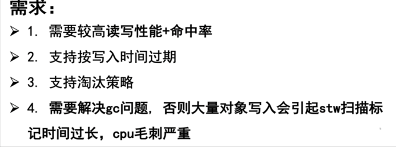

<!-- START doctoc generated TOC please keep comment here to allow auto update -->
<!-- DON'T EDIT THIS SECTION, INSTEAD RE-RUN doctoc TO UPDATE -->
**Table of Contents**  *generated with [DocToc](https://github.com/thlorenz/doctoc)*

- [本地缓存](#%E6%9C%AC%E5%9C%B0%E7%BC%93%E5%AD%98)
  - [缓存淘汰算法](#%E7%BC%93%E5%AD%98%E6%B7%98%E6%B1%B0%E7%AE%97%E6%B3%95)
  - [需求](#%E9%9C%80%E6%B1%82)
  - [Go本身实现背景](#go%E6%9C%AC%E8%BA%AB%E5%AE%9E%E7%8E%B0%E8%83%8C%E6%99%AF)
  - [本地缓存组件优化方式](#%E6%9C%AC%E5%9C%B0%E7%BC%93%E5%AD%98%E7%BB%84%E4%BB%B6%E4%BC%98%E5%8C%96%E6%96%B9%E5%BC%8F)
  - [参考](#%E5%8F%82%E8%80%83)

<!-- END doctoc generated TOC please keep comment here to allow auto update -->

# 本地缓存

## 缓存淘汰算法

LRU（Least Recently Used）：最近最少使用算法。从时间角度对缓存条目进行淘汰，即最长时间没有被使用的缓存条目会被淘汰。
该算法有一个问题：如果某些历史数据突然被大量访问，但仅仅访问一次，就可能会把那些需要频繁访问的缓存条目给淘汰掉，造成之后大量频繁访问的缓存条目出现 cache-miss。

LFU（Least Frequently Used）：最不常用算法。从访问频率角度对缓存条目进行淘汰，即访问频率最少的缓存条目会被淘汰。
该算法也存在问题：如果之前频繁访问过一些缓存条目，但是现在并不会访问这些条目，这些条目也会一直占据缓冲区，很难被淘汰。

LRU-K :相比于 LRU， LRU-K 算法多维护一个队列，用来记录所有缓存数据被访问的历史，只有当数据访问的次数达到 K 时，才将数据放入真正的缓存队列.LRU-K 一定程度上解决了 LRU 的缺点。实际应用中，通常采用 LRU-2。

2Q 即 two-queues 算法，类似于 LRU-2，也是使用两个缓存队列，只不过一个是 FIFO 队列，一个是 LRU 队列

ARC（Adaptive Replacement Cache）：自适应缓存替换算法。它同时结合了 LRU 和 LFU，当访问的数据趋向于最近访问的条目时，会更多地命中 LRU cache；当访问的数据趋向于最频繁的条目时，会更多地命中 LFU cache。ARC 会动态调整 LRU 和 LFU 的比例，从而提高缓存命中率

## 需求

1. 我们一般做缓存就是为了能提高系统的读写性能，缓存的命中率越高，也就意味着缓存的效果越好。
2. 其次本地缓存一般都受限于本地内存的大小，所以全量的数据一般存不下。
   - 那基于这样的场景，一方面是想缓存的数据越多，则命中率理论上也会随着缓存数据的增多而提高；
   - 另外一方面是想，既然所有的数据存不下那就想办法利用有限的内存存储有限的数据。这些有限的数据需要是经常访问的，同时有一定时效性（不会频繁改变）的。
     
基于这两个点展开，我们一般对本地缓存会要求其满足支持过期时间、支持淘汰策略。

3. 最后再使用自动管理内存的语言，例如 Go 等开发时，还需要考虑在加入本地缓存后引发的 GC 问题。

## Go本身实现背景
Go 中内置的可以直接用来做本地缓存的无非就是 map 和 sync.Map。
而这两者中，map 是非并发安全的数据结构，在使用时需要加锁；而 sync.Map 虽然是线程安全的。但是需要在并发读写时加锁。
此外二者均无法支持数据的过期和淘汰，同时在存储大量数据时，又会产生比较频繁的 GC 问题，更严重的情况下导致线上服务无法稳定运行

## 本地缓存组件优化方式
1. 实现零 GC 的方案主要就两种：
   a. 无 GC：分配堆外内存（Mmap）
   b. 避免 GC：map 非指针优化（map[uint64]uint32）或者采用 slice 实现一套无指针的 map
   c. 避免 GC：数据存入[]byte slice（可考虑底层采用环形队列封装循环使用空间）

2. 实现高性能的关键在于：
   a. 数据分片（降低锁的粒度)

## 参考
- [Go 本地缓存（bigcache/freecache/fastcache等）选型对比及原理总结](https://mp.weixin.qq.com/s/UuqkO9UUXjNWNGyI2sjG4Q)