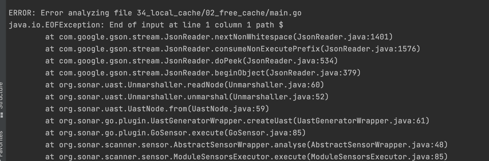

<!-- START doctoc generated TOC please keep comment here to allow auto update -->
<!-- DON'T EDIT THIS SECTION, INSTEAD RE-RUN doctoc TO UPDATE -->
**Table of Contents**  *generated with [DocToc](https://github.com/thlorenz/doctoc)*

- [sonar](#sonar)
  - [sonarQube能带来什么？](#sonarqube%E8%83%BD%E5%B8%A6%E6%9D%A5%E4%BB%80%E4%B9%88)
  - [Sonar的客户端共有四种](#sonar%E7%9A%84%E5%AE%A2%E6%88%B7%E7%AB%AF%E5%85%B1%E6%9C%89%E5%9B%9B%E7%A7%8D)
  - [sonar的组成](#sonar%E7%9A%84%E7%BB%84%E6%88%90)
  - [平台要求](#%E5%B9%B3%E5%8F%B0%E8%A6%81%E6%B1%82)
  - [搭建服务端](#%E6%90%AD%E5%BB%BA%E6%9C%8D%E5%8A%A1%E7%AB%AF)
    - [配置项目](#%E9%85%8D%E7%BD%AE%E9%A1%B9%E7%9B%AE)
  - [搭建客户端](#%E6%90%AD%E5%BB%BA%E5%AE%A2%E6%88%B7%E7%AB%AF)
  - [与Go工具对比](#%E4%B8%8Ego%E5%B7%A5%E5%85%B7%E5%AF%B9%E6%AF%94)
    - [1. 单元测试](#1-%E5%8D%95%E5%85%83%E6%B5%8B%E8%AF%95)
    - [2. 覆盖率](#2-%E8%A6%86%E7%9B%96%E7%8E%87)
    - [3. 静态扫描](#3-%E9%9D%99%E6%80%81%E6%89%AB%E6%8F%8F)
    - [4. 外部规则](#4-%E5%A4%96%E9%83%A8%E8%A7%84%E5%88%99)
      - [常用的Linter介绍](#%E5%B8%B8%E7%94%A8%E7%9A%84linter%E4%BB%8B%E7%BB%8D)
      - [golint：官方，deprecated](#golint%E5%AE%98%E6%96%B9deprecated)
      - [gometalinter:不维护了](#gometalinter%E4%B8%8D%E7%BB%B4%E6%8A%A4%E4%BA%86)
      - [golangci-lint](#golangci-lint)
      - [特点](#%E7%89%B9%E7%82%B9)
      - [golangci-lint使用](#golangci-lint%E4%BD%BF%E7%94%A8)
  - [工作流转](#%E5%B7%A5%E4%BD%9C%E6%B5%81%E8%BD%AC)
  - [参考](#%E5%8F%82%E8%80%83)

<!-- END doctoc generated TOC please keep comment here to allow auto update -->

# sonar

sonar是一款静态代码质量分析工具，支持Java、Python、PHP、JavaScript、CSS等25种以上的语言，而且能够集成在IDE、Jenkins、Git等服务中，方便随时查看代码质量分析报告；

## sonarQube能带来什么？

1. 重复:显然程序中包含大量复制粘贴的代码是质量低下的

2. 缺乏单元测试: sonar可以很方便地统计并展示单元测试覆盖率

3. 没有足够的或者过多的注释

## Sonar的客户端共有四种
- Sonar-Scanner。一个独立的扫描器，通过简单的命令就能对项目进行静态扫描，并将扫描结果上传至SonarQube。
- sonar maven插件。一个maven插件，能通过maven命令执行静态扫描。
- sonar ant插件。ant上的插件。
- sonar IDE插件。可以直接集成到IDE中(比如IntelliJ)。


## sonar的组成

一个sonar项目主要有以下四个组件构成：

1. 一台SonarQube Server启动3个主要过程：
- Web服务器，供开发人员，管理人员浏览高质量的快照并配置SonarQube实例
- 基于Elasticsearch的Search Server从UI进行后退搜索
- Compute Engine服务器，负责处理代码分析报告并将其保存在SonarQube数据库中

2. 一个SonarQube数据库要存储：
- SonarQube实例的配置（安全性，插件设置等）
- 项目，视图等的质量快照。

3. 服务器上安装了多个SonarQube插件，可能包括语言，SCM，集成，身份验证和管理插件

4. 在构建/持续集成服务器上运行一个或多个SonarScanner，以分析项目


## 平台要求
> The SonarQube server require Java version 11 and the SonarQube scanners require Java version 11 or 17.
1. 服务端java11
2. 客户端scanners Java11或则17

## 搭建服务端
注意版本，早期版本不支持Go,否则会报本地错误


### 配置项目
```shell
[root@k8s-master01 ~]# docker ps -a
CONTAINER ID   IMAGE                       COMMAND                  CREATED        STATUS        PORTS                                       NAMES
ddec18b47392   sonarqube:8.9.2-community   "bin/run.sh bin/sona…"   39 hours ago   Up 39 hours   0.0.0.0:9000->9000/tcp, :::9000->9000/tcp   sonarqube
cce68ee0508a   postgres:11                 "docker-entrypoint.s…"   39 hours ago   Up 39 hours   0.0.0.0:5432->5432/tcp, :::5432->5432/tcp   postgres
```

login: admin
password: admin

## 搭建客户端
1. 执行 sonar-scanner，会找本地sonar-project.properties文件
```shell
sonar-scanner 
```


2. golang插件:sonarqube

   

## 与Go工具对比

### 1. 单元测试
```shell
go test -v xxx -json > test.json
```
sonar的项目配置文件sonar-project.properties中添加如下配置：
```properties
sonar.go.tests.reportPaths=xx/xx/xx
```

### 2. 覆盖率 
```shell
go test -coverprofile=covprofile
```

sonar的项目配置文件sonar-project.properties中添加如下配置：
```properties
sonar.go.coverage.reportPaths=xx/xx/xx
```

### 3. 静态扫描

```shell
go vet -n xxx 2> report.out
```

sonar的项目配置文件sonar-project.properties中添加如下配置：
```properties
sonar.go.govet.reportPaths=xx/xx/xx
```

### 4. 外部规则

#### 常用的Linter介绍

- deadcode : 未使用且未导出的函数(比如：首字母小写且未被调用的方法)

- errcheck : 返回的error未处理

- structcheck : 检测结构体中未使用的字段

- unused:  方法中方法名首字母小写(未导出)并且未使用的方法

- gosimple: 代码中有需要优化的地方

- ineffassign ： 检查是否有未使⽤的代码

- varcheck - 未使⽤的全局变量和常量检查


#### golint：官方，deprecated
golint生成覆盖率统计报告
```shell
golint xx/xx > golint
```

sonar的项目配置文件sonar-project.properties中添加如下配置
```shell
sonar.go.golint.reportPaths=xx/xx/xx
```

#### gometalinter:不维护了
```shell
gometalinter xx/xx > gometalinter
```

sonar的项目配置文件sonar-project.properties中添加如下配置
```properties
sonar.go.gometalinter.reportPaths=xx/xx/xx
```

#### golangci-lint
Golang常用的checkstyle有golangci-lint和golint，golangci-lint用于许多开源项目中，比如kubernetes、Prometheus、TiDB等都使用golangci-lint用于代码检查，
TIDB的makefile中的check-static使用golangci-lint进行代码检查，可参考：https://github.com/pingcap/tidb/blob/master/Makefile

#### 特点
- 速度快：基于gometalinter开发，但平均速度比他快5倍，主要原因是：可以并行检查，可以复用go build缓存，会缓存分析结果
- 可配置：支持yaml格式
- IDE继承：可以支持vscode,goland等
- linter聚合器：1.41.1版本集成了76个linter,还支持自定义。
- 良好的输出：结果带颜色，代码行号和linter标识，易于查看和定位。


#### golangci-lint使用

1. 检查当前目录下所有的文件
```shell
golangci-lint run  等同于  golangci-lint run ./...
```


2. 可以指定某个目录和文件

```shell
golangci-lint run dir1 dir2/... dir3/file1.go
```


检查dir1和dir2目录下的代码及dir3目录下的file1.go文件


3. 可以通过--enable/-E开启指定Linter，也可以通--disable/-D关闭指定Linter
```shell
golangci-lint run --no-config --disable-all -E errcheck ./...

```

4. 根据指定配置⽂件，进⾏静态代码检查
```shell
golangci-lint run -c .golangci.yaml ./...
```

## 工作流转


1. 开发人员在其IDE中进行编码，并使用SonarLint(sonarlint是idea的插件)运行本地分析。
2. 开发人员将其代码推送到他们最喜欢的SCM(source code management)中：git，SVN，TFVC等
3. Continuous Integration Server会触发自动构建，并执行运行SonarQube分析所需的SonarScanner。
4. 分析报告将发送到SonarQube服务器进行处理。
5. SonarQube Server处理分析报告结果并将其存储在SonarQube数据库中，并在UI中显示结果
6. 开发人员通过SonarQube UI审查，评论，挑战他们的问题，以管理和减少技术债务。
7. 经理从分析中接收报告。Ops使用API自动执行配置并从SonarQube提取数据。运维人员使用JMX监视SonarQube Server。


## 参考
- https://docs.sonarqube.org/latest/user-guide/concepts/