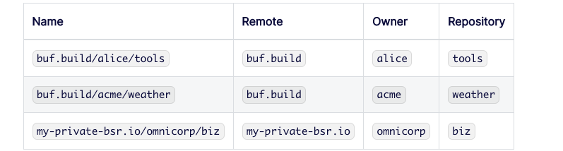

# buf 
buf目标就是从 api编程 转成 schema-driven paradigm ，更好管理 protobuf文件。

## 当前问题
- 依赖管理：比如 google/api经常得拷贝到本地.使用Buf Schema Registry (BSR)可以解决问题，类似Go的module管理，javaScript的npm管理。
- stub生成过程很难：管理protoc对应插件很难

## buf cli工具
- 新的高性能protobuf编译器
- linter检查
- 检查protobuf代码前后兼容性
- 调用对应的Protoc插件


## 安装
1. buf工具
```shell
#使用源码，因为brew install bufbuild/buf/buf 暂时不支持M1
GO111MODULE=on GOBIN=/usr/local/bin go install \
  github.com/bufbuild/buf/cmd/buf@v1.4.0
```

2. 学习前置工具
- git
- jq

3. 下载源码
```shell
(⎈ |teleport.gllue.com-test:danny-xia)➜  35_buf git:(feature/buf) ✗ git clone https://github.com/bufbuild/buf-tour

(⎈ |teleport.gllue.com-test:danny-xia)➜  35_buf git:(feature/buf) ✗ tree               
.
├── buf-tour
│   ├── README.md
│   ├── finish
│   │   ├── buf.gen.yaml
│   │   ├── buf.work.yaml
│   │   ├── client
│   │   │   └── main.go
│   │   ├── gen
│   │   │   └── proto
│   │   │       └── go
│   │   │           ├── payment
│   │   │           │   └── v1alpha1
│   │   │           │       └── payment.pb.go
│   │   │           └── pet
│   │   │               └── v1
│   │   │                   ├── pet.pb.go
│   │   │                   └── pet_grpc.pb.go
│   │   ├── go.mod
│   │   ├── go.sum
│   │   ├── paymentapis
│   │   │   ├── buf.lock
│   │   │   ├── buf.yaml
│   │   │   └── payment
│   │   │       └── v1alpha1
│   │   │           └── payment.proto
│   │   ├── petapis
│   │   │   ├── buf.lock
│   │   │   ├── buf.md
│   │   │   ├── buf.yaml
│   │   │   └── pet
│   │   │       └── v1
│   │   │           └── pet.proto
│   │   └── server
│   │       └── main.go
│   └── start
│       └── petapis
│           ├── google
│           │   └── type
│           │       └── datetime.proto
│           └── pet
│               └── v1
│                   └── pet.proto
└── buf.md

23 directories, 20 files

```
执行从start开始，执行最终结果跟finish一致（除了仓库名字）


## 1. 配置编译
```shell
(⎈ |teleport.gllue.com-test:danny-xia)➜  35_buf git:(feature/buf) ✗ cd buf-tour/start/petapis
```

源文件
```shell
.
├── buf.work.yaml
├── proto
│   ├── acme
│   │   └── weather
│   │       └── v1
│   │           └── weather.proto
│   └── buf.yaml
└── vendor
    └── protoc-gen-validate
        ├── buf.yaml
        └── validate
            └── validate.proto
```

传统使用protoc方式
```shell
$ protoc \
    -I proto \
    -proto_path vendor/protoc-gen-validate \
    -o /dev/null \
    $(find proto -name '*.proto')
```
buf使用方式
```yaml
# buf.work.yaml
version: v1
directories:
  - proto
  - vendor/protoc-gen-validate
```
```yaml
# buf.yaml
version: v1
lint:
  use:
    - DEFAULT
breaking:
  use:
    - FILE
```

使用过protoc的知道，-I和-proto_path就是引入对应的根目录petapis，在buf中没有`-I`这个flag，但是对应的buf.yaml文件的位置对应她的根目录,
如果是多个根目录，可以用buf.work.yaml，代表workspace。

### 配置buf.yaml 
buf.yaml是buf默认的入口，应该在proto的根目录，即pet/v1/pet.proto的根目录,为petapis。
```shell
# 在项目petapis下初始化
buf mod init
```

## 2. lint protobuf文件
```shell
➜  petapis git:(main) ✗ buf lint    
google/type/datetime.proto:17:1:Package name "google.type" should be suffixed with a correctly formed version, such as "google.type.v1".
pet/v1/pet.proto:44:10:Field name "petID" should be lower_snake_case, such as "pet_id".
pet/v1/pet.proto:49:9:Service name "PetStore" should be suffixed with "Service".
➜  petapis git:(main) ✗ buf lint --error-format=json
{"path":"google/type/datetime.proto","start_line":17,"start_column":1,"end_line":17,"end_column":21,"type":"PACKAGE_VERSION_SUFFIX","message":"Package name \"google.type\" should be suffixed with a correctly formed version, such as \"google.type.v1\"."}
{"path":"pet/v1/pet.proto","start_line":44,"start_column":10,"end_line":44,"end_column":15,"type":"FIELD_LOWER_SNAKE_CASE","message":"Field name \"petID\" should be lower_snake_case, such as \"pet_id\"."}
{"path":"pet/v1/pet.proto","start_line":49,"start_column":9,"end_line":49,"end_column":17,"type":"SERVICE_SUFFIX","message":"Service name \"PetStore\" should be suffixed with \"Service\"."}

```
上面报了三种错误
- PACKAGE_VERSION_SUFFIX： 包版本后缀问题
- FIELD_LOWER_SNAKE_CASE: 字段蛇形格式
- SERVICE_SUFFIX：proto的servic名字应该带上后缀service

### lint修改
1. 不需要校验的type
```yaml
 version: v1
 lint:
   use:
     - DEFAULT
   except:
    - PACKAGE_VERSION_SUFFIX 
```
2. 不需要校验的源码包
```yaml
 lint:
   use:
     - DEFAULT
   ignore:
     - google/type/datetime.proto
```

## 3. 上传登陆bsr仓库

### 概念

- remote: 远程的DNS name 地址，buf.build就是
- owner:库的所有者
- repository:仓库名


### 1. 登陆
```shell
petapis git:(main) ✗ buf registry login
# 登陆后效果 
(⎈ |teleport.gllue.com-test:danny-xia)➜  go_test cat ~/.netrc
machine buf.build
  login danny5487401
  password 9dc4224ac972468497698940586d1d672fd91fe38bde4e4b8e5c87d1dc8830d6
machine go.buf.build
  login danny5487401
  password 9dc4224ac972468497698940586d1d672fd91fe38bde4e4b8e5c87d1dc8830d6

```


### 2. 创建仓库
```shell
buf beta registry repository create buf.build/Danny5487401/petapis --visibility public
```

### 3. 在buf.yaml中添加名字
```yaml
version: v1
name: buf.build/danny5487401/petapis
```

### 4. bud.md
相当于github的readme文件

### 5. 推送文件
```shell
buf push
```


## 4. 添加依赖
### 1. 去除 datetime.proto
```shell
rm -rf google

```
去除lint忽略文件
```yaml
 version: v1
 lint:
   use:
     - DEFAULT
-  ignore:
-    - google/type/datetime.proto

```

### 2. buf.yaml添加依赖dependency
```yaml
 version: v1
+deps:
+  - buf.build/googleapis/googleapis

```
```shell
# buf build会报错
WARN    Specified deps are not covered in your buf.lock, run "buf mod update":
    - buf.build/googleapis/googleapis
pet/v1/pet.proto:7:8:google/type/datetime.proto: does not exist
```
上面因为googleapis/googleapis不在

更新外部依赖
```shell
buf mod update
```
多个buf.lock文件，这样就不需要拷贝外部的proto文件了


## 5. 生成Go代码
前置本地工具
```shell
go install google.golang.org/protobuf/cmd/protoc-gen-go@latest
go install google.golang.org/grpc/cmd/protoc-gen-go-grpc@latest
```

### 1. 编辑buf.gen.yaml：使用protoc插件生成工具
```yaml
  - name: go
    out: gen/proto/go
    opt: paths=source_relative
  - name: go-grpc
    out: gen/proto/go
    opt:
      - paths=source_relative
      - require_unimplemented_servers =false
```
- gen/proto/go: 在这下面生成文件
- paths=source_relative: 跟 pet/v1相对目录生成文件

### 2. 根据buf.yaml上面的name生成go文件
```shell
buf generate buf.build/Danny5487401/petapis
```

## 6. 实现服务端和客户端
```go
module github.com/bufbuild/buf-tour/petstore

go 1.16

require (
    google.golang.org/genproto v0.0.0-20220505152158-f39f71e6c8f3
    google.golang.org/grpc v1.46.0
    google.golang.org/protobuf v1.28.0
)

```
## 7. workspace本地调试多个项目

### 1. 多个项目paymentapis
petapi需要调用paymentapis内容


### 2. 指定多个路径
```yaml
#buf.work.yaml
version: v1
directories:
  - paymentapis
  - petapis
```

## 8. 管理package名字
go_package是很复杂使用的，一般使用和module的名字想通
### 1. 去除proto中go_package
```yaml
 syntax = "proto3";

 package pet.v1;

-option go_package = "github.com/bufbuild/buf-tour/petstore/gen/proto/go/pet/v1;petv1";
```

这时候会报错
```shell
#rm -rf gen
#buf generate
protoc-gen-go: unable to determine Go import path for "payment/v1alpha1/payment.proto"

Please specify either:
    • a "go_package" option in the .proto source file, or
    • a "M" argument on the command line.

See https://developers.google.com/protocol-buffers/docs/reference/go-generated#package for more information.
...
```

### 2. 增加managed管理
```yaml
# buf.gen.yaml
 version: v1
+managed:
+  enabled: true
+  go_package_prefix:
+    default: github.com/bufbuild/buf-tour/petstore/gen/proto/go
```
buf generate 后,会覆盖依赖包googleapis的值，此时运行会报错找不到包

### 3. 移除不需要管理底层包
```yaml
# buf.gen.yaml
 version: v1
 managed:
   enabled: true
   go_package_prefix:
     default: github.com/bufbuild/buf-tour/petstore/gen/proto/go
+    except:
+      - buf.build/googleapis/googleapis
```

## 8. 推送多个项目workspace代码的注意

项目顺序
1. googleapis
2. paymentapis
3. petapis


## 参考链接
1. 官网：https://docs.buf.build/introduction